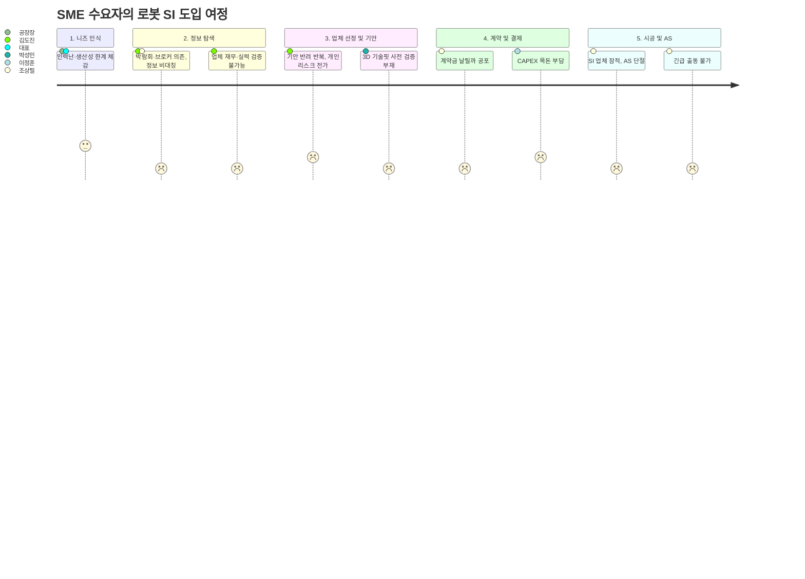
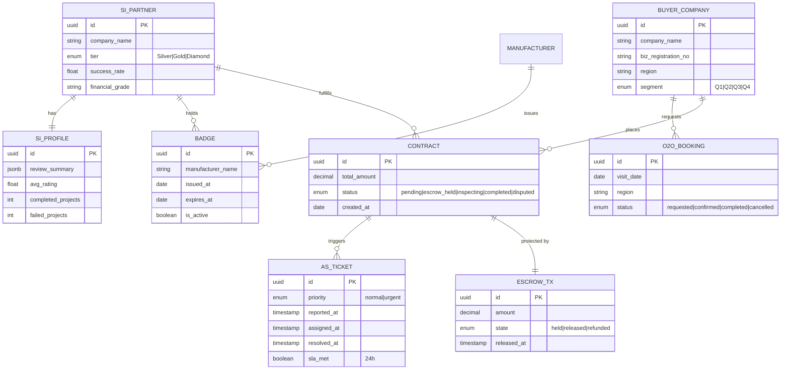

# 로봇 SI 안심 보증 매칭 플랫폼 — PRD v0.2

- **Owner 팀:** Product · Platform Engineering · Growth
- **최종 업데이트:** 2026-04-11 (v0.2 — 품질 리뷰 반영)
- **근거 문서:** `02_VPS-Drafts/6_Value-Proposition-Sheet-V2(rooted).md`

---

## 1. 개요·목표

### 1.1 문제 정의 (Pain 지표 포함)

중소·중견기업(SME)이 로봇 자동화 도입을 결정할 때, **정보 비대칭과 사후 리스크**로 인해 의사결정이 6개월 이상 지연되거나 아예 무산됩니다.

| Pain ID | Pain 서술 | 실패 KPI (현재 As-Is) | 페르소나 |
|:---:|:---|:---|:---|
| **P-01** | SI 업체 파산/잠적으로 로봇이 고철화 → 유지보수 단절 트라우마 | 도입 후 1년 내 AS 단절 경험률 **≥ 25%** (추정) | 조상필 (AOS=4.0) |
| **P-02** | 업체 재무/기술 역량을 객관적으로 증명할 수 없어 기안 반려 반복 | 경영진 기안 첫 보고 통과율 **≤ 35%**, 평균 검증 소요 **14일+** | 김도진 (AOS=2.88) |
| **P-03** | 비대면 계약에 대한 맹목적 불신 → 온라인 전환 거부 | 플랫폼 가입 후 첫 견적 요청 전환율 **≤ 5%** (아날로그 층) | 백창훈 (AOS=1.35) |
| **P-04** | 초기 투자비(CAPEX) 부담 → 유연한 구독형 상품 부재 | SME 중 CAPEX 부담으로 도입 주저 비율 **44.2%** | 이정훈 (AOS=2.00) |
| **P-05** | SI 파트너 탐색에 박람회·인맥 의존 → 검색 비용 과다 | 적격 SI 파트너 발굴까지 평균 소요 **≥ 3개월** | 강혁진 (AOS=2.88) |

### 1.2 목표 (Desired Outcome 수치화)

| 목표 ID | 목표 서술 | 목표값 | 달성 시한 |
|:---:|:---|:---|:---|
| G-01 | 고장 접수 → 로컬 AS 엔지니어 방문 보장 | **24시간 내 출동률 ≥ 95%** | MVP+6개월 |
| G-02 | 경영진 기안 첫 보고 통과율 대폭 개선 | **첫 보고 통과율 ≥ 80%**, 검증 소요 **≤ 1일** | MVP+3개월 |
| G-03 | 아날로그 층의 플랫폼 내 최초 거래 전환 | **O2O 파견 후 견적 요청 전환율 ≥ 40%** | Phase 2 |
| G-04 | CAPEX→OPEX 전환을 통한 도입 결정 가속 | **RaaS 계산기 사용 후 계약 전환율 ≥ 25%** | MVP+6개월 |

### 1.3 성공 지표 (KPI)

| 유형 | KPI | 기준선 | MVP+1m | MVP+3m | MVP+6m (Target) | 주기 | 측정 경로 |
|:---|:---|:---|:---|:---|:---|:---|:---|
| **🌟 북극성** | **에스크로 거래 완결 수 (월간)** | 0 | 5건 | 15건 | **30건** | 주간 | `ESCROW_TX` 테이블 `state=released` 집계 → Metabase 대시보드 |
| 보조 | 신규 수요 기업 가입 수 | 0 | 50 | **200** | 300 | 주간 | `BUYER_COMPANY` 신규 생성 수 → Amplitude `signup_complete` |
| 보조 | 뱃지 인증 SI 파트너 등록 수 | 0 | **50** (런칭) | 80 | 120 | 월간 | `BADGE` 테이블 `is_active=true` 고유 SI 수 → Admin 대시보드 |
| 보조 | 에스크로 보증 수수료 GMV 비율 | 0% | 5% | 7% | **5~10%** | 월간 | `ESCROW_TX.amount / CONTRACT.total_amount` 평균 → Finance 리포트 |
| 보조 | 24시간 내 AS 출동 성공률 | N/A | ≥ 80% | ≥ 90% | **≥ 95%** | 월간 | `AS_TICKET` WHERE `resolved_at - reported_at ≤ 24h` 비율 → Ops 대시보드 |
| 보조 | NPS (수요 기업) | N/A | 측정 시작 | ≥ 40 | **≥ 50** | 분기 | 인앱 NPS 설문 (Delighted 또는 자체 모달) → 분기 리포트 |

---

## 2. 사용자와 페르소나

### 2.1 핵심 페르소나 요약

| ID | 이름 | 역할 | 핵심 Pain | AOS | DOS | Phase |
|:---:|:---|:---|:---|:---:|:---:|:---:|
| P9 | 조상필 | 영세기업 대표 (극단) | AS 단절 → 고철 방치 공포 | **4.00** | **3.20** | **1** |
| P1 | 김도진 | 중견기업 생산기술 팀장 (핵심) | 객관 증빙 없이 기안 통과 불가 | **2.88** | **2.52** | **1** |
| P6 | 강혁진 | 로봇 제조사 영업 (확장) | 역량 검증된 SI 파트너 풀 부재 | **2.88** | **2.52** | **1** |
| P3 | 박성민 | 공정 엔지니어 (핵심) | 사전 3D 기술핏 검증 불가 | **2.94** | **1.89** | **1** |
| P2 | 이정훈 | SME 대표 (핵심) | CAPEX 부담, 구독형 상품 부재 | **2.00** | **1.20** | **1** |
| P11 | 백창훈 | 공장장 (비활성) | 비대면 불신, '멱살 잡을 사람' 요구 | 1.35 | 0.90 | **2** |

### 2.2 수요자 여정 Pain 맵

---

## 3. 사용자 스토리와 수용 기준 (AC)

### Story 1 — 안심 에스크로 결제 & AS 보증 (Job 1 핵심)

> **As a** 영세 제조기업 대표(조상필),
> **I want** 계약금이 플랫폼 에스크로에 안전하게 예치되고, 시공 완료·검수 확인 전까지 SI 업체에 자금이 방출되지 않으며,
> **So that** SI 업체의 파산·잠적 시에도 내 투자금이 보호되고, 24시간 내 대체 AS 출동이 보장되어 도입 실패 공포에서 해방됩니다.

| AC ID | Given | When | Then (측정 임계치) |
|:---:|:---|:---|:---|
| AC-1.1 | 수요 기업이 SI 파트너와 계약을 체결함 | 계약금 결제를 요청함 | 에스크로 예치 완료까지 **≤ 3분**, 결제 실패율 **< 0.5%** |
| AC-1.2 | 시공이 완료되고 검수 프로세스가 시작됨 | 수요 기업이 검수 합격을 승인함 | 자금 방출까지 **≤ 24시간**, 분쟁 발생 시 플랫폼 중재 개시 **≤ 2영업일** |
| AC-1.3 | SI 파트너가 부도·폐업·연락 두절 상태 확인됨 | 수요 기업이 긴급 AS를 접수함 | 로컬 AS 엔지니어 배정 **≤ 4시간**, 현장 출동 **≤ 24시간**, 성공률 **≥ 95%** |
| AC-1.4 | 에스크로 결제 완료 시 | AS 보증서가 자동 발급됨 | 보증서 발급 **≤ 1분**, 보증서에 지정 로컬 AS 업체명·연락처·보증 범위 100% 명시 |
| AC-1.5 ⚠️ | 수요 기업이 에스크로 결제를 시도하나 **PG 응답이 타임아웃(>10초)** 발생 | 결제 요청이 실패함 | 실패 사유 안내 **≤ 2초**, 자동 재시도 **1회** 실행, 재시도 실패 시 CS 접수 유도 팝업 표시. 실패 로그 `escrow_payment_failed` 이벤트 적재 |
| AC-1.6 ⚠️ | 시공 완료 후 수요 기업이 **검수 기한(7영업일) 내 승인/거절 미응답** | 검수 기한이 만료됨 | 자동 '검수 대기 → 분쟁 접수' 전환, 플랫폼 중재팀 알림 **≤ 10분** 이내 발송. 자금 에스크로 유지(방출 불가) |

### Story 2 — SI 파트너 투명 평판 뷰어 & 제조사 인증 뱃지 (Job 1 검증)

> **As a** 중견기업 생산기술 팀장(김도진),
> **I want** SI 업체의 재무 상태·시공 성공률·고객 리뷰가 객관적 등급으로 시각화되고, 로봇 제조사가 직접 인증한 뱃지가 표시되어,
> **So that** 경영진 기안 보고 시 1회 통과할 수 있는 신뢰도 높은 증빙 자료를 즉시 확보합니다.

| AC ID | Given | When | Then (측정 임계치) |
|:---:|:---|:---|:---|
| AC-2.1 | 수요 기업이 SI 파트너 프로필 페이지에 접근함 | 페이지를 로드함 | 재무 등급·시공 성공률·리뷰 점수 로딩 **≤ 2초** (p95), 데이터 갱신 주기 **≤ 30일** |
| AC-2.2 | 수요 기업이 '기안용 리포트' 다운로드를 요청함 | PDF 리포트가 생성됨 | 생성 소요 **≤ 5초**, 리포트에 재무·기술·인증·리뷰 4개 섹션 100% 포함 |
| AC-2.3 | 제조사가 SI 업체에 인증 뱃지를 발급함 | SI 프로필에 뱃지가 노출됨 | 뱃지 반영 지연 **≤ 1시간**, 만료·철회 시 자동 비노출 처리 **≤ 10분** |
| AC-2.4 | 검색 결과에서 뱃지 보유 SI 필터를 적용함 | 필터링된 목록이 표시됨 | 필터 적용 응답 **≤ 1초** (p95), 미인증 SI 혼입률 **= 0%** |
| AC-2.5 ⚠️ | NICE평가정보 API가 **일시 장애(5xx) 또는 일일 한도(500건) 초과** | 재무 등급 조회 시도 | '최근 갱신일 기준 캐시 데이터' 표시 + "실시간 조회 불가" 안내 배너. 캐시 TTL **≤ 30일**, 장애 해소 시 자동 갱신 |

### Story 3 — 현장 O2O 매니저 파견 예약 (Job 2)

> **As a** 비대면 불신이 극심한 공장장(백창훈),
> **I want** 로봇 도입 상담을 위한 플랫폼 소속 현장 전문가(로컬 매니저)의 방문 일정을 쉽게 예약하고,
> **So that** 온라인이 아닌 대면 방식으로 신뢰를 확인한 후 안심하고 계약을 진행합니다.

| AC ID | Given | When | Then (측정 임계치) |
|:---:|:---|:---|:---|
| AC-3.1 | 수요 기업이 O2O 파견 예약 화면에 접근함 | 희망 지역·날짜를 선택함 | 가능한 매니저 슬롯 조회 **≤ 2초**, 3일 내 가용 슬롯 **≥ 2개** (수도권 기준) |
| AC-3.2 | 예약이 확정됨 | 예약 확인 알림이 발송됨 | SMS + 카카오톡 이중 발송 **≤ 30초**, 발송 실패율 **< 1%** |
| AC-3.3 | 매니저가 현장 방문을 완료함 | 방문 보고서가 등록됨 | 보고서 등록 **≤ 24시간**, 보고서에 상담 요약·추천 SI 3개사·예상 견적 범위 포함 |
| AC-3.4 ⚠️ | 희망 지역·날짜에 **가용 매니저 슬롯이 0건** | 조회 결과가 비어 있음 | "가장 가까운 가용 일정(D+N)" 자동 추천 **≤ 2초**, 대기 예약 옵션 제공. 지역 매니저 부족 → Ops Slack **즉시** 알림 |

### Story 4 — RaaS 구독 & 비용 비교 계산기

> **As a** 초기 투자비 부담이 큰 SME 대표(이정훈),
> **I want** 일시불·리스·RaaS 구독 등의 비용 구조를 자동으로 비교하여 월별 OPEX 예상치를 한눈에 확인하고,
> **So that** 경영진에게 'CAPEX 대비 OPEX 전환 ROI'를 명확히 제시하여 도입 결정을 앞당깁니다.

| AC ID | Given | When | Then (측정 임계치) |
|:---:|:---|:---|:---|
| AC-4.1 | 사용자가 로봇 모델·수량·계약 기간을 입력함 | '비교 계산' 버튼을 누름 | 3가지 옵션(일시불·리스·RaaS) 결과 렌더링 **≤ 2초** |
| AC-4.2 | 계산 결과가 표시됨 | '결과 PDF 내려받기'를 요청함 | PDF 생성 **≤ 3초**, ROI 그래프·월비용 테이블·총 소유비용(TCO) 비교 포함 |
| AC-4.3 | 사용자가 특정 RaaS 플랜을 선택함 | 금융 파트너 연결을 요청함 | 금융 파트너 API 응답 **≤ 5초**, 보증금·월납입금·금리 정보 100% 표시 |
| AC-4.4 ⚠️ | 사용자가 **존재하지 않는 로봇 모델 코드** 또는 **수량에 음수/0** 입력 | 계산 요청 발생 | 인라인 유효성 에러 메시지 **≤ 200ms** 표시, API 호출 차단. 잘못된 모델 코드 시 "유사 모델 추천 3건" 자동 표시 |
| AC-4.5 ⚠️ | 금융 파트너 API가 **타임아웃(>5초) 또는 HTTP 5xx 응답** | RaaS 플랜 금융 연결 실패 | "금융 연결 일시 지연" 토스트 **≤ 1초**, 30초 후 자동 재시도 1회. 최종 실패 시 "이메일 견적 수신" 대안 경로 제공 |

### Story 5 — 제조사 인증 SI 파트너 검색 & 매칭

> **As a** 자사 로봇의 턴키 시공 파트너가 필요한 로봇 제조사 영업(강혁진),
> **I want** 우리 브랜드 기계를 다룰 줄 아는 검증된 SI 업체들을 지역·역량별로 즉시 필터링하고,
> **So that** 분기별 신규 파트너 연계를 5건에서 30건으로 확대하고 기술 클레임을 0건으로 유지합니다.

| AC ID | Given | When | Then (측정 임계치) |
|:---:|:---|:---|:---|
| AC-5.1 | 제조사가 브랜드·지역·역량 필터를 설정함 | 검색을 실행함 | 결과 반환 **≤ 1초** (p95), 결과에 뱃지 보유 여부·성공률·지역 명시 |
| AC-5.2 | 제조사가 특정 SI에게 '파트너 제안'을 발송함 | SI가 수락/거절함 | 제안 발송 **≤ 3초**, SI 응답 기한 **≤ 5영업일**, 미응답 시 자동 리마인더 |
| AC-5.3 | 파트너십이 체결됨 | 플랫폼에 '공식 인증 파트너' 뱃지가 노출됨 | 뱃지 반영 **≤ 1시간**, 제조사 대시보드에 파트너 현황 실시간 표시 |
| AC-5.4 ⚠️ | SI가 파트너 제안에 **5영업일 내 미응답** | 응답 기한 만료 | D+3 자동 리마인더 1회 발송, D+5 만료 시 제조사에게 "미응답 종료" 알림 + 대안 SI 3개사 자동 추천 **≤ 1분** |

---

## 4. 기능 요구사항 (Functional) — MoSCoW 우선순위

| 우선순위 | Feature ID | 기능명 | 근거 (대안 대비 가치) | Phase |
|:---:|:---:|:---|:---|:---:|
| **Must** | F-01 | 안심 에스크로 결제 시스템 | 기존 대안(브로커): 계약금 보호 0% → 플랫폼: 100% 보호. 결제 분쟁 해결 60일→2일 | 1 |
| **Must** | F-02 | 제조사 인증 로컬 AS망 연동 & 보증서 발급 | 기존 대안(영세 SI): AS 출동 보장 없음 → 플랫폼: 24시간 내 95% 출동 보장 | 1 |
| **Must** | F-03 | SI 파트너 재무/시공 투명 평판 뷰어 | 기존 대안(박람회): 검증 소요 14일+ → 플랫폼: 1일 이내, 기안용 리포트 즉시 발행 | 1 |
| **Must** | F-04 | 제조사 인증 뱃지 시스템 | 기존 대안(UR+): **1개 브랜드** 한정 × 500 파트너 → 플랫폼: **≥ 3개 브랜드** Brand-Agnostic, UR 외 시장 **70% 커버**, 뱃지 발급 비용 **$0** (UR+ 연간 인증비 대비) | 1 |
| **Should** | F-05 | RaaS 구독 & OPEX 비교 계산기 | 기존 대안: 수기 견적 2주+ → 플랫폼: 실시간 3옵션 비교, 금융 파트너 즉시 연결 | 1 |
| **Should** | F-06 | 현장 O2O 매니저 파견 예약 캘린더 | 기존 대안(브로커): 중개 수수료 **3~5%** + 사후 보고서 없음 → 플랫폼: 파견 비용 **0원**, 24시간 내 보고서 제공, 건당 비용 절감 **150~500만 원** | 2 |
| **Could** | F-07 | 3D 기술핏 시뮬레이터 (Lite/Web) | 기존 대안(RoboDK): 설치형, 라이선스 $3K+ → 플랫폼: Zero-Install 웹, 무료 Lite. ⚠️ **1스프린트 내 구현 불가** — WebGL 3D 엔진 + 모델 렌더링 + 공간 검증 포함. Phase 2 별도 에픽(예상 4~6스프린트), MVP에서는 정적 VOD 레퍼런스로 대체 | 2 |
| **Won't** | F-08 | 정부 보조금 원클릭 대행 | 행정 프로세스 변동 과다 → 유지보수 ROI 음수. **AOS-DOS Q4 폐기 대상** | Drop |
| **Won't** | F-09 | 대기업 인하우스 커스텀 모듈 | 제임스킴 DOS=-1.05. 시장 불가. **AOS-DOS Q4 폐기 대상** | Drop |

---

## 5. 비기능 요구사항 (NFR)

### 5.1 성능

| 항목 | 기준 |
|:---|:---|
| 페이지 로딩 (LCP) | p95 **≤ 2,000ms** |
| API 응답 (검색·필터) | p95 **≤ 1,000ms** |
| 에스크로 결제 API(PG 연동) | p95 **≤ 3,000ms**, 타임아웃 **≤ 10초** |
| PDF 리포트 생성 | p95 **≤ 5,000ms** |
| 동시 접속 | **≥ 500 CCU** (MVP 규모) |
| **부하 테스트** | **k6 또는 Locust** 사용. MVP D-14 Staging 환경에서 **500 CCU × 30분** 지속 부하. 통과: p95 ≤ 위 임계치, 에러율 < 1%, CPU 평균 ≤ 70% |

### 5.2 신뢰성·가용성

| 항목 | 기준 |
|:---|:---|
| 월간 가용성 (Uptime) | **≥ 99.5%** (월 다운타임 ≤ 3.6시간) |
| 에스크로 결제 오류율 | **< 0.1%** |
| 데이터 백업 RPO | **≤ 1시간** |
| RTO (장애 복구) | **≤ 4시간** |
| **데이터 보존 정책** | 거래·결제 데이터: **5년** (전자금융거래법). 개인정보: 탈퇴 후 **30일** 보존 후 파기. 로그: **90일** Hot → **1년** Cold Storage |

### 5.3 보안

| 항목 | 기준 |
|:---|:---|
| 결제 데이터 | PCI-DSS Level 1 준수 (PG사 위임) |
| 개인정보 | 개인정보보호법 + ISMS-P 인증 (MVP+12개월 목표) |
| 인증 | OAuth 2.0 + MFA (B2B 관리자 계정 필수) |
| 데이터 전송 | TLS 1.3 강제 |

### 5.4 비용 목표

| 항목 | 기준 |
|:---|:---|
| 인프라 (MVP) | **≤ 월 500만 원** (클라우드 기준) |
| PG 수수료 | **≤ 3.5%** (에스크로 전용 요율 협상) |
| SMS/카카오 발송| **≤ 건당 20원** |

### 5.5 모니터링 항목

| 대상 | 로그/대시보드 | 알림 기준 |
|:---|:---|:---|
| 에스크로 결제 | 실시간 트랜잭션 대시보드 | 실패율 > 0.5% 연속 5분 → PagerDuty |
| AS 출동 SLA | AS 접수-배정-출동 진행 보드 | 24시간 미배정 건 발생 → Slack 즉시 알림 |
| 페이지 성능 | Datadog RUM / Core Web Vitals | LCP > 3s p95 연속 1시간 → Eng 알림 |
| SI 뱃지 만료 | 배치 스캔 (일 1회) | 만료 D-7 → SI 이메일 + 내부 알림 |
| **RaaS 계산 엔진** | API 응답 시간·에러율 대시보드 | p95 응답 > 3초 연속 10분 또는 금융 API 실패율 > 5% → Eng + Biz 동시 알림 |
| **NICE 신용조회 API** | 일일 조회 건수·잔여 한도 대시보드 | 잔여 한도 < 50건 → Ops 알림, 한도 소진 → 캐시 모드 자동 전환 + Eng 알림 |

---

## 6. 데이터·인터페이스 개요

### 6.1 핵심 엔터티 및 주요 필드

### 6.2 외부/내부 API 개요

| API | 방향 | 입력 | 출력 | 제약 |
|:---|:---:|:---|:---|:---|
| **PG 에스크로** (토스페이먼츠/나이스) | 외부 | 계약ID, 금액, 결제수단 | 에스크로TX ID, 상태 | PCI-DSS, 타임아웃 10s |
| **기업 신용정보** (NICE평가정보) | 외부 | 사업자번호 | 재무 등급, 신용 점수 | 조회 건당 과금, 일 한도 500건 |
| **카카오 알림톡** | 외부 | 수신번호, 템플릿ID, 변수 | 발송결과 | 건당 10원, 초당 100건 |
| **SI 검색 & 필터** | 내부 | 지역, 브랜드, 역량 태그 | SI 목록 (정렬·페이지네이션) | p95 ≤ 1s |
| **RaaS 계산 엔진** | 내부 | 로봇 모델, 수량, 기간 | 3옵션 비교 JSON | 금융 파트너 API 의존 |

---

## 7. 범위 (In/Out), 리스크·가정·의존성

### 7.1 In-Scope (MVP Phase 1)

- 에스크로 결제 & 자금 방출 로직 (F-01)
- 로컬 AS망 매칭 & 보증서 자동 발급 (F-02)
- SI 파트너 평판 뷰어 & 기안 리포트 PDF (F-03)
- 제조사 인증 뱃지 발급·관리 (F-04)
- RaaS 비용 비교 계산기 (F-05)
- 수요 기업·SI 파트너 온보딩 & 검색

### 7.2 Out-of-Scope (MVP 이후)

- O2O 매니저 파견 예약 시스템 → Phase 2
- 3D 기술핏 시뮬레이터 → Phase 2
- S/W 플러그인 앱스토어 → Phase 3
- 정부 보조금 대행 → **영구 Drop**
- 대기업 커스텀 인하우스 모듈 → **영구 Drop**

### 7.3 리스크

| # | 리스크 | 영향도 | 발생 가능성 | 완화 전략 |
|:---:|:---|:---:|:---:|:---|
| R-01 | **SI 파트너 초기 공급 부족 (Cold-Start)** — MVP 런칭 시 인증 뱃지 보유 SI 50개사 미달 | 🔴 상 | 🟠 중상 | D-90일부터 Layer 3 영세 SI 무료 온보딩 캠페인. 최소 3개 제조사 파트너십 사전 체결 |
| R-02 | **에스크로 분쟁 폭주** — 검수 합격 기준 모호로 분쟁 비율 10% 초과 | 🟠 중상 | 🟡 중 | 표준 검수 체크리스트 20항목 사전 정의. 분쟁 중재 SLA 2영업일 준수 인력 1명 전담 |
| R-03 | **AS 출동 SLA 미달** — 지방·야간 AS 엔지니어 공급 부족으로 24시간 출동률 < 95% | 🔴 상 | 🟠 중상 | 수도권·5대 산단 집중 운영 후 점진 확대. 로컬 AS 사업자 계약 시 SLA 위약금 조항 삽입 |
| R-04 | **규제 리스크** — 에스크로 결제가 전자금융업 등록 대상 판정 | 🔴 상 | 🟡 중 | PG사 에스크로 서비스 위임 구조(직접 결제 아님) 확인. 법률 자문 MVP 전 완료 |
| R-05 | **경쟁사 추격** — 마로솔이 에스크로 + 3D 기능 자체 개발 | 🟠 중상 | 🟡 중 | 호환성 DB + 제조사 뱃지 독점 파트너십으로 데이터 해자 선점. 속도 우선 |

### 7.4 가정·의존성

| # | 항목 | 유형 | 상세 |
|:---:|:---|:---:|:---|
| A-01 | PG사 에스크로 API가 B2B 고액 거래(건당 1억 원+)를 지원 | 가정 | 토스·나이스 B2B 에스크로 한도 사전 확인 필요 |
| A-02 | 제조사(UR, 두산, 레인보우 등) 최소 3사가 뱃지 프로그램에 참여 | 의존성 | D-90일 파트너십 LOI 완료 목표 |
| A-03 | NICE평가정보 API를 통한 SI 업체 재무 등급 조회가 법적으로 가능 | 가정 | 법률 검토 D-60일 완료 |
| A-04 | 로컬 AS 사업자가 24시간 SLA에 동의하고 계약 가능 | 의존성 | 수도권 5개 산단 AS 사업자 계약 D-30일 목표 |

### 7.5 핵심 ADR (Architecture Decision Records)

#### ADR-001: 에스크로 결제 — PG사 위임 구조 채택

| 항목 | 내용 |
|:---|:---|
| **결정** | 플랫폼이 직접 자금을 보관하지 않고, PG사(토스페이먼츠/나이스)의 에스크로 API를 위임 호출하여 자금 예치·방출을 처리한다 |
| **배경/제약** | 직접 자금 보관 시 `전자금융업자 등록`(금융위원회) 필수 → MVP 단계에서 라이선스 취득에 6~12개월 소요. 초기 스타트업에게 치명적 시간 지연 (R-04 직결) |
| **검토한 대안** | ① 자체 에스크로 구축(규제 리스크 🔴) ② 블록체인 스마트컨트랙트(B2B SME 수용성 극저) ③ PG사 위임(규제 회피 + 기존 인프라 활용) |
| **결론** | ③ PG 위임 채택. PCI-DSS 준수를 PG에 전가하고, 플랫폼은 계약 상태 관리·분쟁 중재에만 집중. MVP 속도 확보 |
| **리스크 잔존** | PG사 에스크로가 B2B 고액(건당 1억+)을 지원하지 않을 가능성 → A-01에서 사전 확인 |

#### ADR-002: SI 재무 등급 — NICE API 캐시 TTL 30일 설정

| 항목 | 내용 |
|:---|:---|
| **결정** | NICE평가정보 신용조회 API 결과를 DB에 캐시하고, TTL(Time-to-Live)을 **30일**로 설정한다 |
| **배경/제약** | API 일일 조회 한도 500건. SI 파트너 120개사 기준 월 1회 전수 갱신 시 4일 소요(120건/일). 실시간 조회는 한도 초과로 불가 |
| **검토한 대안** | ① 실시간 조회만(한도 초과 시 장애) ② 7일 캐시(갱신 빈도 과다, 비용 증가) ③ 30일 캐시(월 1회 배치 갱신) ④ 90일 캐시(데이터 신선도 부족) |
| **결론** | ③ 30일 캐시 채택. 재무 등급은 월 단위 변동이므로 30일이 정보 신선도와 API 효율의 최적 균형점. 장애 시 캐시 폴백 자동 전환(AC-2.5) |
| **리스크 잔존** | 캐시 기간 중 SI 업체 급격한 재무 악화 시 데이터 지연 → 분기 1회 수동 스팟 체크 프로세스 추가 |

#### ADR-003: Brand-Agnostic 다(多)브랜드 호환성 DB 구조 채택

| 항목 | 내용 |
|:---|:---|
| **결정** | 특정 로봇 제조사에 종속되지 않는 **Brand-Agnostic 호환성 DB** 구조로 설계한다 |
| **배경/제약** | 경쟁사 UR+는 UR 1사에 한정된 500개 파트너 생태계. 국내 로봇 시장에서 UR 외 브랜드가 차지하는 비중 약 70%. 단일 브랜드 종속 시 시장의 70%를 포기 |
| **검토한 대안** | ① UR+ 모델 모방(1개 브랜드 깊이 우선) ② 2~3개 주요 브랜드 한정 ③ 완전 Brand-Agnostic 개방형 |
| **결론** | ③ 채택. 플랫폼의 핵심 해자는 '중립성'이며, 수요 기업(김도진)이 신뢰하는 근거. 초기 ≥ 3사 파트너십(A-02)으로 시작하되, DB 스키마는 제조사 무관 확장 가능 구조 |
| **리스크 잔존** | 특정 제조사가 독점 파트너십을 요구하며 참여 거부 가능 → 중립성 원칙 고수, 개별 제조사 의존도 30% 이하 유지 |

---

## 8. 실험·롤아웃·측정

### 8.1 베타 채널

| 단계 | 시기 | 대상 | 규모 |
|:---:|:---|:---|:---|
| **Alpha** | MVP-4주 | 내부 팀 + 파트너 SI 5개사 | 10명 |
| **Closed Beta** | MVP~MVP+4주 | 수도권 2개 산단 SME 초대 | 30개사 |
| **Open Beta** | MVP+4주~+12주 | 전국 5대 산단 확장 | 100개사 |

### 8.2 실험 가설·측정·성공 기준

| 실험 ID | 가설 | 설계·도구 | 시점·기간 | 표본 확보 | 성공 기준 |
|:---:|:---|:---|:---|:---|:---|
| **EXP-01** | 에스크로 보호 시 첫 거래 전환율 +30pp 상승 | A/B 테스트 (대조: 일반결제 / 실험: 에스크로). KPI: 견적→계약 전환율 | Open Beta (MVP+4w~+12w) | 100개사 (OB 전체), 기업당 ≥1건 견적 | 전환율 **+30pp**, p < 0.05 |
| **EXP-02** | 기안 리포트 자동 생성 시 통과율 80% 초과 | 코호트 분석 (다운로드 vs 미다운로드). KPI: 첫 보고 통과율 | CB~OB (MVP~+12w) | 50개사 (CB 30 + OB 초기 20), 사후 설문 | 통과율 **≥ 80%** (기준선 35%) |
| **EXP-03** | 뱃지 SI 우선 노출 시 매칭 요청 수 2배 증가 | A/B 테스트 (대조: 기본정렬 / 실험: 뱃지 상단 고정). KPI: 매칭 CTR | Open Beta (MVP+4w~+12w) | 200건+ SI 프로필 뷰 (100개사 × 평균 2회) | CTR **×2.0↑**, p < 0.05 |
| **EXP-04** | RaaS 계산기 사용자 > 미사용자 계약 전환율 | 퍼널 분석 (자연 노출 분기). KPI: 계산기→계약 전환 | Open Beta (MVP+4w~+12w) | 100개사 (자연 분기 50/50 기대) | 전환율 **≥ 25%** (미사용 대비 +15pp) |
| **EXP-05** | 보증료 WTP ≥ 8% 검증 | Van Westendorp PSM 설문(4Q). KPI: WTP 중앙값 | Closed Beta (MVP~+4w) | 200명 (CB 30사 × 3~4명 + 외부 패널 100명) | 중앙값 **≥ 8%**, 95% CI 하한 **≥ 6%** |

### 8.3 경쟁 대안 대비 벤치마크 계획

| 비교 항목 | 현 대안 (마로솔·브로커) | 본 플랫폼 목표 | 벤치마크 방법 |
|:---|:---|:---|:---|
| 계약금 보호 | 보호 없음 (0%) | 100% 에스크로 보호 | 분쟁 발생 시 자금 보전율 비교 |
| SI 검증 소요 | 14일+ (발품 탐색) | **≤ 1일** (리포트 즉시 발행) | 미스터리 쇼퍼 테스트 (n=20) |
| AS 출동 보증 | 보증 없음 | **24시간 내 95%** 출동 | 2개월간 AS 접수-출동 로그 분석 |
| 비용 비교 기능 | 수기 견적 2주+ | **실시간 3옵션**, 2초 내 | Task Completion Rate 비교 (n=50) |

---

## 9. 근거 (Proof)

### 9.1 인터뷰 근거

| 출처 | 핵심 인사이트 | 링크 |
|:---|:---|:---|
| JTBD 심층 인터뷰 — 조상필 | *"새벽 2시 출동 보장되면 15% 더 주지"* → 보증료 WTP 10~15% 검증 | `02_VPS-Drafts/6_Value-Proposition-Sheet-V2(rooted).md` 부록 E-1 |
| JTBD 심층 인터뷰 — 김도진 | *"부도나면 내 목이 날아감"* → 기안 통과율 Pain 확인 | 상동 부록 E-1 |
| JTBD 심층 인터뷰 — 백창훈 | *"온라인은 사기야. 멱살 잡을 담당자가 없으면 절대 안 사"* → O2O 필수성 검증 | 상동 부록 E-1 |
| JTBD 심층 인터뷰 — 강혁진 | *"매칭 과정이 너무 파편화되어 영업사원들도 지쳐 떨어집니다"* → 파트너 검색 Pain 확인 | 상동 부록 E-1 |

### 9.2 시장 리서치 근거

| 출처 | 핵심 데이터 | 링크 |
|:---|:---|:---|
| Grand View Research (2024) | 글로벌 로봇 SI 시장 $745억, CAGR 9.6% | `01_Biz-analysis/6_TAM-SAM-SOM+MarketSegment.md` |
| 국내 로봇 산업 실태조사 (2023) | 국내 로봇 SI 매출 1조 6,695억 원, SME 44.2% CAPEX 부담 | 상동 |
| 마로솔 사례분석 | 2023 상반기 수주 100억, 매출 Y/Y 5.8× 성장 | `01_Biz-analysis/2_competitents-analysis.md` |

### 9.3 전략 분석 근거

| 출처 | 핵심 인사이트 | 링크 |
|:---|:---|:---|
| Porter's 5 Forces | 대체재 위협 🔴상 (전통 SI) → 공생 구조 편입 전략 | `01_Biz-analysis/1_porters-forces.md` |
| KSF 통합 보고서 | KSF A(호환성 DB) → B(SI 공생) → C(3D 시뮬레이션) 순서적 실행 | `01_Biz-analysis/4_ksf-report.md` |
| AOS-DOS 분석 | Q1 집중(예산 80%) → Q3(O2O) → Q2(백로그) 투자 서열 | `01_Biz-analysis/9_aos-dos-analysis.md` |

### 9.4 실험 설계 연결표

| 주장 (Claim) | 실험 설계 (Design) | 측정 도구 (Metrics) |
|:---|:---|:---|
| 에스크로가 전환율을 높인다 | EXP-01: A/B 테스트 (n≥100) | 견적→계약 전환율, p-value |
| 기안 리포트가 통과율을 높인다 | EXP-02: 코호트 분석 (n≥50) | 첫 보고 통과율 (%) |
| 뱃지가 매칭 선호를 높인다 | EXP-03: A/B 테스트 (n≥200) | 매칭 요청 수/뷰 (CTR) |
| RaaS 계산기가 결정을 앞당긴다 | EXP-04: 퍼널 분석 (n≥100) | 계산기 사용→계약 전환율 |
| 보증료 WTP가 8% 이상이다 | EXP-05: 가격 탄력성 설문 (n≥200) | WTP 중앙값 (%), 95% CI |

---

*끝. 본 PRD v0.2는 v0.1 품질 리뷰(측정 가능성·검증 가능성 보강)를 반영한 개정판입니다. 리뷰 상세: `03_PRD-Drafts/2_PRD-Quality-Review-Report.md`. Closed Beta 결과에 따라 v0.3으로 개정됩니다.*
