# Software Requirements Specification (SRS)

**Document ID:** SRS-001
**Revision:** 1.2 (v0.4)
**Date:** 2026-04-18
**Standard:** ISO/IEC/IEEE 29148:2018
**Change Log:** v0.3 → v0.4 외부 API 의존성 제거 및 Admin 수동 운영 체계 전환 (SRS_Revision_Flash_Recipe 적용)

---

## 1. Introduction

### 1.1 Purpose

본 SRS는 **로봇 SI 안심 보증 매칭 플랫폼**(이하 "플랫폼")의 소프트웨어 요구사항을 정의한다. 중소·중견기업(SME)이 로봇 자동화를 도입할 때 직면하는 **정보 비대칭과 사후 리스크**(SI 업체 파산·잠적에 의한 유지보수 단절, 객관적 역량 증빙 부재, 초기 투자비 부담)를 해소하여, 의사결정 지연(6개월 이상)과 도입 무산을 방지하는 것을 목적으로 한다.

본 문서는 개발팀, QA팀, 프로젝트 관리자, 이해관계자에게 시스템의 기능적·비기능적 요구사항, 인터페이스, 데이터 모델, 제약사항을 명확히 전달하며, 모든 요구사항의 테스트 가능성(Testability)과 추적 가능성(Traceability)을 보장한다.

### 1.2 Scope

#### 1.2.1 In-Scope (MVP Phase 1)

| ID | 범위 항목 | 관련 기능 |
|:---:|:---|:---:|
| IS-01 | 무통장 입금 기반 Admin 수동 예치/방출 확인 시스템 | F-01 |
| IS-02 | 로컬 AS망 매칭 및 보증서 자동 발급 | F-02 |
| IS-03 | SI 파트너 시공 투명 평판 뷰어 (운영팀 사전 DB 업데이트 기반) 및 기안 리포트 PDF 생성 | F-03 |
| IS-04 | 제조사 인증 뱃지 발급·관리 시스템 | F-04 |
| IS-05 | OPEX 비용 비교 계산기 및 이메일 수기 견적 요청 (더미 폼) | F-05 |
| IS-06 | 수요 기업·SI 파트너 온보딩 및 검색 | F-03, F-04 |

#### 1.2.2 Out-of-Scope

| ID | 범위 외 항목 | 사유 | 비고 |
|:---:|:---|:---|:---:|
| OS-01 | O2O 매니저 파견 예약 시스템 (F-06) | Phase 2 계획 | Phase 2 |
| OS-02 | 3D 기술핏 시뮬레이터 (F-07) | WebGL 3D 엔진 + 모델 렌더링 + 공간 검증 포함, 1스프린트 내 구현 불가 (4~6스프린트 예상) | Phase 2 |
| OS-03 | S/W 플러그인 앱스토어 | Phase 3 계획 | Phase 3 |
| OS-04 | 정부 보조금 원클릭 대행 (F-08) | 행정 프로세스 변동 과다, 유지보수 ROI 음수 | 영구 Drop |
| OS-05 | 대기업 인하우스 커스텀 모듈 (F-09) | 시장 불가 (DOS=-1.05) | 영구 Drop |

#### 1.2.3 Constraints (제약사항)

| ID | 제약사항 | 근거 |
|:---:|:---|:---|
| CON-01 | MVP 단계의 모든 에스크로 자금은 지정된 법인 계좌로 수기 입출금되며, 플랫폼은 상태값(held/released/refunded)만 기록한다. 직접 자금을 보관하지 않는다 | ADR-001: 전자금융업자 등록 회피, MVP 속도 확보 |
| CON-02 | SI 파트너 재무 등급은 운영팀이 SI_PARTNER 테이블에 사전 수동 업데이트한 정적 데이터를 제공한다. 외부 신용평가 API 연동은 Phase 2 이후 적용한다 | ADR-002: 외부 API 의존성 제거, MVP 단순화 |
| CON-03 | 호환성 DB는 Brand-Agnostic(특정 제조사 비종속) 개방형 구조로 설계한다 | ADR-003: 시장 70% 커버 목표 |
| CON-05 | 제조사 최소 3사가 뱃지 프로그램에 참여해야 한다 (D-90일 LOI 완료 목표) | 의존성 A-02 |
| CON-07 | 로컬 AS 사업자가 24시간 SLA에 동의하고 계약 가능해야 한다 (수도권 5개 산단 D-30일 목표) | 의존성 A-04 |
| CON-08 | 결제 입출금 증빙 및 Admin 확인 기록은 전자금융거래법 기준 5년 보존한다 | 보안 요구 |
| CON-09 | 개인정보보호법 준수 및 ISMS-P 인증을 MVP+12개월 내 취득한다 | 보안 요구 |
| CON-10 | MVP 인프라 비용은 월 500만 원 이하로 유지한다 | 비용 목표 |
| CON-11 | 모든 서비스는 Next.js (App Router) 기반의 단일 풀스택 프레임워크로 구현한다. 프론트엔드와 백엔드를 별도 분리하지 않는다 | C-TEC-001 |
| CON-12 | 서버 측 로직은 Next.js Server Actions 또는 Route Handlers로 구현하며, 별도 백엔드 서버를 두지 않는다 | C-TEC-002 |
| CON-13 | 데이터베이스는 Prisma ORM을 사용하며, 로컬 개발은 SQLite, 배포 환경은 Supabase (PostgreSQL)를 사용한다 | C-TEC-003 |
| CON-14 | UI/스타일링은 Tailwind CSS + shadcn/ui로 통일한다 | C-TEC-004 |
| CON-15 | LLM 오케스트레이션은 Vercel AI SDK + Google Gemini API로 구현하며, 환경 변수를 통해 모델 교체가 가능해야 한다 | C-TEC-005, C-TEC-006 |
| CON-16 | 배포 및 인프라는 Vercel 플랫폼으로 단일화하며, Git Push → 자동 배포를 강제한다 | C-TEC-007 |
| CON-17 | Vercel Pro 플랜을 기준으로 하며, Serverless Function 실행 시간 60초, Cron 최소 주기 1분을 활용한다 | C-TEC-007 (운영 요건) |

#### 1.2.4 Assumptions (가정)

| ID | 가정 | 검증 방안 | 검증 시한 |
|:---:|:---|:---|:---|
| ASM-02 | 로봇 제조사(UR, 두산, 레인보우 등) 최소 3사가 뱃지 프로그램에 참여한다 | 제조사 영업 담당자 미팅 및 LOI (참리의향서) 초안 발송 | D-90일 LOI |
| ASM-04 | 로컬 AS 사업자가 24시간 SLA에 동의하고 계약 가능하다 | 수도권 핵심 산단 주변 AS 업체 대상 수요 조사 및 초기 파트너 확보 | D-30일 |
| ASM-05 | MVP 동시 접속 규모는 500 CCU 이내이다 | k6/Locust 도구를 활용한 가상의 부하 발생 시뮬레이션 | 부하 테스트 |

### 1.3 Definitions, Acronyms, Abbreviations

| 용어 | 정의 |
|:---|:---|
| **SI (System Integrator)** | 로봇 시스템을 설계·시공·통합하는 업체 |
| **SME** | 중소·중견기업 (Small and Medium-sized Enterprise) |
| **에스크로 (Escrow)** | 거래 대금을 제3자가 보관하고, 조건 충족 시 방출하는 결제 보호 방식 |
| **RaaS (Robot-as-a-Service)** | 로봇을 구독형(OPEX)으로 이용하는 서비스 모델 |
| **CAPEX** | 자본적 지출 (Capital Expenditure) |
| **OPEX** | 운영 지출 (Operating Expenditure) |
| **TCO** | 총 소유비용 (Total Cost of Ownership) |
| **뱃지 (Badge)** | 로봇 제조사가 SI 파트너의 기술 역량을 인증하여 발급하는 디지털 인증 마크 |
| **AOS (Adjusted Opportunity Score)** | 사용자 Pain의 기대 충족도를 보정한 기회 점수 |
| **DOS (Discovered Opportunity Score)** | 발견된 기회 점수 |
| **O2O (Online-to-Offline)** | 온라인 플랫폼에서 오프라인 현장 서비스로 연결하는 방식 |
| **PG (Payment Gateway)** | 전자결제 대행 서비스 |
| **JTBD (Jobs to be Done)** | 고객이 완수하고자 하는 핵심 과업 |
| **MoSCoW** | 우선순위 분류 기법 (Must, Should, Could, Won't) |
| **CCU** | 동시 접속 사용자 수 (Concurrent Users) |
| **LCP** | Largest Contentful Paint — 페이지의 주요 콘텐츠 렌더링 완료 시점 |
| **RPO** | 복구 시점 목표 (Recovery Point Objective) |
| **RTO** | 복구 시간 목표 (Recovery Time Objective) |
| **SLA** | 서비스 수준 협약 (Service Level Agreement) |
| **RBAC** | 역할 기반 접근 제어 (Role-Based Access Control) |
| **TLS** | 전송 계층 보안 (Transport Layer Security) |
| **PCI-DSS** | 결제 카드 산업 데이터 보안 표준 (Payment Card Industry Data Security Standard) |
| **ISMS-P** | 정보보호 및 개인정보보호 관리체계 인증 |
| **GMV** | 총 거래액 (Gross Merchandise Volume) |
| **NPS** | 순추천고객지수 (Net Promoter Score) |
| **Validator** | 요구사항 또는 가설의 유효성을 검증하는 실험 설계 |
| **PSM (Van Westendorp Price Sensitivity Meter)** | 가격 민감도 측정 설문 기법 |
| **WTP (Willingness to Pay)** | 지불 의사 금액 |

### 1.4 References

| ID | 문서명 | 설명 |
|:---:|:---|:---|
| REF-01 | `1_PRD-Robot-SI-Platform-v0.1.md` (v0.2) | 본 SRS의 유일한 원천 비즈니스 요구사항 및 기획 문서 |
| REF-02 | ISO/IEC/IEEE 29148:2018 | Systems and software engineering — Life cycle processes — Requirements engineering |
| REF-03 | 전자금융거래법 | 거래·결제 데이터 5년 보존 의무 등 규제 요건 참조 |

---

## 2. Stakeholders

| ID | 역할 (Role) | 페르소나 | 책임 (Responsibility) | 관심사 (Interest) | Phase |
|:---:|:---|:---|:---|:---|:---:|
| STK-01 | 영세기업 대표 | 조상필 (P9, AOS=4.00) | 로봇 도입 최종 의사결정, 에스크로 결제 실행, 검수 승인 | AS 단절 공포 해소, 투자금 보호, 24시간 내 대체 AS 출동 보장 | 1 |
| STK-02 | 중견기업 생산기술 팀장 | 김도진 (P1, AOS=2.88) | SI 업체 비교·평가, 경영진 기안 보고서 작성 | 객관적 증빙 즉시 확보, 기안 첫 보고 통과율 80% 이상 달성 | 1 |
| STK-03 | 로봇 제조사 영업 | 강혁진 (P6, AOS=2.88) | 인증 SI 파트너 발굴, 뱃지 발급·관리, 파트너 제안 | 턴키 시공 파트너 풀 확대, 분기별 파트너 연계 30건, 기술 클레임 0건 | 1 |
| STK-04 | 공정 엔지니어 | 박성민 (P3, AOS=2.94) | 기술핏 사전 검증, SI 기술 역량 평가 | 사전 3D 기술핏 검증 (Phase 2), SI 시공 성공률 확인 | 1 |
| STK-05 | SME 대표 | 이정훈 (P2, AOS=2.00) | 비용 구조 비교, RaaS 구독 검토, 도입 의사결정 | CAPEX→OPEX 전환 ROI 명확화, 월별 비용 예측 | 1 |
| STK-06 | 공장장 (비활성 사용자) | 백창훈 (P11, AOS=1.35) | O2O 매니저 파견 예약, 대면 상담 후 계약 진행 | 비대면 불신 해소, 대면 방식 신뢰 확인 | 2 |
| STK-07 | 플랫폼 운영팀 | — | 분쟁 중재, AS SLA 모니터링, SI 온보딩 관리 | 분쟁률 10% 미만 유지, AS 24시간 출동률 95% 이상 | 1 |
| STK-08 | 플랫폼 개발팀 | — | 시스템 설계·구현·배포, 성능 모니터링 | 기술 아키텍처 안정성, 부하 테스트 통과, 모니터링 자동화 | 1 |

---

## 3. System Context and Interfaces

### 3.1 External Systems

| ID | 외부 시스템 | 인터페이스 | 프로토콜 | 역할 | 제약 사항 |
|:---:|:---|:---|:---:|:---|:---|
| EXT-03 | 카카오 알림톡 | REST API | HTTPS | 알림톡 템플릿 기반 실시간 메시지 발송 | 건당 10원, 초당 100건 제한 |
| EXT-04 | SMS 발송 서비스 | REST API | HTTPS | 알림톡 실패 시 Fallback 문자 메시지 발송 | 건당 20원 이하 |

**MVP 아키텍처 원칙**

> MVP는 외부 결제·신용평가·금융 API 연동 없이 Vercel 내부 DB망에서 독립적으로 작동한다.
> - **에스크로:** Admin이 지정 법인 계좌 입출금을 수기 확인하고, 플랫폼 DB의 상태값(held/released)을 수동 변경한다.
> - **재무 등급:** 운영팀이 SI_PARTNER 테이블에 사전 업데이트한 정적 데이터를 서빙한다. 실시간 외부 API 조회 없음.
> - **RaaS 금융 견적:** 사용자가 "운영팀에 맞춤 견적 요청하기" 폼을 제출하면, DB에 리드(Lead)를 저장하고 Admin에게 알림한다.

* **EXT-03, EXT-04 (알림 시스템):** 카카오톡 및 외부 SMS 발송망에 장애가 생기면, 주요 알림(결제 완료, 방문 일정 등)은 1차적으로 **플랫폼 내장 웹 알림함(DB 기반 알림)** 과 연결된 메일 서버(SMTP)를 통한 비동기 이메일로 우회 처리한다.

#### 3.1.1 System Component Diagram

Next.js (App Router) 풀스택 아키텍처 기반의 내부 모듈 구성과 외부 연동 시스템 간의 구조적 관계를 도식화한다. 별도의 BFF/API Gateway 없이 Server Components, Server Actions, Route Handlers를 활용한 단일 프레임워크 구조이다.

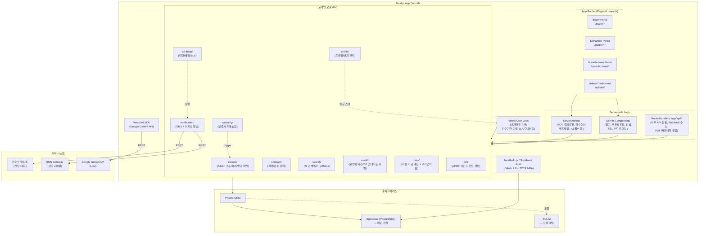
```mermaid
graph TB
    subgraph NextApp ["Next.js App (Vercel)"]
        subgraph Pages ["App Router (Pages & Layouts)"]
            P_BUYER["Buyer Portal\n/buyer/*"]
            P_SI["SI Partner Portal\n/partner/*"]
            P_MFR["Manufacturer Portal\n/manufacturer/*"]
            P_ADMIN["Admin Dashboard\n/admin/*"]
        end

        subgraph ServerLogic ["Server-side Logic"]
            SA["Server Actions\n(쓰기: 결제요청, 검수승인,\n뱃지발급, AS접수 등)"]
            SC["Server Components\n(읽기: 프로필조회, 검색,\n대시보드 렌더링)"]
            RH["Route Handlers /app/api/*\n(외부 API 연동, Webhook 수신,\nPDF 바이너리 응답)"]
        end

        subgraph DomainModules ["도메인 모듈 (lib/)"]
            M_ESC["escrow/\n(Admin 수동 예치/방출 확인)"]
            M_CONTRACT["contract/\n(계약/검수 관리)"]
            M_AS["as-ticket/\n(티켓/배정/SLA)"]
            M_WARRANTY["warranty/\n(보증서 자동발급)"]
            M_SEARCH["search/\n(SI 검색/필터, p95≤1s)"]
            M_PROFILE["profile/\n(프로필/뱃지 관리)"]
            M_CREDIT["credit/\n(운영팀 사전 DB 업데이트 기반)"]
            M_RAAS["raas/\n(비용 비교 계산 + 수기견적폼)"]
            M_PDF["pdf/\n(jsPDF 기반 리포트 생성)"]
            M_NOTI["notification/\n(SMS + 카카오 발송)"]
        end

        CRON["Vercel Cron Jobs\n(뱃지만료 스캔/\n검수기한 만료/SLA 모니터링)"]
        AI["Vercel AI SDK\n(Google Gemini API)"]
        AUTH["NextAuth.js / Supabase Auth\n(OAuth 2.0 + TOTP MFA)"]
    end

    subgraph DB ["데이터베이스"]
        PRISMA["Prisma ORM"]
        SUPA["Supabase (PostgreSQL)\n— 배포 환경"]
        SQLITE["SQLite\n— 로컬 개발"]
        PRISMA --> SUPA
        PRISMA -.->|로컬| SQLITE
    end

    subgraph External ["외부 시스템"]
        EXT_KAKAO["카카오 알림톡\n(건당 10원)"]
        EXT_SMS["SMS Gateway\n(건당 ≤20원)"]
        EXT_GEMINI["Google Gemini API\n(LLM)"]
    end

    Pages --> SC & SA
    SA --> DomainModules
    SC --> DomainModules
    RH --> DomainModules
    CRON --> DomainModules
    DomainModules --> PRISMA

    M_NOTI -->|REST| EXT_KAKAO
    M_NOTI -->|REST| EXT_SMS
    AI -->|REST| EXT_GEMINI

    AUTH --> SUPA

    M_WARRANTY -.->|trigger| M_ESC
    M_AS -.->|알림| M_NOTI
    M_PROFILE -.->|만료 스캔| CRON
```

### 3.2 Client Applications

| ID | 클라이언트 | 유형 | 사용자 |
|:---:|:---|:---|:---|
| CLI-01 | 수요 기업 웹 포털 | 반응형 웹 애플리케이션 | STK-01, STK-02, STK-04, STK-05, STK-06 |
| CLI-02 | SI 파트너 웹 포털 | 반응형 웹 애플리케이션 | SI 파트너 |
| CLI-03 | 제조사 관리 웹 포털 | 반응형 웹 애플리케이션 | STK-03 |
| CLI-04 | 플랫폼 Admin 대시보드 | 웹 애플리케이션 | STK-07, STK-08 |

#### 3.2.1 Use Case Diagram

시스템의 주요 액터(수요기업, SI 파트너, 제조사, 플랫폼 운영팀)와 플랫폼이 제공하는 통합 서비스(Use Case) 간의 상호작용을 식별한다.

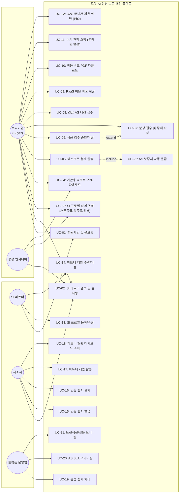
```mermaid
graph LR
    subgraph Actors_Left [" "]
        A_BUYER(("수요기업\n(Buyer)"))
        A_ENGINEER(("공정 엔지니어"))
    end

    subgraph Platform ["로봇 SI 안심 보증 매칭 플랫폼"]
        UC01["UC-01: 회원가입 및 온보딩"]
        UC02["UC-02: SI 파트너 검색 및 필터링"]
        UC03["UC-03: SI 프로필 상세 조회\n(재무등급/성공률/리뷰)"]
        UC04["UC-04: 기안용 리포트 PDF 다운로드"]
        UC05["UC-05: 에스크로 결제 실행"]
        UC06["UC-06: 시공 검수 승인/거절"]
        UC07["UC-07: 분쟁 접수 및 중재 요청"]
        UC08["UC-08: 긴급 AS 티켓 접수"]
        UC09["UC-09: RaaS 비용 비교 계산"]
        UC10["UC-10: 비용 비교 PDF 다운로드"]
        UC11["UC-11: 수기 견적 요청 (운영팀 연결)"]
        UC12["UC-12: O2O 매니저 파견 예약 (Ph2)"]
        UC13["UC-13: SI 프로필 등록/수정"]
        UC14["UC-14: 파트너 제안 수락/거절"]
        UC15["UC-15: 인증 뱃지 발급"]
        UC16["UC-16: 인증 뱃지 철회"]
        UC17["UC-17: 파트너 제안 발송"]
        UC18["UC-18: 파트너 현황 대시보드 조회"]
        UC19["UC-19: 분쟁 중재 처리"]
        UC20["UC-20: AS SLA 모니터링"]
        UC21["UC-21: 트랜잭션/성능 모니터링"]
        UC22["UC-22: AS 보증서 자동 발급"]
    end

    subgraph Actors_Right [" "]
        A_SI(("SI 파트너"))
        A_MFR(("제조사"))
        A_OPS(("플랫폼 운영팀"))
    end

    A_BUYER --> UC01 & UC02 & UC03 & UC04 & UC05 & UC06 & UC07 & UC08 & UC09 & UC10 & UC11 & UC12
    A_ENGINEER --> UC02 & UC03 & UC04

    A_SI --> UC01 & UC13 & UC14
    A_MFR --> UC02 & UC15 & UC16 & UC17 & UC18
    A_OPS --> UC19 & UC20 & UC21

    UC05 -.->|include| UC22
    UC06 -.->|extend| UC07
```

**Use Case - Actor 매핑표**

| Use Case ID | Use Case 명 | 수요기업 | 공정엔지니어 | SI 파트너 | 제조사 | 운영팀 | 관련 REQ |
|:---:|:---|:---:|:---:|:---:|:---:|:---:|:---|
| UC-01 | 회원가입 및 온보딩 | ● | | ● | | | REQ-FUNC-027, 028 |
| UC-02 | SI 파트너 검색 및 필터링 | ● | ● | | ● | | REQ-FUNC-029, 015 |
| UC-03 | SI 프로필 상세 조회 | ● | ● | | | | REQ-FUNC-009 |
| UC-04 | 기안용 리포트 PDF 다운로드 | ● | ● | | | | REQ-FUNC-010 |
| UC-05 | 에스크로 결제 실행 | ● | | | | | REQ-FUNC-001 |
| UC-06 | 시공 검수 승인/거절 | ● | | | | | REQ-FUNC-002, 005 |
| UC-07 | 분쟁 접수 및 중재 요청 | ● | | | | ● | REQ-FUNC-003 |
| UC-08 | 긴급 AS 티켓 접수 | ● | | | | | REQ-FUNC-007 |
| UC-09 | RaaS 비용 비교 계산 | ● | | | | | REQ-FUNC-018, 021 |
| UC-10 | 비용 비교 PDF 다운로드 | ● | | | | | REQ-FUNC-019 |
| UC-11 | 수기 견적 요청 (운영팀 연결) | ● | | | | | REQ-FUNC-020 |
| UC-12 | O2O 매니저 파견 예약 (Ph2) | ● | | | | | REQ-FUNC-023~026 |
| UC-13 | SI 프로필 등록/수정 | | | ● | | | REQ-FUNC-028 |
| UC-14 | 파트너 제안 수락/거절 | | | ● | | | REQ-FUNC-030 |
| UC-15 | 인증 뱃지 발급 | | | | ● | | REQ-FUNC-013, 017 |
| UC-16 | 인증 뱃지 철회 | | | | ● | | REQ-FUNC-014 |
| UC-17 | 파트너 제안 발송 | | | | ● | | REQ-FUNC-030, 032 |
| UC-18 | 파트너 현황 대시보드 조회 | | | | ● | | REQ-FUNC-031 |
| UC-19 | 분쟁 중재 처리 | | | | | ● | REQ-FUNC-003, 005 |
| UC-20 | AS SLA 모니터링 | | | | | ● | REQ-FUNC-008, 034 |
| UC-21 | 트랜잭션/성능 모니터링 | | | | | ● | REQ-FUNC-033~036 |
| UC-22 | AS 보증서 자동 발급 | | | | | | REQ-FUNC-006 |

### 3.3 API Overview

| API ID | API 명 | 방향 | 구현 방식 (Next.js) | 입력 (Input) | 출력 (Output) | 제약 |
|:---:|:---|:---:|:---|:---|:---|:---|
| API-01 | Admin 에스크로 상태 변경 (예치) | 내부 | Server Action (`action: updateEscrowStatus`) | 계약 ID, Admin 메모, 상태값 | 에스크로 TX 상태 | Admin 권한 필수 |
| API-02 | Admin 자금 방출 확인 | 내부 | Server Action (`action: confirmRelease`) | 에스크로 TX ID, Admin 메모 | 방출 상태, 완료 시각 | 검수 승인 후 Admin 확인 |
| API-04 | 카카오 알림톡 발송 | 외부 (Outbound) | Route Handler (`/app/api/notifications/kakao`) | 수신 번호, 템플릿 ID, 변수 | 발송 결과 | 건당 10원, 초당 100건 |
| API-05 | SMS 발송 | 외부 (Outbound) | Route Handler (`/app/api/notifications/sms`) | 수신 번호, 메시지 내용 | 발송 결과 | 건당 20원 이하 |
| API-07 | SI 검색 및 필터 | 내부 | Server Component + Prisma 직접 쿼리 | 지역, 브랜드, 역량 태그 | SI 목록 (정렬·페이지네이션) | p95 ≤ 1초 |
| API-08 | RaaS 비용 계산 엔진 | 내부 | Server Action (`calculateRaasOptions`) | 로봇 모델, 수량, 계약 기간 | 3옵션 비교 JSON (일시불·리스·RaaS) | 내부 DB 기반 계산 |
| API-09 | 기안 리포트 PDF 생성 | 내부 | Route Handler (`/app/api/reports/pdf`) — 바이너리 응답 | SI 파트너 ID | PDF 바이너리 (재무·기술·인증·리뷰 4섹션) | p95 ≤ 5초 |
| API-10 | 뱃지 발급/관리 | 내부 | Server Action (`issueBadge`, `revokeBadge`) | 제조사 ID, SI 파트너 ID, 만료일 | 뱃지 상태 | 반영 ≤ 1시간 |
| API-11 | AS 티켓 접수/배정 | 내부 | Server Action (`createAsTicket`, `assignEngineer`) | 계약 ID, 긴급도, 증상 설명 | 티켓 ID, 배정 AS 엔지니어 | 배정 ≤ 4시간 |
| API-12 | 보증서 발급 | 내부 | Route Handler (`/app/api/warranty/issue`) — PDF 바이너리 | 에스크로 TX ID, 계약 ID | 보증서 PDF/디지털 문서 | 발급 ≤ 1분 |
| API-13 | 수기 견적 요청 (더미 폼) | 내부 | Server Action (`action: requestManualQuote`) | 로봇 모델, 수량, 기간, 연락처 | 리드 ID, Admin 알림 | 리드 DB 저장 |

### 3.4 Interaction Sequences (핵심 시퀀스 다이어그램)

#### 3.4.1 에스크로 결제 및 자금 방출 흐름

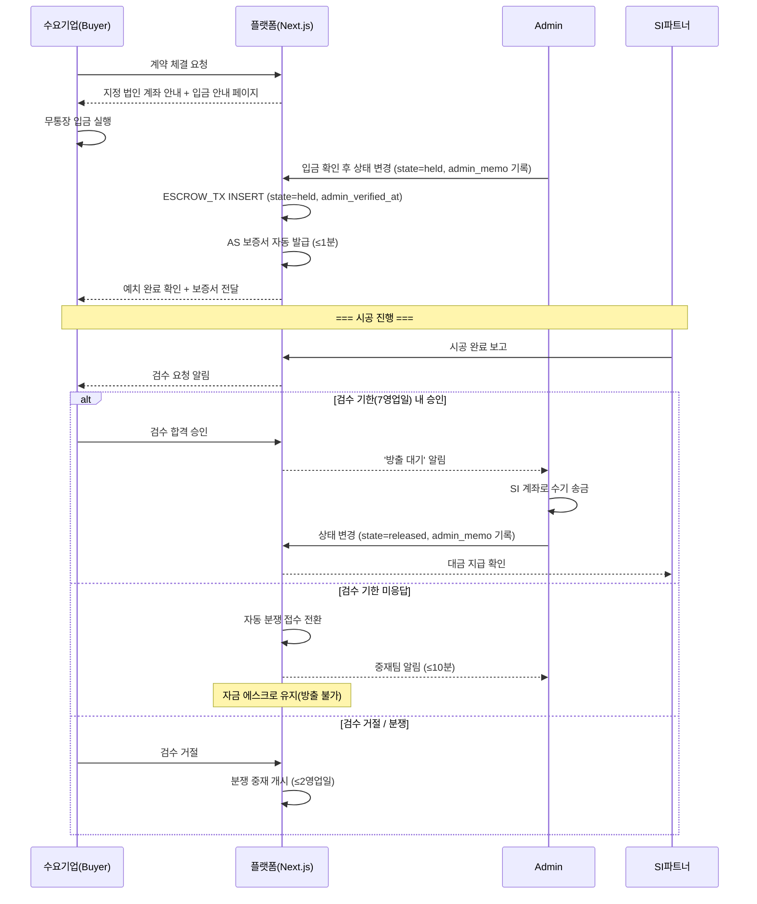
```mermaid
sequenceDiagram
    participant B as 수요기업(Buyer)
    participant P as 플랫폼(Next.js)
    participant ADMIN as Admin
    participant SI as SI파트너

    B->>P: 계약 체결 요청
    P-->>B: 지정 법인 계좌 안내 + 입금 안내 페이지
    B->>B: 무통장 입금 실행
    ADMIN->>P: 입금 확인 후 상태 변경 (state=held, admin_memo 기록)
    P->>P: ESCROW_TX INSERT (state=held, admin_verified_at)
    P->>P: AS 보증서 자동 발급 (≤1분)
    P-->>B: 예치 완료 확인 + 보증서 전달

    Note over B,SI: === 시공 진행 ===

    SI->>P: 시공 완료 보고
    P-->>B: 검수 요청 알림
    alt 검수 기한(7영업일) 내 승인
        B->>P: 검수 합격 승인
        P-->>ADMIN: '방출 대기' 알림
        ADMIN->>ADMIN: SI 계좌로 수기 송금
        ADMIN->>P: 상태 변경 (state=released, admin_memo 기록)
        P-->>SI: 대금 지급 확인
    else 검수 기한 미응답
        P->>P: 자동 분쟁 접수 전환
        P-->>ADMIN: 중재팀 알림 (≤10분)
        Note over P: 자금 에스크로 유지(방출 불가)
    else 검수 거절 / 분쟁
        B->>P: 검수 거절
        P->>P: 분쟁 중재 개시 (≤2영업일)
    end
```

#### 3.4.2 SI 파트너 검색 및 평판 조회 흐름

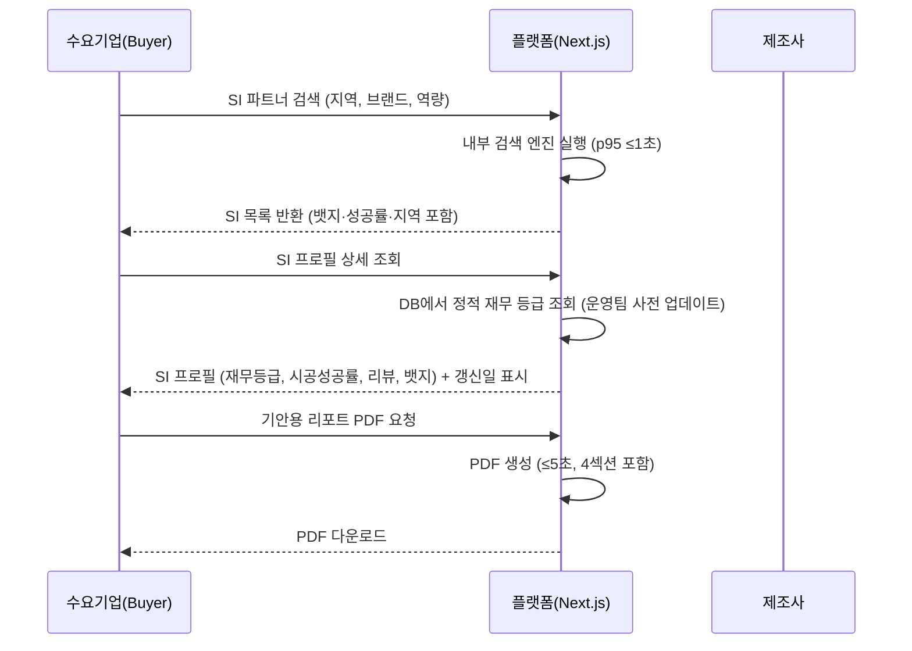
```mermaid
sequenceDiagram
    participant B as 수요기업(Buyer)
    participant P as 플랫폼(Next.js)
    participant MFR as 제조사

    B->>P: SI 파트너 검색 (지역, 브랜드, 역량)
    P->>P: 내부 검색 엔진 실행 (p95 ≤1초)
    P-->>B: SI 목록 반환 (뱃지·성공률·지역 포함)

    B->>P: SI 프로필 상세 조회
    P->>P: DB에서 정적 재무 등급 조회 (운영팀 사전 업데이트)
    P-->>B: SI 프로필 (재무등급, 시공성공률, 리뷰, 뱃지) + 갱신일 표시

    B->>P: 기안용 리포트 PDF 요청
    P->>P: PDF 생성 (≤5초, 4섹션 포함)
    P-->>B: PDF 다운로드
```

#### 3.4.3 긴급 AS 접수 및 출동 흐름

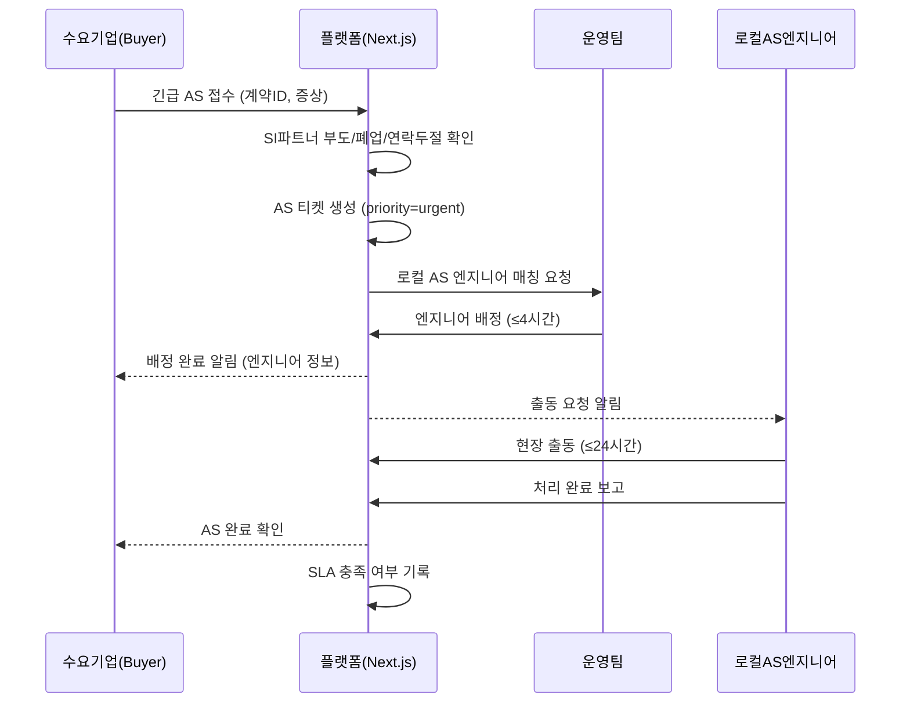
```mermaid
sequenceDiagram
    participant B as 수요기업(Buyer)
    participant P as 플랫폼(Next.js)
    participant OPS as 운영팀
    participant AS as 로컬AS엔지니어

    B->>P: 긴급 AS 접수 (계약ID, 증상)
    P->>P: SI파트너 부도/폐업/연락두절 확인
    P->>P: AS 티켓 생성 (priority=urgent)
    P->>OPS: 로컬 AS 엔지니어 매칭 요청
    OPS->>P: 엔지니어 배정 (≤4시간)
    P-->>B: 배정 완료 알림 (엔지니어 정보)
    P-->>AS: 출동 요청 알림
    AS->>P: 현장 출동 (≤24시간)
    AS->>P: 처리 완료 보고
    P-->>B: AS 완료 확인
    P->>P: SLA 충족 여부 기록
```

#### 3.4.4 제조사 인증 뱃지 발급·관리 흐름

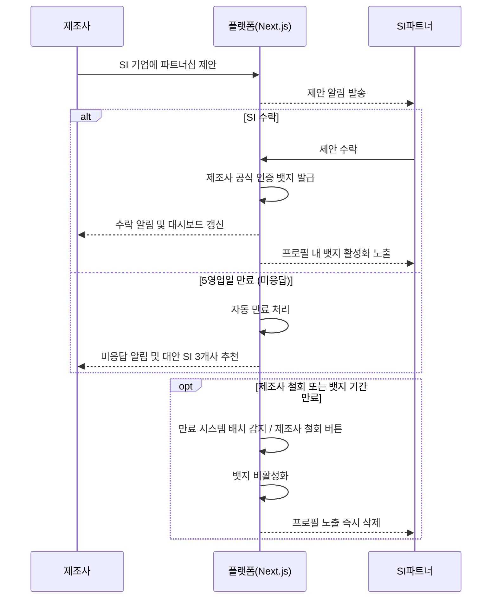
```mermaid
sequenceDiagram
    participant MFR as 제조사
    participant P as 플랫폼(Next.js)
    participant SI as SI파트너

    MFR->>P: SI 기업에 파트너십 제안
    P-->>SI: 제안 알림 발송
    
    alt SI 수락
        SI->>P: 제안 수락
        P->>P: 제조사 공식 인증 뱃지 발급
        P-->>MFR: 수락 알림 및 대시보드 갱신
        P-->>SI: 프로필 내 뱃지 활성화 노출
    else 5영업일 만료 (미응답)
        P->>P: 자동 만료 처리
        P-->>MFR: 미응답 알림 및 대안 SI 3개사 추천
    end

    opt 제조사 철회 또는 뱃지 기간 만료
        P->>P: 만료 시스템 배치 감지 / 제조사 철회 버튼
        P->>P: 뱃지 비활성화
        P-->>SI: 프로필 노출 즉시 삭제
    end
```

#### 3.4.5 OPEX 비용 비교 계산기 이용 흐름

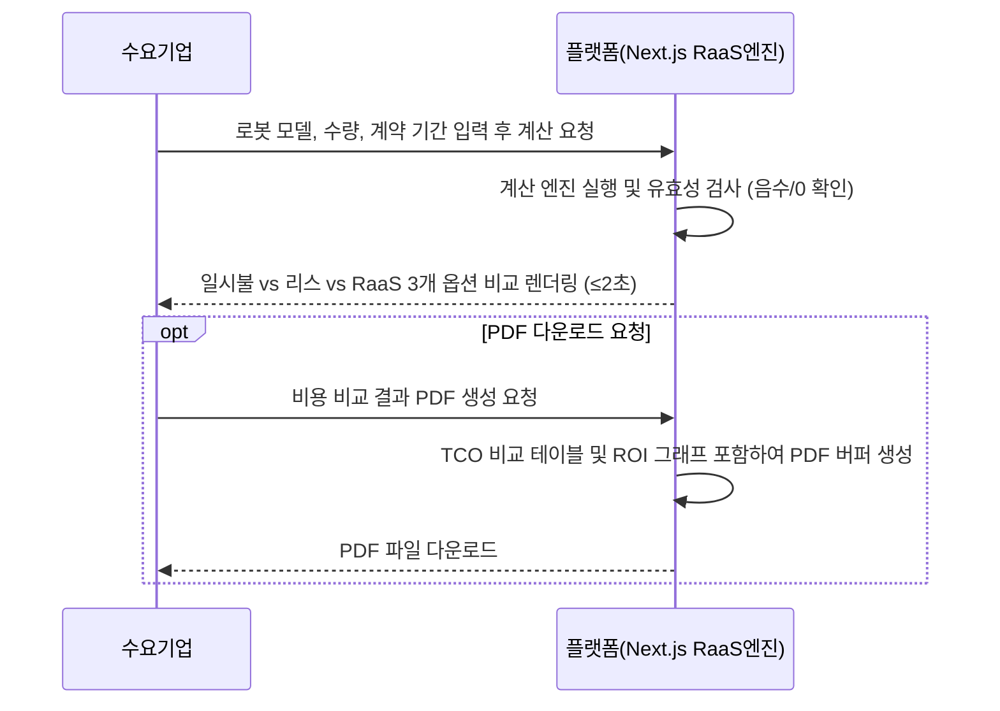
```mermaid
sequenceDiagram
    participant U as 수요기업
    participant P as 플랫폼(Next.js RaaS엔진)

    U->>P: 로봇 모델, 수량, 계약 기간 입력 후 계산 요청
    P->>P: 계산 엔진 실행 및 유효성 검사 (음수/0 확인)
    
    P-->>U: 일시불 vs 리스 vs RaaS 3개 옵션 비교 렌더링 (≤2초)
    
    opt PDF 다운로드 요청
        U->>P: 비용 비교 결과 PDF 생성 요청
        P->>P: TCO 비교 테이블 및 ROI 그래프 포함하여 PDF 버퍼 생성
        P-->>U: PDF 파일 다운로드
    end
```

#### 3.4.6 RaaS 구독 흐름

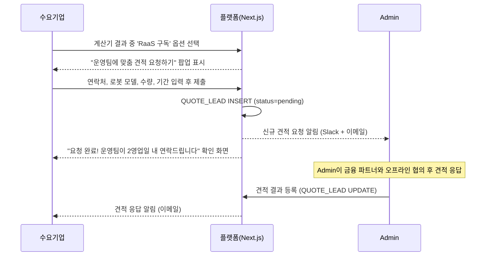
```mermaid
sequenceDiagram
    participant U as 수요기업
    participant P as 플랫폼(Next.js)
    participant ADMIN as Admin
    
    U->>P: 계산기 결과 중 'RaaS 구독' 옵션 선택
    P-->>U: "운영팀에 맞춤 견적 요청하기" 팝업 표시
    U->>P: 연락처, 로봇 모델, 수량, 기간 입력 후 제출
    P->>P: QUOTE_LEAD INSERT (status=pending)
    P-->>ADMIN: 신규 견적 요청 알림 (Slack + 이메일)
    P-->>U: "요청 완료! 운영팀이 2영업일 내 연락드립니다" 확인 화면

    Note over ADMIN: Admin이 금융 파트너와 오프라인 협의 후 견적 응답
    ADMIN->>P: 견적 결과 등록 (QUOTE_LEAD UPDATE)
    P-->>U: 견적 응답 알림 (이메일)
```

---

## 4. Specific Requirements

### 4.1 Functional Requirements

#### 4.1.1 F-01: 안심 에스크로 결제 시스템

| Req ID | 요구사항 | Source | Priority | Acceptance Criteria |
|:---:|:---|:---:|:---:|:---|
| REQ-FUNC-001 | 시스템은 수요 기업의 계약금 입금 요청 시 지정 법인 계좌 정보를 안내하고, Admin이 입금 확인 후 에스크로 상태를 'held'로 수동 변경해야 한다 | Story 1, F-01 | Must | **Given** 수요 기업이 SI 파트너와 계약을 체결함 **When** 계약금 입금을 요청함 **Then** 지정 법인 계좌 정보가 안내되고, Admin 확인 후 예치 상태가 반영됨. admin_verified_at 타임스탬프 기록 |
| REQ-FUNC-002 | 시스템은 검수 합격 승인 시 Admin 대시보드에 '방출 대기' 알림을 표시하고, Admin이 수기 송금 후 상태를 'released'로 수동 변경해야 한다 | Story 1, F-01 | Must | **Given** 시공이 완료되고 검수 프로세스가 시작됨 **When** 수요 기업이 검수 합격을 승인함 **Then** Admin 대시보드에 '방출 대기' 알림 표시, Admin 수기 송금 후 상태 변경. admin_memo 기록 |
| REQ-FUNC-003 | 시스템은 분쟁 발생 시 플랫폼 중재 프로세스를 자동 개시해야 한다 | Story 1, F-01 | Must | **Given** 수요 기업이 검수를 거절하거나 분쟁을 신청함 **When** 분쟁 접수가 등록됨 **Then** 플랫폼 중재팀에 알림이 전송되고 중재가 개시됨. 중재 개시 소요 ≤ 2영업일 |
| REQ-FUNC-005 | 시스템은 검수 기한(7영업일) 내 수요 기업의 승인/거절 미응답 시 자동으로 '분쟁 접수' 상태로 전환해야 한다 | Story 1 (AC-1.6), F-01 | Must | **Given** 시공 완료 후 수요 기업이 검수 기한(7영업일) 내 승인/거절 미응답 **When** 검수 기한이 만료됨 **Then** 계약 상태가 '검수 대기 → 분쟁 접수'로 자동 전환, 중재팀 알림 ≤ 10분 이내 발송, 자금 에스크로 유지(방출 불가) |

#### 4.1.2 F-02: 제조사 인증 로컬 AS망 연동 및 보증서 발급

| Req ID | 요구사항 | Source | Priority | Acceptance Criteria |
|:---:|:---|:---:|:---:|:---|
| REQ-FUNC-006 | 시스템은 에스크로 결제 완료 시 AS 보증서를 자동 발급해야 한다 | Story 1 (AC-1.4), F-02 | Must | **Given** 에스크로 결제가 완료됨 **When** AS 보증서 자동 발급이 트리거됨 **Then** 보증서가 1분 이내 발급되며, 지정 로컬 AS 업체명·연락처·보증 범위가 100% 명시됨 |
| REQ-FUNC-007 | 시스템은 SI 파트너의 부도·폐업·연락두절 확인 시 로컬 AS 엔지니어를 자동 매칭하여 배정해야 한다 | Story 1 (AC-1.3), F-02 | Must | **Given** SI 파트너가 부도·폐업·연락두절 상태로 확인됨 **When** 수요 기업이 긴급 AS를 접수함 **Then** 로컬 AS 엔지니어가 4시간 이내 배정되고, 현장 출동이 24시간 이내 이루어짐. 성공률 ≥ 95% |
| REQ-FUNC-008 | 시스템은 AS 티켓의 접수·배정·출동·완료 전 과정을 추적하고 SLA 충족 여부를 자동 기록해야 한다 | F-02 | Must | **Given** AS 티켓이 생성됨 **When** 각 단계(접수→배정→출동→완료)가 진행됨 **Then** 각 단계별 timestamp가 기록되고, `resolved_at - reported_at ≤ 24h` 기준으로 SLA 충족 여부가 자동 판정됨 |

#### 4.1.3 F-03: SI 파트너 재무/시공 투명 평판 뷰어

| Req ID | 요구사항 | Source | Priority | Acceptance Criteria |
|:---:|:---|:---:|:---:|:---|
| REQ-FUNC-009 | 시스템은 SI 파트너 프로필 페이지에서 재무 등급(운영팀 사전 DB 업데이트)·시공 성공률·고객 리뷰 점수를 통합 표시해야 한다 | Story 2 (AC-2.1), F-03 | Must | **Given** 수요 기업이 SI 파트너 프로필 페이지에 접근함 **When** 페이지를 로드함 **Then** 재무 등급·시공 성공률·리뷰 점수가 DB 정적 데이터로 로딩됨. 로딩 시간 ≤ 2초 (p95), 갱신일 표시 |
| REQ-FUNC-010 | 시스템은 '기안용 리포트' PDF를 재무·기술·인증·리뷰 4개 섹션을 포함하여 자동 생성해야 한다 | Story 2 (AC-2.2), F-03 | Must | **Given** 수요 기업이 '기안용 리포트' 다운로드를 요청함 **When** PDF 리포트가 생성됨 **Then** 생성 소요 ≤ 5초, 리포트에 재무·기술·인증·리뷰 4개 섹션이 100% 포함됨 |

#### 4.1.4 F-04: 제조사 인증 뱃지 시스템

| Req ID | 요구사항 | Source | Priority | Acceptance Criteria |
|:---:|:---|:---:|:---:|:---|
| REQ-FUNC-013 | 시스템은 로봇 제조사가 SI 파트너에게 인증 뱃지를 발급할 수 있는 기능을 제공해야 한다 | Story 2 (AC-2.3), Story 5, F-04 | Must | **Given** 제조사가 SI 업체에 인증 뱃지를 발급함 **When** SI 프로필에 뱃지가 노출됨 **Then** 뱃지 반영 지연 ≤ 1시간 |
| REQ-FUNC-014 | 시스템은 뱃지 만료 또는 철회 시 SI 프로필에서 자동으로 비노출 처리해야 한다 | Story 2 (AC-2.3), F-04 | Must | **Given** 뱃지의 만료일이 도래하거나 제조사가 뱃지를 철회함 **When** 만료/철회 이벤트가 발생함 **Then** SI 프로필에서 해당 뱃지가 10분 이내 자동 비노출 처리됨 |
| REQ-FUNC-015 | 시스템은 뱃지 보유 SI 필터를 제공하고, 필터링 시 미인증 SI가 혼입되지 않아야 한다 | Story 2 (AC-2.4), F-04 | Must | **Given** 검색 결과에서 뱃지 보유 SI 필터를 적용함 **When** 필터링된 목록이 표시됨 **Then** 필터 적용 응답 ≤ 1초 (p95), 미인증 SI 혼입률 = 0% |
| REQ-FUNC-016 | 시스템은 뱃지 만료 D-7일에 해당 SI에게 이메일 및 내부 알림을 자동 발송해야 한다 | F-04 | Must | **Given** 뱃지 만료일이 7일 이내로 도래함 **When** 일일 배치 스캔이 실행됨 **Then** 해당 SI에게 만료 안내 이메일 및 내부 알림이 발송됨 |
| REQ-FUNC-017 | 시스템은 3개 이상의 로봇 제조사 브랜드를 지원하는 Brand-Agnostic 뱃지 구조를 제공해야 한다 | F-04 | Must | **Given** 서로 다른 제조사(≥3사)가 각각 뱃지를 발급하려 함 **When** 뱃지 발급 요청이 접수됨 **Then** 제조사별 독립 뱃지가 발급되며, 하나의 SI에 다수 제조사 뱃지가 동시 표시 가능 |

#### 4.1.5 F-05: RaaS 구독 및 OPEX 비용 비교 계산기

| Req ID | 요구사항 | Source | Priority | Acceptance Criteria |
|:---:|:---|:---:|:---:|:---|
| REQ-FUNC-018 | 시스템은 로봇 모델·수량·계약 기간 입력 시 일시불·리스·RaaS 3가지 비용 옵션을 내부 DB 기반으로 자동 계산하여 비교 결과를 표시해야 한다 | Story 4 (AC-4.1), F-05 | Should | **Given** 사용자가 로봇 모델·수량·계약 기간을 입력함 **When** '비교 계산' 버튼을 누름 **Then** 3가지 옵션(일시불·리스·RaaS) 결과가 렌더링됨. 렌더링 소요 ≤ 2초 |
| REQ-FUNC-019 | 시스템은 비용 비교 결과를 ROI 그래프·월비용 테이블·TCO 비교를 포함한 PDF로 생성해야 한다 | Story 4 (AC-4.2), F-05 | Should | **Given** 계산 결과가 표시됨 **When** '결과 PDF 내려받기'를 요청함 **Then** PDF가 3초 이내 생성되며, ROI 그래프·월비용 테이블·TCO 비교가 포함됨 |
| REQ-FUNC-020 | 시스템은 특정 RaaS 플랜 선택 시 "운영팀에 맞춤 견적 요청하기" 팝업을 표시하고, 제출 시 DB에 리드(Lead) 데이터를 저장하고 Admin에게 알림을 보내야 한다 | Story 4 (AC-4.3), F-05 | Should | **Given** 사용자가 특정 RaaS 플랜을 선택함 **When** 견적 요청 폼을 제출함 **Then** QUOTE_LEAD 테이블에 리드 데이터 저장, Admin에게 Slack + 이메일 알림 발송, 사용자에게 "요청 완료" 확인 화면 표시 |
| REQ-FUNC-021 | 시스템은 존재하지 않는 로봇 모델 코드 또는 음수/0 수량 입력 시 인라인 유효성 에러를 표시하고 계산 요청을 차단해야 한다 | Story 4 (AC-4.4), F-05 | Should | **Given** 사용자가 존재하지 않는 로봇 모델 코드 또는 수량에 음수/0을 입력함 **When** 계산 요청이 발생함 **Then** 인라인 유효성 에러 메시지가 200ms 이내 표시, 계산 요청 차단. 잘못된 모델 코드 시 유사 모델 추천 3건 자동 표시 |

#### 4.1.6 F-06: 현장 O2O 매니저 파견 예약 캘린더 (Phase 2)

| Req ID | 요구사항 | Source | Priority | Acceptance Criteria |
|:---:|:---|:---:|:---:|:---|
| REQ-FUNC-023 | 시스템은 희망 지역·날짜 선택 시 가용 매니저 슬롯을 조회하여 표시해야 한다 | Story 3 (AC-3.1), F-06 | Should | **Given** 수요 기업이 O2O 파견 예약 화면에 접근함 **When** 희망 지역·날짜를 선택함 **Then** 가능한 매니저 슬롯 조회 ≤ 2초, 3일 내 가용 슬롯 ≥ 2개 (수도권 기준) |
| REQ-FUNC-024 | 시스템은 예약 확정 시 SMS + 카카오톡으로 이중 알림을 발송해야 한다 | Story 3 (AC-3.2), F-06 | Should | **Given** 예약이 확정됨 **When** 예약 확인 알림이 발송됨 **Then** SMS + 카카오톡 이중 발송 ≤ 30초, 발송 실패율 < 1% |
| REQ-FUNC-025 | 시스템은 매니저 방문 완료 후 방문 보고서를 등록하고 관리해야 한다 | Story 3 (AC-3.3), F-06 | Should | **Given** 매니저가 현장 방문을 완료함 **When** 방문 보고서가 등록됨 **Then** 보고서 등록 ≤ 24시간, 보고서에 상담 요약·추천 SI 3개사·예상 견적 범위가 포함됨 |
| REQ-FUNC-026 | 시스템은 가용 매니저 슬롯이 0건일 때 가장 가까운 가용 일정을 자동 추천하고, 대기 예약 옵션을 제공해야 한다 | Story 3 (AC-3.4), F-06 | Should | **Given** 희망 지역·날짜에 가용 매니저 슬롯이 0건 **When** 조회 결과가 비어 있음 **Then** "가장 가까운 가용 일정(D+N)" 자동 추천 ≤ 2초, 대기 예약 옵션 제공. 지역 매니저 부족 시 Ops Slack 즉시 알림 |

#### 4.1.7 수요 기업·SI 파트너 온보딩 및 검색

| Req ID | 요구사항 | Source | Priority | Acceptance Criteria |
|:---:|:---|:---:|:---:|:---|
| REQ-FUNC-027 | 시스템은 수요 기업의 회원가입 및 온보딩 프로세스를 제공해야 한다 | F-03, F-04 (KPI: 신규 수요 기업 가입 수) | Must | **Given** 신규 수요 기업 담당자가 가입 페이지에 접근함 **When** 필수 정보(회사명, 사업자등록번호, 지역, 담당자 정보)를 입력하고 가입을 완료함 **Then** `signup_complete` 이벤트가 Vercel Analytics (DB 이벤트 로그)에 기록되고, 대시보드에서 집계됨 |
| REQ-FUNC-028 | 시스템은 SI 파트너의 회원가입 및 프로필 등록 프로세스를 제공해야 한다 | F-03, F-04 | Must | **Given** SI 파트너가 가입 페이지에 접근함 **When** 회사 정보·시공 이력·역량 태그를 등록함 **Then** SI 프로필이 생성되고, Admin 검토 대기 상태로 전환됨 |
| REQ-FUNC-029 | 시스템은 지역·브랜드·역량 태그 기반의 SI 파트너 검색 및 필터링 기능을 제공해야 한다 | Story 5 (AC-5.1), F-03, F-04 | Must | **Given** 제조사 또는 수요 기업이 브랜드·지역·역량 필터를 설정함 **When** 검색을 실행함 **Then** 결과 반환 ≤ 1초 (p95), 결과에 뱃지 보유 여부·성공률·지역이 명시됨 |

#### 4.1.8 제조사-SI 파트너십 관리

| Req ID | 요구사항 | Source | Priority | Acceptance Criteria |
|:---:|:---|:---:|:---:|:---|
| REQ-FUNC-030 | 시스템은 제조사가 특정 SI에게 '파트너 제안'을 발송하고, SI의 수락/거절을 관리해야 한다 | Story 5 (AC-5.2), F-04 | Must | **Given** 제조사가 특정 SI에게 '파트너 제안'을 발송함 **When** SI가 수락/거절함 **Then** 제안 발송 ≤ 3초, SI 응답 기한 ≤ 5영업일, 미응답 시 자동 리마인더 |
| REQ-FUNC-031 | 시스템은 파트너십 체결 시 '공식 인증 파트너' 뱃지를 자동 노출하고, 제조사 대시보드에 파트너 현황을 실시간 표시해야 한다 | Story 5 (AC-5.3), F-04 | Must | **Given** 파트너십이 체결됨 **When** 플랫폼에 '공식 인증 파트너' 뱃지가 노출됨 **Then** 뱃지 반영 ≤ 1시간, 제조사 대시보드에 파트너 현황 실시간 표시 |
| REQ-FUNC-032 | 시스템은 SI의 파트너 제안 미응답(5영업일) 시 D+3 자동 리마인더 1회 발송 후, D+5 만료 처리 및 대안 SI 3개사를 자동 추천해야 한다 | Story 5 (AC-5.4), F-04 | Must | **Given** SI가 파트너 제안에 5영업일 내 미응답 **When** 응답 기한이 만료됨 **Then** D+3 자동 리마인더 1회 발송, D+5 만료 시 제조사에게 "미응답 종료" 알림 + 대안 SI 3개사 자동 추천 ≤ 1분 |

#### 4.1.9 모니터링 및 알림

| Req ID | 요구사항 | Source | Priority | Acceptance Criteria |
|:---:|:---|:---:|:---:|:---|
| REQ-FUNC-033 | 시스템은 Admin 에스크로 상태 변경 오류율이 연속 5분간 0.5% 초과 시 Slack Webhook 알림을 자동 발송해야 한다 | NFR 5.5 | Must | **Given** 에스크로 상태 변경 트랜잭션이 모니터링 중임 **When** 오류율 > 0.5%가 연속 5분 지속 **Then** Slack Webhook 알림이 자동 발송됨 |
| REQ-FUNC-034 | 시스템은 AS 티켓이 24시간 미배정 시 Slack 즉시 알림을 발송해야 한다 | NFR 5.5 | Must | **Given** AS 티켓이 접수되어 배정 대기 중임 **When** 접수 후 24시간이 경과하여도 미배정 상태 **Then** Ops Slack 채널에 즉시 알림 발송 |
| REQ-FUNC-035 | 시스템은 RaaS 계산 엔진의 p95 응답 시간이 연속 10분간 3초 초과 시 Eng팀에 알림을 발송해야 한다 | NFR 5.5 | Must | **Given** RaaS 계산 엔진이 운영 중임 **When** p95 응답 > 3초 연속 10분 **Then** Eng팀 알림 발송 |
| REQ-FUNC-036 | 시스템은 페이지 성능(LCP)의 p95가 연속 1시간 동안 3초를 초과할 때 Eng 알림을 발송해야 한다 | NFR 5.5 | Must | **Given** Vercel Analytics / Core Web Vitals 모니터링이 활성 상태임 **When** LCP > 3초 p95가 연속 1시간 지속 **Then** Eng팀 알림 발송 |

---

### 4.2 Non-Functional Requirements

#### 4.2.1 성능 (Performance)

| Req ID | 요구사항 | 측정 기준 | Source |
|:---:|:---|:---|:---|
| REQ-NF-001 | 시스템의 페이지 로딩 시간(LCP)은 p95 기준 2,000ms 이하여야 한다 | Vercel Analytics Web Vitals 측정, p95 ≤ 2,000ms | PRD 5.1 |
| REQ-NF-002 | 시스템의 API 응답 시간(검색·필터)은 p95 기준 1,000ms 이하여야 한다 | API Gateway 응답 로그 기준, p95 ≤ 1,000ms | PRD 5.1 |
| REQ-NF-004 | PDF 리포트 생성 소요 시간은 p95 기준 5,000ms 이하여야 한다 | 서버 사이드 PDF 생성 로그, p95 ≤ 5,000ms | PRD 5.1 |
| REQ-NF-005 | 시스템은 500 CCU (동시 접속 사용자) 이상을 지원해야 한다 | 부하 테스트 (k6, Vercel Preview 환경), 500 CCU × 30분 지속, p95 ≤ 임계치, 에러율 < 1%, CPU 평균 ≤ 70% | PRD 5.1 |
| REQ-NF-006 | 부하 테스트는 MVP D-14 Staging 환경에서 k6를 사용하여 Vercel Preview 환경에서 500 CCU × 30분 지속 부하 조건으로 수행해야 한다 | 통과 기준: p95 ≤ 위 임계치, 에러율 < 1%, CPU 평균 ≤ 70% | PRD 5.1 |

#### 4.2.2 신뢰성·가용성 (Reliability & Availability)

| Req ID | 요구사항 | 측정 기준 | Source |
|:---:|:---|:---|:---|
| REQ-NF-007 | 시스템의 월간 가용성(Uptime)은 99.5% 이상이어야 한다 (월 다운타임 ≤ 3.6시간) | 업타임 모니터링 도구 측정, 월간 가용성 ≥ 99.5% | PRD 5.2 |
| REQ-NF-008 | 에스크로 결제 오류율은 0.1% 미만이어야 한다 | `ESCROW_TX` 오류 건수 / 전체 건수, 오류율 < 0.1% | PRD 5.2 |
| REQ-NF-009 | 데이터 백업 RPO(복구 시점 목표)는 1시간 이하여야 한다 | 백업 시스템 해당 주기 검증, RPO ≤ 1시간 | PRD 5.2 |
| REQ-NF-010 | RTO(장애 복구 시간)는 4시간 이하여야 한다 | 장애 복구 훈련 시 측정, RTO ≤ 4시간 | PRD 5.2 |
| REQ-NF-011 | 거래·결제 데이터는 5년간 보존해야 한다 (전자금융거래법 준수) | 데이터 보존 정책 감사, 보존 기간 ≥ 5년 | PRD 5.2 |
| REQ-NF-012 | 개인정보는 탈퇴 후 30일 보존 후 파기해야 한다 | 탈퇴 후 30일 경과 시 파기 확인, 파기 로그 존재 | PRD 5.2 |
| REQ-NF-013 | 로그 데이터는 90일 Hot Storage, 이후 1년 Cold Storage로 보존해야 한다 | 로그 보존 정책 감사 | PRD 5.2 |

#### 4.2.3 보안 (Security)

| Req ID | 요구사항 | 측정 기준 | Source |
|:---:|:---|:---|:---|
| REQ-NF-014 | 결제 입출금 증빙 및 Admin 확인 기록은 전자금융거래법 기준 5년 보존해야 한다 | Admin 확인 로그 및 입출금 증빙 보존 기간 검증 | PRD 5.3 |
| REQ-NF-015 | 개인정보 처리는 개인정보보호법을 준수하고, ISMS-P 인증을 MVP+12개월 내 취득해야 한다 | ISMS-P 인증 취득 여부, 취득 시한 MVP+12개월 | PRD 5.3 |
| REQ-NF-016 | 사용자 인증은 NextAuth.js (Auth.js) 또는 Supabase Auth 기반 OAuth 2.0을 적용하고, B2B 관리자 계정에 TOTP 기반 MFA(다중 인증)를 필수 적용해야 한다 | 인증 흐름 검증, B2B 관리자 계정 MFA 활성화율 100% | PRD 5.3 |
| REQ-NF-017 | 모든 데이터 전송은 TLS 1.3을 강제 적용해야 한다 | SSL Labs 등급 A+ 또는 동등 검증 | PRD 5.3 |

#### 4.2.4 비용 (Cost)

| Req ID | 요구사항 | 측정 기준 | Source |
|:---:|:---|:---|:---|
| REQ-NF-018 | MVP 인프라 비용은 월 500만 원 이하를 유지해야 한다 | 월간 클라우드 청구서 기준, ≤ 월 500만 원 | PRD 5.4 |
| REQ-NF-019 | *(Phase 2 이관)* PG 도입 시 에스크로 전용 요율 기준 3.5% 이하를 적용한다. MVP에서는 PG 미사용 | PG사 계약 요율 확인, ≤ 3.5% (Phase 2 활성화) | PRD 5.4 |
| REQ-NF-020 | SMS/카카오 알림톡 발송 비용은 건당 20원 이하여야 한다 | 발송 비용 정산 기준, ≤ 건당 20원 | PRD 5.4 |

#### 4.2.5 확장성 (Scalability)

| Req ID | 요구사항 | 측정 기준 | Source |
|:---:|:---|:---|:---|
| REQ-NF-021 | 시스템은 뱃지 인증 SI 파트너 120개사, 수요 기업 300개사 규모까지 수평 확장이 가능해야 한다 | MVP+6개월 목표 사용자 규모에서 성능 임계치 준수 여부 | PRD 1.3 KPI |

#### 4.2.6 유지보수성 (Maintainability)

| Req ID | 요구사항 | 측정 기준 | Source |
|:---:|:---|:---|:---|
| REQ-NF-022 | 시스템은 Brand-Agnostic 호환성 DB 구조를 채택하여, 신규 제조사 브랜드 추가 시 DB 스키마 변경 없이 데이터 레벨에서 확장 가능해야 한다 | 신규 제조사 추가 시 스키마 마이그레이션 불필요 확인 | ADR-003 |

#### 4.2.7 KPI 기반 비기능 요구사항

| Req ID | 요구사항 | 목표값 | 측정 경로 | Source |
|:---:|:---|:---|:---|:---|
| REQ-NF-023 | 월간 에스크로 거래 완결 수 (북극성 KPI) | MVP+6개월: **30건** | `ESCROW_TX` 테이블 `state=released` 집계 → Supabase Dashboard + Admin 페이지 | PRD 1.3 |
| REQ-NF-024 | 24시간 내 AS 출동 성공률 | MVP+6개월: **≥ 95%** | `AS_TICKET` WHERE `resolved_at - reported_at ≤ 24h` 비율 → Ops 대시보드 | PRD 1.3, G-01 |
| REQ-NF-025 | 경영진 기안 첫 보고 통과율 | MVP+3개월: **≥ 80%** | 사후 설문 / 코호트 분석 (EXP-02) | PRD 1.3, G-02 |
| REQ-NF-026 | O2O 파견 후 견적 요청 전환율 | Phase 2: **≥ 40%** | 퍼널 분석 | PRD 1.3, G-03 |
| REQ-NF-027 | RaaS 계산기 사용 후 계약 전환율 | MVP+6개월: **≥ 25%** | 퍼널 분석 (EXP-04) | PRD 1.3, G-04 |
| REQ-NF-028 | NPS (수요 기업) | MVP+6개월: **≥ 50** | 인앱 NPS 설문 → 분기 리포트 | PRD 1.3 |

---

## 5. Traceability Matrix

### 5.1 Story ↔ Requirement ID ↔ Test Case ID

| Story | Story 제목 | Requirement ID(s) | Test Case ID(s) |
|:---:|:---|:---|:---|
| Story 1 | 안심 에스크로 결제 & AS 보증 | REQ-FUNC-001, REQ-FUNC-002, REQ-FUNC-003, REQ-FUNC-005, REQ-FUNC-006, REQ-FUNC-007, REQ-FUNC-008 | TC-001 ~ TC-003, TC-005 ~ TC-008 |
| Story 2 | SI 파트너 투명 평판 뷰어 & 제조사 인증 뱃지 | REQ-FUNC-009, REQ-FUNC-010, REQ-FUNC-013, REQ-FUNC-014, REQ-FUNC-015, REQ-FUNC-016, REQ-FUNC-017 | TC-009, TC-010, TC-013 ~ TC-017 |
| Story 3 | 현장 O2O 매니저 파견 예약 | REQ-FUNC-023, REQ-FUNC-024, REQ-FUNC-025, REQ-FUNC-026 | TC-023 ~ TC-026 |
| Story 4 | RaaS 구독 & 비용 비교 계산기 | REQ-FUNC-018, REQ-FUNC-019, REQ-FUNC-020, REQ-FUNC-021 | TC-018 ~ TC-021 |
| Story 5 | 제조사 인증 SI 파트너 검색 & 매칭 | REQ-FUNC-029, REQ-FUNC-030, REQ-FUNC-031, REQ-FUNC-032 | TC-029 ~ TC-032 |

### 5.2 Feature ↔ Requirement ID(s)

| Feature ID | Feature 명 | MoSCoW | Requirement ID(s) |
|:---:|:---|:---:|:---|
| F-01 | 안심 에스크로 결제 시스템 (Admin 수동 확인) | Must | REQ-FUNC-001 ~ REQ-FUNC-003, REQ-FUNC-005 |
| F-02 | 제조사 인증 로컬 AS망 연동 & 보증서 발급 | Must | REQ-FUNC-006 ~ REQ-FUNC-008 |
| F-03 | SI 파트너 시공 투명 평판 뷰어 (운영팀 DB 기반) | Must | REQ-FUNC-009, REQ-FUNC-010 |
| F-04 | 제조사 인증 뱃지 시스템 | Must | REQ-FUNC-013 ~ REQ-FUNC-017, REQ-FUNC-030 ~ REQ-FUNC-032 |
| F-05 | OPEX 비용 비교 계산기 & 수기 견적 요청 (더미 폼) | Should | REQ-FUNC-018 ~ REQ-FUNC-021 |
| F-06 | 현장 O2O 매니저 파견 예약 캘린더 | Should | REQ-FUNC-023 ~ REQ-FUNC-026 |

### 5.3 KPI/Goal ↔ Non-Functional Requirement

| Goal/KPI ID | 설명 | NFR ID(s) |
|:---:|:---|:---|
| G-01 | 24시간 내 AS 출동 보장 (출동률 ≥ 95%) | REQ-NF-024 |
| G-02 | 경영진 기안 첫 보고 통과율 ≥ 80% | REQ-NF-025 |
| G-03 | O2O 파견 후 견적 요청 전환율 ≥ 40% | REQ-NF-026 |
| G-04 | RaaS 계산기 사용 후 계약 전환율 ≥ 25% | REQ-NF-027 |
| North Star KPI | 에스크로 거래 완결 수 월 30건 | REQ-NF-023 |
| NPS | 수요 기업 NPS ≥ 50 | REQ-NF-028 |

### 5.4 Pain ↔ Feature ↔ Requirement 추적

| Pain ID | Pain 서술 | 해결 Feature | 핵심 Requirement |
|:---:|:---|:---:|:---|
| P-01 | SI 업체 파산/잠적으로 유지보수 단절 트라우마 | F-01, F-02 | REQ-FUNC-001~008 |
| P-02 | 업체 역량 객관적 증빙 불가, 기안 반려 반복 | F-03, F-04 | REQ-FUNC-009~017 |
| P-03 | 비대면 계약 불신, 온라인 전환 거부 | F-06 | REQ-FUNC-023~026 |
| P-04 | CAPEX 부담, 구독형 상품 부재 | F-05 | REQ-FUNC-018~021 |
| P-05 | SI 파트너 탐색에 박람회·인맥 의존, 검색 비용 과다 | F-04, F-03 | REQ-FUNC-029~032 |

---

## 6. Appendix

### 6.1 API Endpoint List

> **구현 컨벤션:** Next.js App Router 기반. 외부 API 연동 및 바이너리 응답(PDF)은 Route Handler(`/app/api/*`), DB 뮬테이션(쓰기)은 Server Action, 읽기 전용은 Server Component로 구현한다. MVP 단일 버전이므로 `/api/v1/` 버전 접두사를 제거한다.

| # | Method | Endpoint / Action | 설명 | 구현 방식 | 관련 API ID | 관련 REQ |
|:---:|:---:|:---|:---|:---:|:---:|:---:|
| 1 | — | `action: updateEscrowStatus` | Admin 에스크로 상태 변경 (예치/방출) | Server Action | API-01, API-02 | REQ-FUNC-001, 002 |
| 2 | POST | `/api/escrow/dispute` | 분쟁 접수 | Route Handler | API-01 | REQ-FUNC-003 |
| 3 | GET | `/api/escrow/[txId]/status` | 에스크로 TX 상태 조회 | Route Handler | API-01 | REQ-FUNC-001 |
| 4 | — | `action: createContract` | 계약 생성 | Server Action | — | REQ-FUNC-001 |
| 5 | — | `action: submitInspection` | 검수 승인/거절 | Server Action | — | REQ-FUNC-002, 005 |
| 6 | — | `action: createAsTicket` | AS 티켓 접수 | Server Action | API-11 | REQ-FUNC-007 |
| 7 | — | `action: assignEngineer` | AS 엔지니어 배정 | Server Action | API-11 | REQ-FUNC-007 |
| 8 | — | `action: resolveTicket` | AS 완료 처리 | Server Action | API-11 | REQ-FUNC-008 |
| 9 | — | Server Component | SLA 충족 여부 조회 | Server Component | API-11 | REQ-FUNC-008 |
| 10 | POST | `/api/warranty/issue` | AS 보증서 자동 발급 (PDF) | Route Handler | API-12 | REQ-FUNC-006 |
| 11 | — | Server Component | SI 파트너 검색 (필터링) | Server Component | API-07 | REQ-FUNC-029, 015 |
| 12 | — | Server Component | SI 프로필 상세 조회 (정적 DB) | Server Component | API-07 | REQ-FUNC-009 |
| 13 | POST | `/api/reports/pdf` | 기안용 리포트 PDF 생성 | Route Handler | API-09 | REQ-FUNC-010 |
| 14 | — | `action: issueBadge` | 뱃지 발급 | Server Action | API-10 | REQ-FUNC-013 |
| 15 | — | `action: revokeBadge` | 뱃지 철회 | Server Action | API-10 | REQ-FUNC-014 |
| 16 | — | Vercel Cron + Server Component | 만료 예정 뱃지 조회 | Vercel Cron | API-10 | REQ-FUNC-016 |
| 17 | — | `action: calculateRaasOptions` | RaaS 비용 비교 계산 | Server Action | API-08 | REQ-FUNC-018 |
| 18 | POST | `/api/raas/pdf` | RaaS 비교 결과 PDF 생성 | Route Handler | API-08 | REQ-FUNC-019 |
| 19 | — | `action: requestManualQuote` | 수기 견적 요청 (더미 폼) | Server Action | API-13 | REQ-FUNC-020 |
| 20 | — | `action: sendPartnerProposal` | 파트너 제안 발송 | Server Action | — | REQ-FUNC-030 |
| 21 | — | `action: respondProposal` | 파트너 제안 수락/거절 | Server Action | — | REQ-FUNC-030 |
| 22 | — | `action: createO2oBooking` | O2O 매니저 예약 생성 | Server Action | — | REQ-FUNC-023 |
| 23 | — | Server Component | 가용 매니저 슬롯 조회 | Server Component | — | REQ-FUNC-023 |
| 24 | — | `action: submitVisitReport` | 방문 보고서 등록 | Server Action | — | REQ-FUNC-025 |
| 25 | — | `action: signupBuyer` | 수요 기업 회원가입 | Server Action | — | REQ-FUNC-027 |
| 26 | — | `action: signupSiPartner` | SI 파트너 회원가입 | Server Action | — | REQ-FUNC-028 |
| 27 | POST | `/api/notifications/send` | 알림 발송 (SMS + 카카오) | Route Handler | API-04, API-05 | REQ-FUNC-024 |

### 6.2 Entity & Data Model

> **ORM 매핑 노트 (Prisma + SQLite/PostgreSQL 호환성):**
> - 모든 엔티티는 **Prisma ORM** `schema.prisma`로 정의하며, `prisma migrate` 명령으로 스키마를 관리한다.
> - **JSONB** → Prisma `Json` 타입 (로컬 SQLite에서는 JSON 문자열로 자동 직렬화)
> - **TEXT[]** → Prisma `Json` 타입으로 대체 (SQLite는 배열 타입 미지원)
> - **ENUM** → Prisma `enum` 정의 (SQLite에서는 String으로 매핑)
> - **DECIMAL(15,2)** → Prisma `Decimal` (SQLite에서는 `REAL`로 매핑, 로컬 개발 시 정밀도 차이 허용)
> - **UUID** → Prisma `String @id @default(cuid())` 또는 `@default(uuid())`
>
> **Prisma Schema 예시 (BUYER_COMPANY):**
> ```prisma
> model BuyerCompany {
>   id                String   @id @default(cuid())
>   companyName       String
>   bizRegistrationNo String   @unique
>   region            String
>   segment           String   // 'Q1' | 'Q2' | 'Q3' | 'Q4'
>   contactName       String
>   contactEmail      String
>   contactPhone      String
>   createdAt         DateTime @default(now())
>   updatedAt         DateTime @updatedAt
>   contracts         Contract[]
>   o2oBookings       O2oBooking[]
> }
> ```

#### 6.2.1 BUYER_COMPANY (수요 기업)

| 필드 | 타입 | 제약 조건 | 설명 |
|:---|:---|:---|:---|
| id | UUID | PK, NOT NULL | 고유 식별자 |
| company_name | VARCHAR(255) | NOT NULL | 회사명 |
| biz_registration_no | VARCHAR(20) | NOT NULL, UNIQUE | 사업자등록번호 |
| region | VARCHAR(100) | NOT NULL | 소재 지역 |
| segment | ENUM | 'Q1', 'Q2', 'Q3', 'Q4' | AOS-DOS 분류 세그먼트 |
| contact_name | VARCHAR(100) | NOT NULL | 담당자 이름 |
| contact_email | VARCHAR(255) | NOT NULL | 담당자 이메일 |
| contact_phone | VARCHAR(20) | NOT NULL | 담당자 전화번호 |
| created_at | TIMESTAMP | NOT NULL, DEFAULT NOW() | 가입 일시 |
| updated_at | TIMESTAMP | NOT NULL | 최종 수정 일시 |

#### 6.2.2 SI_PARTNER (SI 파트너)

| 필드 | 타입 | 제약 조건 | 설명 |
|:---|:---|:---|:---|
| id | UUID | PK, NOT NULL | 고유 식별자 |
| company_name | VARCHAR(255) | NOT NULL | 회사명 |
| biz_registration_no | VARCHAR(20) | NOT NULL, UNIQUE | 사업자등록번호 |
| tier | ENUM | 'Silver', 'Gold', 'Diamond' | SI 등급 |
| success_rate | FLOAT | >= 0, <= 100 | 시공 성공률 (%) |
| financial_grade | VARCHAR(10) | NULLABLE | NICE 재무 등급 (캐시) |
| financial_grade_updated_at | TIMESTAMP | NULLABLE | 재무 등급 최종 갱신 일시 |
| region | VARCHAR(100) | NOT NULL | 주요 활동 지역 |
| created_at | TIMESTAMP | NOT NULL, DEFAULT NOW() | 가입 일시 |
| updated_at | TIMESTAMP | NOT NULL | 최종 수정 일시 |

#### 6.2.3 MANUFACTURER (제조사)

| 필드 | 타입 | 제약 조건 | 설명 |
|:---|:---|:---|:---|
| id | UUID | PK, NOT NULL | 고유 식별자 |
| company_name | VARCHAR(255) | NOT NULL | 제조사명 |
| brand_name | VARCHAR(255) | NOT NULL | 브랜드명 |
| contact_email | VARCHAR(255) | NOT NULL | 담당자 이메일 |
| created_at | TIMESTAMP | NOT NULL, DEFAULT NOW() | 등록 일시 |

#### 6.2.4 CONTRACT (계약)

| 필드 | 타입 | 제약 조건 | 설명 |
|:---|:---|:---|:---|
| id | UUID | PK, NOT NULL | 고유 식별자 |
| buyer_company_id | UUID | FK → BUYER_COMPANY.id, NOT NULL | 수요 기업 ID |
| si_partner_id | UUID | FK → SI_PARTNER.id, NOT NULL | SI 파트너 ID |
| total_amount | DECIMAL(15,2) | NOT NULL, > 0 | 총 계약 금액 |
| status | ENUM | 'pending', 'escrow_held', 'inspecting', 'release_pending', 'completed', 'disputed' | 계약 상태 |
| inspection_deadline | DATE | NULLABLE | 검수 기한 (시공 완료 + 7영업일) |
| created_at | TIMESTAMP | NOT NULL, DEFAULT NOW() | 계약 생성 일시 |
| updated_at | TIMESTAMP | NOT NULL | 최종 수정 일시 |

#### 6.2.5 ESCROW_TX (에스크로 거래)

| 필드 | 타입 | 제약 조건 | 설명 |
|:---|:---|:---|:---|
| id | UUID | PK, NOT NULL | 고유 식별자 |
| contract_id | UUID | FK → CONTRACT.id, NOT NULL, UNIQUE | 연결 계약 ID |
| amount | DECIMAL(15,2) | NOT NULL, > 0 | 예치 금액 |
| state | ENUM | 'held', 'released', 'refunded' | 에스크로 상태 |
| held_at | TIMESTAMP | NULLABLE | 예치 완료 시각 |
| released_at | TIMESTAMP | NULLABLE | 방출 완료 시각 |
| refunded_at | TIMESTAMP | NULLABLE | 환불 완료 시각 |
| admin_verified_at | TIMESTAMP | NULLABLE | Admin 입금 확인 시각 |
| admin_memo | TEXT | NULLABLE | 관리자 메모 (입금자명, 증빙 등) |
| created_at | TIMESTAMP | NOT NULL, DEFAULT NOW() | 생성 일시 |

#### 6.2.6 AS_TICKET (AS 티켓)

| 필드 | 타입 | 제약 조건 | 설명 |
|:---|:---|:---|:---|
| id | UUID | PK, NOT NULL | 고유 식별자 |
| contract_id | UUID | FK → CONTRACT.id, NOT NULL | 연결 계약 ID |
| priority | ENUM | 'normal', 'urgent' | 긴급도 |
| symptom_description | TEXT | NOT NULL | 증상 설명 |
| assigned_engineer_id | UUID | NULLABLE | 배정 AS 엔지니어 ID |
| reported_at | TIMESTAMP | NOT NULL | 접수 시각 |
| assigned_at | TIMESTAMP | NULLABLE | 배정 시각 |
| dispatched_at | TIMESTAMP | NULLABLE | 출동 시각 |
| resolved_at | TIMESTAMP | NULLABLE | 해결 시각 |
| sla_met | BOOLEAN | NULLABLE | SLA 충족 여부 (24시간 기준) |
| created_at | TIMESTAMP | NOT NULL, DEFAULT NOW() | 생성 일시 |

#### 6.2.7 BADGE (제조사 인증 뱃지)

| 필드 | 타입 | 제약 조건 | 설명 |
|:---|:---|:---|:---|
| id | UUID | PK, NOT NULL | 고유 식별자 |
| manufacturer_id | UUID | FK → MANUFACTURER.id, NOT NULL | 발급 제조사 ID |
| si_partner_id | UUID | FK → SI_PARTNER.id, NOT NULL | 대상 SI 파트너 ID |
| manufacturer_name | VARCHAR(255) | NOT NULL | 제조사명 (비정규화) |
| issued_at | DATE | NOT NULL | 발급일 |
| expires_at | DATE | NOT NULL | 만료일 |
| is_active | BOOLEAN | NOT NULL, DEFAULT TRUE | 활성 상태 |
| revoked_at | TIMESTAMP | NULLABLE | 철회 시각 |
| created_at | TIMESTAMP | NOT NULL, DEFAULT NOW() | 생성 일시 |

#### 6.2.8 SI_PROFILE (SI 프로필)

| 필드 | 타입 | 제약 조건 | 설명 |
|:---|:---|:---|:---|
| id | UUID | PK, NOT NULL | 고유 식별자 |
| si_partner_id | UUID | FK → SI_PARTNER.id, NOT NULL, UNIQUE | 연결 SI 파트너 ID |
| review_summary | JSONB | NULLABLE | 리뷰 요약 데이터 |
| avg_rating | FLOAT | >= 0, <= 5, NULLABLE | 평균 평점 |
| completed_projects | INT | DEFAULT 0 | 완료 프로젝트 수 |
| failed_projects | INT | DEFAULT 0 | 실패 프로젝트 수 |
| capability_tags | TEXT[] | NULLABLE | 역량 태그 배열 |
| updated_at | TIMESTAMP | NOT NULL | 최종 수정 일시 |

#### 6.2.9 O2O_BOOKING (O2O 파견 예약)

| 필드 | 타입 | 제약 조건 | 설명 |
|:---|:---|:---|:---|
| id | UUID | PK, NOT NULL | 고유 식별자 |
| buyer_company_id | UUID | FK → BUYER_COMPANY.id, NOT NULL | 수요 기업 ID |
| visit_date | DATE | NOT NULL | 방문 희망 일자 |
| region | VARCHAR(100) | NOT NULL | 방문 지역 |
| assigned_manager_id | UUID | NULLABLE | 배정 매니저 ID |
| status | ENUM | 'requested', 'confirmed', 'completed', 'cancelled' | 예약 상태 |
| report_submitted_at | TIMESTAMP | NULLABLE | 보고서 제출 일시 |
| report_content | JSONB | NULLABLE | 보고서 내용 (상담 요약, 추천 SI, 견적 범위) |
| created_at | TIMESTAMP | NOT NULL, DEFAULT NOW() | 생성 일시 |
| updated_at | TIMESTAMP | NOT NULL | 최종 수정 일시 |

#### 6.2.10 WARRANTY (AS 보증서)

| 필드 | 타입 | 제약 조건 | 설명 |
|:---|:---|:---|:---|
| id | UUID | PK, NOT NULL | 고유 식별자 |
| contract_id | UUID | FK → CONTRACT.id, NOT NULL | 연결 계약 ID |
| escrow_tx_id | UUID | FK → ESCROW_TX.id, NOT NULL | 연결 에스크로 TX ID |
| as_company_name | VARCHAR(255) | NOT NULL | 지정 로컬 AS 업체명 |
| as_contact_phone | VARCHAR(20) | NOT NULL | AS 업체 연락처 |
| as_contact_email | VARCHAR(255) | NULLABLE | AS 업체 이메일 |
| coverage_scope | TEXT | NOT NULL | 보증 범위 설명 |
| coverage_period_months | INT | NOT NULL, DEFAULT 12 | 보증 기간 (개월) |
| issued_at | TIMESTAMP | NOT NULL, DEFAULT NOW() | 발급 일시 |
| pdf_url | VARCHAR(500) | NULLABLE | 보증서 PDF URL |
| created_at | TIMESTAMP | NOT NULL, DEFAULT NOW() | 생성 일시 |

#### 6.2.11 QUOTE_LEAD (수기 견적 요청)

| 필드 | 타입 | 제약 조건 | 설명 |
|:---|:---|:---|:---|
| id | UUID | PK, NOT NULL | 고유 식별자 |
| buyer_company_id | UUID | FK → BUYER_COMPANY.id, NULLABLE | 로그인 사용자 시 수요 기업 ID |
| robot_model | VARCHAR(255) | NOT NULL | 요청 로봇 모델명 |
| quantity | INT | NOT NULL, > 0 | 요청 수량 |
| term_months | INT | NOT NULL, > 0 | 희망 계약 기간 (개월) |
| contact_name | VARCHAR(100) | NOT NULL | 담당자 이름 |
| contact_email | VARCHAR(255) | NOT NULL | 담당자 이메일 |
| contact_phone | VARCHAR(20) | NOT NULL | 담당자 전화번호 |
| status | ENUM | 'pending', 'in_progress', 'responded', 'closed' | 견적 요청 상태 |
| response_data | JSONB | NULLABLE | Admin 응답 데이터 (견적 결과) |
| admin_responded_at | TIMESTAMP | NULLABLE | Admin 응답 일시 |
| created_at | TIMESTAMP | NOT NULL, DEFAULT NOW() | 요청 일시 |
| updated_at | TIMESTAMP | NOT NULL | 최종 수정 일시 |

#### 6.2.12 ER Diagram

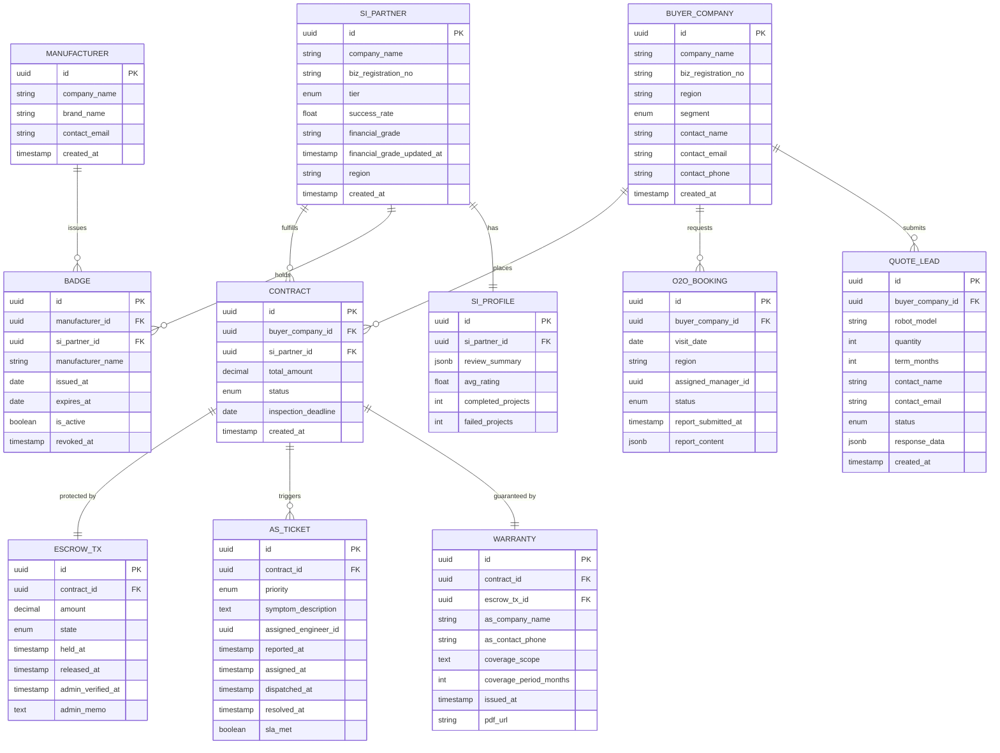
```mermaid
erDiagram
    BUYER_COMPANY ||--o{ CONTRACT : places
    SI_PARTNER ||--o{ CONTRACT : fulfills
    MANUFACTURER ||--o{ BADGE : issues
    SI_PARTNER ||--o{ BADGE : holds
    CONTRACT ||--|| ESCROW_TX : "protected by"
    CONTRACT ||--o{ AS_TICKET : triggers
    CONTRACT ||--|| WARRANTY : "guaranteed by"
    SI_PARTNER ||--|| SI_PROFILE : has
    BUYER_COMPANY ||--o{ O2O_BOOKING : requests
    BUYER_COMPANY ||--o{ QUOTE_LEAD : submits

    BUYER_COMPANY {
        uuid id PK
        string company_name
        string biz_registration_no
        string region
        enum segment
        string contact_name
        string contact_email
        string contact_phone
        timestamp created_at
    }
    SI_PARTNER {
        uuid id PK
        string company_name
        string biz_registration_no
        enum tier
        float success_rate
        string financial_grade
        timestamp financial_grade_updated_at
        string region
        timestamp created_at
    }
    MANUFACTURER {
        uuid id PK
        string company_name
        string brand_name
        string contact_email
        timestamp created_at
    }
    CONTRACT {
        uuid id PK
        uuid buyer_company_id FK
        uuid si_partner_id FK
        decimal total_amount
        enum status
        date inspection_deadline
        timestamp created_at
    }
    ESCROW_TX {
        uuid id PK
        uuid contract_id FK
        decimal amount
        enum state
        timestamp held_at
        timestamp released_at
        timestamp admin_verified_at
        text admin_memo
    }
    AS_TICKET {
        uuid id PK
        uuid contract_id FK
        enum priority
        text symptom_description
        uuid assigned_engineer_id
        timestamp reported_at
        timestamp assigned_at
        timestamp dispatched_at
        timestamp resolved_at
        boolean sla_met
    }
    BADGE {
        uuid id PK
        uuid manufacturer_id FK
        uuid si_partner_id FK
        string manufacturer_name
        date issued_at
        date expires_at
        boolean is_active
        timestamp revoked_at
    }
    SI_PROFILE {
        uuid id PK
        uuid si_partner_id FK
        jsonb review_summary
        float avg_rating
        int completed_projects
        int failed_projects
    }
    O2O_BOOKING {
        uuid id PK
        uuid buyer_company_id FK
        date visit_date
        string region
        uuid assigned_manager_id
        enum status
        timestamp report_submitted_at
        jsonb report_content
    }
    WARRANTY {
        uuid id PK
        uuid contract_id FK
        uuid escrow_tx_id FK
        string as_company_name
        string as_contact_phone
        text coverage_scope
        int coverage_period_months
        timestamp issued_at
        string pdf_url
    }
    QUOTE_LEAD {
        uuid id PK
        uuid buyer_company_id FK
        string robot_model
        int quantity
        int term_months
        string contact_name
        string contact_email
        enum status
        jsonb response_data
        timestamp created_at
    }
```

#### 6.2.13 Class Diagram (도메인 객체 구조)

시스템의 핵심 도메인 객체 간의 구조적 관계, 속성(Attribute), 주요 기능/메서드(Method)를 도식화한다.

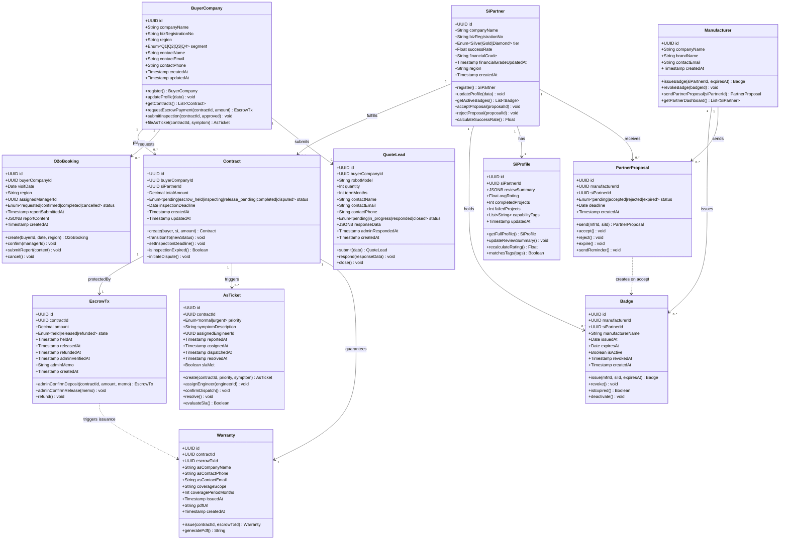
```mermaid
classDiagram
    class BuyerCompany {
        +UUID id
        +String companyName
        +String bizRegistrationNo
        +String region
        +Enum~Q1|Q2|Q3|Q4~ segment
        +String contactName
        +String contactEmail
        +String contactPhone
        +Timestamp createdAt
        +Timestamp updatedAt
        +register() BuyerCompany
        +updateProfile(data) void
        +getContracts() List~Contract~
        +requestEscrowPayment(contractId, amount) EscrowTx
        +submitInspection(contractId, approved) void
        +fileAsTicket(contractId, symptom) AsTicket
    }

    class SiPartner {
        +UUID id
        +String companyName
        +String bizRegistrationNo
        +Enum~Silver|Gold|Diamond~ tier
        +Float successRate
        +String financialGrade
        +Timestamp financialGradeUpdatedAt
        +String region
        +Timestamp createdAt
        +register() SiPartner
        +updateProfile(data) void
        +getActiveBadges() List~Badge~
        +acceptProposal(proposalId) void
        +rejectProposal(proposalId) void
        +calculateSuccessRate() Float
    }

    class Manufacturer {
        +UUID id
        +String companyName
        +String brandName
        +String contactEmail
        +Timestamp createdAt
        +issueBadge(siPartnerId, expiresAt) Badge
        +revokeBadge(badgeId) void
        +sendPartnerProposal(siPartnerId) PartnerProposal
        +getPartnerDashboard() List~SiPartner~
    }

    class Contract {
        +UUID id
        +UUID buyerCompanyId
        +UUID siPartnerId
        +Decimal totalAmount
        +Enum~pending|escrow_held|inspecting|release_pending|completed|disputed~ status
        +Date inspectionDeadline
        +Timestamp createdAt
        +Timestamp updatedAt
        +create(buyer, si, amount) Contract
        +transitionTo(newStatus) void
        +setInspectionDeadline() void
        +isInspectionExpired() Boolean
        +initiateDispute() void
    }

    class EscrowTx {
        +UUID id
        +UUID contractId
        +Decimal amount
        +Enum~held|released|refunded~ state
        +Timestamp heldAt
        +Timestamp releasedAt
        +Timestamp refundedAt
        +Timestamp adminVerifiedAt
        +String adminMemo
        +Timestamp createdAt
        +adminConfirmDeposit(contractId, amount, memo) EscrowTx
        +adminConfirmRelease(memo) void
        +refund() void
    }

    class AsTicket {
        +UUID id
        +UUID contractId
        +Enum~normal|urgent~ priority
        +String symptomDescription
        +UUID assignedEngineerId
        +Timestamp reportedAt
        +Timestamp assignedAt
        +Timestamp dispatchedAt
        +Timestamp resolvedAt
        +Boolean slaMet
        +create(contractId, priority, symptom) AsTicket
        +assignEngineer(engineerId) void
        +confirmDispatch() void
        +resolve() void
        +evaluateSla() Boolean
    }

    class Badge {
        +UUID id
        +UUID manufacturerId
        +UUID siPartnerId
        +String manufacturerName
        +Date issuedAt
        +Date expiresAt
        +Boolean isActive
        +Timestamp revokedAt
        +Timestamp createdAt
        +issue(mfrId, siId, expiresAt) Badge
        +revoke() void
        +isExpired() Boolean
        +deactivate() void
    }

    class SiProfile {
        +UUID id
        +UUID siPartnerId
        +JSONB reviewSummary
        +Float avgRating
        +Int completedProjects
        +Int failedProjects
        +List~String~ capabilityTags
        +Timestamp updatedAt
        +getFullProfile() SiProfile
        +updateReviewSummary() void
        +recalculateRating() Float
        +matchesTags(tags) Boolean
    }

    class O2oBooking {
        +UUID id
        +UUID buyerCompanyId
        +Date visitDate
        +String region
        +UUID assignedManagerId
        +Enum~requested|confirmed|completed|cancelled~ status
        +Timestamp reportSubmittedAt
        +JSONB reportContent
        +Timestamp createdAt
        +create(buyerId, date, region) O2oBooking
        +confirm(managerId) void
        +submitReport(content) void
        +cancel() void
    }

    class PartnerProposal {
        +UUID id
        +UUID manufacturerId
        +UUID siPartnerId
        +Enum~pending|accepted|rejected|expired~ status
        +Date deadline
        +Timestamp createdAt
        +send(mfrId, siId) PartnerProposal
        +accept() void
        +reject() void
        +expire() void
        +sendReminder() void
    }

    class Warranty {
        +UUID id
        +UUID contractId
        +UUID escrowTxId
        +String asCompanyName
        +String asContactPhone
        +String asContactEmail
        +String coverageScope
        +Int coveragePeriodMonths
        +Timestamp issuedAt
        +String pdfUrl
        +Timestamp createdAt
        +issue(contractId, escrowTxId) Warranty
        +generatePdf() String
    }

    class QuoteLead {
        +UUID id
        +UUID buyerCompanyId
        +String robotModel
        +Int quantity
        +Int termMonths
        +String contactName
        +String contactEmail
        +String contactPhone
        +Enum~pending|in_progress|responded|closed~ status
        +JSONB responseData
        +Timestamp adminRespondedAt
        +Timestamp createdAt
        +submit(data) QuoteLead
        +respond(responseData) void
        +close() void
    }

    BuyerCompany "1" --> "0..*" Contract : places
    SiPartner "1" --> "0..*" Contract : fulfills
    Contract "1" --> "1" EscrowTx : protectedBy
    Contract "1" --> "0..*" AsTicket : triggers
    Manufacturer "1" --> "0..*" Badge : issues
    SiPartner "1" --> "0..*" Badge : holds
    SiPartner "1" --> "1" SiProfile : has
    BuyerCompany "1" --> "0..*" O2oBooking : requests
    BuyerCompany "1" --> "0..*" QuoteLead : submits
    Manufacturer "1" --> "0..*" PartnerProposal : sends
    SiPartner "1" --> "0..*" PartnerProposal : receives
    PartnerProposal ..> Badge : creates on accept
    Contract "1" --> "1" Warranty : guarantees
    EscrowTx ..> Warranty : triggers issuance
```

### 6.3 Detailed Interaction Models (상세 시퀀스 다이어그램)

#### 6.3.1 에스크로 결제 전체 상세 흐름 (결제 → 시공 → 검수 → 방출/분쟁)

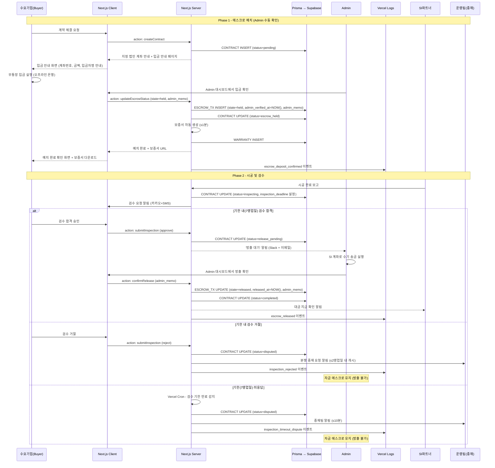
```mermaid
sequenceDiagram
    participant B as 수요기업(Buyer)
    participant WEB as Next.js Client
    participant BFF as Next.js Server
    participant DB as Prisma → Supabase
    participant ADMIN as Admin
    participant LOG as Vercel Logs
    participant SI as SI파트너
    participant OPS as 운영팀(중재)

    Note over B,OPS: Phase 1 - 에스크로 예치 (Admin 수동 확인)

    B->>WEB: 계약 체결 요청
    WEB->>BFF: action: createContract
    BFF->>DB: CONTRACT INSERT (status=pending)
    BFF-->>WEB: 지정 법인 계좌 안내 + 입금 안내 페이지
    WEB-->>B: 입금 안내 화면 (계좌번호, 금액, 입금자명 안내)
    B->>B: 무통장 입금 실행 (오프라인 은행)

    ADMIN->>WEB: Admin 대시보드에서 입금 확인
    WEB->>BFF: action: updateEscrowStatus (state=held, admin_memo)
    BFF->>DB: ESCROW_TX INSERT (state=held, admin_verified_at=NOW(), admin_memo)
    BFF->>DB: CONTRACT UPDATE (status=escrow_held)
    BFF->>BFF: 보증서 자동 생성 (≤1분)
    BFF->>DB: WARRANTY INSERT
    BFF-->>WEB: 예치 완료 + 보증서 URL
    WEB-->>B: 예치 완료 확인 화면 + 보증서 다운로드
    BFF->>LOG: escrow_deposit_confirmed 이벤트

    Note over B,OPS: Phase 2 - 시공 및 검수

    SI->>BFF: 시공 완료 보고
    BFF->>DB: CONTRACT UPDATE (status=inspecting, inspection_deadline 설정)
    BFF->>WEB: 검수 요청 알림 (카카오+SMS)

    alt 기한 내(7영업일) 검수 합격
        B->>WEB: 검수 합격 승인
        WEB->>BFF: action: submitInspection (approve)
        BFF->>DB: CONTRACT UPDATE (status=release_pending)
        BFF-->>ADMIN: '방출 대기' 알림 (Slack + 이메일)
        ADMIN->>ADMIN: SI 계좌로 수기 송금 실행
        ADMIN->>WEB: Admin 대시보드에서 방출 확인
        WEB->>BFF: action: confirmRelease (admin_memo)
        BFF->>DB: ESCROW_TX UPDATE (state=released, released_at=NOW(), admin_memo)
        BFF->>DB: CONTRACT UPDATE (status=completed)
        BFF-->>SI: 대금 지급 확인 알림
        BFF->>LOG: escrow_released 이벤트

    else 기한 내 검수 거절
        B->>WEB: 검수 거절
        WEB->>BFF: action: submitInspection (reject)
        BFF->>DB: CONTRACT UPDATE (status=disputed)
        BFF->>OPS: 분쟁 중재 요청 알림 (≤2영업일 내 개시)
        BFF->>LOG: inspection_rejected 이벤트
        Note over ADMIN: 자금 에스크로 유지 (방출 불가)

    else 기한(7영업일) 미응답
        BFF->>BFF: Vercel Cron - 검수 기한 만료 감지
        BFF->>DB: CONTRACT UPDATE (status=disputed)
        BFF->>OPS: 중재팀 알림 (≤10분)
        BFF->>LOG: inspection_timeout_dispute 이벤트
        Note over ADMIN: 자금 에스크로 유지 (방출 불가)
    end
```

#### 6.3.2 제조사 인증 뱃지 생명주기 상세 흐름

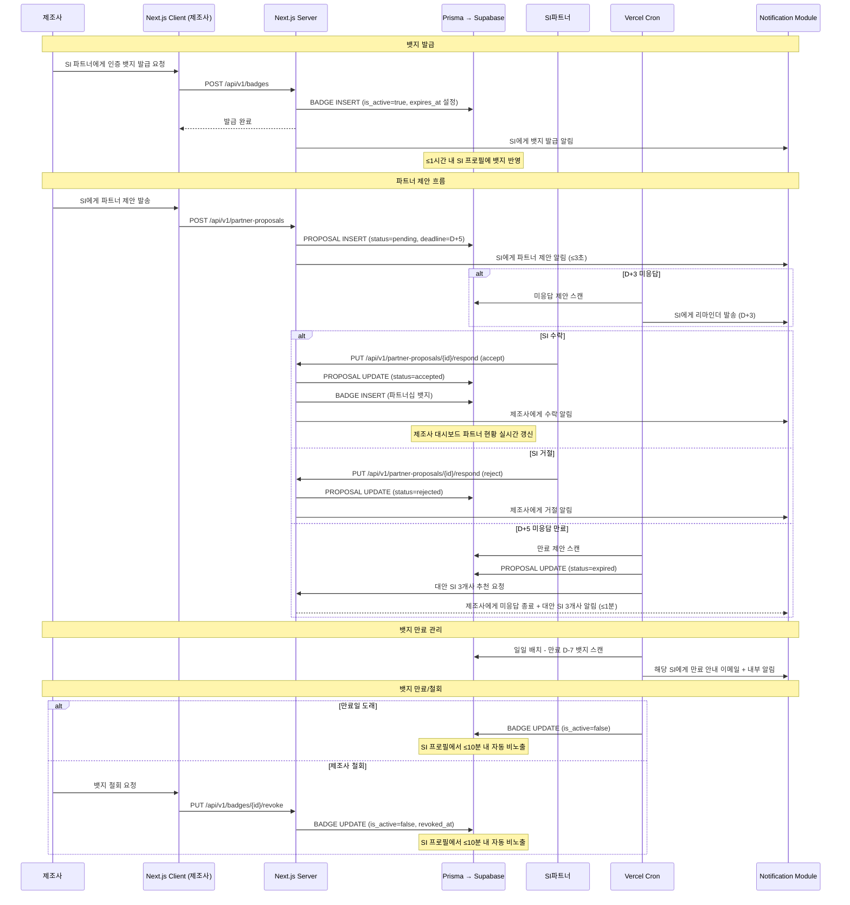
```mermaid
sequenceDiagram
    participant MFR as 제조사
    participant WEB as Next.js Client (제조사)
    participant BFF as Next.js Server
    participant DB as Prisma → Supabase
    participant SI as SI파트너
    participant BATCH as Vercel Cron
    participant NOTI as Notification Module

    Note over MFR,NOTI: 뱃지 발급
    MFR->>WEB: SI 파트너에게 인증 뱃지 발급 요청
    WEB->>BFF: POST /api/v1/badges
    BFF->>DB: BADGE INSERT (is_active=true, expires_at 설정)
    BFF-->>WEB: 발급 완료
    BFF->>NOTI: SI에게 뱃지 발급 알림
    Note over DB: ≤1시간 내 SI 프로필에 뱃지 반영

    Note over MFR,NOTI: 파트너 제안 흐름
    MFR->>WEB: SI에게 파트너 제안 발송
    WEB->>BFF: POST /api/v1/partner-proposals
    BFF->>DB: PROPOSAL INSERT (status=pending, deadline=D+5)
    BFF->>NOTI: SI에게 파트너 제안 알림 (≤3초)

    alt D+3 미응답
        BATCH->>DB: 미응답 제안 스캔
        BATCH->>NOTI: SI에게 리마인더 발송 (D+3)
    end

    alt SI 수락
        SI->>BFF: PUT /api/v1/partner-proposals/{id}/respond (accept)
        BFF->>DB: PROPOSAL UPDATE (status=accepted)
        BFF->>DB: BADGE INSERT (파트너십 뱃지)
        BFF->>NOTI: 제조사에게 수락 알림
        Note over DB: 제조사 대시보드 파트너 현황 실시간 갱신
    else SI 거절
        SI->>BFF: PUT /api/v1/partner-proposals/{id}/respond (reject)
        BFF->>DB: PROPOSAL UPDATE (status=rejected)
        BFF->>NOTI: 제조사에게 거절 알림
    else D+5 미응답 만료
        BATCH->>DB: 만료 제안 스캔
        BATCH->>DB: PROPOSAL UPDATE (status=expired)
        BATCH->>BFF: 대안 SI 3개사 추천 요청
        BFF-->>NOTI: 제조사에게 미응답 종료 + 대안 SI 3개사 알림 (≤1분)
    end

    Note over MFR,NOTI: 뱃지 만료 관리
    BATCH->>DB: 일일 배치 - 만료 D-7 뱃지 스캔
    BATCH->>NOTI: 해당 SI에게 만료 안내 이메일 + 내부 알림

    Note over MFR,NOTI: 뱃지 만료/철회
    alt 만료일 도래
        BATCH->>DB: BADGE UPDATE (is_active=false)
        Note over DB: SI 프로필에서 ≤10분 내 자동 비노출
    else 제조사 철회
        MFR->>WEB: 뱃지 철회 요청
        WEB->>BFF: PUT /api/v1/badges/{id}/revoke
        BFF->>DB: BADGE UPDATE (is_active=false, revoked_at)
        Note over DB: SI 프로필에서 ≤10분 내 자동 비노출
    end
```

#### 6.3.3 RaaS 비용 비교 계산 및 금융 연결 상세 흐름

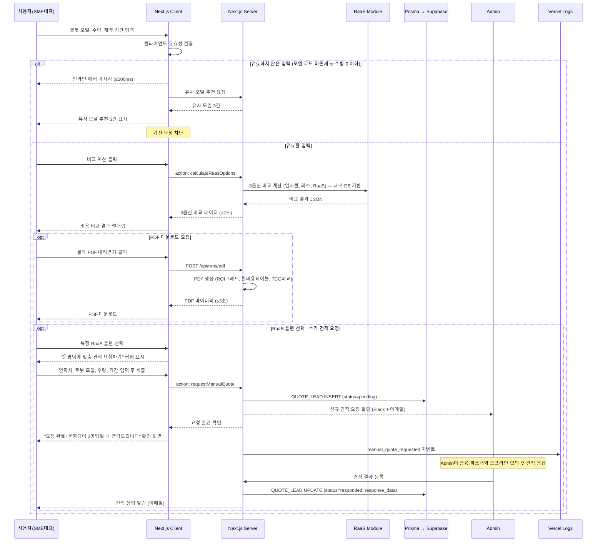
```mermaid
sequenceDiagram
    participant U as 사용자(SME대표)
    participant WEB as Next.js Client
    participant BFF as Next.js Server
    participant CALC as RaaS Module
    participant DB as Prisma → Supabase
    participant ADMIN as Admin
    participant LOG as Vercel Logs

    U->>WEB: 로봇 모델, 수량, 계약 기간 입력
    WEB->>WEB: 클라이언트 유효성 검증

    alt 유효하지 않은 입력 (모델 코드 미존재 or 수량 0 이하)
        WEB-->>U: 인라인 에러 메시지 (≤200ms)
        WEB->>BFF: 유사 모델 추천 요청
        BFF-->>WEB: 유사 모델 3건
        WEB-->>U: 유사 모델 추천 3건 표시
        Note over WEB: 계산 요청 차단
    else 유효한 입력
        U->>WEB: 비교 계산 클릭
        WEB->>BFF: action: calculateRaasOptions
        BFF->>CALC: 3옵션 비교 계산 (일시불, 리스, RaaS) — 내부 DB 기반
        CALC-->>BFF: 비교 결과 JSON
        BFF-->>WEB: 3옵션 비교 데이터 (≤2초)
        WEB-->>U: 비용 비교 결과 렌더링

        opt PDF 다운로드 요청
            U->>WEB: 결과 PDF 내려받기 클릭
            WEB->>BFF: POST /api/raas/pdf
            BFF->>BFF: PDF 생성 (ROI그래프, 월비용테이블, TCO비교)
            BFF-->>WEB: PDF 바이너리 (≤3초)
            WEB-->>U: PDF 다운로드
        end

        opt RaaS 플랜 선택 - 수기 견적 요청
            U->>WEB: 특정 RaaS 플랜 선택
            WEB-->>U: "운영팀에 맞춤 견적 요청하기" 팝업 표시
            U->>WEB: 연락처, 로봇 모델, 수량, 기간 입력 후 제출
            WEB->>BFF: action: requestManualQuote
            BFF->>DB: QUOTE_LEAD INSERT (status=pending)
            BFF-->>ADMIN: 신규 견적 요청 알림 (Slack + 이메일)
            BFF-->>WEB: 요청 완료 확인
            WEB-->>U: "요청 완료! 운영팀이 2영업일 내 연락드립니다" 확인 화면
            BFF->>LOG: manual_quote_requested 이벤트

            Note over ADMIN: Admin이 금융 파트너와 오프라인 협의 후 견적 응답
            ADMIN->>BFF: 견적 결과 등록
            BFF->>DB: QUOTE_LEAD UPDATE (status=responded, response_data)
            BFF-->>U: 견적 응답 알림 (이메일)
        end
    end
```

#### 6.3.4 SI 재무 등급 조회 및 캐시 상세 흐름

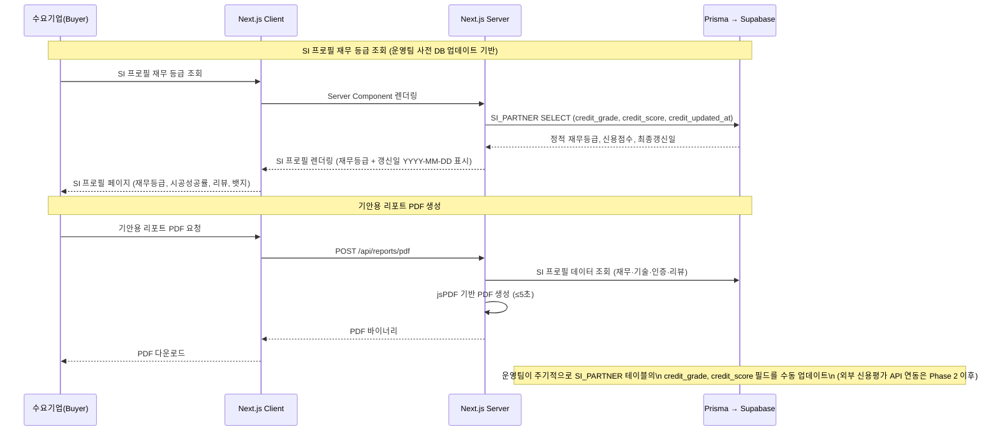
```mermaid
sequenceDiagram
    participant B as 수요기업(Buyer)
    participant WEB as Next.js Client
    participant BFF as Next.js Server
    participant DB as Prisma → Supabase

    Note over B,DB: SI 프로필 재무 등급 조회 (운영팀 사전 DB 업데이트 기반)

    B->>WEB: SI 프로필 재무 등급 조회
    WEB->>BFF: Server Component 렌더링
    BFF->>DB: SI_PARTNER SELECT (credit_grade, credit_score, credit_updated_at)
    DB-->>BFF: 정적 재무등급, 신용점수, 최종갱신일
    BFF-->>WEB: SI 프로필 렌더링 (재무등급 + 갱신일 YYYY-MM-DD 표시)
    WEB-->>B: SI 프로필 페이지 (재무등급, 시공성공률, 리뷰, 뱃지)

    Note over B,DB: 기안용 리포트 PDF 생성
    B->>WEB: 기안용 리포트 PDF 요청
    WEB->>BFF: POST /api/reports/pdf
    BFF->>DB: SI 프로필 데이터 조회 (재무·기술·인증·리뷰)
    BFF->>BFF: jsPDF 기반 PDF 생성 (≤5초)
    BFF-->>WEB: PDF 바이너리
    WEB-->>B: PDF 다운로드

    Note over DB: 운영팀이 주기적으로 SI_PARTNER 테이블의\n credit_grade, credit_score 필드를 수동 업데이트\n (외부 신용평가 API 연동은 Phase 2 이후)
```

#### 6.3.5 긴급 AS 접수·배정·출동 상세 흐름

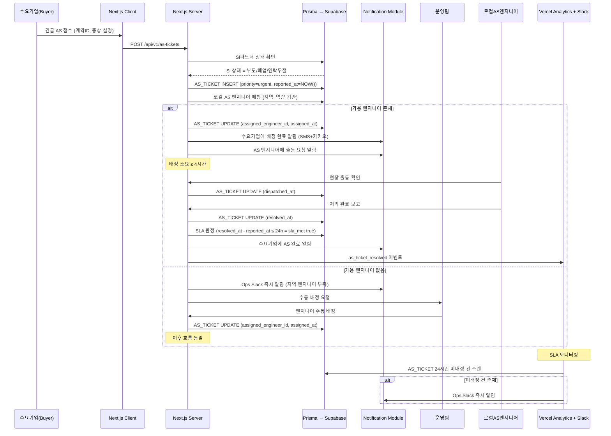
```mermaid
sequenceDiagram
    participant B as 수요기업(Buyer)
    participant WEB as Next.js Client
    participant BFF as Next.js Server
    participant DB as Prisma → Supabase
    participant NOTI as Notification Module
    participant OPS as 운영팀
    participant AS as 로컬AS엔지니어
    participant MON as Vercel Analytics + Slack

    B->>WEB: 긴급 AS 접수 (계약ID, 증상 설명)
    WEB->>BFF: POST /api/v1/as-tickets
    BFF->>DB: SI파트너 상태 확인
    DB-->>BFF: SI 상태 = 부도/폐업/연락두절

    BFF->>DB: AS_TICKET INSERT (priority=urgent, reported_at=NOW())
    BFF->>DB: 로컬 AS 엔지니어 매칭 (지역, 역량 기반)

    alt 가용 엔지니어 존재
        BFF->>DB: AS_TICKET UPDATE (assigned_engineer_id, assigned_at)
        BFF->>NOTI: 수요기업에 배정 완료 알림 (SMS+카카오)
        BFF->>NOTI: AS 엔지니어에 출동 요청 알림
        Note over BFF: 배정 소요 ≤ 4시간

        AS->>BFF: 현장 출동 확인
        BFF->>DB: AS_TICKET UPDATE (dispatched_at)

        AS->>BFF: 처리 완료 보고
        BFF->>DB: AS_TICKET UPDATE (resolved_at)
        BFF->>DB: SLA 판정 (resolved_at - reported_at ≤ 24h = sla_met true)
        BFF->>NOTI: 수요기업에 AS 완료 알림
        BFF->>MON: as_ticket_resolved 이벤트

    else 가용 엔지니어 없음
        BFF->>NOTI: Ops Slack 즉시 알림 (지역 엔지니어 부족)
        BFF->>OPS: 수동 배정 요청
        OPS->>BFF: 엔지니어 수동 배정
        BFF->>DB: AS_TICKET UPDATE (assigned_engineer_id, assigned_at)
        Note over BFF: 이후 흐름 동일
    end

    Note over MON: SLA 모니터링
    MON->>DB: AS_TICKET 24시간 미배정 건 스캔
    alt 미배정 건 존재
        MON->>NOTI: Ops Slack 즉시 알림
    end
```

#### 6.3.6 O2O 매니저 파견 예약 상세 흐름 (Phase 2)

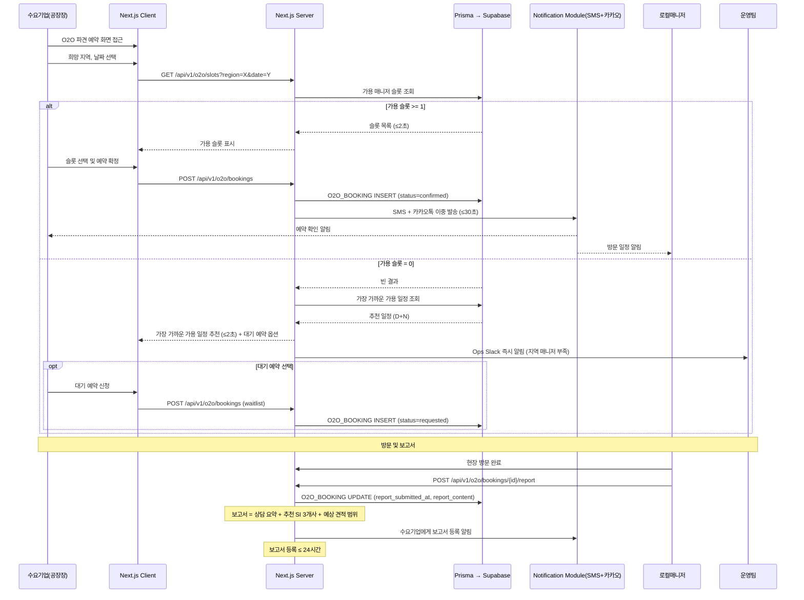
```mermaid
sequenceDiagram
    participant B as 수요기업(공장장)
    participant WEB as Next.js Client
    participant BFF as Next.js Server
    participant DB as Prisma → Supabase
    participant NOTI as Notification Module(SMS+카카오)
    participant MGR as 로컬매니저
    participant OPS as 운영팀

    B->>WEB: O2O 파견 예약 화면 접근
    B->>WEB: 희망 지역, 날짜 선택
    WEB->>BFF: GET /api/v1/o2o/slots?region=X&date=Y
    BFF->>DB: 가용 매니저 슬롯 조회

    alt 가용 슬롯 >= 1
        DB-->>BFF: 슬롯 목록 (≤2초)
        BFF-->>WEB: 가용 슬롯 표시
        B->>WEB: 슬롯 선택 및 예약 확정
        WEB->>BFF: POST /api/v1/o2o/bookings
        BFF->>DB: O2O_BOOKING INSERT (status=confirmed)
        BFF->>NOTI: SMS + 카카오톡 이중 발송 (≤30초)
        NOTI-->>B: 예약 확인 알림
        NOTI-->>MGR: 방문 일정 알림
    else 가용 슬롯 = 0
        DB-->>BFF: 빈 결과
        BFF->>DB: 가장 가까운 가용 일정 조회
        DB-->>BFF: 추천 일정 (D+N)
        BFF-->>WEB: 가장 가까운 가용 일정 추천 (≤2초) + 대기 예약 옵션
        BFF->>OPS: Ops Slack 즉시 알림 (지역 매니저 부족)
        opt 대기 예약 선택
            B->>WEB: 대기 예약 신청
            WEB->>BFF: POST /api/v1/o2o/bookings (waitlist)
            BFF->>DB: O2O_BOOKING INSERT (status=requested)
        end
    end

    Note over B,OPS: 방문 및 보고서
    MGR->>BFF: 현장 방문 완료
    MGR->>BFF: POST /api/v1/o2o/bookings/{id}/report
    BFF->>DB: O2O_BOOKING UPDATE (report_submitted_at, report_content)
    Note over BFF: 보고서 = 상담 요약 + 추천 SI 3개사 + 예상 견적 범위
    BFF->>NOTI: 수요기업에게 보고서 등록 알림
    Note over BFF: 보고서 등록 ≤ 24시간
```

### 6.4 Validation Plan (검증 계획)

| 실험 ID | 가설 | 설계·도구 | 시점·기간 | 표본 | 성공 기준 | 관련 REQ |
|:---:|:---|:---|:---|:---|:---|:---|
| EXP-01 | 에스크로 보호 시 첫 거래 전환율 +30pp 상승 | A/B 테스트 (대조: 일반결제 / 실험: 에스크로) | Open Beta (MVP+4w~+12w) | 100개사 | 전환율 +30pp, p < 0.05 | REQ-FUNC-001, REQ-NF-023 |
| EXP-02 | 기안 리포트 자동 생성 시 통과율 80% 초과 | 코호트 분석 (다운로드 vs 미다운로드) | CB~OB (MVP~+12w) | 50개사 | 통과율 >= 80% | REQ-FUNC-010, REQ-NF-025 |
| EXP-03 | 뱃지 SI 우선 노출 시 매칭 요청 수 2배 증가 | A/B 테스트 (대조: 기본정렬 / 실험: 뱃지 상단 고정) | Open Beta (MVP+4w~+12w) | 200건+ SI 프로필 뷰 | CTR x2.0 이상, p < 0.05 | REQ-FUNC-013, 015 |
| EXP-04 | RaaS 계산기 사용자 > 미사용자 계약 전환율 | 퍼널 분석 (자연 노출 분기) | Open Beta (MVP+4w~+12w) | 100개사 | 전환율 >= 25% | REQ-FUNC-018, REQ-NF-027 |
| EXP-05 | 보증료 WTP >= 8% 검증 | Van Westendorp PSM 설문(4Q) | Closed Beta (MVP~+4w) | 200명 | 중앙값 >= 8%, 95% CI 하한 >= 6% | REQ-NF-023 |

### 6.5 Risk Registry

| Risk ID | 리스크 | 영향도 | 발생 가능성 | 완화 전략 | 관련 REQ |
|:---:|:---|:---:|:---:|:---|:---|
| R-01 | SI 파트너 초기 공급 부족 (Cold-Start) — 인증 뱃지 보유 SI 50개사 미달 | 상 | 중상 | D-90일부터 영세 SI 무료 온보딩 캠페인. 최소 3개 제조사 파트너십 사전 체결 | REQ-FUNC-013, 017 |
| R-02 | 에스크로 분쟁 폭주 — 검수 합격 기준 모호로 분쟁 비율 10% 초과 | 중상 | 중 | 표준 검수 체크리스트 20항목 사전 정의. 분쟁 중재 SLA 2영업일 준수 인력 1명 전담 | REQ-FUNC-003, 005 |
| R-03 | AS 출동 SLA 미달 — 지방/야간 AS 엔지니어 공급 부족으로 24시간 출동률 < 95% | 상 | 중상 | 수도권/5대 산단 집중 운영 후 점진 확대. 로컬 AS 사업자 계약 시 SLA 위약금 조항 삽입 | REQ-FUNC-007, REQ-NF-024 |
| R-04 | 규제 리스크 — Admin 수동 입출금 확인 구조가 전자금융업 등록 대상 판정 | 상 | 중 | 플랫폼은 자금 직접 보관 없이 상태값만 기록하는 구조 유지. 법률 자문 MVP 전 완료 | CON-01 |
| R-05 | 경쟁사 추격 — 마로솔이 에스크로 + 3D 기능 자체 개발 | 중상 | 중 | 호환성 DB + 제조사 뱃지 독점 파트너십으로 데이터 해자 선점 | REQ-FUNC-017, CON-03 |

---

*끝. 본 SRS v1.2 (v0.4)는 PRD v0.2 (REF-01)를 유일한 원천(Source of Truth)으로 하여 ISO/IEC/IEEE 29148:2018 표준에 따라 작성되었습니다. v0.3 대비 외부 API 의존성 제거(PG·NICE·금융 파트너) 및 Admin 수동 운영 체계 전환(SRS_Revision_Flash_Recipe 적용)이 적용되었습니다. Closed Beta 결과 및 실험(EXP-01~05) 수행 결과에 따라 SRS v1.3으로 개정됩니다.*
