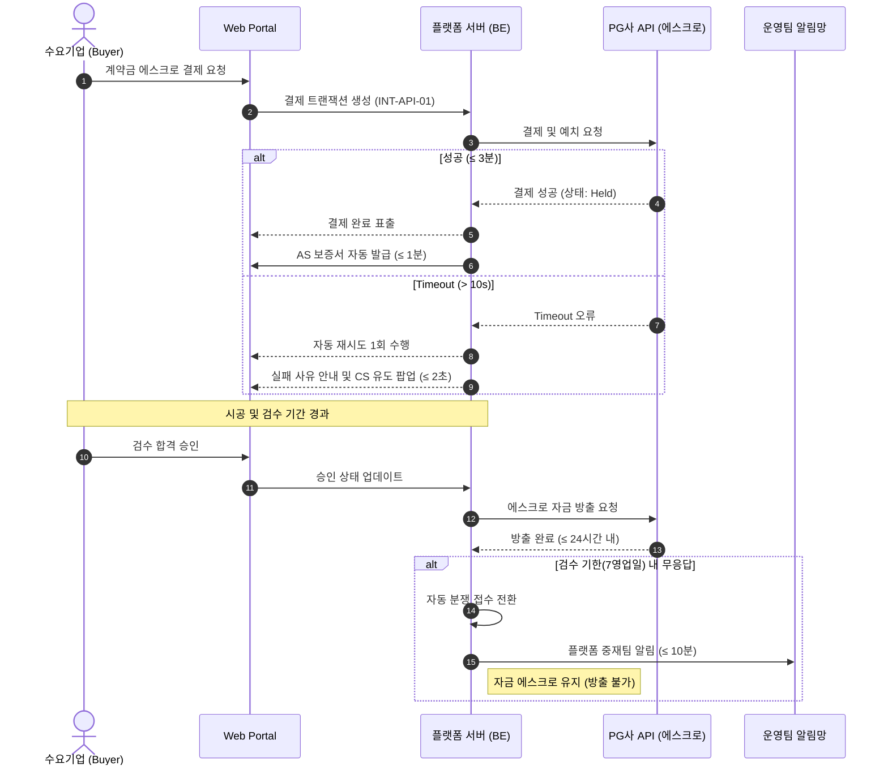
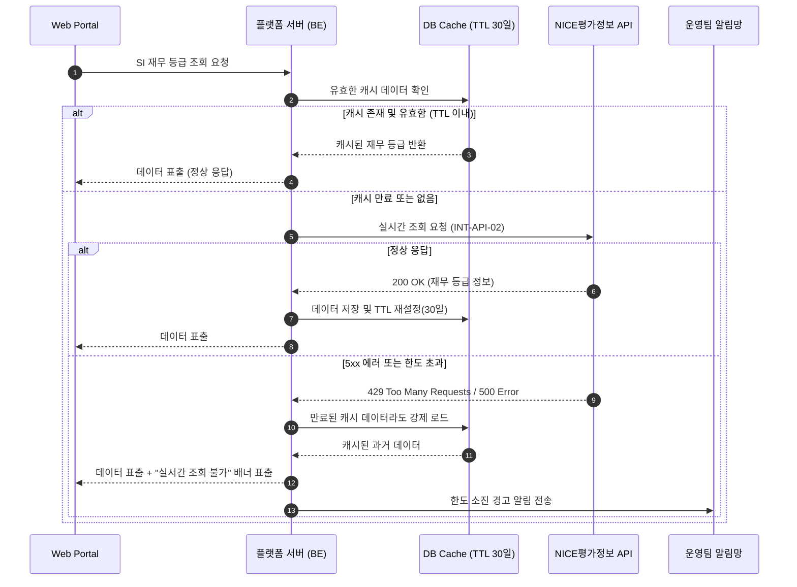

# Software Requirements Specification (SRS)
Document ID: SRS-001
Revision: 1.0
Date: 2026-04-15
Standard: ISO/IEC/IEEE 29148:2018

---

## 1. Introduction

### 1.1 Purpose
본 Software Requirements Specification(SRS)은 중소·중견기업(SME)의 로봇 자동화 도입 시 발생하는 정보 비대칭 및 사후 유지보수 리스크를 해소하기 위한 **'로봇 SI 안심 보증 매칭 플랫폼'**의 요구사항을 정의한다. 본 시스템은 에스크로(Escrow) 기반의 결제 보호, 데이터 기반의 SI 파트너 평판 검증, 24시간 AS 보증 체계, 그리고 구독형(RaaS) 비용 비교 계산기를 제공하여 수요 기업의 도입 의사결정을 가속하고 안전한 계약 완결성을 보장하는 것을 목적으로 한다.

### 1.2 Scope

**1.2.1 In-Scope (Phase 1 - MVP)**
본 문서는 MVP 단계에서 구현되어야 하는 다음의 핵심 기능을 포함한다.
* **F-01:** 안심 에스크로 결제 예치 및 자금 방출 시스템 (PG 연동)
* **F-02:** 제조사 인증 로컬 AS망 연동 및 전자 보증서 자동 발급
* **F-03:** SI 파트너 재무·시공 투명 평판 뷰어 및 기안 리포트 PDF 자동 생성
* **F-04:** Brand-Agnostic(다브랜드) 제조사 인증 뱃지 발급 및 필터링 검색
* **F-05:** RaaS 구독 및 일시불·리스 비용 비교 계산기 구현

**1.2.2 Out-of-Scope**
다음 기능은 MVP 릴리스 범위에서 제외되며, 향후 페이즈 또는 영구 제외 대상으로 분류한다.
* **Phase 2:** 현장 O2O 매니저 파견 예약 시스템 (F-06), 3D 기술핏 시뮬레이터 (F-07)
* **Phase 3:** S/W 플러그인 앱스토어
* **영구 Drop:** 정부 보조금 원클릭 대행 (F-08), 대기업 인하우스 커스텀 모듈 (F-09)

**1.2.3 Constraints & Assumptions**
* **ADR-001 (에스크로 위임):** 전자금융업 라이선스 회피 및 규제 리스크 완화를 위해, 플랫폼 직접 예치가 아닌 PG사(토스페이먼츠/나이스)의 에스크로 API 위임 호출 구조를 강제한다.
* **ADR-002 (데이터 캐싱):** NICE평가정보 API의 일일 한도(500건) 및 비용 제약으로 인해, SI 업체의 재무/신용 데이터는 DB에 캐시되며 Time-to-Live(TTL)는 30일로 강제된다.
* **ADR-003 (중립성):** 특정 제조사 종속을 방지하기 위해 최소 3개 이상의 로봇 제조사를 지원하는 Brand-Agnostic DB 스키마를 강제한다.

### 1.3 Definitions, Acronyms, Abbreviations
* **SME (Small and Medium-sized Enterprises):** 중소·중견기업. 본 플랫폼의 핵심 수요층.
* **SI (System Integrator):** 로봇 자동화 설비를 현장에 시공하고 통합하는 파트너 기업.
* **RaaS (Robot-as-a-Service):** 로봇 구독형 서비스 모델 (OPEX 기반).
* **CAPEX / OPEX:** 자본적 지출(초기 투자비) / 운영적 지출(월별 운영비).
* **AOS / DOS:** Adjusted Opportunity Score / Discovered Opportunity Score (JTBD 프레임워크 기반 기회 지표).

### 1.4 References
* **REF-01:** JTBD 심층 인터뷰 결과 (02_VPS-Drafts/6_Value-Proposition-Sheet-V2(rooted).md 부록 E-1)
* **REF-02:** 시장 리서치 - Grand View Research 2024 / 국내 로봇 산업 실태조사 2023
* **REF-03:** 비즈니스 전략 분석 - KSF 통합 보고서 (01_Biz-analysis/4_ksf-report.md)
* **REF-04:** 전자금융거래법 (데이터 보존 정책 근거)
* **REF-05:** ISMS-P 및 PCI-DSS (보안 및 결제 아키텍처 근거)

---

## 2. Stakeholders

| Role | Persona / ID | Responsibility | Interest / Needs |
| :--- | :--- | :--- | :--- |
| **영세 제조기업 대표** | 조상필 (P9) | 최종 결제 및 검수 승인 권한자 | SI 잠적 방지(투자금 보호), 긴급 AS 24시간 보장 |
| **수요기업 기술책임** | 김도진 (P1) / 박성민 (P3) | 기안 작성, SI 업체 검증, 기술핏 확인 | 경영진 보고용 객관적 신뢰 데이터(재무/실적), 1회 통과 증빙 |
| **수요기업 경영진** | 이정훈 (P2) | 예산 집행 승인 (CAPEX/OPEX 결정) | 초기 투자비 최소화, 투명한 비용 비교(ROI/TCO) |
| **제조사 영업대표** | 강혁진 (P6) | 자사 로봇 브랜드 파트너십 확장 및 인증 | 검증된 SI 파트너 지역/역량별 즉시 검색, 기술 클레임 최소화 |
| **오프라인 지향 관리자** | 백창훈 (P11) | - | 비대면 불신 해소를 위한 대면 전문가(로컬 매니저) 파견 |

---

## 3. System Context and Interfaces

### 3.1 External Systems
* **Payment Gateway (PG):** B2B 에스크로 결제 처리 (결제, 예치, 방출, 환불).
* **NICE평가정보 (NICE API):** 사업자등록번호 기반 기업 신용등급 및 재무 데이터 제공.
* **Notification Provider:** 카카오 알림톡 및 SMS 발송 서비스.
* **Financial Partner API:** RaaS 구독 상품 금리, 보증금, 월 납입금 정보 제공.

### 3.2 Client Applications
* **Buyer Portal (Web):** 수요기업용 탐색, 매칭, 결제, AS 접수 인터페이스.
* **Partner Portal (Web):** SI 업체 및 제조사용 프로필 관리, 제안 수락, 뱃지 관리 인터페이스.
* **Admin Console (Web):** 플랫폼 운영팀용 트랜잭션 모니터링, 분쟁 중재, 데이터 관리.

### 3.3 API Overview

| Interface ID | Type | Provider | Direction | Inputs | Outputs | Constraints |
| :--- | :--- | :--- | :--- | :--- | :--- | :--- |
| **INT-API-01** | REST | PG (Toss/NICE) | Outbound | 계약ID, 금액, 결제수단 | 에스크로TX ID, 거래 상태 | Timeout 10s, PCI-DSS |
| **INT-API-02** | REST | NICE평가정보 | Outbound | 사업자번호 | 재무 등급, 신용 점수 | TTL 30 days, 일 500건 한도 |
| **INT-API-03** | REST | 알림톡/SMS | Outbound | 수신번호, 템플릿ID, 변수 | 발송 성공 여부 | 건당 단가 제한, 초당 100건 |
| **INT-API-04** | REST | 내부 엔진 | Inbound | 지역, 브랜드, 태그 | SI 목록 리스트 | p95 ≤ 1,000ms |
| **INT-API-05** | REST | 금융 파트너 | Outbound | 모델코드, 수량, 기간 | 3옵션 비용 결과 JSON | Timeout 5s, Fallback 필수 |

### 3.4 Interaction Sequences

**[SEQ-01] 핵심 결제 및 자금 방출 시퀀스 다이어그램**

---

## 4. Specific Requirements

### 4.1 Functional Requirements

| ID | Source (Story/Feature) | Acceptance Criteria (Given/When/Then) | Priority |
| :--- | :--- | :--- | :--- |
| **REQ-FUNC-101** | Story 1 / F-01 | **[에스크로 예치]** Given 체결된 계약이 있을 때, When 수요기업이 결제를 요청하면, Then 3분 이내에 에스크로 예치가 완료되어야 하며 결제 실패율은 0.5% 미만이어야 한다. | Must |
| **REQ-FUNC-102** | Story 1 / F-01 | **[자금 방출 및 분쟁]** Given 시공 완료 후, When 수요기업이 검수를 승인하면, Then 24시간 내 자금이 방출되어야 한다. 분쟁 시 2영업일 내 중재가 개시되어야 한다. | Must |
| **REQ-FUNC-103** | Story 1 / F-01 | **[AS 출동 연계]** Given SI 파트너의 유지보수 불가 상태 시, When 긴급 AS를 접수하면, Then 4시간 내 로컬 엔지니어가 배정되고 24시간 내 현장 출동(성공률 95%)이 처리되어야 한다. | Must |
| **REQ-FUNC-104** | Story 1 / F-02 | **[AS 보증서 발급]** Given 에스크로 결제 완료 시, When 시스템 트리거가 발생하면, Then 1분 내에 지정 로컬 AS 업체 정보가 100% 명시된 보증서가 자동 발급되어야 한다. | Must |
| **REQ-FUNC-105** | Story 1 / Exception | **[결제 장애 처리]** Given 결제 시도 중 PG 타임아웃(10초 초과) 시, When 에러가 반환되면, Then 2초 내 사유를 안내하고, 1회 자동 재시도하며, 실패 시 `escrow_payment_failed` 로그를 적재하고 CS 팝업을 노출해야 한다. | Must |
| **REQ-FUNC-106** | Story 1 / Exception | **[검수 기한 만료]** Given 시공 완료 후, When 7영업일 내 검수 응답이 없으면, Then 자동으로 '분쟁 접수'로 전환되며 10분 내 중재팀에 알림을 발송하고 예치금을 유지해야 한다. | Must |
| **REQ-FUNC-201** | Story 2 / F-03 | **[평판 조회]** Given SI 프로필 페이지 접근 시, When 페이지를 로드하면, Then 재무/시공성공률/리뷰 데이터가 2초 이내(p95)에 렌더링되어야 한다. 데이터 갱신 주기는 30일 이내여야 한다. | Must |
| **REQ-FUNC-202** | Story 2 / F-03 | **[기안 리포트 생성]** Given 수요기업이 다운로드를 요청하면, When 리포트 생성 프로세스가 실행되면, Then 5초 이내에 4개 섹션(재무, 기술, 인증, 리뷰)이 100% 포함된 PDF가 생성되어야 한다. | Must |
| **REQ-FUNC-203** | Story 2 / F-04 | **[뱃지 갱신]** Given 제조사가 인증 뱃지를 발급/철회할 때, When 상태가 변경되면, Then 1시간 이내(발급) 또는 10분 이내(철회)에 프로필 노출 상태가 자동 반영되어야 한다. | Must |
| **REQ-FUNC-204** | Story 2 / Exception | **[NICE API 장애]** Given 재무 조회 시 일일 한도 초과(500건) 또는 5xx 에러 발생 시, When 조회를 시도하면, Then '캐시 데이터'와 '실시간 조회 불가' 배너를 노출해야 한다. (캐시 TTL 30일) | Must |
| **REQ-FUNC-301** | Story 3 / F-06 | **[O2O 예약 조회]** Given 예약 화면 접근 시, When 희망 지역/날짜를 선택하면, Then 2초 내에 가능한 슬롯이 조회되며, 수도권 기준 3일 내 가용 슬롯이 2개 이상 표시되어야 한다. | Should (Ph 2) |
| **REQ-FUNC-302** | Story 3 / F-06 | **[방문 보고서]** Given 매니저 방문 완료 시, When 매니저가 결과를 등록하면, Then 24시간 내 상담 요약/추천 SI/견적 범위가 포함된 보고서가 발행되어야 한다. | Should (Ph 2) |
| **REQ-FUNC-401** | Story 4 / F-05 | **[RaaS 3옵션 계산]** Given 모델/수량/기간 입력 후 계산 시, When 버튼을 클릭하면, Then 2초 내에 일시불/리스/RaaS 3가지 옵션의 비용 결과가 렌더링되어야 한다. | Should |
| **REQ-FUNC-402** | Story 4 / Exception | **[계산기 유효성/장애]** Given 음수/0 수량 입력 또는 금융 API 타임아웃(5초) 시, When 계산을 요청하면, Then 즉각적(200ms) 인라인 에러 처리 및 1회 재시도, 실패 시 "이메일 견적 수신" 대안을 제공해야 한다. | Should |
| **REQ-FUNC-501** | Story 5 / F-04 | **[제조사 검색/매칭]** Given 제조사가 필터 검색 후 제안을 발송하면, When 시스템이 처리할 때, Then 3초 내 제안이 발송되고, SI 응답 기한(5영업일) 미달 시 D+3에 자동 리마인더가 발송되어야 한다. | Must |

### 4.2 Non-Functional Requirements

| ID | Category | Target Metrics / Constraints | Source Alignment |
| :--- | :--- | :--- | :--- |
| **REQ-NF-PERF-01** | Performance | 페이지 로딩(LCP)은 p95 기준 **≤ 2,000ms**이어야 한다. | PRD 5.1 |
| **REQ-NF-PERF-02** | Performance | 검색/필터 등 API 응답 시간은 p95 기준 **≤ 1,000ms**이어야 한다. | PRD 5.1 |
| **REQ-NF-PERF-03** | Performance | 에스크로 결제 API(INT-API-01) 응답은 p95 **≤ 3,000ms**, 타임아웃 제한 **10초**를 준수해야 한다. | PRD 5.1 |
| **REQ-NF-PERF-04** | Performance | 시스템은 동시 접속자 수(CCU) **≥ 500** 명을 지연 없이 처리해야 하며 (CPU 평균 ≤ 70%). 에러율은 1% 미만이어야 한다. | PRD 5.1 |
| **REQ-NF-AVAIL-01**| Availability | 시스템 월간 가용성(Uptime)은 **≥ 99.5%** (다운타임 월 3.6시간 이하)를 보장해야 한다. | PRD 5.2 |
| **REQ-NF-AVAIL-02**| Availability | 데이터 복구 목표 시점(RPO)은 **≤ 1시간**, 장애 복구 시간(RTO)은 **≤ 4시간**이어야 한다. | PRD 5.2 |
| **REQ-NF-SEC-01** | Security | 결제 데이터 처리는 PG사 위임을 통해 간접적으로 **PCI-DSS Level 1**을 준수해야 한다. | PRD 5.3 |
| **REQ-NF-SEC-02** | Security | 전송 구간 암호화는 **TLS 1.3**을 강제하며, B2B 관리자 계정은 OAuth 2.0 및 MFA 적용을 필수로 한다. | PRD 5.3 |
| **REQ-NF-DATA-01** | Data/Legal | 거래/결제 데이터는 5년 보존, 개인정보는 탈퇴 후 30일 내 파기, 로그는 90일 Hot/1년 Cold 원칙을 준수해야 한다. | PRD 5.2 / REF-04 |
| **REQ-NF-COST-01** | Cost | 월 인프라 운영 비용은 500만 원 이하, 에스크로 전용 PG 수수료 3.5% 이하, 알림톡 건당 20원 이하로 제어해야 한다. | PRD 5.4 |
| **REQ-NF-MON-01** | Monitoring | 에스크로 실패율 > 0.5% (5분 지속), LCP > 3s (1시간 지속), AS 24h 미배정 발생 시 PagerDuty/Slack으로 즉시 알림을 발송해야 한다. | PRD 5.5 |
| **REQ-NF-BIZ-01** | Business | 24시간 내 AS 출동률 95% 이상 보장 (목표값 G-01), 경영진 기안 첫 보고 통과율 80% 이상(목표값 G-02). | PRD 1.2 / 8.2 |

---

## 5. Traceability Matrix

| Story ID (PRD) | Requirement ID (SRS) | Description | Test Case ID |
| :--- | :--- | :--- | :--- |
| Story 1 | REQ-FUNC-101 | 에스크로 3분 내 예치 및 0.5% 미만 에러 | TC-ESC-01 |
| Story 1 | REQ-FUNC-102 | 검수 합격 시 24시간 내 에스크로 자금 방출 | TC-ESC-02 |
| Story 1 | REQ-FUNC-103 | 고장 접수 후 24시간 내 현장 방문 보장 | TC-AS-01 |
| Story 1 | REQ-FUNC-104 | 에스크로 결제 즉시 AS 보증서 자동 발급 | TC-AS-02 |
| Story 1 | REQ-FUNC-105 | PG사 타임아웃 발생 시 재시도 로직 실행 | TC-ESC-03 |
| Story 1 | REQ-FUNC-106 | 7일 내 검수 무응답 시 자동 분쟁 접수 | TC-ESC-04 |
| Story 2 | REQ-FUNC-201 | SI 프로필 데이터(재무/성공률) 2초 이내 렌더링 | TC-PROF-01 |
| Story 2 | REQ-FUNC-202 | 4개 섹션이 포함된 기안 리포트 5초 내 PDF 생성 | TC-PROF-02 |
| Story 2 | REQ-FUNC-203 | 뱃지 부여/철회 시 즉각적인 프로필 갱신 | TC-BDG-01 |
| Story 2 | REQ-FUNC-204 | NICE API 한도 도달 시 DB 캐시 데이터 폴백 | TC-API-01 |
| Story 3 | REQ-FUNC-301, 302 | 가용 매니저 확인, 24시간 내 오프라인 방문 리포트 | TC-O2O-01, 02 |
| Story 4 | REQ-FUNC-401, 402 | 3옵션 비용 결과 비교 및 금융 파트너 API 에러 제어 | TC-RaaS-01, 02 |
| Story 5 | REQ-FUNC-501 | SI 파트너 제안 발송 및 미응답 시 자동 리마인더 처리 | TC-MAT-01 |

---

## 6. Appendix

### 6.1 API Endpoint List (Internal Platform APIs)

| Endpoint | Method | Purpose | Rate Limit / p95 |
| :--- | :--- | :--- | :--- |
| `/api/v1/escrow/deposit` | POST | 새로운 에스크로 결제 트랜잭션 개시 | Max 10 req/s, ≤ 3s |
| `/api/v1/escrow/release` | POST | 검수 완료에 따른 자금 방출 호출 | Max 5 req/s, ≤ 1s |
| `/api/v1/si-partner/search` | GET | 브랜드, 역량, 뱃지 필터 기반 SI 검색 | Max 100 req/s, ≤ 1s |
| `/api/v1/report/generate` | POST | 특정 SI 업체의 신뢰도 PDF 리포트 생성 | Max 10 req/s, ≤ 5s |
| `/api/v1/raas/calculate` | GET | 입력 매개변수 기반 3개 옵션 ROI 계산 | Max 50 req/s, ≤ 2s |

### 6.2 Entity & Data Model

| Table Name | Primary Key | Critical Attributes | Description |
| :--- | :--- | :--- | :--- |
| **BUYER_COMPANY** | `uuid id` | `company_name`, `biz_registration_no`, `segment` | 수요기업 (구매자) 기본 정보 및 분류 |
| **SI_PARTNER** | `uuid id` | `company_name`, `success_rate`, `financial_grade` | SI 업체 정보 및 집계된 역량 지표 (캐싱 포함) |
| **CONTRACT** | `uuid id` | `total_amount`, `status`, `created_at` | 구매자와 SI 간 체결된 로봇 시공 계약 (분쟁 상태 포함) |
| **ESCROW_TX** | `uuid id` | `amount`, `state` (held/released/refunded) | PG사 API와 1:1 매핑되는 예치금 트랜잭션 내역 |
| **AS_TICKET** | `uuid id` | `priority`, `reported_at`, `resolved_at`, `sla_met` | 24시간 AS 보증 이행 추적용 티켓 |
| **BADGE** | `uuid id` | `manufacturer_name`, `expires_at`, `is_active` | 제조사 브랜드 무관 통합 뱃지 보유 현황 |
| **O2O_BOOKING** | `uuid id` | `visit_date`, `region`, `status` | 오프라인 파견 일정 및 상태 (Phase 2) |

### 6.3 Detailed Interaction Models

**[SEQ-02] NICE 신용정보 조회 및 캐시 Fallback 시퀀스**

## 7. Verification and Validation (V&V)

본 시스템의 요구사항이 비즈니스 목표(KPI)와 기술적 명세를 충족하는지 검증하기 위한 계획을 정의합니다.

### 7.1 Verification Methods (검증 방법)
* **Inspection (I):** 코드 리뷰 및 문서 검토.
* **Analysis (A):** 로그 데이터 및 통계적 유의성 분석.
* **Demonstration (D):** 기능 동작 시연.
* **Test (T):** 단위/통합/성능 테스트 수행.

### 7.2 Verification & Validation Matrix (실험 및 검증 설계)
PRD의 실험 설계(EXP)를 기반으로 요구사항의 타당성을 확인합니다.

| ID | 검증 대상 (Requirement) | 성공 기준 (Success Criteria) | 방법 | 관련 실험 ID |
| :--- | :--- | :--- | :---: | :--- |
| **REQ-VAL-01** | 에스크로 기반 거래 전환율 | 일반 결제 대비 에스크로 적용 시 계약 전환율 **+30%p 상승** | A/T | EXP-01 |
| **REQ-VAL-02** | 기안용 리포트 유효성 | 리포트 활용 시 경영진 첫 보고 통과율 **≥ 80%** 달성 | A | EXP-02 |
| **REQ-VAL-03** | 인증 뱃지 신뢰도 | 뱃지 보유 SI에 대한 매칭 요청 수(CTR) **2배 증가** | A | EXP-03 |
| **REQ-VAL-04** | RaaS 계산기 ROI 효과 | 계산기 사용자의 계약 전환율 **≥ 25%** 확보 | A | EXP-04 |
| **REQ-VAL-05** | AS 보증료 수용도 | 보증 수수료 지불 의향(WTP) 중앙값 **≥ 8%** 검증 | A | EXP-05 |

---

## 8. Project Risks and Constraints (리스크 및 제약사항)

### 8.1 Project Risks (REQ-RISK)
시스템 구축 및 운영 과정에서 발생 가능한 리스크와 완화 전략입니다.

| ID | 리스크 항목 | 영향도 | 완화 전략 (Mitigation) |
| :--- | :--- | :---: | :--- |
| **REQ-RISK-01** | SI 파트너 초기 공급 부족 (Cold-Start) | 상 | D-90일부터 Layer 3 SI 무료 온보딩 및 제조사 3사 파트너십 선체결 |
| **REQ-RISK-02** | 에스크로 분쟁 폭주 (기준 모호) | 중상 | 표준 검수 체크리스트(20개 항목) 정의 및 중재 전담 인력 배치 |
| **REQ-RISK-03** | AS 출동 SLA 미달 (지방/야간) | 상 | 수도권 및 5대 산단 집중 운영 후 확대, 위약금 조항 포함 |
| **REQ-RISK-04** | 규제 리스크 (전자금융업) | 상 | PG사 에스크로 API 위임 구조를 통한 규제 회피 아키텍처 적용 |
| **REQ-RISK-05** | 경쟁사(마로솔 등) 기능 추격 | 중상 | 제조사 뱃지 독점 파트너십 및 호환성 DB 고도화로 해자 선점 |

### 8.2 Design Constraints (REQ-CON)
* **REQ-CON-01 (Architecture):** 직접 자금 보관 금지. 모든 자금 흐름은 PG사 에스크로 서버를 경유해야 함 (ADR-001).
* **REQ-CON-02 (Data):** NICE API 호출 최적화를 위해 월 1회 전수 갱신 배치를 수행하며, 실시간 조회 실패 시 캐시 데이터를 사용함 (ADR-002).
* **REQ-CON-03 (Neutrality):** 특정 브랜드 종속을 방지하기 위해 다중 제조사(UR, 두산, 레인보우 등)를 수용하는 확장 스키마를 유지함 (ADR-003).

---

## 9. Assumptions and Dependencies (가정 및 의존성)

요구사항의 유효성을 뒷받침하는 외부 요인들입니다.

| ID | 항목 | 상세 내용 |
| :--- | :--- | :--- |
| **REQ-ASUM-01** | PG사 지원 범위 | PG사가 건당 1억 원 이상의 B2B 고액 에스크로 거래를 기술적으로 지원함. |
| **REQ-ASUM-02** | 제조사 참여 | 최소 3개 이상의 로봇 제조사와 뱃지 프로그램 운영 LOI가 완료됨. |
| **REQ-ASUM-03** | 법률 타당성 | NICE API를 통한 타 기업 재무 정보 조회가 B2B 서비스상 법적 결격 사유가 없음. |
| **REQ-ASUM-04** | AS 인프라 | 지역별 로컬 AS 사업자가 플랫폼의 24시간 SLA 조항에 동의함. |

---

## 10. Deployment and Support (배포 및 지원)

### 10.1 Rollout Strategy (단계적 배포)
PRD의 베타 채널 계획을 따릅니다.

* **Alpha (MVP-4w):** 내부 팀 및 파트너 SI 5개사 대상 기능 검증.
* **Closed Beta (MVP):** 수도권 2개 산단 SME 30개사 대상 폐쇄형 운영.
* **Open Beta (MVP+4w):** 전국 5대 산단 확장 및 100개사 이상 표본 확보.

### 10.2 Benchmarking Plan
경쟁 대안(전통 브로커) 대비 성능 우위를 측정합니다.

* **계약금 보호:** 기존 0% → **플랫폼 100% (에스크로)**.
* **SI 검증 소요:** 기존 14일+ → **플랫폼 1일 이내**.
* **AS 보증:** 기존 없음 → **플랫폼 24시간 내 95% 출동**.

---

## 11. Strategic Context (비즈니스 맥락 및 전략)

### 11.1 AOS-DOS 기반 투자 우선순위
본 시스템은 비즈니스 분석 결과에 따라 다음과 같은 투자 서열을 가집니다.
1.  **Q1 집중 (예산 80%):** 핵심 Pain(P-01, P-02) 해결을 위한 에스크로 및 평판 뷰어.
2.  **Q3 확장 (O2O):** 비대면 불신(P-03) 해소를 위한 현장 매니저 파견.
3.  **Q2/Q4 관리:** 기술핏 검증 등 백로그 관리 및 불필요 기능(정부 보조금 대행 등) 폐기.

### 11.2 KSF (Key Success Factors) 이행 경로
* **Path A:** 호환성 DB 구축을 통한 정보 비대칭 해소.
* **Path B:** SI 공생 구조(에스크로 분쟁 중재)를 통한 생태계 안정화.
* **Path C:** 3D 시뮬레이션 등 고도화 기술 적용으로 전환율 극대화.

---

## 12. Glossary (용어 사전)

* **에스크로 거래 완결 수 (월간):** 북극성 지표. `ESCROW_TX` 테이블에서 `state=released`인 건수의 집계.
* **뱃지 인증 SI:** 로봇 제조사가 기술력을 보증한 SI 업체. 검색 결과 상단 노출 대상.
* **SLA (Service Level Agreement):** AS 접수 후 24시간 이내 현장 출동을 보장하는 서비스 수준 협약.

---
*본 SRS v1.0은 PRD v0.2의 모든 품질 리뷰 사항을 반영하여 작성되었습니다.*