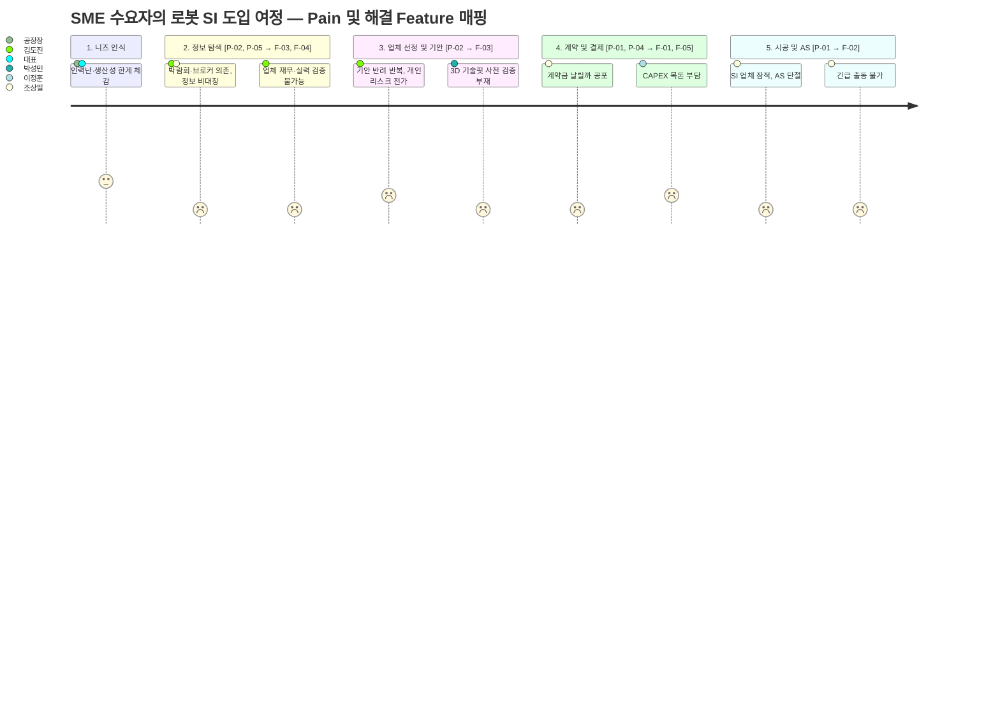

# SRS-v0_1_Opus — 보충 섹션 (Section 7–12)

**Document ID:** SRS-001 (Supplement)
**Revision:** 1.0
**Date:** 2026-04-15
**Standard:** ISO/IEC/IEEE 29148:2018
**적용 대상:** `SRS-v0_1_Opus.md` Section 6 이후 연결

> 본 문서는 `SRS-v0_1_Opus.md`(Section 1~6)의 목차 커버리지를 완비하기 위해 작성된 보충 문서입니다.
> 모든 콘텐츠는 `1_PRD-Robot-SI-Platform-v0.1.md` (v0.2)를 유일한 원천으로 하며, 임의 생성 콘텐츠는 포함하지 않습니다.

---

## 7. Verification and Validation (검증 및 타당성 확인)

### 7.1 검증 방법 (Verification Methods)

본 시스템의 요구사항이 올바르게 구현되었는지 확인하기 위해 아래 4가지 검증 방법을 적용한다.

| 방법 | 코드 | 정의 | 적용 대상 |
|:---|:---:|:---|:---|
| **검사 (Inspection)** | I | 코드 리뷰, 문서 검토, 정적 분석 | 보안 요구사항 (REQ-NF-014~017), 데이터 보존 정책 (REQ-NF-011~013) |
| **분석 (Analysis)** | A | 로그 데이터 기반 통계 분석, 코호트 분석 | KPI (REQ-NF-023~028), 비용 목표 (REQ-NF-018~020) |
| **시연 (Demonstration)** | D | 기능 동작 시연, 워크스루 | 온보딩 (REQ-FUNC-027, 028), UI 흐름 (REQ-FUNC-009~012) |
| **테스트 (Test)** | T | 단위·통합·부하·E2E 테스트 | 에스크로 (REQ-FUNC-001~005), 성능 (REQ-NF-001~006) |

### 7.2 요구사항별 검증 방법 매핑

| Requirement ID | 요구사항 요약 | 검증 방법 |
|:---:|:---|:---:|
| REQ-FUNC-001 | 에스크로 예치 (≤3분, 실패율 <0.5%) | T |
| REQ-FUNC-002 | 검수 합격 시 자금 방출 (≤24시간) | T |
| REQ-FUNC-003 | 분쟁 발생 시 중재 개시 (≤2영업일) | D, T |
| REQ-FUNC-004 | PG 타임아웃 시 자동 재시도 및 CS 유도 | T |
| REQ-FUNC-005 | 검수 기한(7영업일) 만료 시 자동 분쟁 전환 | T |
| REQ-FUNC-006 | 에스크로 결제 완료 시 AS 보증서 자동 발급 (≤1분) | T |
| REQ-FUNC-007 | SI 부도 시 로컬 AS 엔지니어 자동 매칭 (≤4시간) | T, D |
| REQ-FUNC-008 | AS 티켓 SLA 충족 여부 자동 기록 | T, I |
| REQ-FUNC-009 | SI 프로필 재무/성공률/리뷰 통합 표시 (≤2초) | T |
| REQ-FUNC-010 | 기안용 리포트 PDF 4섹션 생성 (≤5초) | T |
| REQ-FUNC-011 | NICE API 장애 시 캐시 폴백 + 안내 배너 | T |
| REQ-FUNC-012 | NICE 잔여 한도 50건 미만 시 Ops 알림 발송 | T, A |
| REQ-FUNC-013 | 제조사 인증 뱃지 발급 (반영 ≤1시간) | T |
| REQ-FUNC-014 | 뱃지 만료/철회 시 자동 비노출 (≤10분) | T |
| REQ-FUNC-015 | 뱃지 보유 SI 필터 적용 (미인증 혼입률 0%) | T |
| REQ-FUNC-016 | 뱃지 만료 D-7일 자동 알림 발송 | T |
| REQ-FUNC-017 | Brand-Agnostic 뱃지 구조 (≥3사) | I, T |
| REQ-FUNC-018 | RaaS 3옵션 비용 결과 렌더링 (≤2초) | T |
| REQ-FUNC-019 | ROI/TCO 포함 PDF 생성 (≤3초) | T |
| REQ-FUNC-020 | 금융 파트너 API 연결 (≤5초) | T |
| REQ-FUNC-021 | 유효하지 않은 입력 시 인라인 에러 (≤200ms) | T |
| REQ-FUNC-022 | 금융 API 장애 시 재시도 + 대안 경로 | T |
| REQ-FUNC-023 | O2O 가용 매니저 슬롯 조회 (≤2초) | T |
| REQ-FUNC-024 | 예약 확정 시 SMS+카카오 이중 알림 (≤30초) | T |
| REQ-FUNC-025 | 방문 보고서 등록 및 관리 (≤24시간) | D, T |
| REQ-FUNC-026 | 가용 슬롯 0건 시 가장 가까운 일정 추천 | T |
| REQ-FUNC-027~028 | 수요기업/SI 파트너 온보딩 | D, T |
| REQ-FUNC-029 | 지역/브랜드/역량 태그 SI 검색 (≤1초) | T |
| REQ-FUNC-030~032 | 파트너 제안 발송/수락/거절/리마인더 | T |
| REQ-FUNC-033~036 | 모니터링 알림 (PagerDuty/Slack) | T, A |
| REQ-NF-001~006 | 성능 (LCP, API 응답, CCU) | T |
| REQ-NF-007~013 | 가용성/데이터 보존 | T, I, A |
| REQ-NF-014~017 | 보안 (PCI-DSS, TLS, MFA) | I |
| REQ-NF-018~020 | 비용 목표 | A |
| REQ-NF-021 | 수평 확장성 | T |
| REQ-NF-022 | Brand-Agnostic DB 구조 | I |
| REQ-NF-023~028 | KPI 기반 지표 | A |

### 7.3 타당성 확인 실험 (Validation Experiments)

PRD 8.2절의 실험 설계를 기반으로, 요구사항의 비즈니스 타당성을 확인한다.

| ID | 검증 대상 (Requirement) | 가설 | 성공 기준 | 설계·도구 | 시점 | 표본 | 관련 REQ |
|:---:|:---|:---|:---|:---|:---|:---|:---|
| **VAL-01** | 에스크로 기반 거래 전환율 | 에스크로 보호 시 첫 거래 전환율 +30pp 상승 | 전환율 **+30pp**, p < 0.05 | A/B 테스트 (대조: 일반결제 / 실험: 에스크로) | Open Beta (MVP+4w~+12w) | 100개사 | REQ-FUNC-001, REQ-NF-023 |
| **VAL-02** | 기안 리포트 유효성 | 기안 리포트 자동 생성 시 통과율 80% 초과 | 통과율 **≥ 80%** (기준선 35%) | 코호트 분석 (다운로드 vs 미다운로드) | CB~OB (MVP~+12w) | 50개사 | REQ-FUNC-010, REQ-NF-025 |
| **VAL-03** | 인증 뱃지 신뢰도 | 뱃지 SI 우선 노출 시 매칭 요청 수 2배 증가 | CTR **×2.0↑**, p < 0.05 | A/B 테스트 (대조: 기본정렬 / 실험: 뱃지 상단 고정) | Open Beta (MVP+4w~+12w) | 200건+ SI 프로필 뷰 | REQ-FUNC-013, 015 |
| **VAL-04** | RaaS 계산기 ROI 효과 | RaaS 계산기 사용자 > 미사용자 계약 전환율 | 전환율 **≥ 25%** (미사용 대비 +15pp) | 퍼널 분석 (자연 노출 분기) | Open Beta (MVP+4w~+12w) | 100개사 | REQ-FUNC-018, REQ-NF-027 |
| **VAL-05** | AS 보증료 수용도 | 보증료 WTP ≥ 8% 검증 | 중앙값 **≥ 8%**, 95% CI 하한 **≥ 6%** | Van Westendorp PSM 설문(4Q) | Closed Beta (MVP~+4w) | 200명 | REQ-NF-023 |

### 7.4 측정 도구 및 연결표

PRD 9.4절의 실험 설계 연결표를 SRS 형식으로 재구성한다.

| 주장 (Claim) | 실험 설계 (Design) | 측정 도구 (Metrics) | Validation ID |
|:---|:---|:---|:---:|
| 에스크로가 전환율을 높인다 | A/B 테스트 (n≥100) | 견적→계약 전환율, p-value | VAL-01 |
| 기안 리포트가 통과율을 높인다 | 코호트 분석 (n≥50) | 첫 보고 통과율 (%) | VAL-02 |
| 뱃지가 매칭 선호를 높인다 | A/B 테스트 (n≥200) | 매칭 요청 수/뷰 (CTR) | VAL-03 |
| RaaS 계산기가 결정을 앞당긴다 | 퍼널 분석 (n≥100) | 계산기 사용→계약 전환율 | VAL-04 |
| 보증료 WTP가 8% 이상이다 | 가격 탄력성 설문 (n≥200) | WTP 중앙값 (%), 95% CI | VAL-05 |

---

## 8. Project Risks and Constraints (프로젝트 리스크 및 제약사항)

### 8.1 리스크 레지스트리

PRD 7.3절의 리스크를 SRS 형식으로 정식 기재한다.

| Risk ID | 리스크 항목 | 영향도 | 발생 가능성 | 완화 전략 (Mitigation) | 관련 REQ |
|:---:|:---|:---:|:---:|:---|:---|
| **REQ-RISK-01** | **SI 파트너 초기 공급 부족 (Cold-Start)** — MVP 런칭 시 인증 뱃지 보유 SI 50개사 미달 | 상 | 중상 | D-90일부터 Layer 3 영세 SI 무료 온보딩 캠페인. 최소 3개 제조사 파트너십 사전 체결 | REQ-FUNC-013, 017 |
| **REQ-RISK-02** | **에스크로 분쟁 폭주** — 검수 합격 기준 모호로 분쟁 비율 10% 초과 | 중상 | 중 | 표준 검수 체크리스트 20항목 사전 정의. 분쟁 중재 SLA 2영업일 준수 인력 1명 전담 | REQ-FUNC-003, 005 |
| **REQ-RISK-03** | **AS 출동 SLA 미달** — 지방·야간 AS 엔지니어 공급 부족으로 24시간 출동률 < 95% | 상 | 중상 | 수도권·5대 산단 집중 운영 후 점진 확대. 로컬 AS 사업자 계약 시 SLA 위약금 조항 삽입 | REQ-FUNC-007, REQ-NF-024 |
| **REQ-RISK-04** | **규제 리스크** — 에스크로 결제가 전자금융업 등록 대상 판정 | 상 | 중 | PG사 에스크로 서비스 위임 구조(직접 결제 아님) 확인. 법률 자문 MVP 전 완료 | CON-01 |
| **REQ-RISK-05** | **경쟁사 추격** — 마로솔이 에스크로 + 3D 기능 자체 개발 | 중상 | 중 | 호환성 DB + 제조사 뱃지 독점 파트너십으로 데이터 해자 선점. 속도 우선 | REQ-FUNC-017, CON-03 |

### 8.2 Architecture Decision Records (ADR)

PRD 7.5절의 핵심 아키텍처 결정 기록을 SRS 형식으로 정식 기재한다.

#### ADR-001: 에스크로 결제 — PG사 위임 구조 채택

| 항목 | 내용 |
|:---|:---|
| **결정** | 플랫폼이 직접 자금을 보관하지 않고, PG사(토스페이먼츠/나이스)의 에스크로 API를 위임 호출하여 자금 예치·방출을 처리한다 |
| **배경/제약** | 직접 자금 보관 시 `전자금융업자 등록`(금융위원회) 필수 → MVP 단계에서 라이선스 취득에 6~12개월 소요. 초기 스타트업에게 치명적 시간 지연 (REQ-RISK-04 직결) |
| **검토한 대안** | ① 자체 에스크로 구축(규제 리스크 상) ② 블록체인 스마트컨트랙트(B2B SME 수용성 극저) ③ PG사 위임(규제 회피 + 기존 인프라 활용) |
| **결론** | ③ PG 위임 채택. PCI-DSS 준수를 PG에 전가하고, 플랫폼은 계약 상태 관리·분쟁 중재에만 집중. MVP 속도 확보 |
| **리스크 잔존** | PG사 에스크로가 B2B 고액(건당 1억+)을 지원하지 않을 가능성 → ASM-01에서 사전 확인 |
| **관련 제약** | CON-01, REQ-NF-014 |

#### ADR-002: SI 재무 등급 — NICE API 캐시 TTL 30일 설정

| 항목 | 내용 |
|:---|:---|
| **결정** | NICE평가정보 신용조회 API 결과를 DB에 캐시하고, TTL(Time-to-Live)을 **30일**로 설정한다 |
| **배경/제약** | API 일일 조회 한도 500건. SI 파트너 120개사 기준 월 1회 전수 갱신 시 4일 소요(120건/일). 실시간 조회는 한도 초과로 불가 |
| **검토한 대안** | ① 실시간 조회만(한도 초과 시 장애) ② 7일 캐시(갱신 빈도 과다, 비용 증가) ③ 30일 캐시(월 1회 배치 갱신) ④ 90일 캐시(데이터 신선도 부족) |
| **결론** | ③ 30일 캐시 채택. 재무 등급은 월 단위 변동이므로 30일이 정보 신선도와 API 효율의 최적 균형점. 장애 시 캐시 폴백 자동 전환(AC-2.5) |
| **리스크 잔존** | 캐시 기간 중 SI 업체 급격한 재무 악화 시 데이터 지연 → 분기 1회 수동 스팟 체크 프로세스 추가 |
| **관련 제약** | CON-02, REQ-FUNC-011, REQ-FUNC-012 |

#### ADR-003: Brand-Agnostic 다(多)브랜드 호환성 DB 구조 채택

| 항목 | 내용 |
|:---|:---|
| **결정** | 특정 로봇 제조사에 종속되지 않는 **Brand-Agnostic 호환성 DB** 구조로 설계한다 |
| **배경/제약** | 경쟁사 UR+는 UR 1사에 한정된 500개 파트너 생태계. 국내 로봇 시장에서 UR 외 브랜드가 차지하는 비중 약 70%. 단일 브랜드 종속 시 시장의 70%를 포기 |
| **검토한 대안** | ① UR+ 모델 모방(1개 브랜드 깊이 우선) ② 2~3개 주요 브랜드 한정 ③ 완전 Brand-Agnostic 개방형 |
| **결론** | ③ 채택. 플랫폼의 핵심 해자는 '중립성'이며, 수요 기업 페르소나(김도진)가 신뢰하는 근거. 초기 ≥ 3사 파트너십(ASM-02)으로 시작하되, DB 스키마는 제조사 무관 확장 가능 구조 |
| **리스크 잔존** | 특정 제조사가 독점 파트너십을 요구하며 참여 거부 가능 → 중립성 원칙 고수, 개별 제조사 의존도 30% 이하 유지 |
| **관련 제약** | CON-03, REQ-FUNC-017, REQ-NF-022 |

### 8.3 Design Constraints (설계 제약사항)

기존 SRS 1.2.3절의 제약사항에서 도출된 핵심 설계 제약을 정식 요구사항 형태로 기재한다.

| ID | 제약사항 | 근거 | 관련 ADR |
|:---:|:---|:---|:---:|
| **REQ-CON-01** | 플랫폼은 직접 자금을 보관하지 않으며, 모든 자금 흐름은 PG사 에스크로 서버를 경유해야 한다 | 전자금융업자 등록 회피, MVP 속도 확보 | ADR-001 |
| **REQ-CON-02** | NICE API 호출 최적화를 위해 월 1회 전수 갱신 배치를 수행하며, 실시간 조회 실패 시 캐시 데이터를 사용한다 (TTL 30일) | API 일일 한도 500건, 정보 신선도-효율 균형 | ADR-002 |
| **REQ-CON-03** | 특정 브랜드 종속을 방지하기 위해 다중 제조사(UR, 두산, 레인보우 등)를 수용하는 확장 스키마를 유지한다 | UR 외 시장 70% 커버 목표 | ADR-003 |
| **REQ-CON-04** | PG사 에스크로가 B2B 고액 거래(건당 1억 원 이상)를 기술적으로 지원해야 한다 | 가정 ASM-01 | ADR-001 |
| **REQ-CON-05** | 결제 데이터는 PCI-DSS Level 1을 준수한다 (PG사 위임) | 보안 요구 | ADR-001 |
| **REQ-CON-06** | 개인정보보호법 준수 및 ISMS-P 인증을 MVP+12개월 내 취득한다 | 보안 요구 | — |
| **REQ-CON-07** | MVP 인프라 비용은 월 500만 원 이하로 유지한다 | 비용 목표 (PRD 5.4) | — |

---

## 9. Assumptions and Dependencies (가정 및 의존성)

PRD 7.4절의 가정·의존성을 SRS 형식으로 정식 기재한다.

### 9.1 가정 (Assumptions)

| ID | 가정 항목 | 상세 내용 | 검증 시한 | 검증 실패 시 영향 |
|:---:|:---|:---|:---|:---|
| **ASM-01** | PG사 B2B 고액 지원 | PG사(토스페이먼츠/나이스) 에스크로 API가 B2B 고액 거래(건당 1억 원 이상)를 기술적으로 지원한다 | D-60일 | REQ-FUNC-001~005 전체 에스크로 기능 구현 불가. 대안 PG사 탐색 또는 분할 결제 구조 검토 필요 |
| **ASM-02** | 제조사 뱃지 참여 | 로봇 제조사(UR, 두산, 레인보우 등) 최소 3사가 뱃지 프로그램에 참여한다 | D-90일 LOI 완료 | REQ-FUNC-013~017, CON-03 위반. Brand-Agnostic 전략 및 뱃지 시스템의 차별적 가치 상실 |
| **ASM-03** | 재무 조회 법적 허용 | NICE평가정보 API를 통한 SI 업체 재무 등급 조회가 B2B 서비스 맥락에서 법적으로 가능하다 | D-60일 법률 검토 | REQ-FUNC-009~012 평판 뷰어의 재무 등급 섹션 제거 필요. 대안: 자가 신고 기반 재무 정보 |
| **ASM-04** | 로컬 AS 사업자 SLA 동의 | 지역별 로컬 AS 사업자가 플랫폼의 24시간 SLA 조항에 동의하고 계약 가능하다 | D-30일 (수도권 5개 산단) | REQ-FUNC-007, REQ-NF-024 AS 출동 보장 SLA 달성 불가. 대안: SLA 수치 완화(48시간) |
| **ASM-05** | MVP 동시 접속 규모 | MVP 단계의 동시 접속 규모는 500 CCU 이내이다 | 부하 테스트 (D-14) | REQ-NF-005, REQ-NF-006 초과 시 인프라 스케일업 및 비용 목표(REQ-NF-018) 재조정 필요 |

### 9.2 의존성 (Dependencies)

| ID | 의존성 항목 | 의존 대상 | 확보 시한 | 미충족 시 영향 |
|:---:|:---|:---|:---|:---|
| **DEP-01** | PG사 에스크로 API 계약 | 토스페이먼츠 또는 나이스 | MVP D-60일 | F-01 전체 기능 블로킹 |
| **DEP-02** | NICE평가정보 API 계약 | NICE평가정보 | MVP D-60일 | F-03 재무 등급 표시 불가, 캐시 데이터 원천 미확보 |
| **DEP-03** | 제조사 파트너십 LOI | 로봇 제조사 최소 3사 | MVP D-90일 | F-04 뱃지 시스템 콘텐츠 부재 (Cold-Start: REQ-RISK-01 현실화) |
| **DEP-04** | 로컬 AS 사업자 계약 | 수도권 5개 산단 AS 사업자 | MVP D-30일 | F-02 AS 출동 보증 SLA 달성 불가 (REQ-RISK-03 현실화) |
| **DEP-05** | 금융 파트너 API 연동 | 리스/RaaS 금융 파트너 | MVP D-30일 | F-05 실시간 금융 정보 제공 불가, 이메일 견적 대안 경로만 제공 |
| **DEP-06** | 카카오 알림톡/SMS 연동 | 카카오, SMS 게이트웨이 | MVP D-14일 | 알림 기능 제한, 이메일 단일 채널 대안 제공 |

---

## 10. Deployment and Support (배포 및 지원)

### 10.1 Rollout Strategy (단계적 배포)

PRD 8.1절의 베타 채널 계획을 SRS 형식으로 정식 기재한다.

| 단계 | 시기 | 대상 | 규모 | 목적 | 진입/종료 기준 |
|:---:|:---|:---|:---:|:---|:---|
| **Alpha** | MVP-4주 | 내부 팀 + 파트너 SI 5개사 | 10명 | 핵심 기능 안정성 검증, 치명적 결함 탐지 | 진입: 기능 개발 완료. 종료: P1 결함 0건, 에스크로 E2E 성공 |
| **Closed Beta (CB)** | MVP ~ MVP+4주 | 수도권 2개 산단 SME 초대 | 30개사 | 실사용 환경 운영 검증, EXP-05(보증료 WTP) 수행 | 진입: Alpha 종료 기준 충족. 종료: 에스크로 완결 ≥ 5건, 치명적 SLA 위반 0건 |
| **Open Beta (OB)** | MVP+4주 ~ +12주 | 전국 5대 산단 확장 | 100개사 | A/B 실험(EXP-01, 03, 04) 수행, 통계적 유의성 확보 | 진입: CB 종료 기준 충족. 종료: 에스크로 완결 ≥ 15건, EXP 성공 기준 달성 |

### 10.2 배포 환경 요구사항

| 환경 | 용도 | 인프라 요구사항 |
|:---|:---|:---|
| **Development** | 개발/단위 테스트 | 클라우드 개발 환경 (비용 최소화) |
| **Staging** | 부하 테스트 (k6/Locust, 500 CCU × 30분), 통합 테스트 | Production 동등 구성 (MVP D-14 수행) |
| **Production** | 실서비스 운영 | 월 500만 원 이하 (REQ-NF-018), 99.5% 가용성 (REQ-NF-007) |

### 10.3 Benchmarking Plan (경쟁 대안 대비 벤치마크)

PRD 8.3절의 경쟁 대안 대비 벤치마크 계획을 정식 기재한다.

| 비교 항목 | 현 대안 (마로솔·브로커) | 본 플랫폼 목표 | 벤치마크 방법 | 관련 REQ |
|:---|:---|:---|:---|:---|
| 계약금 보호 | 보호 없음 (0%) | **100% 에스크로 보호** | 분쟁 발생 시 자금 보전율 비교 | REQ-FUNC-001~002 |
| SI 검증 소요 | 14일+ (발품 탐색) | **≤ 1일** (리포트 즉시 발행) | 미스터리 쇼퍼 테스트 (n=20) | REQ-FUNC-009~010 |
| AS 출동 보증 | 보증 없음 | **24시간 내 95%** 출동 | 2개월간 AS 접수-출동 로그 분석 | REQ-FUNC-007, REQ-NF-024 |
| 비용 비교 기능 | 수기 견적 2주+ | **실시간 3옵션**, 2초 내 | Task Completion Rate 비교 (n=50) | REQ-FUNC-018 |

---

## 11. Business Context (비즈니스 컨텍스트)

### 11.1 문제 정의 (Pain 지표)

PRD 1.1절의 문제 정의를 SRS 참조용으로 정식 기재한다.

| Pain ID | Pain 서술 | 실패 KPI (현재 As-Is) | 매핑 페르소나 | 해결 Feature |
|:---:|:---|:---|:---|:---|
| **P-01** | SI 업체 파산/잠적으로 로봇이 고철화 → 유지보수 단절 트라우마 | 도입 후 1년 내 AS 단절 경험률 **≥ 25%** (추정) | 조상필 (P9, AOS=4.00) | F-01, F-02 |
| **P-02** | 업체 재무/기술 역량을 객관적으로 증명할 수 없어 기안 반려 반복 | 경영진 기안 첫 보고 통과율 **≤ 35%**, 평균 검증 소요 **14일+** | 김도진 (P1, AOS=2.88) | F-03, F-04 |
| **P-03** | 비대면 계약에 대한 맹목적 불신 → 온라인 전환 거부 | 플랫폼 가입 후 첫 견적 요청 전환율 **≤ 5%** (아날로그 층) | 백창훈 (P11, AOS=1.35) | F-06 |
| **P-04** | 초기 투자비(CAPEX) 부담 → 유연한 구독형 상품 부재 | SME 중 CAPEX 부담으로 도입 주저 비율 **44.2%** | 이정훈 (P2, AOS=2.00) | F-05 |
| **P-05** | SI 파트너 탐색에 박람회·인맥 의존 → 검색 비용 과다 | 적격 SI 파트너 발굴까지 평균 소요 **≥ 3개월** | 강혁진 (P6, AOS=2.88) | F-04, F-03 |

### 11.2 목표 (Desired Outcome)

PRD 1.2절의 비즈니스 목표를 SRS 요구사항과 연결한다.

| 목표 ID | 목표 서술 | 목표값 | 달성 시한 | 관련 REQ |
|:---:|:---|:---|:---|:---|
| **G-01** | 고장 접수 → 로컬 AS 엔지니어 방문 보장 | 24시간 내 출동률 **≥ 95%** | MVP+6개월 | REQ-FUNC-007, REQ-NF-024 |
| **G-02** | 경영진 기안 첫 보고 통과율 대폭 개선 | 첫 보고 통과율 **≥ 80%**, 검증 소요 **≤ 1일** | MVP+3개월 | REQ-FUNC-010, REQ-NF-025 |
| **G-03** | 아날로그 층의 플랫폼 내 최초 거래 전환 | O2O 파견 후 견적 요청 전환율 **≥ 40%** | Phase 2 | REQ-FUNC-023~026, REQ-NF-026 |
| **G-04** | CAPEX→OPEX 전환을 통한 도입 결정 가속 | RaaS 계산기 사용 후 계약 전환율 **≥ 25%** | MVP+6개월 | REQ-FUNC-018, REQ-NF-027 |

### 11.3 성공 지표 (KPI) — 요구사항 추적

PRD 1.3절의 KPI를 SRS 요구사항 ID와 측정 경로에 연결한다.

| 유형 | KPI | 기준선 | MVP+1m | MVP+3m | MVP+6m (Target) | 주기 | 측정 경로 | 관련 REQ |
|:---|:---|:---|:---|:---|:---|:---|:---|:---|
| 🌟 **북극성** | 에스크로 거래 완결 수 (월간) | 0 | 5건 | 15건 | **30건** | 주간 | `ESCROW_TX` `state=released` 집계 → Metabase | REQ-NF-023 |
| 보조 | 신규 수요 기업 가입 수 | 0 | 50 | **200** | 300 | 주간 | `BUYER_COMPANY` 신규 생성 → Amplitude `signup_complete` | REQ-FUNC-027 |
| 보조 | 뱃지 인증 SI 파트너 등록 수 | 0 | **50** (런칭) | 80 | 120 | 월간 | `BADGE` `is_active=true` 고유 SI 수 → Admin | REQ-FUNC-013, REQ-NF-021 |
| 보조 | 에스크로 보증 수수료 GMV 비율 | 0% | 5% | 7% | **5~10%** | 월간 | `ESCROW_TX.amount / CONTRACT.total_amount` 평균 | REQ-FUNC-001 |
| 보조 | 24시간 내 AS 출동 성공률 | N/A | ≥ 80% | ≥ 90% | **≥ 95%** | 월간 | `AS_TICKET` `resolved_at - reported_at ≤ 24h` 비율 | REQ-NF-024 |
| 보조 | NPS (수요 기업) | N/A | 측정 시작 | ≥ 40 | **≥ 50** | 분기 | 인앱 NPS 설문 → 분기 리포트 | REQ-NF-028 |

### 11.4 AOS-DOS 기반 투자 우선순위

PRD 2.1절의 AOS-DOS 분석 결과와 전략 분석(REF-07)을 기반으로 시스템 투자 서열을 정의한다.

| Quadrant | 투자 방향 | 예산 배분 | 대상 기능 | 근거 |
|:---:|:---|:---:|:---|:---|
| **Q1 (즉시 투자)** | 핵심 Pain 해소 — 에스크로 + 평판 뷰어 | **80%** | F-01, F-02, F-03, F-04 | P-01 (AOS=4.00), P-02 (AOS=2.88) 해결. 가장 높은 기회 점수 |
| **Q3 (조건부 확장)** | 비대면 불신 해소 — O2O 매니저 파견 | **진입 후 배분** | F-06 | P-03 (AOS=1.35). Phase 2 조건: CB 전환율 ≥ 10% 도달 시 |
| **Q2 (백로그)** | 비용 비교 및 3D 시뮬레이션 | **잔여** | F-05, F-07 | P-04 (AOS=2.00). Should 우선순위로 MVP 포함하되 예산 제한적 배분 |
| **Q4 (폐기)** | ROI 음수 기능 | **0%** | F-08 (보조금 대행), F-09 (대기업 커스텀) | DOS < 0. AOS-DOS 분석에서 영구 Drop 판정 |

### 11.5 KSF (Key Success Factors) 이행 경로

전략 분석(REF-06: KSF 통합 보고서)에서 도출된 핵심 성공 요인의 순서적 실행 경로를 SRS 요구사항과 연결한다.

| 경로 | KSF | Phase | 핵심 실행 내용 | 관련 REQ |
|:---:|:---|:---:|:---|:---|
| **Path A** | 호환성 DB 구축을 통한 정보 비대칭 해소 | 1 | Brand-Agnostic DB 스키마(ADR-003), 뱃지 시스템(F-04), 재무 평판 뷰어(F-03) | REQ-FUNC-009~017, REQ-NF-022 |
| **Path B** | SI 공생 구조(에스크로 분쟁 중재)를 통한 생태계 안정화 | 1 | 에스크로 결제(F-01), AS 보증(F-02), 분쟁 중재 프로세스 | REQ-FUNC-001~008 |
| **Path C** | 3D 시뮬레이션 등 고도화 기술 적용으로 전환율 극대화 | 2 | 3D 기술핏 시뮬레이터(F-07, Phase 2), RaaS 계산기 고도화 | REQ-FUNC-018~022 (Phase 1), F-07 (Phase 2) |

### 11.6 수요자 여정 Pain 맵

PRD 2.2절의 수요자 여정에서 각 단계의 Pain과 해결 Feature의 연결을 기재한다.

---

## 12. 인터뷰·시장·전략 근거 (Evidence)

### 12.1 인터뷰 근거

PRD 9.1절의 JTBD 심층 인터뷰 결과를 SRS 참조용으로 정식 기재한다.

| 출처 | 핵심 인사이트 (원문 인용) | 연결 Pain/Feature | 링크 |
|:---|:---|:---|:---|
| JTBD 심층 인터뷰 — 조상필 (P9) | *"새벽 2시 출동 보장되면 15% 더 주지"* → 보증료 WTP 10~15% 검증 | P-01, F-02 → VAL-05 | `02_VPS-Drafts/6_Value-Proposition-Sheet-V2(rooted).md` 부록 E-1 |
| JTBD 심층 인터뷰 — 김도진 (P1) | *"부도나면 내 목이 날아감"* → 기안 통과율 Pain 확인 | P-02, F-03 → VAL-02 | 상동 부록 E-1 |
| JTBD 심층 인터뷰 — 백창훈 (P11) | *"온라인은 사기야. 멱살 잡을 담당자가 없으면 절대 안 사"* → O2O 필수성 검증 | P-03, F-06 | 상동 부록 E-1 |
| JTBD 심층 인터뷰 — 강혁진 (P6) | *"매칭 과정이 너무 파편화되어 영업사원들도 지쳐 떨어집니다"* → 파트너 검색 Pain 확인 | P-05, F-04 | 상동 부록 E-1 |

### 12.2 시장 리서치 근거

PRD 9.2절의 시장 데이터를 SRS 참조용으로 정식 기재한다.

| 출처 | 핵심 데이터 | 활용 요구사항 | 링크 |
|:---|:---|:---|:---|
| Grand View Research (2024) | 글로벌 로봇 SI 시장 **$745억**, CAGR **9.6%** | 시장 규모 타당성 → REQ-NF-021 확장성 근거 | `01_Biz-analysis/6_TAM-SAM-SOM+MarketSegment.md` |
| 국내 로봇 산업 실태조사 (2023) | 국내 로봇 SI 매출 **1조 6,695억 원**, SME **44.2%** CAPEX 부담 | P-04 검증 → REQ-FUNC-018~022 (RaaS) | 상동 |
| 마로솔 사례분석 | 2023 상반기 수주 **100억**, 매출 Y/Y **5.8×** 성장 | 경쟁사 벤치마크 → REQ-RISK-05 | `01_Biz-analysis/2_competitents-analysis.md` |

### 12.3 전략 분석 근거

PRD 9.3절의 전략 분석 결과를 SRS 참조용으로 정식 기재한다.

| 출처 | 핵심 인사이트 | 활용 요구사항 | 링크 |
|:---|:---|:---|:---|
| Porter's 5 Forces | 대체재 위협 상 (전통 SI) → **공생 구조 편입 전략** | ADR-001 (에스크로 중재) → REQ-FUNC-003 | `01_Biz-analysis/1_porters-forces.md` |
| KSF 통합 보고서 | KSF A(호환성 DB) → B(SI 공생) → C(3D 시뮬레이션) **순서적 실행** | Section 11.5 이행 경로 | `01_Biz-analysis/4_ksf-report.md` |
| AOS-DOS 분석 | **Q1 집중(예산 80%)** → Q3(O2O) → Q2(백로그) 투자 서열 | Section 11.4 투자 우선순위 | `01_Biz-analysis/9_aos-dos-analysis.md` |

---

## 13. Glossary (용어집 확장)

기존 SRS 1.3절에 정의된 용어 외 추가로 참조가 필요한 용어를 기재한다.

| 용어 | 정의 | 사용 섹션 |
|:---|:---|:---|
| **에스크로 거래 완결 수 (월간)** | 북극성 KPI. `ESCROW_TX` 테이블에서 `state=released`인 건수의 월간 집계값 | 11.3, REQ-NF-023 |
| **뱃지 인증 SI** | 로봇 제조사가 기술력을 보증하여 인증 뱃지를 발급한 SI 업체. 검색 결과 상단 노출 대상 | 4.1.4, REQ-FUNC-013~017 |
| **SLA (Service Level Agreement)** | AS 접수 후 24시간 이내 현장 출동을 보장하는 서비스 수준 협약 | REQ-FUNC-007, REQ-NF-024 |
| **Cold-Start** | 플랫폼 초기 런칭 시 공급(SI 파트너) 또는 수요(기업)가 부족하여 네트워크 효과가 미작동하는 상태 | REQ-RISK-01 |
| **Layer 3 SI** | 소규모 영세 SI 업체 (규모 기준). 플랫폼 초기 공급 확보를 위한 무료 온보딩 대상 | REQ-RISK-01 완화 전략 |
| **GMV (Gross Merchandise Volume)** | 플랫폼을 통해 체결된 전체 거래액. 보증 수수료 비율 산출 기준 | 11.3 |
| **Van Westendorp PSM** | 가격 민감도 측정 설문 기법 (4개 질문). 보증료 WTP 중앙값 산출에 사용 | VAL-05 |
| **Quadrant (Q1~Q4)** | AOS-DOS 분석에서 기회 점수와 만족 점수를 기반으로 기능을 4개 상한에 분류하는 기법 | 11.4 |
| **LOI (Letter of Intent)** | 의향서. 제조사 파트너십 체결 의지를 사전에 확인하기 위한 법적 비구속 문서 | ASM-02, DEP-03 |
| **RPO / RTO** | Recovery Point Objective (복구 시점 목표) / Recovery Time Objective (복구 시간 목표) | REQ-NF-009, REQ-NF-010 |

---

*끝. 본 보충 문서는 `SRS-v0_1_Opus.md` Section 6 종료 지점 이후에 연결하여 Section 7~13의 목차 커버리지를 완비합니다. 모든 콘텐츠는 PRD v0.2 (REF-01)를 유일한 원천(Source of Truth)으로 합니다.*
