# Software Requirements Specification (SRS)

**Document ID:** SRS-001
**Revision:** 1.1
**Date:** 2026-04-15
**Standard:** ISO/IEC/IEEE 29148:2018

---

## 1. Introduction

### 1.1 Purpose

본 SRS는 **로봇 SI 안심 보증 매칭 플랫폼**(이하 "플랫폼")의 소프트웨어 요구사항을 정의한다. 중소·중견기업(SME)이 로봇 자동화를 도입할 때 직면하는 **정보 비대칭과 사후 리스크**(SI 업체 파산·잠적에 의한 유지보수 단절, 객관적 역량 증빙 부재, 초기 투자비 부담)를 해소하여, 의사결정 지연(6개월 이상)과 도입 무산을 방지하는 것을 목적으로 한다.

본 문서는 개발팀, QA팀, 프로젝트 관리자, 이해관계자에게 시스템의 기능적·비기능적 요구사항, 인터페이스, 데이터 모델, 제약사항을 명확히 전달하며, 모든 요구사항의 테스트 가능성(Testability)과 추적 가능성(Traceability)을 보장한다.

### 1.2 Scope

#### 1.2.1 In-Scope (MVP Phase 1)

| ID | 범위 항목 | 관련 기능 |
|:---:|:---|:---:|
| IS-01 | 에스크로 결제 및 자금 방출 로직 | F-01 |
| IS-02 | 로컬 AS망 매칭 및 보증서 자동 발급 | F-02 |
| IS-03 | SI 파트너 재무/시공 투명 평판 뷰어 및 기안 리포트 PDF 생성 | F-03 |
| IS-04 | 제조사 인증 뱃지 발급·관리 시스템 | F-04 |
| IS-05 | RaaS 구독 및 OPEX 비용 비교 계산기 | F-05 |
| IS-06 | 수요 기업·SI 파트너 온보딩 및 검색 | F-03, F-04 |

#### 1.2.2 Out-of-Scope

| ID | 범위 외 항목 | 사유 | 비고 |
|:---:|:---|:---|:---:|
| OS-01 | O2O 매니저 파견 예약 시스템 (F-06) | Phase 2 계획 | Phase 2 |
| OS-02 | 3D 기술핏 시뮬레이터 (F-07) | WebGL 3D 엔진 + 모델 렌더링 + 공간 검증 포함, 1스프린트 내 구현 불가 (4~6스프린트 예상) | Phase 2 |
| OS-03 | S/W 플러그인 앱스토어 | Phase 3 계획 | Phase 3 |
| OS-04 | 정부 보조금 원클릭 대행 (F-08) | 행정 프로세스 변동 과다, 유지보수 ROI 음수 | 영구 Drop |
| OS-05 | 대기업 인하우스 커스텀 모듈 (F-09) | 시장 불가 (DOS=-1.05) | 영구 Drop |

#### 1.2.3 Constraints (제약사항)

| ID | 제약사항 | 근거 |
|:---:|:---|:---|
| CON-01 | 플랫폼은 직접 자금을 보관하지 않으며, PG사(토스페이먼츠/나이스) 에스크로 API 위임 구조를 채택한다 | ADR-001: 전자금융업자 등록 회피, MVP 속도 확보 |
| CON-02 | NICE 평가정보 API 조회 결과는 DB 캐시(TTL 30일)로 운영하며, 일일 조회 한도는 500건이다 | ADR-002: API 한도 제약, 정보 신선도-효율 균형 |
| CON-03 | 호환성 DB는 Brand-Agnostic(특정 제조사 비종속) 개방형 구조로 설계한다 | ADR-003: 시장 70% 커버 목표 |
| CON-04 | PG사 에스크로가 B2B 고액 거래(건당 1억 원 이상)를 지원해야 한다 | 가정 A-01 |
| CON-05 | 제조사 최소 3사가 뱃지 프로그램에 참여해야 한다 (D-90일 LOI 완료 목표) | 의존성 A-02 |
| CON-06 | NICE 평가정보 API를 통한 SI 업체 재무 등급 조회가 법적으로 허용되어야 한다 | 가정 A-03 |
| CON-07 | 로컬 AS 사업자가 24시간 SLA에 동의하고 계약 가능해야 한다 (수도권 5개 산단 D-30일 목표) | 의존성 A-04 |
| CON-08 | 결제 데이터는 PCI-DSS Level 1을 준수한다 (PG사 위임) | 보안 요구 |
| CON-09 | 개인정보보호법 준수 및 ISMS-P 인증을 MVP+12개월 내 취득한다 | 보안 요구 |
| CON-10 | MVP 인프라 비용은 월 500만 원 이하로 유지한다 | 비용 목표 |

#### 1.2.4 Assumptions (가정)

| ID | 가정 | 검증 방안 | 검증 시한 |
|:---:|:---|:---|:---|
| ASM-01 | PG사 에스크로 API가 B2B 고액 거래(건당 1억 원 이상)를 지원한다 | 토스페이먼츠/나이스 B2B 에스크로 API 기술 문서 검토 + 테스트 계정으로 1억 원 이상 모의 결제 시도. 한도 제약 시 분할 결제 구조 PoC 수행 | D-60일 |
| ASM-02 | 로봇 제조사(UR, 두산, 레인보우 등) 최소 3사가 뱃지 프로그램에 참여한다 | 각 제조사 채널 영업 담당에게 파트너십 제안서 발송 후 LOI(의향서) 회수. 뱃지 프로그램 혜택(검색 상단 노출, 파트너 매칭 우선)을 명시한 1-pager 제공 | D-90일 LOI |
| ASM-03 | NICE 평가정보 API를 통한 SI 업체 재무 등급 조회가 법적으로 가능하다 | 외부 법률사무소에 B2B 신용조회 서비스의 개인정보보호법·신용정보법 적법성 검토 의뢰. NICE 담당과 이용 약관 협의 | D-60일 법률 검토 |
| ASM-04 | 로컬 AS 사업자가 24시간 SLA에 동의하고 계약 가능하다 | 수도권 5대 산단 소재 AS 사업자 5개사에 SLA 조건 포함 계약서 초안 발송 + 간담회 1회 개최. SLA 위약금 조항 수용 여부 확인 | D-30일 |
| ASM-05 | MVP 동시 접속 규모는 500 CCU 이내이다 | MVP D-14일 Staging 환경에서 k6 또는 Locust를 활용한 500 CCU × 30분 부하 테스트 수행. p95 응답 시간, 에러율, CPU 사용률 확인 | 부하 테스트 (D-14) |

### 1.3 Definitions, Acronyms, Abbreviations

| 용어 | 정의 |
|:---|:---|
| **SI (System Integrator)** | 로봇 시스템을 설계·시공·통합하는 업체 |
| **SME** | 중소·중견기업 (Small and Medium-sized Enterprise) |
| **에스크로 (Escrow)** | 거래 대금을 제3자가 보관하고, 조건 충족 시 방출하는 결제 보호 방식 |
| **RaaS (Robot-as-a-Service)** | 로봇을 구독형(OPEX)으로 이용하는 서비스 모델 |
| **CAPEX** | 자본적 지출 (Capital Expenditure) |
| **OPEX** | 운영 지출 (Operating Expenditure) |
| **TCO** | 총 소유비용 (Total Cost of Ownership) |
| **뱃지 (Badge)** | 로봇 제조사가 SI 파트너의 기술 역량을 인증하여 발급하는 디지털 인증 마크 |
| **AOS (Adjusted Opportunity Score)** | 사용자 Pain의 기대 충족도를 보정한 기회 점수 |
| **DOS (Discovered Opportunity Score)** | 발견된 기회 점수 |
| **O2O (Online-to-Offline)** | 온라인 플랫폼에서 오프라인 현장 서비스로 연결하는 방식 |
| **PG (Payment Gateway)** | 전자결제 대행 서비스 |
| **JTBD (Jobs to be Done)** | 고객이 완수하고자 하는 핵심 과업 |
| **MoSCoW** | 우선순위 분류 기법 (Must, Should, Could, Won't) |
| **CCU** | 동시 접속 사용자 수 (Concurrent Users) |
| **LCP** | Largest Contentful Paint — 페이지의 주요 콘텐츠 렌더링 완료 시점 |
| **RPO** | 복구 시점 목표 (Recovery Point Objective) |
| **RTO** | 복구 시간 목표 (Recovery Time Objective) |
| **SLA** | 서비스 수준 협약 (Service Level Agreement) |
| **RBAC** | 역할 기반 접근 제어 (Role-Based Access Control) |
| **TLS** | 전송 계층 보안 (Transport Layer Security) |
| **PCI-DSS** | 결제 카드 산업 데이터 보안 표준 (Payment Card Industry Data Security Standard) |
| **ISMS-P** | 정보보호 및 개인정보보호 관리체계 인증 |
| **GMV** | 총 거래액 (Gross Merchandise Volume) |
| **NPS** | 순추천고객지수 (Net Promoter Score) |
| **Validator** | 요구사항 또는 가설의 유효성을 검증하는 실험 설계 |
| **PSM (Van Westendorp Price Sensitivity Meter)** | 가격 민감도 측정 설문 기법 |
| **WTP (Willingness to Pay)** | 지불 의사 금액 |

### 1.4 References

| ID | 문서명 | 설명 |
|:---:|:---|:---|
| REF-01 | `1_PRD-Robot-SI-Platform-v0.1.md` (v0.2) | 본 SRS의 원천 PRD 문서. 모든 비즈니스 분석, 인터뷰 근거, 시장 데이터, 전략 분석을 포함 |
| REF-02 | ISO/IEC/IEEE 29148:2018 | Systems and software engineering — Life cycle processes — Requirements engineering |
| REF-03 | 전자금융거래법 | 거래·결제 데이터 5년 보존 의무 |

> **참고:** JTBD 인터뷰 근거(PRD 9.1절), 시장 규모 데이터(PRD 9.2절), Porter's 5 Forces·KSF·AOS-DOS 전략 분석(PRD 9.3절), 품질 리뷰 이력(PRD 서문)은 모두 PRD v0.2 (REF-01) 내에 직접 포함되어 있다. 별도 문서 참조를 제거하고 PRD 단일 원천 구조로 통합하였다.

---

## 2. Stakeholders

| ID | 역할 (Role) | 페르소나 | 책임 (Responsibility) | 관심사 (Interest) | Phase |
|:---:|:---|:---|:---|:---|:---:|
| STK-01 | 영세기업 대표 | 조상필 (P9, AOS=4.00) | 로봇 도입 최종 의사결정, 에스크로 결제 실행, 검수 승인 | AS 단절 공포 해소, 투자금 보호, 24시간 내 대체 AS 출동 보장 | 1 |
| STK-02 | 중견기업 생산기술 팀장 | 김도진 (P1, AOS=2.88) | SI 업체 비교·평가, 경영진 기안 보고서 작성 | 객관적 증빙 즉시 확보, 기안 첫 보고 통과율 80% 이상 달성 | 1 |
| STK-03 | 로봇 제조사 영업 | 강혁진 (P6, AOS=2.88) | 인증 SI 파트너 발굴, 뱃지 발급·관리, 파트너 제안 | 턴키 시공 파트너 풀 확대, 분기별 파트너 연계 30건, 기술 클레임 0건 | 1 |
| STK-04 | 공정 엔지니어 | 박성민 (P3, AOS=2.94) | 기술핏 사전 검증, SI 기술 역량 평가 | 사전 3D 기술핏 검증 (Phase 2), SI 시공 성공률 확인 | 1 |
| STK-05 | SME 대표 | 이정훈 (P2, AOS=2.00) | 비용 구조 비교, RaaS 구독 검토, 도입 의사결정 | CAPEX→OPEX 전환 ROI 명확화, 월별 비용 예측 | 1 |
| STK-06 | 공장장 (비활성 사용자) | 백창훈 (P11, AOS=1.35) | O2O 매니저 파견 예약, 대면 상담 후 계약 진행 | 비대면 불신 해소, 대면 방식 신뢰 확인 | 2 |
| STK-07 | 플랫폼 운영팀 | — | 분쟁 중재, AS SLA 모니터링, SI 온보딩 관리 | 분쟁률 10% 미만 유지, AS 24시간 출동률 95% 이상 | 1 |
| STK-08 | 플랫폼 개발팀 | — | 시스템 설계·구현·배포, 성능 모니터링 | 기술 아키텍처 안정성, 부하 테스트 통과, 모니터링 자동화 | 1 |

---

## 3. System Context and Interfaces

### 3.1 External Systems

| ID | 외부 시스템 | 인터페이스 | 프로토콜 | 역할 | 제약 사항 |
|:---:|:---|:---|:---:|:---|:---|
| EXT-01 | PG 에스크로 (토스페이먼츠/나이스) | REST API | HTTPS (TLS 1.3) | 계약금 에스크로 예치·방출·환불 처리. 플랫폼 자금 보관 회피(ADR-001) | PCI-DSS Level 1, 타임아웃 10초, B2B 고액 거래(건당 1억 원+) 지원 필요 |
| EXT-02 | NICE 평가정보 (기업 신용정보) | REST API | HTTPS (TLS 1.3) | SI 파트너의 재무 등급·신용 점수 조회. 평판 뷰어 재무 섹션 데이터 원천 | 조회 건당 과금, 일일 한도 500건, 캐시 TTL 30일 |
| EXT-03 | 카카오 알림톡 | REST API | HTTPS | 검수 요청·예약 확인·AS 배정 등 주요 이벤트의 카카오톡 실시간 알림 발송 | 건당 10원, 초당 100건 제한 |
| EXT-04 | SMS 발송 서비스 | REST API | HTTPS | 카카오톡 수신 불가 사용자를 위한 보조 알림 채널. 카카오 알림톡과 이중 발송 구조 | 건당 20원 이하 |
| EXT-05 | 금융 파트너 API (RaaS/리스) | REST API | HTTPS (TLS 1.3) | RaaS 구독 시 보증금·월납입금·금리 정보 실시간 조회. 비용 비교 계산기의 금융 연결 기능 지원 | 응답 시간 5초 이내, 장애 시 이메일 견적 대안 경로 제공 |

#### 3.1.0 외부 서비스 비가용 시 임시 우회 전략 (Fallback Strategy)

외부 시스템이 일시적으로 비가용할 경우, MVP 기능 연속성을 확보하기 위해 아래의 내부 데이터 기반 임시 우회 전략을 적용한다.

| 외부 시스템 | 비가용 상황 | 우회 전략 | 사용자 안내 | 자동 복구 |
|:---|:---|:---|:---|:---|
| **EXT-01** PG 에스크로 | PG API 타임아웃(>10초) 또는 5xx 오류 | ① 자동 재시도 1회 실행. ② 최종 실패 시 `ESCROW_TX` 테이블에 `state=pending_retry`로 기록, CS 접수 유도 팝업 표시. 결제 자체 대행은 불가하므로 PG 복구 후 수동 재처리 | 실패 사유 안내(≤2초) + CS 접수 유도 | PG 복구 감지 시 `pending_retry` 건 Ops 알림 발송 |
| **EXT-02** NICE 평가정보 | API 5xx 장애 또는 일일 한도(500건) 소진 | 내부 DB 캐시(TTL 30일)에 저장된 최근 재무 등급 데이터를 표시. 일일 배치 갱신으로 사전 확보된 캐시 데이터 활용 | "실시간 조회 불가" 안내 배너 + 캐시 데이터 갱신일 YYYY-MM-DD 표시 | 잔여 한도 회복 또는 장애 해소 시 자동 실시간 모드 복귀 |
| **EXT-03** 카카오 알림톡 | 카카오 서버 장애 또는 발송 실패 | SMS 발송 서비스(EXT-04)로 자동 전환하여 동일 내용 발송. SMS도 실패 시 이메일 채널로 2차 폴백 | 사용자에게 별도 안내 없음 (백엔드 자동 전환) | 카카오 복구 시 자동 기본 채널 복귀 |
| **EXT-04** SMS 발송 | SMS 게이트웨이 장애 | 카카오 알림톡(EXT-03)을 단독 채널로 사용. 카카오도 불가 시 이메일 단일 채널 대안 | 사용자에게 별도 안내 없음 (백엔드 자동 전환) | SMS 복구 시 이중 발송 모드 자동 복귀 |
| **EXT-05** 금융 파트너 API | 타임아웃(>5초) 또는 HTTP 5xx | ① 30초 후 자동 재시도 1회. ② 최종 실패 시 사전 확보된 기본 금리·보증금 테이블(내부 DB)로 '참고용 예상치' 표시. 정확한 견적은 '이메일 견적 수신' 대안 경로 제공 | "금융 연결 일시 지연" 토스트(≤1초) + 참고용 예상치 표시 또는 이메일 견적 경로 | 금융 API 복구 시 자동 실시간 모드 복귀 |

#### 3.1.1 System Component Diagram

플랫폼을 구성하는 내부 컴포넌트, 클라이언트 애플리케이션, 외부 연동 시스템 간의 구조적 관계를 도식화한다.

```mermaid
graph TB
    subgraph Clients ["클라이언트 애플리케이션"]
        CLI01["Buyer Portal\n(반응형 웹)"]
        CLI02["SI Partner Portal\n(반응형 웹)"]
        CLI03["Manufacturer Portal\n(반응형 웹)"]
        CLI04["Admin Dashboard\n(웹)"]
    end

    subgraph Platform ["플랫폼 백엔드 (Cloud)"]
        BFF["BFF / API Gateway\n(TLS 1.3, OAuth 2.0)"]

        subgraph CoreServices ["핵심 도메인 서비스"]
            SVC_ESC["Escrow Service\n(결제 예치/방출/분쟁)"]
            SVC_CONTRACT["Contract Service\n(계약/검수 관리)"]
            SVC_AS["AS Ticket Service\n(티켓/배정/SLA)"]
            SVC_WARRANTY["Warranty Service\n(보증서 자동발급)"]
        end

        subgraph MatchingServices ["매칭/평판 서비스"]
            SVC_SEARCH["SI Search Engine\n(필터/정렬, p95≤1s)"]
            SVC_PROFILE["Profile & Badge\nService"]
            SVC_CREDIT["Credit Cache\nService (TTL=30d)"]
        end

        subgraph FinanceServices ["비용 분석 서비스"]
            SVC_RAAS["RaaS Calculator\n(3옵션 비교)"]
            SVC_PDF["PDF Generator\n(리포트/비교표, p95≤5s)"]
        end

        subgraph InfraServices ["공통 인프라"]
            SVC_AUTH["Auth Service\n(OAuth 2.0 + MFA)"]
            SVC_NOTI["Notification Service\n(SMS + 카카오)"]
            SVC_MON["Monitoring & Alerting\n(Datadog, PagerDuty)"]
            SVC_BATCH["Batch Scheduler\n(뱃지만료/NICE갱신)"]
        end

        DB[("Database\n(PostgreSQL)")]
        CACHE[("Cache\n(Redis)")]
    end

    subgraph External ["외부 시스템"]
        EXT_PG["PG사 에스크로 API\n(토스/나이스)\nPCI-DSS Level 1"]
        EXT_NICE["NICE평가정보 API\n(신용조회)\n일 500건 한도"]
        EXT_KAKAO["카카오 알림톡\n(건당 10원)"]
        EXT_SMS["SMS Gateway\n(건당 ≤20원)"]
        EXT_FIN["금융파트너 API\n(RaaS/리스 견적)"]
    end

    CLI01 & CLI02 & CLI03 & CLI04 -->|HTTPS| BFF

    BFF --> SVC_ESC & SVC_CONTRACT & SVC_AS & SVC_WARRANTY
    BFF --> SVC_SEARCH & SVC_PROFILE & SVC_CREDIT
    BFF --> SVC_RAAS & SVC_PDF
    BFF --> SVC_AUTH

    SVC_ESC -->|REST| EXT_PG
    SVC_CREDIT -->|REST| EXT_NICE
    SVC_NOTI -->|REST| EXT_KAKAO
    SVC_NOTI -->|REST| EXT_SMS
    SVC_RAAS -->|REST| EXT_FIN

    SVC_ESC & SVC_CONTRACT & SVC_AS & SVC_PROFILE --> DB
    SVC_CREDIT --> CACHE
    SVC_BATCH --> DB & CACHE & EXT_NICE
    SVC_MON --> SVC_ESC & SVC_AS & SVC_RAAS

    SVC_WARRANTY -.->|trigger| SVC_ESC
    SVC_AS -.->|배정| SVC_NOTI
    SVC_PROFILE -.->|뱃지 만료| SVC_BATCH
```

### 3.2 Client Applications

| ID | 클라이언트 | 유형 | 사용자 |
|:---:|:---|:---|:---|
| CLI-01 | 수요 기업 웹 포털 | 반응형 웹 애플리케이션 | STK-01, STK-02, STK-04, STK-05, STK-06 |
| CLI-02 | SI 파트너 웹 포털 | 반응형 웹 애플리케이션 | SI 파트너 |
| CLI-03 | 제조사 관리 웹 포털 | 반응형 웹 애플리케이션 | STK-03 |
| CLI-04 | 플랫폼 Admin 대시보드 | 웹 애플리케이션 | STK-07, STK-08 |

#### 3.2.1 Use Case Diagram

시스템의 주요 액터(수요기업, SI 파트너, 제조사, 플랫폼 운영팀)와 플랫폼이 제공하는 통합 서비스(Use Case) 간의 상호작용을 식별한다.

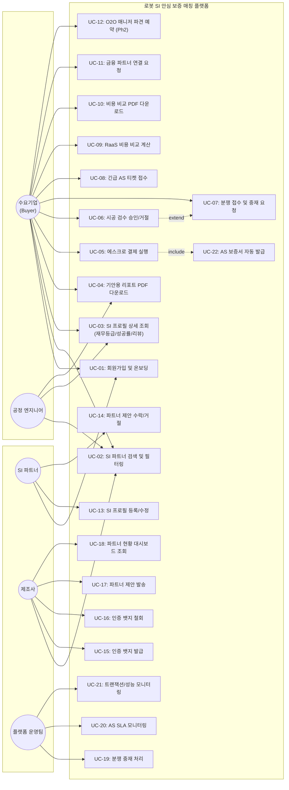
```mermaid
graph LR
    subgraph Actors_Left [" "]
        A_BUYER(("수요기업\n(Buyer)"))
        A_ENGINEER(("공정 엔지니어"))
    end

    subgraph Platform ["로봇 SI 안심 보증 매칭 플랫폼"]
        UC01["UC-01: 회원가입 및 온보딩"]
        UC02["UC-02: SI 파트너 검색 및 필터링"]
        UC03["UC-03: SI 프로필 상세 조회\n(재무등급/성공률/리뷰)"]
        UC04["UC-04: 기안용 리포트 PDF 다운로드"]
        UC05["UC-05: 에스크로 결제 실행"]
        UC06["UC-06: 시공 검수 승인/거절"]
        UC07["UC-07: 분쟁 접수 및 중재 요청"]
        UC08["UC-08: 긴급 AS 티켓 접수"]
        UC09["UC-09: RaaS 비용 비교 계산"]
        UC10["UC-10: 비용 비교 PDF 다운로드"]
        UC11["UC-11: 금융 파트너 연결 요청"]
        UC12["UC-12: O2O 매니저 파견 예약 (Ph2)"]
        UC13["UC-13: SI 프로필 등록/수정"]
        UC14["UC-14: 파트너 제안 수락/거절"]
        UC15["UC-15: 인증 뱃지 발급"]
        UC16["UC-16: 인증 뱃지 철회"]
        UC17["UC-17: 파트너 제안 발송"]
        UC18["UC-18: 파트너 현황 대시보드 조회"]
        UC19["UC-19: 분쟁 중재 처리"]
        UC20["UC-20: AS SLA 모니터링"]
        UC21["UC-21: 트랜잭션/성능 모니터링"]
        UC22["UC-22: AS 보증서 자동 발급"]
    end

    subgraph Actors_Right [" "]
        A_SI(("SI 파트너"))
        A_MFR(("제조사"))
        A_OPS(("플랫폼 운영팀"))
    end

    A_BUYER --> UC01 & UC02 & UC03 & UC04 & UC05 & UC06 & UC07 & UC08 & UC09 & UC10 & UC11 & UC12
    A_ENGINEER --> UC02 & UC03 & UC04

    A_SI --> UC01 & UC13 & UC14
    A_MFR --> UC02 & UC15 & UC16 & UC17 & UC18
    A_OPS --> UC19 & UC20 & UC21

    UC05 -.->|include| UC22
    UC06 -.->|extend| UC07
```

**Use Case - Actor 매핑표**

| Use Case ID | Use Case 명 | 수요기업 | 공정엔지니어 | SI 파트너 | 제조사 | 운영팀 | 관련 REQ |
|:---:|:---|:---:|:---:|:---:|:---:|:---:|:---|
| UC-01 | 회원가입 및 온보딩 | ● | | ● | | | REQ-FUNC-027, 028 |
| UC-02 | SI 파트너 검색 및 필터링 | ● | ● | | ● | | REQ-FUNC-029, 015 |
| UC-03 | SI 프로필 상세 조회 | ● | ● | | | | REQ-FUNC-009 |
| UC-04 | 기안용 리포트 PDF 다운로드 | ● | ● | | | | REQ-FUNC-010 |
| UC-05 | 에스크로 결제 실행 | ● | | | | | REQ-FUNC-001, 004 |
| UC-06 | 시공 검수 승인/거절 | ● | | | | | REQ-FUNC-002, 005 |
| UC-07 | 분쟁 접수 및 중재 요청 | ● | | | | ● | REQ-FUNC-003 |
| UC-08 | 긴급 AS 티켓 접수 | ● | | | | | REQ-FUNC-007 |
| UC-09 | RaaS 비용 비교 계산 | ● | | | | | REQ-FUNC-018, 021 |
| UC-10 | 비용 비교 PDF 다운로드 | ● | | | | | REQ-FUNC-019 |
| UC-11 | 금융 파트너 연결 요청 | ● | | | | | REQ-FUNC-020, 022 |
| UC-12 | O2O 매니저 파견 예약 (Ph2) | ● | | | | | REQ-FUNC-023~026 |
| UC-13 | SI 프로필 등록/수정 | | | ● | | | REQ-FUNC-028 |
| UC-14 | 파트너 제안 수락/거절 | | | ● | | | REQ-FUNC-030 |
| UC-15 | 인증 뱃지 발급 | | | | ● | | REQ-FUNC-013, 017 |
| UC-16 | 인증 뱃지 철회 | | | | ● | | REQ-FUNC-014 |
| UC-17 | 파트너 제안 발송 | | | | ● | | REQ-FUNC-030, 032 |
| UC-18 | 파트너 현황 대시보드 조회 | | | | ● | | REQ-FUNC-031 |
| UC-19 | 분쟁 중재 처리 | | | | | ● | REQ-FUNC-003, 005 |
| UC-20 | AS SLA 모니터링 | | | | | ● | REQ-FUNC-008, 034 |
| UC-21 | 트랜잭션/성능 모니터링 | | | | | ● | REQ-FUNC-033~036 |
| UC-22 | AS 보증서 자동 발급 | | | | | | REQ-FUNC-006 |

### 3.3 API Overview

| API ID | API 명 | 방향 | 입력 (Input) | 출력 (Output) | 제약 |
|:---:|:---|:---:|:---|:---|:---|
| API-01 | PG 에스크로 결제 | 외부 (Outbound) | 계약 ID, 금액, 결제 수단 | 에스크로 TX ID, 상태 | PCI-DSS, 타임아웃 10초 |
| API-02 | PG 에스크로 자금 방출 | 외부 (Outbound) | 에스크로 TX ID, 검수 승인 정보 | 방출 상태, 완료 시각 | 검수 승인 후 24시간 내 |
| API-03 | NICE 기업 신용정보 조회 | 외부 (Outbound) | 사업자등록번호 | 재무 등급, 신용 점수 | 일일 한도 500건, 건당 과금 |
| API-04 | 카카오 알림톡 발송 | 외부 (Outbound) | 수신 번호, 템플릿 ID, 변수 | 발송 결과 | 건당 10원, 초당 100건 |
| API-05 | SMS 발송 | 외부 (Outbound) | 수신 번호, 메시지 내용 | 발송 결과 | 건당 20원 이하 |
| API-06 | 금융 파트너 RaaS 견적 | 외부 (Outbound) | 로봇 모델, 수량, 기간 | 보증금, 월납입금, 금리 정보 | 응답 5초 이내, 장애 시 대안 경로 |
| API-07 | SI 검색 및 필터 | 내부 | 지역, 브랜드, 역량 태그 | SI 목록 (정렬·페이지네이션) | p95 ≤ 1초 |
| API-08 | RaaS 비용 계산 엔진 | 내부 | 로봇 모델, 수량, 계약 기간 | 3옵션 비교 JSON (일시불·리스·RaaS) | 금융 파트너 API 의존 |
| API-09 | 기안 리포트 PDF 생성 | 내부 | SI 파트너 ID | PDF 바이너리 (재무·기술·인증·리뷰 4섹션) | p95 ≤ 5초 |
| API-10 | 뱃지 발급/관리 | 내부 | 제조사 ID, SI 파트너 ID, 만료일 | 뱃지 상태 | 반영 ≤ 1시간 |
| API-11 | AS 티켓 접수/배정 | 내부 | 계약 ID, 긴급도, 증상 설명 | 티켓 ID, 배정 AS 엔지니어 | 배정 ≤ 4시간 |
| API-12 | 보증서 발급 | 내부 | 에스크로 TX ID, 계약 ID | 보증서 PDF/디지털 문서 | 발급 ≤ 1분 |

### 3.4 Interaction Sequences (핵심 시퀀스 다이어그램)

#### 3.4.1 에스크로 결제 및 자금 방출 흐름

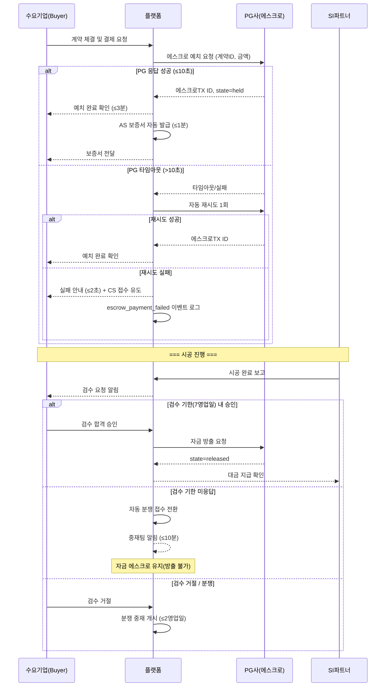
```mermaid
sequenceDiagram
    participant B as 수요기업(Buyer)
    participant P as 플랫폼
    participant PG as PG사(에스크로)
    participant SI as SI파트너

    B->>P: 계약 체결 및 결제 요청
    P->>PG: 에스크로 예치 요청 (계약ID, 금액)
    alt PG 응답 성공 (≤10초)
        PG-->>P: 에스크로TX ID, state=held
        P-->>B: 예치 완료 확인 (≤3분)
        P->>P: AS 보증서 자동 발급 (≤1분)
        P-->>B: 보증서 전달
    else PG 타임아웃 (>10초)
        PG-->>P: 타임아웃/실패
        P->>PG: 자동 재시도 1회
        alt 재시도 성공
            PG-->>P: 에스크로TX ID
            P-->>B: 예치 완료 확인
        else 재시도 실패
            P-->>B: 실패 안내 (≤2초) + CS 접수 유도
            P->>P: escrow_payment_failed 이벤트 로그
        end
    end

    Note over B,SI: === 시공 진행 ===

    SI->>P: 시공 완료 보고
    P-->>B: 검수 요청 알림
    alt 검수 기한(7영업일) 내 승인
        B->>P: 검수 합격 승인
        P->>PG: 자금 방출 요청
        PG-->>P: state=released
        P-->>SI: 대금 지급 확인
    else 검수 기한 미응답
        P->>P: 자동 분쟁 접수 전환
        P-->>P: 중재팀 알림 (≤10분)
        Note over P: 자금 에스크로 유지(방출 불가)
    else 검수 거절 / 분쟁
        B->>P: 검수 거절
        P->>P: 분쟁 중재 개시 (≤2영업일)
    end
```

#### 3.4.2 SI 파트너 검색 및 평판 조회 흐름

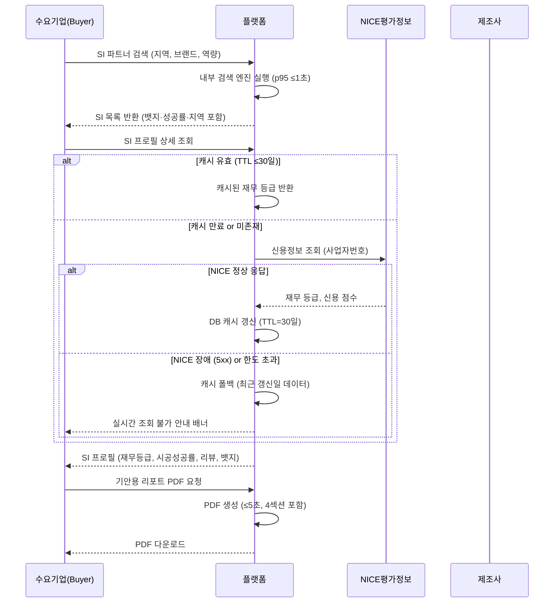
```mermaid
sequenceDiagram
    participant B as 수요기업(Buyer)
    participant P as 플랫폼
    participant NICE as NICE평가정보
    participant MFR as 제조사

    B->>P: SI 파트너 검색 (지역, 브랜드, 역량)
    P->>P: 내부 검색 엔진 실행 (p95 ≤1초)
    P-->>B: SI 목록 반환 (뱃지·성공률·지역 포함)

    B->>P: SI 프로필 상세 조회
    alt 캐시 유효 (TTL ≤30일)
        P->>P: 캐시된 재무 등급 반환
    else 캐시 만료 or 미존재
        P->>NICE: 신용정보 조회 (사업자번호)
        alt NICE 정상 응답
            NICE-->>P: 재무 등급, 신용 점수
            P->>P: DB 캐시 갱신 (TTL=30일)
        else NICE 장애 (5xx) or 한도 초과
            P->>P: 캐시 폴백 (최근 갱신일 데이터)
            P-->>B: 실시간 조회 불가 안내 배너
        end
    end
    P-->>B: SI 프로필 (재무등급, 시공성공률, 리뷰, 뱃지)

    B->>P: 기안용 리포트 PDF 요청
    P->>P: PDF 생성 (≤5초, 4섹션 포함)
    P-->>B: PDF 다운로드
```

#### 3.4.3 긴급 AS 접수 및 출동 흐름

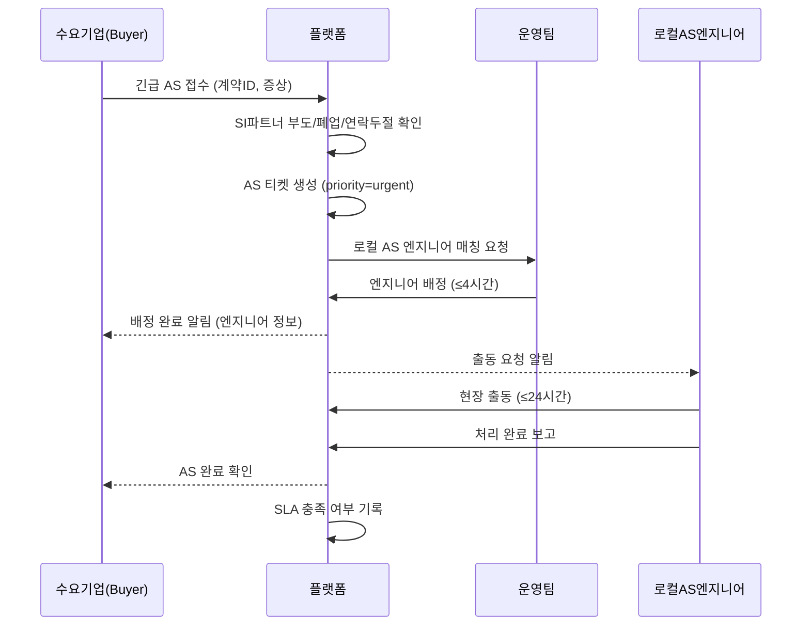
```mermaid
sequenceDiagram
    participant B as 수요기업(Buyer)
    participant P as 플랫폼
    participant OPS as 운영팀
    participant AS as 로컬AS엔지니어

    B->>P: 긴급 AS 접수 (계약ID, 증상)
    P->>P: SI파트너 부도/폐업/연락두절 확인
    P->>P: AS 티켓 생성 (priority=urgent)
    P->>OPS: 로컬 AS 엔지니어 매칭 요청
    OPS->>P: 엔지니어 배정 (≤4시간)
    P-->>B: 배정 완료 알림 (엔지니어 정보)
    P-->>AS: 출동 요청 알림
    AS->>P: 현장 출동 (≤24시간)
    AS->>P: 처리 완료 보고
    P-->>B: AS 완료 확인
    P->>P: SLA 충족 여부 기록
```

#### 3.4.4 제조사 인증 뱃지 발급·관리 흐름

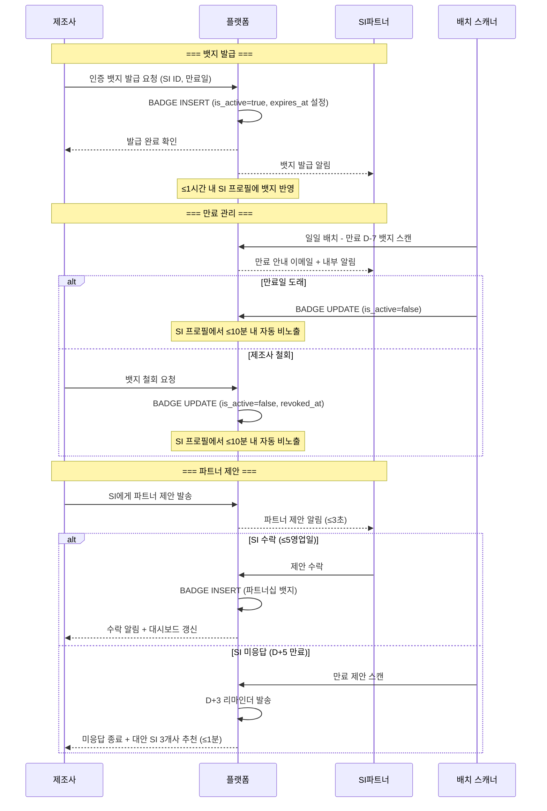
```mermaid
sequenceDiagram
    participant MFR as 제조사
    participant P as 플랫폼
    participant SI as SI파트너
    participant BATCH as 배치 스캐너

    Note over MFR,SI: === 뱃지 발급 ===
    MFR->>P: 인증 뱃지 발급 요청 (SI ID, 만료일)
    P->>P: BADGE INSERT (is_active=true, expires_at 설정)
    P-->>MFR: 발급 완료 확인
    P-->>SI: 뱃지 발급 알림
    Note over P: ≤1시간 내 SI 프로필에 뱃지 반영

    Note over MFR,SI: === 만료 관리 ===
    BATCH->>P: 일일 배치 - 만료 D-7 뱃지 스캔
    P-->>SI: 만료 안내 이메일 + 내부 알림

    alt 만료일 도래
        BATCH->>P: BADGE UPDATE (is_active=false)
        Note over P: SI 프로필에서 ≤10분 내 자동 비노출
    else 제조사 철회
        MFR->>P: 뱃지 철회 요청
        P->>P: BADGE UPDATE (is_active=false, revoked_at)
        Note over P: SI 프로필에서 ≤10분 내 자동 비노출
    end

    Note over MFR,SI: === 파트너 제안 ===
    MFR->>P: SI에게 파트너 제안 발송
    P-->>SI: 파트너 제안 알림 (≤3초)
    alt SI 수락 (≤5영업일)
        SI->>P: 제안 수락
        P->>P: BADGE INSERT (파트너십 뱃지)
        P-->>MFR: 수락 알림 + 대시보드 갱신
    else SI 미응답 (D+5 만료)
        BATCH->>P: 만료 제안 스캔
        P->>P: D+3 리마인더 발송
        P-->>MFR: 미응답 종료 + 대안 SI 3개사 추천 (≤1분)
    end
```

#### 3.4.5 OPEX 비용 비교 계산기 이용 흐름

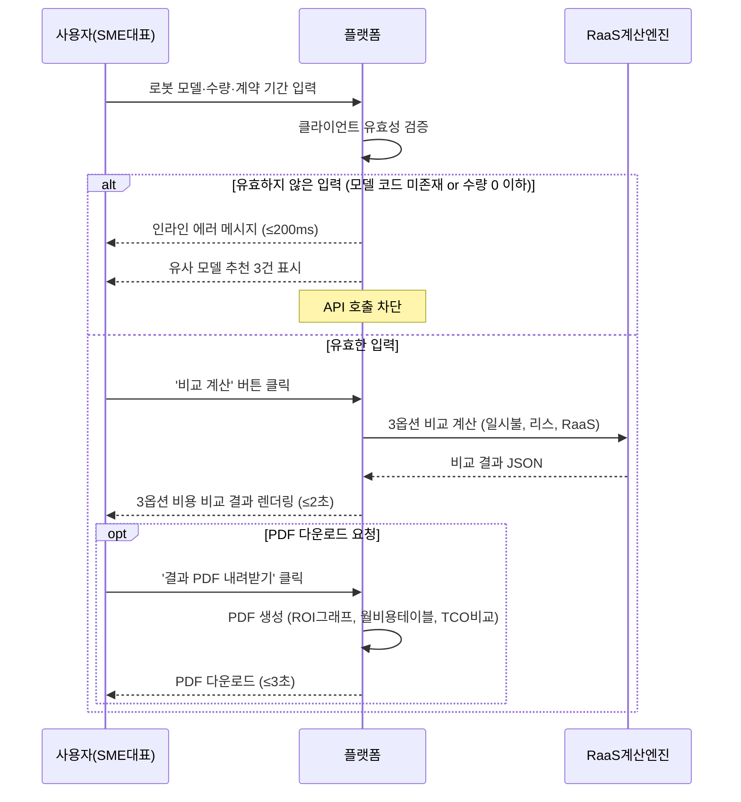
```mermaid
sequenceDiagram
    participant U as 사용자(SME대표)
    participant P as 플랫폼
    participant CALC as RaaS계산엔진

    U->>P: 로봇 모델·수량·계약 기간 입력
    P->>P: 클라이언트 유효성 검증

    alt 유효하지 않은 입력 (모델 코드 미존재 or 수량 0 이하)
        P-->>U: 인라인 에러 메시지 (≤200ms)
        P-->>U: 유사 모델 추천 3건 표시
        Note over P: API 호출 차단
    else 유효한 입력
        U->>P: '비교 계산' 버튼 클릭
        P->>CALC: 3옵션 비교 계산 (일시불, 리스, RaaS)
        CALC-->>P: 비교 결과 JSON
        P-->>U: 3옵션 비용 비교 결과 렌더링 (≤2초)

        opt PDF 다운로드 요청
            U->>P: '결과 PDF 내려받기' 클릭
            P->>P: PDF 생성 (ROI그래프, 월비용테이블, TCO비교)
            P-->>U: PDF 다운로드 (≤3초)
        end
    end
```

#### 3.4.6 RaaS 구독 금융 연결 흐름

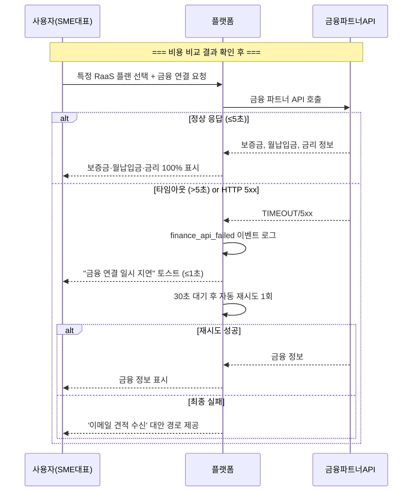
```mermaid
sequenceDiagram
    participant U as 사용자(SME대표)
    participant P as 플랫폼
    participant FIN as 금융파트너API

    Note over U,FIN: === 비용 비교 결과 확인 후 ===
    U->>P: 특정 RaaS 플랜 선택 + 금융 연결 요청
    P->>FIN: 금융 파트너 API 호출

    alt 정상 응답 (≤5초)
        FIN-->>P: 보증금, 월납입금, 금리 정보
        P-->>U: 보증금·월납입금·금리 100% 표시
    else 타임아웃 (>5초) or HTTP 5xx
        FIN-->>P: TIMEOUT/5xx
        P->>P: finance_api_failed 이벤트 로그
        P-->>U: "금융 연결 일시 지연" 토스트 (≤1초)
        P->>P: 30초 대기 후 자동 재시도 1회
        alt 재시도 성공
            FIN-->>P: 금융 정보
            P-->>U: 금융 정보 표시
        else 최종 실패
            P-->>U: '이메일 견적 수신' 대안 경로 제공
        end
    end
```

---

## 4. Specific Requirements

### 4.1 Functional Requirements

#### 4.1.1 F-01: 안심 에스크로 결제 시스템

| Req ID | 요구사항 | Source | Priority | Acceptance Criteria |
|:---:|:---|:---:|:---:|:---|
| REQ-FUNC-001 | 시스템은 수요 기업의 계약금 결제 요청을 PG사 에스크로 API로 전달하여 자금을 예치해야 한다 | Story 1, F-01 | Must | **Given** 수요 기업이 SI 파트너와 계약을 체결함 **When** 계약금 결제를 요청함 **Then** 에스크로 예치가 완료되고 결제 확인이 표시됨. 예치 완료 소요 시간 ≤ 3분, 결제 실패율 < 0.5% |
| REQ-FUNC-002 | 시스템은 검수 합격 승인 시 PG사 에스크로 API를 호출하여 SI 파트너에게 자금을 방출해야 한다 | Story 1, F-01 | Must | **Given** 시공이 완료되고 검수 프로세스가 시작됨 **When** 수요 기업이 검수 합격을 승인함 **Then** 자금 방출이 요청되고 SI 파트너 계좌로 이체됨. 자금 방출 소요 ≤ 24시간 |
| REQ-FUNC-003 | 시스템은 분쟁 발생 시 플랫폼 중재 프로세스를 자동 개시해야 한다 | Story 1, F-01 | Must | **Given** 수요 기업이 검수를 거절하거나 분쟁을 신청함 **When** 분쟁 접수가 등록됨 **Then** 플랫폼 중재팀에 알림이 전송되고 중재가 개시됨. 중재 개시 소요 ≤ 2영업일 |
| REQ-FUNC-004 | 시스템은 PG 응답 타임아웃(>10초) 발생 시 자동 재시도를 1회 실행하고, 최종 실패 시 실패 안내 및 CS 접수 유도를 표시해야 한다 | Story 1 (AC-1.5), F-01 | Must | **Given** 수요 기업이 에스크로 결제를 시도하나 PG 응답이 타임아웃(>10초) 발생 **When** 결제 요청이 실패함 **Then** 실패 사유 안내 ≤ 2초 표시, 자동 재시도 1회 실행. 재시도 실패 시 CS 접수 유도 팝업 표시. `escrow_payment_failed` 이벤트 로그 적재 |
| REQ-FUNC-005 | 시스템은 검수 기한(7영업일) 내 수요 기업의 승인/거절 미응답 시 자동으로 '분쟁 접수' 상태로 전환해야 한다 | Story 1 (AC-1.6), F-01 | Must | **Given** 시공 완료 후 수요 기업이 검수 기한(7영업일) 내 승인/거절 미응답 **When** 검수 기한이 만료됨 **Then** 계약 상태가 '검수 대기 → 분쟁 접수'로 자동 전환, 중재팀 알림 ≤ 10분 이내 발송, 자금 에스크로 유지(방출 불가) |

#### 4.1.2 F-02: 제조사 인증 로컬 AS망 연동 및 보증서 발급

| Req ID | 요구사항 | Source | Priority | Acceptance Criteria |
|:---:|:---|:---:|:---:|:---|
| REQ-FUNC-006 | 시스템은 에스크로 결제 완료 시 AS 보증서를 자동 발급해야 한다 | Story 1 (AC-1.4), F-02 | Must | **Given** 에스크로 결제가 완료됨 **When** AS 보증서 자동 발급이 트리거됨 **Then** 보증서가 1분 이내 발급되며, 지정 로컬 AS 업체명·연락처·보증 범위가 100% 명시됨 |
| REQ-FUNC-007 | 시스템은 SI 파트너의 부도·폐업·연락두절 확인 시 로컬 AS 엔지니어를 자동 매칭하여 배정해야 한다 | Story 1 (AC-1.3), F-02 | Must | **Given** SI 파트너가 부도·폐업·연락두절 상태로 확인됨 **When** 수요 기업이 긴급 AS를 접수함 **Then** 로컬 AS 엔지니어가 4시간 이내 배정되고, 현장 출동이 24시간 이내 이루어짐. 성공률 ≥ 95% |
| REQ-FUNC-008 | 시스템은 AS 티켓의 접수·배정·출동·완료 전 과정을 추적하고 SLA 충족 여부를 자동 기록해야 한다 | F-02 | Must | **Given** AS 티켓이 생성됨 **When** 각 단계(접수→배정→출동→완료)가 진행됨 **Then** 각 단계별 timestamp가 기록되고, `resolved_at - reported_at ≤ 24h` 기준으로 SLA 충족 여부가 자동 판정됨 |

#### 4.1.3 F-03: SI 파트너 재무/시공 투명 평판 뷰어

| Req ID | 요구사항 | Source | Priority | Acceptance Criteria |
|:---:|:---|:---:|:---:|:---|
| REQ-FUNC-009 | 시스템은 SI 파트너 프로필 페이지에서 재무 등급·시공 성공률·고객 리뷰 점수를 통합 표시해야 한다 | Story 2 (AC-2.1), F-03 | Must | **Given** 수요 기업이 SI 파트너 프로필 페이지에 접근함 **When** 페이지를 로드함 **Then** 재무 등급·시공 성공률·리뷰 점수가 로딩됨. 로딩 시간 ≤ 2초 (p95), 데이터 갱신 주기 ≤ 30일 |
| REQ-FUNC-010 | 시스템은 '기안용 리포트' PDF를 재무·기술·인증·리뷰 4개 섹션을 포함하여 자동 생성해야 한다 | Story 2 (AC-2.2), F-03 | Must | **Given** 수요 기업이 '기안용 리포트' 다운로드를 요청함 **When** PDF 리포트가 생성됨 **Then** 생성 소요 ≤ 5초, 리포트에 재무·기술·인증·리뷰 4개 섹션이 100% 포함됨 |
| REQ-FUNC-011 | 시스템은 NICE 평가정보 API 장애 또는 일일 한도 초과 시 캐시 데이터로 폴백하고, 사용자에게 '실시간 조회 불가' 안내 배너를 표시해야 한다 | Story 2 (AC-2.5), F-03 | Must | **Given** NICE 평가정보 API가 일시 장애(5xx) 또는 일일 한도(500건) 초과 **When** 재무 등급 조회를 시도함 **Then** '최근 갱신일 기준 캐시 데이터'를 표시하고, "실시간 조회 불가" 안내 배너를 노출. 캐시 TTL ≤ 30일, 장애 해소 시 자동 갱신 |
| REQ-FUNC-012 | 시스템은 NICE 신용조회 API 잔여 한도가 50건 미만일 때 Ops 알림을 발송하고, 한도 소진 시 캐시 모드로 자동 전환해야 한다 | F-03 | Must | **Given** NICE 신용조회 API의 일일 잔여 조회 한도가 50건 미만 **When** 잔여 한도 임계치 도달 **Then** Ops팀에 알림 발송. 한도가 0건(소진)이 되면 캐시 모드 자동 전환 및 Eng팀 알림 발송 |

#### 4.1.4 F-04: 제조사 인증 뱃지 시스템

| Req ID | 요구사항 | Source | Priority | Acceptance Criteria |
|:---:|:---|:---:|:---:|:---|
| REQ-FUNC-013 | 시스템은 로봇 제조사가 SI 파트너에게 인증 뱃지를 발급할 수 있는 기능을 제공해야 한다 | Story 2 (AC-2.3), Story 5, F-04 | Must | **Given** 제조사가 SI 업체에 인증 뱃지를 발급함 **When** SI 프로필에 뱃지가 노출됨 **Then** 뱃지 반영 지연 ≤ 1시간 |
| REQ-FUNC-014 | 시스템은 뱃지 만료 또는 철회 시 SI 프로필에서 자동으로 비노출 처리해야 한다 | Story 2 (AC-2.3), F-04 | Must | **Given** 뱃지의 만료일이 도래하거나 제조사가 뱃지를 철회함 **When** 만료/철회 이벤트가 발생함 **Then** SI 프로필에서 해당 뱃지가 10분 이내 자동 비노출 처리됨 |
| REQ-FUNC-015 | 시스템은 뱃지 보유 SI 필터를 제공하고, 필터링 시 미인증 SI가 혼입되지 않아야 한다 | Story 2 (AC-2.4), F-04 | Must | **Given** 검색 결과에서 뱃지 보유 SI 필터를 적용함 **When** 필터링된 목록이 표시됨 **Then** 필터 적용 응답 ≤ 1초 (p95), 미인증 SI 혼입률 = 0% |
| REQ-FUNC-016 | 시스템은 뱃지 만료 D-7일에 해당 SI에게 이메일 및 내부 알림을 자동 발송해야 한다 | F-04 | Must | **Given** 뱃지 만료일이 7일 이내로 도래함 **When** 일일 배치 스캔이 실행됨 **Then** 해당 SI에게 만료 안내 이메일 및 내부 알림이 발송됨 |
| REQ-FUNC-017 | 시스템은 3개 이상의 로봇 제조사 브랜드를 지원하는 Brand-Agnostic 뱃지 구조를 제공해야 한다 | F-04 | Must | **Given** 서로 다른 제조사(≥3사)가 각각 뱃지를 발급하려 함 **When** 뱃지 발급 요청이 접수됨 **Then** 제조사별 독립 뱃지가 발급되며, 하나의 SI에 다수 제조사 뱃지가 동시 표시 가능 |

#### 4.1.5 F-05: RaaS 구독 및 OPEX 비용 비교 계산기

| Req ID | 요구사항 | Source | Priority | Acceptance Criteria |
|:---:|:---|:---:|:---:|:---|
| REQ-FUNC-018 | 시스템은 로봇 모델·수량·계약 기간 입력 시 일시불·리스·RaaS 3가지 비용 옵션을 자동 계산하여 비교 결과를 표시해야 한다 | Story 4 (AC-4.1), F-05 | Should | **Given** 사용자가 로봇 모델·수량·계약 기간을 입력함 **When** '비교 계산' 버튼을 누름 **Then** 3가지 옵션(일시불·리스·RaaS) 결과가 렌더링됨. 렌더링 소요 ≤ 2초 |
| REQ-FUNC-019 | 시스템은 비용 비교 결과를 ROI 그래프·월비용 테이블·TCO 비교를 포함한 PDF로 생성해야 한다 | Story 4 (AC-4.2), F-05 | Should | **Given** 계산 결과가 표시됨 **When** '결과 PDF 내려받기'를 요청함 **Then** PDF가 3초 이내 생성되며, ROI 그래프·월비용 테이블·TCO 비교가 포함됨 |
| REQ-FUNC-020 | 시스템은 특정 RaaS 플랜 선택 시 금융 파트너 API를 호출하여 보증금·월납입금·금리 정보를 표시해야 한다 | Story 4 (AC-4.3), F-05 | Should | **Given** 사용자가 특정 RaaS 플랜을 선택함 **When** 금융 파트너 연결을 요청함 **Then** 금융 파트너 API 응답 ≤ 5초, 보증금·월납입금·금리 정보가 100% 표시됨 |
| REQ-FUNC-021 | 시스템은 존재하지 않는 로봇 모델 코드 또는 음수/0 수량 입력 시 인라인 유효성 에러를 표시하고 API 호출을 차단해야 한다 | Story 4 (AC-4.4), F-05 | Should | **Given** 사용자가 존재하지 않는 로봇 모델 코드 또는 수량에 음수/0을 입력함 **When** 계산 요청이 발생함 **Then** 인라인 유효성 에러 메시지가 200ms 이내 표시, API 호출 차단. 잘못된 모델 코드 시 유사 모델 추천 3건 자동 표시 |
| REQ-FUNC-022 | 시스템은 금융 파트너 API 타임아웃(>5초) 또는 HTTP 5xx 응답 시 '금융 연결 일시 지연' 토스트를 표시하고, 30초 후 자동 재시도 1회를 실행해야 한다 | Story 4 (AC-4.5), F-05 | Should | **Given** 금융 파트너 API가 타임아웃(>5초) 또는 HTTP 5xx 응답 **When** RaaS 플랜 금융 연결이 실패함 **Then** "금융 연결 일시 지연" 토스트 ≤ 1초 표시, 30초 후 자동 재시도 1회. 최종 실패 시 "이메일 견적 수신" 대안 경로 제공 |

#### 4.1.6 F-06: 현장 O2O 매니저 파견 예약 캘린더 (Phase 2)

| Req ID | 요구사항 | Source | Priority | Acceptance Criteria |
|:---:|:---|:---:|:---:|:---|
| REQ-FUNC-023 | 시스템은 희망 지역·날짜 선택 시 가용 매니저 슬롯을 조회하여 표시해야 한다 | Story 3 (AC-3.1), F-06 | Should | **Given** 수요 기업이 O2O 파견 예약 화면에 접근함 **When** 희망 지역·날짜를 선택함 **Then** 가능한 매니저 슬롯 조회 ≤ 2초, 3일 내 가용 슬롯 ≥ 2개 (수도권 기준) |
| REQ-FUNC-024 | 시스템은 예약 확정 시 SMS + 카카오톡으로 이중 알림을 발송해야 한다 | Story 3 (AC-3.2), F-06 | Should | **Given** 예약이 확정됨 **When** 예약 확인 알림이 발송됨 **Then** SMS + 카카오톡 이중 발송 ≤ 30초, 발송 실패율 < 1% |
| REQ-FUNC-025 | 시스템은 매니저 방문 완료 후 방문 보고서를 등록하고 관리해야 한다 | Story 3 (AC-3.3), F-06 | Should | **Given** 매니저가 현장 방문을 완료함 **When** 방문 보고서가 등록됨 **Then** 보고서 등록 ≤ 24시간, 보고서에 상담 요약·추천 SI 3개사·예상 견적 범위가 포함됨 |
| REQ-FUNC-026 | 시스템은 가용 매니저 슬롯이 0건일 때 가장 가까운 가용 일정을 자동 추천하고, 대기 예약 옵션을 제공해야 한다 | Story 3 (AC-3.4), F-06 | Should | **Given** 희망 지역·날짜에 가용 매니저 슬롯이 0건 **When** 조회 결과가 비어 있음 **Then** "가장 가까운 가용 일정(D+N)" 자동 추천 ≤ 2초, 대기 예약 옵션 제공. 지역 매니저 부족 시 Ops Slack 즉시 알림 |

#### 4.1.7 수요 기업·SI 파트너 온보딩 및 검색

| Req ID | 요구사항 | Source | Priority | Acceptance Criteria |
|:---:|:---|:---:|:---:|:---|
| REQ-FUNC-027 | 시스템은 수요 기업의 회원가입 및 온보딩 프로세스를 제공해야 한다 | F-03, F-04 (KPI: 신규 수요 기업 가입 수) | Must | **Given** 신규 수요 기업 담당자가 가입 페이지에 접근함 **When** 필수 정보(회사명, 사업자등록번호, 지역, 담당자 정보)를 입력하고 가입을 완료함 **Then** `signup_complete` 이벤트가 Amplitude에 기록되고, 대시보드에서 집계됨 |
| REQ-FUNC-028 | 시스템은 SI 파트너의 회원가입 및 프로필 등록 프로세스를 제공해야 한다 | F-03, F-04 | Must | **Given** SI 파트너가 가입 페이지에 접근함 **When** 회사 정보·시공 이력·역량 태그를 등록함 **Then** SI 프로필이 생성되고, Admin 검토 대기 상태로 전환됨 |
| REQ-FUNC-029 | 시스템은 지역·브랜드·역량 태그 기반의 SI 파트너 검색 및 필터링 기능을 제공해야 한다 | Story 5 (AC-5.1), F-03, F-04 | Must | **Given** 제조사 또는 수요 기업이 브랜드·지역·역량 필터를 설정함 **When** 검색을 실행함 **Then** 결과 반환 ≤ 1초 (p95), 결과에 뱃지 보유 여부·성공률·지역이 명시됨 |

#### 4.1.8 제조사-SI 파트너십 관리

| Req ID | 요구사항 | Source | Priority | Acceptance Criteria |
|:---:|:---|:---:|:---:|:---|
| REQ-FUNC-030 | 시스템은 제조사가 특정 SI에게 '파트너 제안'을 발송하고, SI의 수락/거절을 관리해야 한다 | Story 5 (AC-5.2), F-04 | Must | **Given** 제조사가 특정 SI에게 '파트너 제안'을 발송함 **When** SI가 수락/거절함 **Then** 제안 발송 ≤ 3초, SI 응답 기한 ≤ 5영업일, 미응답 시 자동 리마인더 |
| REQ-FUNC-031 | 시스템은 파트너십 체결 시 '공식 인증 파트너' 뱃지를 자동 노출하고, 제조사 대시보드에 파트너 현황을 실시간 표시해야 한다 | Story 5 (AC-5.3), F-04 | Must | **Given** 파트너십이 체결됨 **When** 플랫폼에 '공식 인증 파트너' 뱃지가 노출됨 **Then** 뱃지 반영 ≤ 1시간, 제조사 대시보드에 파트너 현황 실시간 표시 |
| REQ-FUNC-032 | 시스템은 SI의 파트너 제안 미응답(5영업일) 시 D+3 자동 리마인더 1회 발송 후, D+5 만료 처리 및 대안 SI 3개사를 자동 추천해야 한다 | Story 5 (AC-5.4), F-04 | Must | **Given** SI가 파트너 제안에 5영업일 내 미응답 **When** 응답 기한이 만료됨 **Then** D+3 자동 리마인더 1회 발송, D+5 만료 시 제조사에게 "미응답 종료" 알림 + 대안 SI 3개사 자동 추천 ≤ 1분 |

#### 4.1.9 모니터링 및 알림

| Req ID | 요구사항 | Source | Priority | Acceptance Criteria |
|:---:|:---|:---:|:---:|:---|
| REQ-FUNC-033 | 시스템은 에스크로 결제 실패율이 연속 5분간 0.5% 초과 시 PagerDuty 알림을 자동 발송해야 한다 | NFR 5.5 | Must | **Given** 에스크로 결제 실시간 트랜잭션이 모니터링 중임 **When** 실패율 > 0.5%가 연속 5분 지속 **Then** PagerDuty 알림이 자동 발송됨 |
| REQ-FUNC-034 | 시스템은 AS 티켓이 24시간 미배정 시 Slack 즉시 알림을 발송해야 한다 | NFR 5.5 | Must | **Given** AS 티켓이 접수되어 배정 대기 중임 **When** 접수 후 24시간이 경과하여도 미배정 상태 **Then** Ops Slack 채널에 즉시 알림 발송 |
| REQ-FUNC-035 | 시스템은 RaaS 계산 엔진 API의 p95 응답 시간이 연속 10분간 3초 초과하거나, 금융 API 실패율이 5% 초과 시 Eng 및 Biz팀에 동시 알림을 발송해야 한다 | NFR 5.5 | Must | **Given** RaaS 계산 엔진 API가 운영 중임 **When** p95 응답 > 3초 연속 10분 또는 금융 API 실패율 > 5% **Then** Eng + Biz 동시 알림 발송 |
| REQ-FUNC-036 | 시스템은 페이지 성능(LCP)의 p95가 연속 1시간 동안 3초를 초과할 때 Eng 알림을 발송해야 한다 | NFR 5.5 | Must | **Given** Datadog RUM / Core Web Vitals 모니터링이 활성 상태임 **When** LCP > 3초 p95가 연속 1시간 지속 **Then** Eng팀 알림 발송 |

---

### 4.2 Non-Functional Requirements

#### 4.2.1 성능 (Performance)

| Req ID | 요구사항 | 측정 기준 | Source |
|:---:|:---|:---|:---|
| REQ-NF-001 | 시스템의 페이지 로딩 시간(LCP)은 p95 기준 2,000ms 이하여야 한다 | Datadog RUM Core Web Vitals 측정, p95 ≤ 2,000ms | PRD 5.1 |
| REQ-NF-002 | 시스템의 API 응답 시간(검색·필터)은 p95 기준 1,000ms 이하여야 한다 | API Gateway 응답 로그 기준, p95 ≤ 1,000ms | PRD 5.1 |
| REQ-NF-003 | 에스크로 결제 API(PG 연동) 응답 시간은 p95 기준 3,000ms 이하, 타임아웃은 10초 이하여야 한다 | PG API 호출 로그 기준, p95 ≤ 3,000ms, timeout ≤ 10s | PRD 5.1 |
| REQ-NF-004 | PDF 리포트 생성 소요 시간은 p95 기준 5,000ms 이하여야 한다 | 서버 사이드 PDF 생성 로그, p95 ≤ 5,000ms | PRD 5.1 |
| REQ-NF-005 | 시스템은 500 CCU (동시 접속 사용자) 이상을 지원해야 한다 | 부하 테스트 (k6 또는 Locust), 500 CCU × 30분 지속, p95 ≤ 임계치, 에러율 < 1%, CPU 평균 ≤ 70% | PRD 5.1 |
| REQ-NF-006 | 부하 테스트는 MVP D-14 Staging 환경에서 k6 또는 Locust를 사용하여 500 CCU × 30분 지속 부하 조건으로 수행해야 한다 | 통과 기준: p95 ≤ 위 임계치, 에러율 < 1%, CPU 평균 ≤ 70% | PRD 5.1 |

#### 4.2.2 신뢰성·가용성 (Reliability & Availability)

| Req ID | 요구사항 | 측정 기준 | Source |
|:---:|:---|:---|:---|
| REQ-NF-007 | 시스템의 월간 가용성(Uptime)은 99.5% 이상이어야 한다 (월 다운타임 ≤ 3.6시간) | 업타임 모니터링 도구 측정, 월간 가용성 ≥ 99.5% | PRD 5.2 |
| REQ-NF-008 | 에스크로 결제 오류율은 0.1% 미만이어야 한다 | `ESCROW_TX` 오류 건수 / 전체 건수, 오류율 < 0.1% | PRD 5.2 |
| REQ-NF-009 | 데이터 백업 RPO(복구 시점 목표)는 1시간 이하여야 한다 | 백업 시스템 해당 주기 검증, RPO ≤ 1시간 | PRD 5.2 |
| REQ-NF-010 | RTO(장애 복구 시간)는 4시간 이하여야 한다 | 장애 복구 훈련 시 측정, RTO ≤ 4시간 | PRD 5.2 |
| REQ-NF-011 | 거래·결제 데이터는 5년간 보존해야 한다 (전자금융거래법 준수) | 데이터 보존 정책 감사, 보존 기간 ≥ 5년 | PRD 5.2 |
| REQ-NF-012 | 개인정보는 탈퇴 후 30일 보존 후 파기해야 한다 | 탈퇴 후 30일 경과 시 파기 확인, 파기 로그 존재 | PRD 5.2 |
| REQ-NF-013 | 로그 데이터는 90일 Hot Storage, 이후 1년 Cold Storage로 보존해야 한다 | 로그 보존 정책 감사 | PRD 5.2 |

#### 4.2.3 보안 (Security)

| Req ID | 요구사항 | 측정 기준 | Source |
|:---:|:---|:---|:---|
| REQ-NF-014 | 결제 데이터 처리는 PCI-DSS Level 1을 준수해야 한다 (PG사 위임) | PG사 PCI-DSS 인증서 확인 | PRD 5.3 |
| REQ-NF-015 | 개인정보 처리는 개인정보보호법을 준수하고, ISMS-P 인증을 MVP+12개월 내 취득해야 한다 | ISMS-P 인증 취득 여부, 취득 시한 MVP+12개월 | PRD 5.3 |
| REQ-NF-016 | 사용자 인증은 OAuth 2.0을 적용하고, B2B 관리자 계정에 MFA(다중 인증)를 필수 적용해야 한다 | 인증 흐름 검증, B2B 관리자 계정 MFA 활성화율 100% | PRD 5.3 |
| REQ-NF-017 | 모든 데이터 전송은 TLS 1.3을 강제 적용해야 한다 | SSL Labs 등급 A+ 또는 동등 검증 | PRD 5.3 |

#### 4.2.4 비용 (Cost)

| Req ID | 요구사항 | 측정 기준 | Source |
|:---:|:---|:---|:---|
| REQ-NF-018 | MVP 인프라 비용은 월 500만 원 이하를 유지해야 한다 | 월간 클라우드 청구서 기준, ≤ 월 500만 원 | PRD 5.4 |
| REQ-NF-019 | PG 수수료는 에스크로 전용 요율 기준 3.5% 이하여야 한다 | PG사 계약 요율 확인, ≤ 3.5% | PRD 5.4 |
| REQ-NF-020 | SMS/카카오 알림톡 발송 비용은 건당 20원 이하여야 한다 | 발송 비용 정산 기준, ≤ 건당 20원 | PRD 5.4 |

#### 4.2.5 확장성 (Scalability)

| Req ID | 요구사항 | 측정 기준 | Source |
|:---:|:---|:---|:---|
| REQ-NF-021 | 시스템은 뱃지 인증 SI 파트너 120개사, 수요 기업 300개사 규모까지 수평 확장이 가능해야 한다 | MVP+6개월 목표 사용자 규모에서 성능 임계치 준수 여부 | PRD 1.3 KPI |

#### 4.2.6 유지보수성 (Maintainability)

| Req ID | 요구사항 | 측정 기준 | Source |
|:---:|:---|:---|:---|
| REQ-NF-022 | 시스템은 Brand-Agnostic 호환성 DB 구조를 채택하여, 신규 제조사 브랜드 추가 시 DB 스키마 변경 없이 데이터 레벨에서 확장 가능해야 한다 | 신규 제조사 추가 시 스키마 마이그레이션 불필요 확인 | ADR-003 |

#### 4.2.7 KPI 기반 비기능 요구사항

| Req ID | 요구사항 | 목표값 | 측정 경로 | Source |
|:---:|:---|:---|:---|:---|
| REQ-NF-023 | 월간 에스크로 거래 완결 수 (북극성 KPI) | MVP+6개월: **30건** | `ESCROW_TX` 테이블 `state=released` 집계 → Metabase 대시보드 | PRD 1.3 |
| REQ-NF-024 | 24시간 내 AS 출동 성공률 | MVP+6개월: **≥ 95%** | `AS_TICKET` WHERE `resolved_at - reported_at ≤ 24h` 비율 → Ops 대시보드 | PRD 1.3, G-01 |
| REQ-NF-025 | 경영진 기안 첫 보고 통과율 | MVP+3개월: **≥ 80%** | 사후 설문 / 코호트 분석 (EXP-02) | PRD 1.3, G-02 |
| REQ-NF-026 | O2O 파견 후 견적 요청 전환율 | Phase 2: **≥ 40%** | 퍼널 분석 | PRD 1.3, G-03 |
| REQ-NF-027 | RaaS 계산기 사용 후 계약 전환율 | MVP+6개월: **≥ 25%** | 퍼널 분석 (EXP-04) | PRD 1.3, G-04 |
| REQ-NF-028 | NPS (수요 기업) | MVP+6개월: **≥ 50** | 인앱 NPS 설문 → 분기 리포트 | PRD 1.3 |

---

## 5. Traceability Matrix

### 5.1 Story ↔ Requirement ID ↔ Test Case ID

| Story | Story 제목 | Requirement ID(s) | Test Case ID(s) |
|:---:|:---|:---|:---|
| Story 1 | 안심 에스크로 결제 & AS 보증 | REQ-FUNC-001, REQ-FUNC-002, REQ-FUNC-003, REQ-FUNC-004, REQ-FUNC-005, REQ-FUNC-006, REQ-FUNC-007, REQ-FUNC-008 | TC-001 ~ TC-008 |
| Story 2 | SI 파트너 투명 평판 뷰어 & 제조사 인증 뱃지 | REQ-FUNC-009, REQ-FUNC-010, REQ-FUNC-011, REQ-FUNC-012, REQ-FUNC-013, REQ-FUNC-014, REQ-FUNC-015, REQ-FUNC-016, REQ-FUNC-017 | TC-009 ~ TC-017 |
| Story 3 | 현장 O2O 매니저 파견 예약 | REQ-FUNC-023, REQ-FUNC-024, REQ-FUNC-025, REQ-FUNC-026 | TC-023 ~ TC-026 |
| Story 4 | RaaS 구독 & 비용 비교 계산기 | REQ-FUNC-018, REQ-FUNC-019, REQ-FUNC-020, REQ-FUNC-021, REQ-FUNC-022 | TC-018 ~ TC-022 |
| Story 5 | 제조사 인증 SI 파트너 검색 & 매칭 | REQ-FUNC-029, REQ-FUNC-030, REQ-FUNC-031, REQ-FUNC-032 | TC-029 ~ TC-032 |

### 5.2 Feature ↔ Requirement ID(s)

| Feature ID | Feature 명 | MoSCoW | Requirement ID(s) |
|:---:|:---|:---:|:---|
| F-01 | 안심 에스크로 결제 시스템 | Must | REQ-FUNC-001 ~ REQ-FUNC-005 |
| F-02 | 제조사 인증 로컬 AS망 연동 & 보증서 발급 | Must | REQ-FUNC-006 ~ REQ-FUNC-008 |
| F-03 | SI 파트너 재무/시공 투명 평판 뷰어 | Must | REQ-FUNC-009 ~ REQ-FUNC-012 |
| F-04 | 제조사 인증 뱃지 시스템 | Must | REQ-FUNC-013 ~ REQ-FUNC-017, REQ-FUNC-030 ~ REQ-FUNC-032 |
| F-05 | RaaS 구독 & OPEX 비용 비교 계산기 | Should | REQ-FUNC-018 ~ REQ-FUNC-022 |
| F-06 | 현장 O2O 매니저 파견 예약 캘린더 | Should | REQ-FUNC-023 ~ REQ-FUNC-026 |

### 5.3 KPI/Goal ↔ Non-Functional Requirement

| Goal/KPI ID | 설명 | NFR ID(s) |
|:---:|:---|:---|
| G-01 | 24시간 내 AS 출동 보장 (출동률 ≥ 95%) | REQ-NF-024 |
| G-02 | 경영진 기안 첫 보고 통과율 ≥ 80% | REQ-NF-025 |
| G-03 | O2O 파견 후 견적 요청 전환율 ≥ 40% | REQ-NF-026 |
| G-04 | RaaS 계산기 사용 후 계약 전환율 ≥ 25% | REQ-NF-027 |
| North Star KPI | 에스크로 거래 완결 수 월 30건 | REQ-NF-023 |
| NPS | 수요 기업 NPS ≥ 50 | REQ-NF-028 |

### 5.4 Pain ↔ Feature ↔ Requirement 추적

| Pain ID | Pain 서술 | 해결 Feature | 핵심 Requirement |
|:---:|:---|:---:|:---|
| P-01 | SI 업체 파산/잠적으로 유지보수 단절 트라우마 | F-01, F-02 | REQ-FUNC-001~008 |
| P-02 | 업체 역량 객관적 증빙 불가, 기안 반려 반복 | F-03, F-04 | REQ-FUNC-009~017 |
| P-03 | 비대면 계약 불신, 온라인 전환 거부 | F-06 | REQ-FUNC-023~026 |
| P-04 | CAPEX 부담, 구독형 상품 부재 | F-05 | REQ-FUNC-018~022 |
| P-05 | SI 파트너 탐색에 박람회·인맥 의존, 검색 비용 과다 | F-04, F-03 | REQ-FUNC-029~032 |

---

## 6. Appendix

### 6.1 API Endpoint List

| # | Method | Endpoint | 설명 | 관련 API ID | 관련 REQ |
|:---:|:---:|:---|:---|:---:|:---:|
| 1 | POST | `/api/v1/escrow/deposit` | 에스크로 예치 요청 | API-01 | REQ-FUNC-001 |
| 2 | POST | `/api/v1/escrow/release` | 에스크로 자금 방출 | API-02 | REQ-FUNC-002 |
| 3 | POST | `/api/v1/escrow/dispute` | 분쟁 접수 | API-01 | REQ-FUNC-003 |
| 4 | GET | `/api/v1/escrow/{txId}/status` | 에스크로 TX 상태 조회 | API-01 | REQ-FUNC-001 |
| 5 | POST | `/api/v1/contracts` | 계약 생성 | — | REQ-FUNC-001 |
| 6 | PUT | `/api/v1/contracts/{id}/inspect` | 검수 승인/거절 | — | REQ-FUNC-002, 005 |
| 7 | POST | `/api/v1/as-tickets` | AS 티켓 접수 | API-11 | REQ-FUNC-007 |
| 8 | PUT | `/api/v1/as-tickets/{id}/assign` | AS 엔지니어 배정 | API-11 | REQ-FUNC-007 |
| 9 | PUT | `/api/v1/as-tickets/{id}/resolve` | AS 완료 처리 | API-11 | REQ-FUNC-008 |
| 10 | GET | `/api/v1/as-tickets/{id}/sla` | SLA 충족 여부 조회 | API-11 | REQ-FUNC-008 |
| 11 | POST | `/api/v1/warranty/issue` | AS 보증서 자동 발급 | API-12 | REQ-FUNC-006 |
| 12 | GET | `/api/v1/si-partners/search` | SI 파트너 검색 (필터링) | API-07 | REQ-FUNC-029, 015 |
| 13 | GET | `/api/v1/si-partners/{id}/profile` | SI 프로필 상세 조회 | API-07 | REQ-FUNC-009 |
| 14 | GET | `/api/v1/si-partners/{id}/credit` | SI 재무 등급 조회 (NICE) | API-03 | REQ-FUNC-011 |
| 15 | POST | `/api/v1/reports/proposal-pdf` | 기안용 리포트 PDF 생성 | API-09 | REQ-FUNC-010 |
| 16 | POST | `/api/v1/badges` | 뱃지 발급 | API-10 | REQ-FUNC-013 |
| 17 | PUT | `/api/v1/badges/{id}/revoke` | 뱃지 철회 | API-10 | REQ-FUNC-014 |
| 18 | GET | `/api/v1/badges/expiring` | 만료 예정 뱃지 조회 | API-10 | REQ-FUNC-016 |
| 19 | POST | `/api/v1/raas/calculate` | RaaS 비용 비교 계산 | API-08 | REQ-FUNC-018 |
| 20 | POST | `/api/v1/raas/pdf` | RaaS 비교 결과 PDF 생성 | API-08 | REQ-FUNC-019 |
| 21 | POST | `/api/v1/raas/finance-connect` | 금융 파트너 연결 | API-06 | REQ-FUNC-020 |
| 22 | POST | `/api/v1/partner-proposals` | 파트너 제안 발송 | — | REQ-FUNC-030 |
| 23 | PUT | `/api/v1/partner-proposals/{id}/respond` | 파트너 제안 수락/거절 | — | REQ-FUNC-030 |
| 24 | POST | `/api/v1/o2o/bookings` | O2O 매니저 예약 생성 | — | REQ-FUNC-023 |
| 25 | GET | `/api/v1/o2o/slots` | 가용 매니저 슬롯 조회 | — | REQ-FUNC-023 |
| 26 | POST | `/api/v1/o2o/bookings/{id}/report` | 방문 보고서 등록 | — | REQ-FUNC-025 |
| 27 | POST | `/api/v1/auth/signup/buyer` | 수요 기업 회원가입 | — | REQ-FUNC-027 |
| 28 | POST | `/api/v1/auth/signup/si-partner` | SI 파트너 회원가입 | — | REQ-FUNC-028 |
| 29 | POST | `/api/v1/notifications/send` | 알림 발송 (SMS + 카카오) | API-04, API-05 | REQ-FUNC-024 |

### 6.2 Entity & Data Model

#### 6.2.1 BUYER_COMPANY (수요 기업)

| 필드 | 타입 | 제약 조건 | 설명 |
|:---|:---|:---|:---|
| id | UUID | PK, NOT NULL | 고유 식별자 |
| company_name | VARCHAR(255) | NOT NULL | 회사명 |
| biz_registration_no | VARCHAR(20) | NOT NULL, UNIQUE | 사업자등록번호 |
| region | VARCHAR(100) | NOT NULL | 소재 지역 |
| segment | ENUM | 'Q1', 'Q2', 'Q3', 'Q4' | AOS-DOS 분류 세그먼트 |
| contact_name | VARCHAR(100) | NOT NULL | 담당자 이름 |
| contact_email | VARCHAR(255) | NOT NULL | 담당자 이메일 |
| contact_phone | VARCHAR(20) | NOT NULL | 담당자 전화번호 |
| created_at | TIMESTAMP | NOT NULL, DEFAULT NOW() | 가입 일시 |
| updated_at | TIMESTAMP | NOT NULL | 최종 수정 일시 |

#### 6.2.2 SI_PARTNER (SI 파트너)

| 필드 | 타입 | 제약 조건 | 설명 |
|:---|:---|:---|:---|
| id | UUID | PK, NOT NULL | 고유 식별자 |
| company_name | VARCHAR(255) | NOT NULL | 회사명 |
| biz_registration_no | VARCHAR(20) | NOT NULL, UNIQUE | 사업자등록번호 |
| tier | ENUM | 'Silver', 'Gold', 'Diamond' | SI 등급 |
| success_rate | FLOAT | >= 0, <= 100 | 시공 성공률 (%) |
| financial_grade | VARCHAR(10) | NULLABLE | NICE 재무 등급 (캐시) |
| financial_grade_updated_at | TIMESTAMP | NULLABLE | 재무 등급 최종 갱신 일시 |
| region | VARCHAR(100) | NOT NULL | 주요 활동 지역 |
| created_at | TIMESTAMP | NOT NULL, DEFAULT NOW() | 가입 일시 |
| updated_at | TIMESTAMP | NOT NULL | 최종 수정 일시 |

#### 6.2.3 MANUFACTURER (제조사)

| 필드 | 타입 | 제약 조건 | 설명 |
|:---|:---|:---|:---|
| id | UUID | PK, NOT NULL | 고유 식별자 |
| company_name | VARCHAR(255) | NOT NULL | 제조사명 |
| brand_name | VARCHAR(255) | NOT NULL | 브랜드명 |
| contact_email | VARCHAR(255) | NOT NULL | 담당자 이메일 |
| created_at | TIMESTAMP | NOT NULL, DEFAULT NOW() | 등록 일시 |

#### 6.2.4 CONTRACT (계약)

| 필드 | 타입 | 제약 조건 | 설명 |
|:---|:---|:---|:---|
| id | UUID | PK, NOT NULL | 고유 식별자 |
| buyer_company_id | UUID | FK → BUYER_COMPANY.id, NOT NULL | 수요 기업 ID |
| si_partner_id | UUID | FK → SI_PARTNER.id, NOT NULL | SI 파트너 ID |
| total_amount | DECIMAL(15,2) | NOT NULL, > 0 | 총 계약 금액 |
| status | ENUM | 'pending', 'escrow_held', 'inspecting', 'completed', 'disputed' | 계약 상태 |
| inspection_deadline | DATE | NULLABLE | 검수 기한 (시공 완료 + 7영업일) |
| created_at | TIMESTAMP | NOT NULL, DEFAULT NOW() | 계약 생성 일시 |
| updated_at | TIMESTAMP | NOT NULL | 최종 수정 일시 |

#### 6.2.5 ESCROW_TX (에스크로 거래)

| 필드 | 타입 | 제약 조건 | 설명 |
|:---|:---|:---|:---|
| id | UUID | PK, NOT NULL | 고유 식별자 |
| contract_id | UUID | FK → CONTRACT.id, NOT NULL, UNIQUE | 연결 계약 ID |
| pg_tx_id | VARCHAR(100) | NOT NULL | PG사 트랜잭션 ID |
| amount | DECIMAL(15,2) | NOT NULL, > 0 | 예치 금액 |
| state | ENUM | 'held', 'released', 'refunded' | 에스크로 상태 |
| held_at | TIMESTAMP | NOT NULL | 예치 완료 시각 |
| released_at | TIMESTAMP | NULLABLE | 방출 완료 시각 |
| refunded_at | TIMESTAMP | NULLABLE | 환불 완료 시각 |
| failure_count | INT | DEFAULT 0 | 결제 실패 횟수 |
| created_at | TIMESTAMP | NOT NULL, DEFAULT NOW() | 생성 일시 |

#### 6.2.6 AS_TICKET (AS 티켓)

| 필드 | 타입 | 제약 조건 | 설명 |
|:---|:---|:---|:---|
| id | UUID | PK, NOT NULL | 고유 식별자 |
| contract_id | UUID | FK → CONTRACT.id, NOT NULL | 연결 계약 ID |
| priority | ENUM | 'normal', 'urgent' | 긴급도 |
| symptom_description | TEXT | NOT NULL | 증상 설명 |
| assigned_engineer_id | UUID | NULLABLE | 배정 AS 엔지니어 ID |
| reported_at | TIMESTAMP | NOT NULL | 접수 시각 |
| assigned_at | TIMESTAMP | NULLABLE | 배정 시각 |
| dispatched_at | TIMESTAMP | NULLABLE | 출동 시각 |
| resolved_at | TIMESTAMP | NULLABLE | 해결 시각 |
| sla_met | BOOLEAN | NULLABLE | SLA 충족 여부 (24시간 기준) |
| created_at | TIMESTAMP | NOT NULL, DEFAULT NOW() | 생성 일시 |

#### 6.2.7 BADGE (제조사 인증 뱃지)

| 필드 | 타입 | 제약 조건 | 설명 |
|:---|:---|:---|:---|
| id | UUID | PK, NOT NULL | 고유 식별자 |
| manufacturer_id | UUID | FK → MANUFACTURER.id, NOT NULL | 발급 제조사 ID |
| si_partner_id | UUID | FK → SI_PARTNER.id, NOT NULL | 대상 SI 파트너 ID |
| manufacturer_name | VARCHAR(255) | NOT NULL | 제조사명 (비정규화) |
| issued_at | DATE | NOT NULL | 발급일 |
| expires_at | DATE | NOT NULL | 만료일 |
| is_active | BOOLEAN | NOT NULL, DEFAULT TRUE | 활성 상태 |
| revoked_at | TIMESTAMP | NULLABLE | 철회 시각 |
| created_at | TIMESTAMP | NOT NULL, DEFAULT NOW() | 생성 일시 |

#### 6.2.8 SI_PROFILE (SI 프로필)

| 필드 | 타입 | 제약 조건 | 설명 |
|:---|:---|:---|:---|
| id | UUID | PK, NOT NULL | 고유 식별자 |
| si_partner_id | UUID | FK → SI_PARTNER.id, NOT NULL, UNIQUE | 연결 SI 파트너 ID |
| review_summary | JSONB | NULLABLE | 리뷰 요약 데이터 |
| avg_rating | FLOAT | >= 0, <= 5, NULLABLE | 평균 평점 |
| completed_projects | INT | DEFAULT 0 | 완료 프로젝트 수 |
| failed_projects | INT | DEFAULT 0 | 실패 프로젝트 수 |
| capability_tags | TEXT[] | NULLABLE | 역량 태그 배열 |
| updated_at | TIMESTAMP | NOT NULL | 최종 수정 일시 |

#### 6.2.9 O2O_BOOKING (O2O 파견 예약)

| 필드 | 타입 | 제약 조건 | 설명 |
|:---|:---|:---|:---|
| id | UUID | PK, NOT NULL | 고유 식별자 |
| buyer_company_id | UUID | FK → BUYER_COMPANY.id, NOT NULL | 수요 기업 ID |
| visit_date | DATE | NOT NULL | 방문 희망 일자 |
| region | VARCHAR(100) | NOT NULL | 방문 지역 |
| assigned_manager_id | UUID | NULLABLE | 배정 매니저 ID |
| status | ENUM | 'requested', 'confirmed', 'completed', 'cancelled' | 예약 상태 |
| report_submitted_at | TIMESTAMP | NULLABLE | 보고서 제출 일시 |
| report_content | JSONB | NULLABLE | 보고서 내용 (상담 요약, 추천 SI, 견적 범위) |
| created_at | TIMESTAMP | NOT NULL, DEFAULT NOW() | 생성 일시 |
| updated_at | TIMESTAMP | NOT NULL | 최종 수정 일시 |

#### 6.2.10 ER Diagram

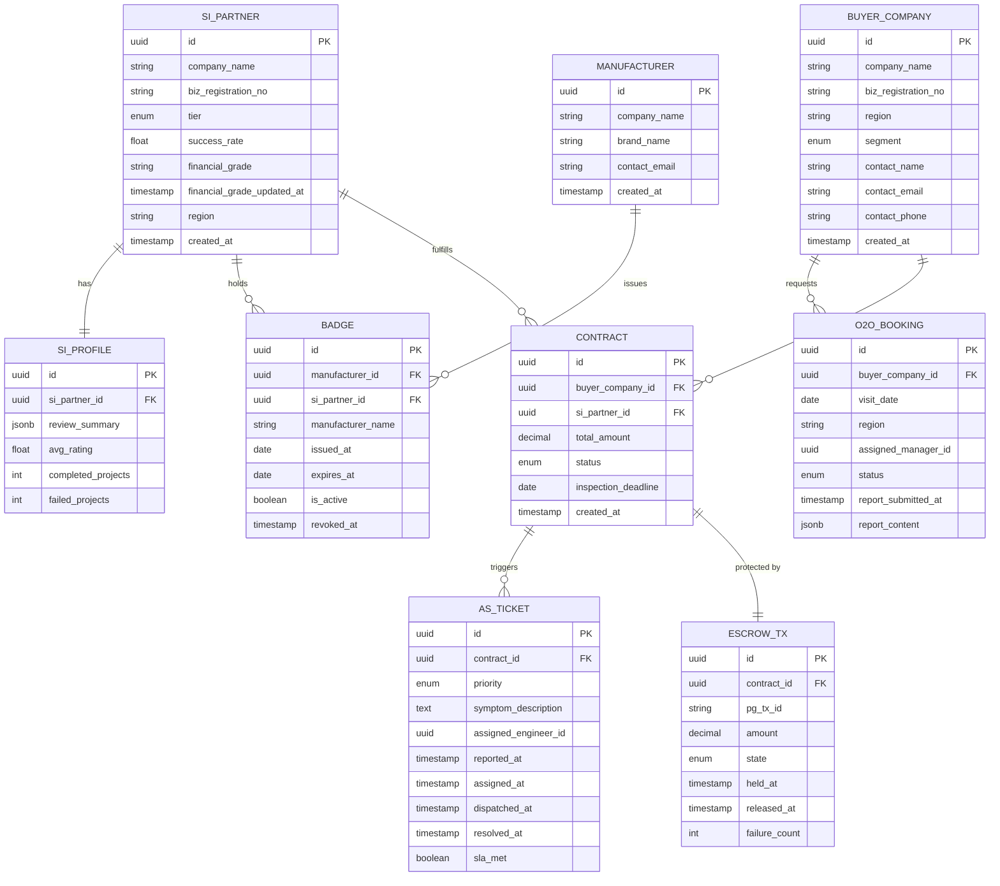
```mermaid
erDiagram
    BUYER_COMPANY ||--o{ CONTRACT : places
    SI_PARTNER ||--o{ CONTRACT : fulfills
    MANUFACTURER ||--o{ BADGE : issues
    SI_PARTNER ||--o{ BADGE : holds
    CONTRACT ||--|| ESCROW_TX : "protected by"
    CONTRACT ||--o{ AS_TICKET : triggers
    SI_PARTNER ||--|| SI_PROFILE : has
    BUYER_COMPANY ||--o{ O2O_BOOKING : requests

    BUYER_COMPANY {
        uuid id PK
        string company_name
        string biz_registration_no
        string region
        enum segment
        string contact_name
        string contact_email
        string contact_phone
        timestamp created_at
    }
    SI_PARTNER {
        uuid id PK
        string company_name
        string biz_registration_no
        enum tier
        float success_rate
        string financial_grade
        timestamp financial_grade_updated_at
        string region
        timestamp created_at
    }
    MANUFACTURER {
        uuid id PK
        string company_name
        string brand_name
        string contact_email
        timestamp created_at
    }
    CONTRACT {
        uuid id PK
        uuid buyer_company_id FK
        uuid si_partner_id FK
        decimal total_amount
        enum status
        date inspection_deadline
        timestamp created_at
    }
    ESCROW_TX {
        uuid id PK
        uuid contract_id FK
        string pg_tx_id
        decimal amount
        enum state
        timestamp held_at
        timestamp released_at
        int failure_count
    }
    AS_TICKET {
        uuid id PK
        uuid contract_id FK
        enum priority
        text symptom_description
        uuid assigned_engineer_id
        timestamp reported_at
        timestamp assigned_at
        timestamp dispatched_at
        timestamp resolved_at
        boolean sla_met
    }
    BADGE {
        uuid id PK
        uuid manufacturer_id FK
        uuid si_partner_id FK
        string manufacturer_name
        date issued_at
        date expires_at
        boolean is_active
        timestamp revoked_at
    }
    SI_PROFILE {
        uuid id PK
        uuid si_partner_id FK
        jsonb review_summary
        float avg_rating
        int completed_projects
        int failed_projects
    }
    O2O_BOOKING {
        uuid id PK
        uuid buyer_company_id FK
        date visit_date
        string region
        uuid assigned_manager_id
        enum status
        timestamp report_submitted_at
        jsonb report_content
    }
```

#### 6.2.11 Class Diagram (도메인 객체 구조)

시스템의 핵심 도메인 객체 간의 구조적 관계, 속성(Attribute), 주요 기능/메서드(Method)를 도식화한다.

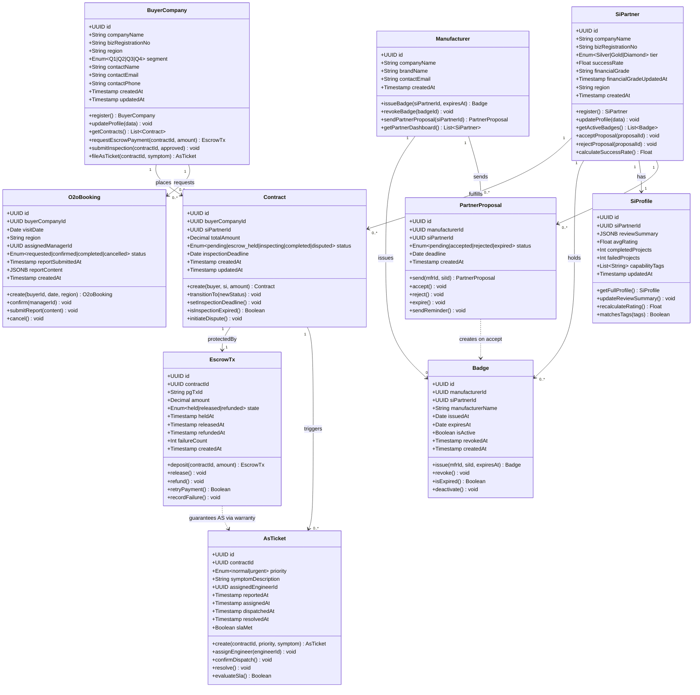
```mermaid
classDiagram
    class BuyerCompany {
        +UUID id
        +String companyName
        +String bizRegistrationNo
        +String region
        +Enum~Q1|Q2|Q3|Q4~ segment
        +String contactName
        +String contactEmail
        +String contactPhone
        +Timestamp createdAt
        +Timestamp updatedAt
        +register() BuyerCompany
        +updateProfile(data) void
        +getContracts() List~Contract~
        +requestEscrowPayment(contractId, amount) EscrowTx
        +submitInspection(contractId, approved) void
        +fileAsTicket(contractId, symptom) AsTicket
    }

    class SiPartner {
        +UUID id
        +String companyName
        +String bizRegistrationNo
        +Enum~Silver|Gold|Diamond~ tier
        +Float successRate
        +String financialGrade
        +Timestamp financialGradeUpdatedAt
        +String region
        +Timestamp createdAt
        +register() SiPartner
        +updateProfile(data) void
        +getActiveBadges() List~Badge~
        +acceptProposal(proposalId) void
        +rejectProposal(proposalId) void
        +calculateSuccessRate() Float
    }

    class Manufacturer {
        +UUID id
        +String companyName
        +String brandName
        +String contactEmail
        +Timestamp createdAt
        +issueBadge(siPartnerId, expiresAt) Badge
        +revokeBadge(badgeId) void
        +sendPartnerProposal(siPartnerId) PartnerProposal
        +getPartnerDashboard() List~SiPartner~
    }

    class Contract {
        +UUID id
        +UUID buyerCompanyId
        +UUID siPartnerId
        +Decimal totalAmount
        +Enum~pending|escrow_held|inspecting|completed|disputed~ status
        +Date inspectionDeadline
        +Timestamp createdAt
        +Timestamp updatedAt
        +create(buyer, si, amount) Contract
        +transitionTo(newStatus) void
        +setInspectionDeadline() void
        +isInspectionExpired() Boolean
        +initiateDispute() void
    }

    class EscrowTx {
        +UUID id
        +UUID contractId
        +String pgTxId
        +Decimal amount
        +Enum~held|released|refunded~ state
        +Timestamp heldAt
        +Timestamp releasedAt
        +Timestamp refundedAt
        +Int failureCount
        +Timestamp createdAt
        +deposit(contractId, amount) EscrowTx
        +release() void
        +refund() void
        +retryPayment() Boolean
        +recordFailure() void
    }

    class AsTicket {
        +UUID id
        +UUID contractId
        +Enum~normal|urgent~ priority
        +String symptomDescription
        +UUID assignedEngineerId
        +Timestamp reportedAt
        +Timestamp assignedAt
        +Timestamp dispatchedAt
        +Timestamp resolvedAt
        +Boolean slaMet
        +create(contractId, priority, symptom) AsTicket
        +assignEngineer(engineerId) void
        +confirmDispatch() void
        +resolve() void
        +evaluateSla() Boolean
    }

    class Badge {
        +UUID id
        +UUID manufacturerId
        +UUID siPartnerId
        +String manufacturerName
        +Date issuedAt
        +Date expiresAt
        +Boolean isActive
        +Timestamp revokedAt
        +Timestamp createdAt
        +issue(mfrId, siId, expiresAt) Badge
        +revoke() void
        +isExpired() Boolean
        +deactivate() void
    }

    class SiProfile {
        +UUID id
        +UUID siPartnerId
        +JSONB reviewSummary
        +Float avgRating
        +Int completedProjects
        +Int failedProjects
        +List~String~ capabilityTags
        +Timestamp updatedAt
        +getFullProfile() SiProfile
        +updateReviewSummary() void
        +recalculateRating() Float
        +matchesTags(tags) Boolean
    }

    class O2oBooking {
        +UUID id
        +UUID buyerCompanyId
        +Date visitDate
        +String region
        +UUID assignedManagerId
        +Enum~requested|confirmed|completed|cancelled~ status
        +Timestamp reportSubmittedAt
        +JSONB reportContent
        +Timestamp createdAt
        +create(buyerId, date, region) O2oBooking
        +confirm(managerId) void
        +submitReport(content) void
        +cancel() void
    }

    class PartnerProposal {
        +UUID id
        +UUID manufacturerId
        +UUID siPartnerId
        +Enum~pending|accepted|rejected|expired~ status
        +Date deadline
        +Timestamp createdAt
        +send(mfrId, siId) PartnerProposal
        +accept() void
        +reject() void
        +expire() void
        +sendReminder() void
    }

    BuyerCompany "1" --> "0..*" Contract : places
    SiPartner "1" --> "0..*" Contract : fulfills
    Contract "1" --> "1" EscrowTx : protectedBy
    Contract "1" --> "0..*" AsTicket : triggers
    Manufacturer "1" --> "0..*" Badge : issues
    SiPartner "1" --> "0..*" Badge : holds
    SiPartner "1" --> "1" SiProfile : has
    BuyerCompany "1" --> "0..*" O2oBooking : requests
    Manufacturer "1" --> "0..*" PartnerProposal : sends
    SiPartner "1" --> "0..*" PartnerProposal : receives
    PartnerProposal ..> Badge : creates on accept
    EscrowTx ..> AsTicket : guarantees AS via warranty
```

### 6.3 Detailed Interaction Models (상세 시퀀스 다이어그램)

#### 6.3.1 에스크로 결제 전체 상세 흐름 (결제 → 시공 → 검수 → 방출/분쟁)

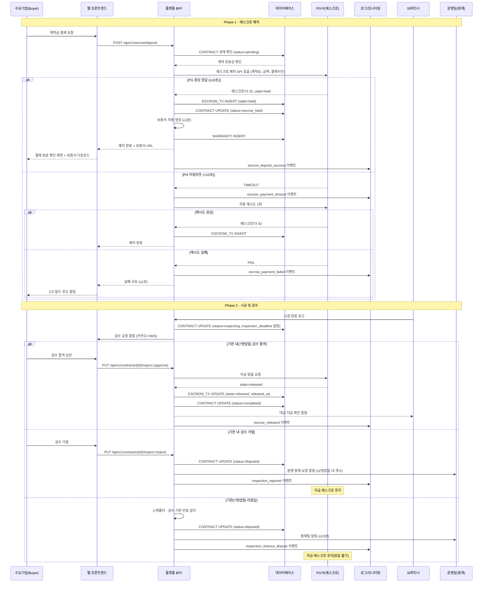
```mermaid
sequenceDiagram
    participant B as 수요기업(Buyer)
    participant WEB as 웹 프론트엔드
    participant BFF as 플랫폼 BFF
    participant DB as 데이터베이스
    participant PG as PG사(에스크로)
    participant LOG as 로그/모니터링
    participant SI as SI파트너
    participant OPS as 운영팀(중재)

    Note over B,OPS: Phase 1 - 에스크로 예치

    B->>WEB: 계약금 결제 요청
    WEB->>BFF: POST /api/v1/escrow/deposit
    BFF->>DB: CONTRACT 상태 확인 (status=pending)
    DB-->>BFF: 계약 유효성 확인
    BFF->>PG: 에스크로 예치 API 호출 (계약ID, 금액, 결제수단)

    alt PG 정상 응답 (≤10초)
        PG-->>BFF: 에스크로TX ID, state=held
        BFF->>DB: ESCROW_TX INSERT (state=held)
        BFF->>DB: CONTRACT UPDATE (status=escrow_held)
        BFF->>BFF: 보증서 자동 생성 (≤1분)
        BFF->>DB: WARRANTY INSERT
        BFF-->>WEB: 예치 완료 + 보증서 URL
        WEB-->>B: 결제 완료 확인 화면 + 보증서 다운로드
        BFF->>LOG: escrow_deposit_success 이벤트
    else PG 타임아웃 (>10초)
        PG-->>BFF: TIMEOUT
        BFF->>LOG: escrow_payment_timeout 이벤트
        BFF->>PG: 자동 재시도 1회
        alt 재시도 성공
            PG-->>BFF: 에스크로TX ID
            BFF->>DB: ESCROW_TX INSERT
            BFF-->>WEB: 예치 완료
        else 재시도 실패
            PG-->>BFF: FAIL
            BFF->>LOG: escrow_payment_failed 이벤트
            BFF-->>WEB: 실패 사유 (≤2초)
            WEB-->>B: CS 접수 유도 팝업
        end
    end

    Note over B,OPS: Phase 2 - 시공 및 검수

    SI->>BFF: 시공 완료 보고
    BFF->>DB: CONTRACT UPDATE (status=inspecting, inspection_deadline 설정)
    BFF->>WEB: 검수 요청 알림 (카카오+SMS)

    alt 기한 내(7영업일) 검수 합격
        B->>WEB: 검수 합격 승인
        WEB->>BFF: PUT /api/v1/contracts/{id}/inspect (approve)
        BFF->>PG: 자금 방출 요청
        PG-->>BFF: state=released
        BFF->>DB: ESCROW_TX UPDATE (state=released, released_at)
        BFF->>DB: CONTRACT UPDATE (status=completed)
        BFF-->>SI: 대금 지급 확인 알림
        BFF->>LOG: escrow_released 이벤트

    else 기한 내 검수 거절
        B->>WEB: 검수 거절
        WEB->>BFF: PUT /api/v1/contracts/{id}/inspect (reject)
        BFF->>DB: CONTRACT UPDATE (status=disputed)
        BFF->>OPS: 분쟁 중재 요청 알림 (≤2영업일 내 개시)
        BFF->>LOG: inspection_rejected 이벤트
        Note over PG: 자금 에스크로 유지

    else 기한(7영업일) 미응답
        BFF->>BFF: 스케줄러 - 검수 기한 만료 감지
        BFF->>DB: CONTRACT UPDATE (status=disputed)
        BFF->>OPS: 중재팀 알림 (≤10분)
        BFF->>LOG: inspection_timeout_dispute 이벤트
        Note over PG: 자금 에스크로 유지(방출 불가)
    end
```

#### 6.3.2 제조사 인증 뱃지 생명주기 상세 흐름

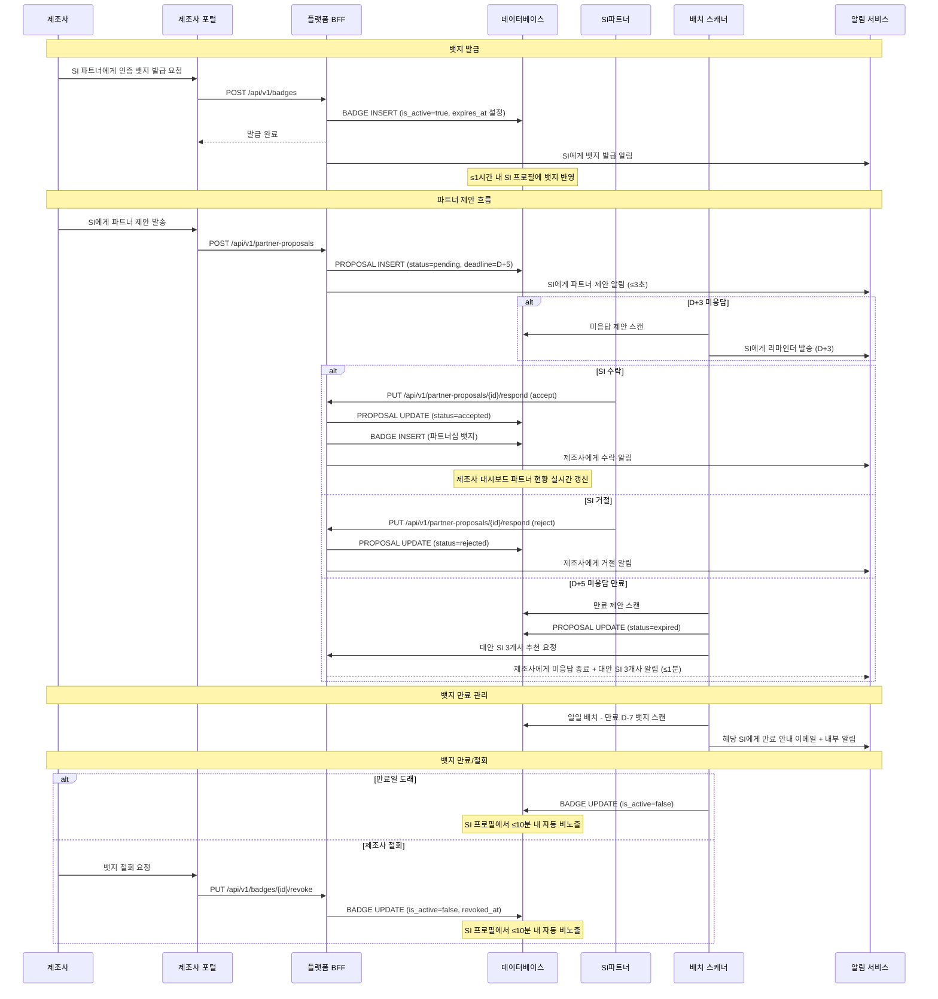
```mermaid
sequenceDiagram
    participant MFR as 제조사
    participant WEB as 제조사 포털
    participant BFF as 플랫폼 BFF
    participant DB as 데이터베이스
    participant SI as SI파트너
    participant BATCH as 배치 스캐너
    participant NOTI as 알림 서비스

    Note over MFR,NOTI: 뱃지 발급
    MFR->>WEB: SI 파트너에게 인증 뱃지 발급 요청
    WEB->>BFF: POST /api/v1/badges
    BFF->>DB: BADGE INSERT (is_active=true, expires_at 설정)
    BFF-->>WEB: 발급 완료
    BFF->>NOTI: SI에게 뱃지 발급 알림
    Note over DB: ≤1시간 내 SI 프로필에 뱃지 반영

    Note over MFR,NOTI: 파트너 제안 흐름
    MFR->>WEB: SI에게 파트너 제안 발송
    WEB->>BFF: POST /api/v1/partner-proposals
    BFF->>DB: PROPOSAL INSERT (status=pending, deadline=D+5)
    BFF->>NOTI: SI에게 파트너 제안 알림 (≤3초)

    alt D+3 미응답
        BATCH->>DB: 미응답 제안 스캔
        BATCH->>NOTI: SI에게 리마인더 발송 (D+3)
    end

    alt SI 수락
        SI->>BFF: PUT /api/v1/partner-proposals/{id}/respond (accept)
        BFF->>DB: PROPOSAL UPDATE (status=accepted)
        BFF->>DB: BADGE INSERT (파트너십 뱃지)
        BFF->>NOTI: 제조사에게 수락 알림
        Note over DB: 제조사 대시보드 파트너 현황 실시간 갱신
    else SI 거절
        SI->>BFF: PUT /api/v1/partner-proposals/{id}/respond (reject)
        BFF->>DB: PROPOSAL UPDATE (status=rejected)
        BFF->>NOTI: 제조사에게 거절 알림
    else D+5 미응답 만료
        BATCH->>DB: 만료 제안 스캔
        BATCH->>DB: PROPOSAL UPDATE (status=expired)
        BATCH->>BFF: 대안 SI 3개사 추천 요청
        BFF-->>NOTI: 제조사에게 미응답 종료 + 대안 SI 3개사 알림 (≤1분)
    end

    Note over MFR,NOTI: 뱃지 만료 관리
    BATCH->>DB: 일일 배치 - 만료 D-7 뱃지 스캔
    BATCH->>NOTI: 해당 SI에게 만료 안내 이메일 + 내부 알림

    Note over MFR,NOTI: 뱃지 만료/철회
    alt 만료일 도래
        BATCH->>DB: BADGE UPDATE (is_active=false)
        Note over DB: SI 프로필에서 ≤10분 내 자동 비노출
    else 제조사 철회
        MFR->>WEB: 뱃지 철회 요청
        WEB->>BFF: PUT /api/v1/badges/{id}/revoke
        BFF->>DB: BADGE UPDATE (is_active=false, revoked_at)
        Note over DB: SI 프로필에서 ≤10분 내 자동 비노출
    end
```

#### 6.3.3 RaaS 비용 비교 계산 및 금융 연결 상세 흐름

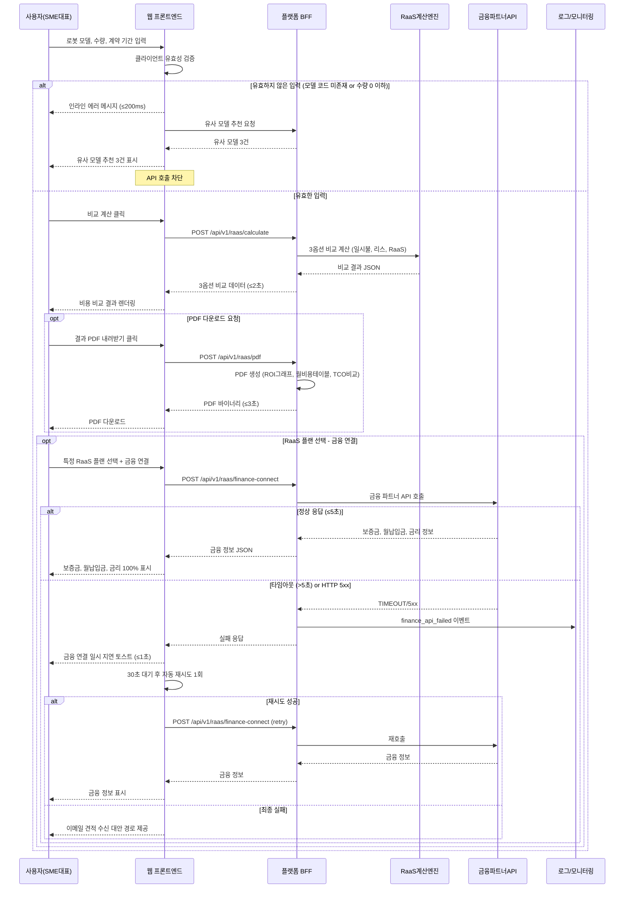
```mermaid
sequenceDiagram
    participant U as 사용자(SME대표)
    participant WEB as 웹 프론트엔드
    participant BFF as 플랫폼 BFF
    participant CALC as RaaS계산엔진
    participant FIN as 금융파트너API
    participant LOG as 로그/모니터링

    U->>WEB: 로봇 모델, 수량, 계약 기간 입력
    WEB->>WEB: 클라이언트 유효성 검증

    alt 유효하지 않은 입력 (모델 코드 미존재 or 수량 0 이하)
        WEB-->>U: 인라인 에러 메시지 (≤200ms)
        WEB->>BFF: 유사 모델 추천 요청
        BFF-->>WEB: 유사 모델 3건
        WEB-->>U: 유사 모델 추천 3건 표시
        Note over WEB: API 호출 차단
    else 유효한 입력
        U->>WEB: 비교 계산 클릭
        WEB->>BFF: POST /api/v1/raas/calculate
        BFF->>CALC: 3옵션 비교 계산 (일시불, 리스, RaaS)
        CALC-->>BFF: 비교 결과 JSON
        BFF-->>WEB: 3옵션 비교 데이터 (≤2초)
        WEB-->>U: 비용 비교 결과 렌더링

        opt PDF 다운로드 요청
            U->>WEB: 결과 PDF 내려받기 클릭
            WEB->>BFF: POST /api/v1/raas/pdf
            BFF->>BFF: PDF 생성 (ROI그래프, 월비용테이블, TCO비교)
            BFF-->>WEB: PDF 바이너리 (≤3초)
            WEB-->>U: PDF 다운로드
        end

        opt RaaS 플랜 선택 - 금융 연결
            U->>WEB: 특정 RaaS 플랜 선택 + 금융 연결
            WEB->>BFF: POST /api/v1/raas/finance-connect
            BFF->>FIN: 금융 파트너 API 호출

            alt 정상 응답 (≤5초)
                FIN-->>BFF: 보증금, 월납입금, 금리 정보
                BFF-->>WEB: 금융 정보 JSON
                WEB-->>U: 보증금, 월납입금, 금리 100% 표시
            else 타임아웃 (>5초) or HTTP 5xx
                FIN-->>BFF: TIMEOUT/5xx
                BFF->>LOG: finance_api_failed 이벤트
                BFF-->>WEB: 실패 응답
                WEB-->>U: 금융 연결 일시 지연 토스트 (≤1초)
                WEB->>WEB: 30초 대기 후 자동 재시도 1회
                alt 재시도 성공
                    WEB->>BFF: POST /api/v1/raas/finance-connect (retry)
                    BFF->>FIN: 재호출
                    FIN-->>BFF: 금융 정보
                    BFF-->>WEB: 금융 정보
                    WEB-->>U: 금융 정보 표시
                else 최종 실패
                    WEB-->>U: 이메일 견적 수신 대안 경로 제공
                end
            end
        end
    end
```

#### 6.3.4 SI 재무 등급 조회 및 캐시 상세 흐름

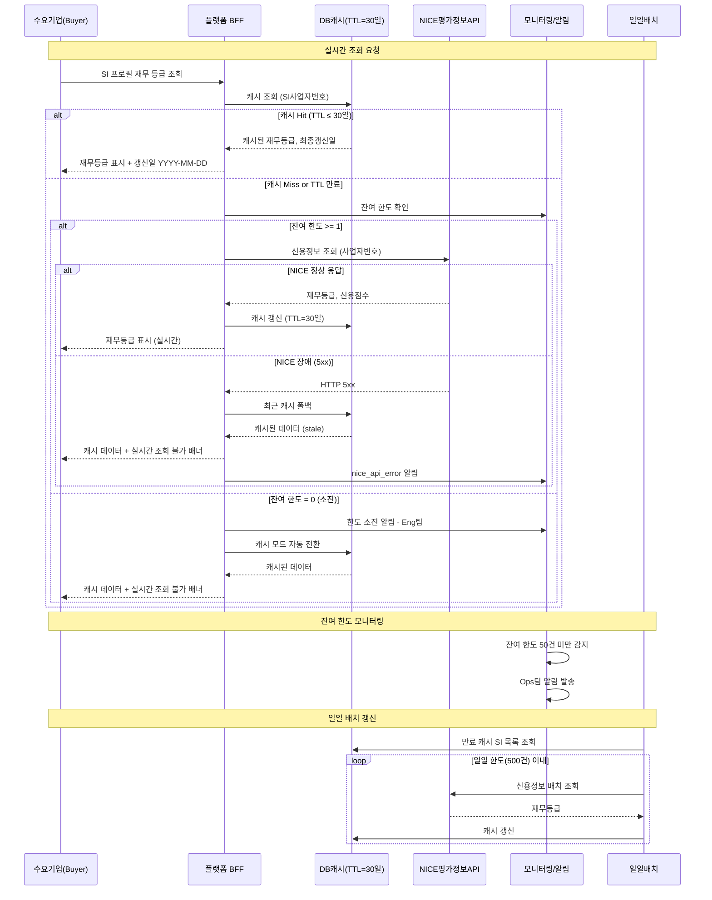
```mermaid
sequenceDiagram
    participant B as 수요기업(Buyer)
    participant BFF as 플랫폼 BFF
    participant CACHE as DB캐시(TTL=30일)
    participant NICE as NICE평가정보API
    participant MON as 모니터링/알림
    participant BATCH as 일일배치

    Note over B,BATCH: 실시간 조회 요청
    B->>BFF: SI 프로필 재무 등급 조회

    BFF->>CACHE: 캐시 조회 (SI사업자번호)
    alt 캐시 Hit (TTL ≤ 30일)
        CACHE-->>BFF: 캐시된 재무등급, 최종갱신일
        BFF-->>B: 재무등급 표시 + 갱신일 YYYY-MM-DD
    else 캐시 Miss or TTL 만료
        BFF->>MON: 잔여 한도 확인
        alt 잔여 한도 >= 1
            BFF->>NICE: 신용정보 조회 (사업자번호)
            alt NICE 정상 응답
                NICE-->>BFF: 재무등급, 신용점수
                BFF->>CACHE: 캐시 갱신 (TTL=30일)
                BFF-->>B: 재무등급 표시 (실시간)
            else NICE 장애 (5xx)
                NICE-->>BFF: HTTP 5xx
                BFF->>CACHE: 최근 캐시 폴백
                CACHE-->>BFF: 캐시된 데이터 (stale)
                BFF-->>B: 캐시 데이터 + 실시간 조회 불가 배너
                BFF->>MON: nice_api_error 알림
            end
        else 잔여 한도 = 0 (소진)
            BFF->>MON: 한도 소진 알림 - Eng팀
            BFF->>CACHE: 캐시 모드 자동 전환
            CACHE-->>BFF: 캐시된 데이터
            BFF-->>B: 캐시 데이터 + 실시간 조회 불가 배너
        end
    end

    Note over B,BATCH: 잔여 한도 모니터링
    MON->>MON: 잔여 한도 50건 미만 감지
    MON->>MON: Ops팀 알림 발송

    Note over B,BATCH: 일일 배치 갱신
    BATCH->>CACHE: 만료 캐시 SI 목록 조회
    loop 일일 한도(500건) 이내
        BATCH->>NICE: 신용정보 배치 조회
        NICE-->>BATCH: 재무등급
        BATCH->>CACHE: 캐시 갱신
    end
```

#### 6.3.5 긴급 AS 접수·배정·출동 상세 흐름

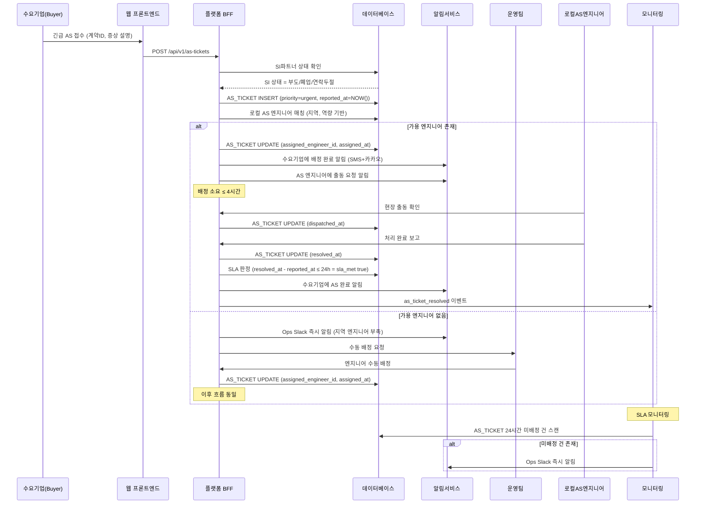
```mermaid
sequenceDiagram
    participant B as 수요기업(Buyer)
    participant WEB as 웹 프론트엔드
    participant BFF as 플랫폼 BFF
    participant DB as 데이터베이스
    participant NOTI as 알림서비스
    participant OPS as 운영팀
    participant AS as 로컬AS엔지니어
    participant MON as 모니터링

    B->>WEB: 긴급 AS 접수 (계약ID, 증상 설명)
    WEB->>BFF: POST /api/v1/as-tickets
    BFF->>DB: SI파트너 상태 확인
    DB-->>BFF: SI 상태 = 부도/폐업/연락두절

    BFF->>DB: AS_TICKET INSERT (priority=urgent, reported_at=NOW())
    BFF->>DB: 로컬 AS 엔지니어 매칭 (지역, 역량 기반)

    alt 가용 엔지니어 존재
        BFF->>DB: AS_TICKET UPDATE (assigned_engineer_id, assigned_at)
        BFF->>NOTI: 수요기업에 배정 완료 알림 (SMS+카카오)
        BFF->>NOTI: AS 엔지니어에 출동 요청 알림
        Note over BFF: 배정 소요 ≤ 4시간

        AS->>BFF: 현장 출동 확인
        BFF->>DB: AS_TICKET UPDATE (dispatched_at)

        AS->>BFF: 처리 완료 보고
        BFF->>DB: AS_TICKET UPDATE (resolved_at)
        BFF->>DB: SLA 판정 (resolved_at - reported_at ≤ 24h = sla_met true)
        BFF->>NOTI: 수요기업에 AS 완료 알림
        BFF->>MON: as_ticket_resolved 이벤트

    else 가용 엔지니어 없음
        BFF->>NOTI: Ops Slack 즉시 알림 (지역 엔지니어 부족)
        BFF->>OPS: 수동 배정 요청
        OPS->>BFF: 엔지니어 수동 배정
        BFF->>DB: AS_TICKET UPDATE (assigned_engineer_id, assigned_at)
        Note over BFF: 이후 흐름 동일
    end

    Note over MON: SLA 모니터링
    MON->>DB: AS_TICKET 24시간 미배정 건 스캔
    alt 미배정 건 존재
        MON->>NOTI: Ops Slack 즉시 알림
    end
```

#### 6.3.6 O2O 매니저 파견 예약 상세 흐름 (Phase 2)

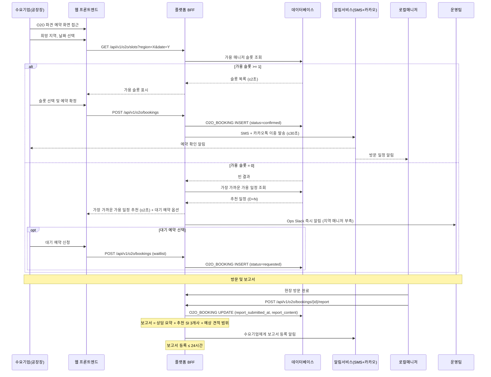
```mermaid
sequenceDiagram
    participant B as 수요기업(공장장)
    participant WEB as 웹 프론트엔드
    participant BFF as 플랫폼 BFF
    participant DB as 데이터베이스
    participant NOTI as 알림서비스(SMS+카카오)
    participant MGR as 로컬매니저
    participant OPS as 운영팀

    B->>WEB: O2O 파견 예약 화면 접근
    B->>WEB: 희망 지역, 날짜 선택
    WEB->>BFF: GET /api/v1/o2o/slots?region=X&date=Y
    BFF->>DB: 가용 매니저 슬롯 조회

    alt 가용 슬롯 >= 1
        DB-->>BFF: 슬롯 목록 (≤2초)
        BFF-->>WEB: 가용 슬롯 표시
        B->>WEB: 슬롯 선택 및 예약 확정
        WEB->>BFF: POST /api/v1/o2o/bookings
        BFF->>DB: O2O_BOOKING INSERT (status=confirmed)
        BFF->>NOTI: SMS + 카카오톡 이중 발송 (≤30초)
        NOTI-->>B: 예약 확인 알림
        NOTI-->>MGR: 방문 일정 알림
    else 가용 슬롯 = 0
        DB-->>BFF: 빈 결과
        BFF->>DB: 가장 가까운 가용 일정 조회
        DB-->>BFF: 추천 일정 (D+N)
        BFF-->>WEB: 가장 가까운 가용 일정 추천 (≤2초) + 대기 예약 옵션
        BFF->>OPS: Ops Slack 즉시 알림 (지역 매니저 부족)
        opt 대기 예약 선택
            B->>WEB: 대기 예약 신청
            WEB->>BFF: POST /api/v1/o2o/bookings (waitlist)
            BFF->>DB: O2O_BOOKING INSERT (status=requested)
        end
    end

    Note over B,OPS: 방문 및 보고서
    MGR->>BFF: 현장 방문 완료
    MGR->>BFF: POST /api/v1/o2o/bookings/{id}/report
    BFF->>DB: O2O_BOOKING UPDATE (report_submitted_at, report_content)
    Note over BFF: 보고서 = 상담 요약 + 추천 SI 3개사 + 예상 견적 범위
    BFF->>NOTI: 수요기업에게 보고서 등록 알림
    Note over BFF: 보고서 등록 ≤ 24시간
```

### 6.4 Validation Plan (검증 계획)

| 실험 ID | 가설 | 설계·도구 | 시점·기간 | 표본 | 성공 기준 | 관련 REQ |
|:---:|:---|:---|:---|:---|:---|:---|
| EXP-01 | 에스크로 보호 시 첫 거래 전환율 +30pp 상승 | A/B 테스트 (대조: 일반결제 / 실험: 에스크로) | Open Beta (MVP+4w~+12w) | 100개사 | 전환율 +30pp, p < 0.05 | REQ-FUNC-001, REQ-NF-023 |
| EXP-02 | 기안 리포트 자동 생성 시 통과율 80% 초과 | 코호트 분석 (다운로드 vs 미다운로드) | CB~OB (MVP~+12w) | 50개사 | 통과율 >= 80% | REQ-FUNC-010, REQ-NF-025 |
| EXP-03 | 뱃지 SI 우선 노출 시 매칭 요청 수 2배 증가 | A/B 테스트 (대조: 기본정렬 / 실험: 뱃지 상단 고정) | Open Beta (MVP+4w~+12w) | 200건+ SI 프로필 뷰 | CTR x2.0 이상, p < 0.05 | REQ-FUNC-013, 015 |
| EXP-04 | RaaS 계산기 사용자 > 미사용자 계약 전환율 | 퍼널 분석 (자연 노출 분기) | Open Beta (MVP+4w~+12w) | 100개사 | 전환율 >= 25% | REQ-FUNC-018, REQ-NF-027 |
| EXP-05 | 보증료 WTP >= 8% 검증 | Van Westendorp PSM 설문(4Q) | Closed Beta (MVP~+4w) | 200명 | 중앙값 >= 8%, 95% CI 하한 >= 6% | REQ-NF-023 |

### 6.5 Risk Registry

| Risk ID | 리스크 | 영향도 | 발생 가능성 | 완화 전략 | 관련 REQ |
|:---:|:---|:---:|:---:|:---|:---|
| R-01 | SI 파트너 초기 공급 부족 (Cold-Start) — 인증 뱃지 보유 SI 50개사 미달 | 상 | 중상 | D-90일부터 영세 SI 무료 온보딩 캠페인. 최소 3개 제조사 파트너십 사전 체결 | REQ-FUNC-013, 017 |
| R-02 | 에스크로 분쟁 폭주 — 검수 합격 기준 모호로 분쟁 비율 10% 초과 | 중상 | 중 | 표준 검수 체크리스트 20항목 사전 정의. 분쟁 중재 SLA 2영업일 준수 인력 1명 전담 | REQ-FUNC-003, 005 |
| R-03 | AS 출동 SLA 미달 — 지방/야간 AS 엔지니어 공급 부족으로 24시간 출동률 < 95% | 상 | 중상 | 수도권/5대 산단 집중 운영 후 점진 확대. 로컬 AS 사업자 계약 시 SLA 위약금 조항 삽입 | REQ-FUNC-007, REQ-NF-024 |
| R-04 | 규제 리스크 — 에스크로 결제가 전자금융업 등록 대상 판정 | 상 | 중 | PG사 에스크로 서비스 위임 구조 확인. 법률 자문 MVP 전 완료 | CON-01 |
| R-05 | 경쟁사 추격 — 마로솔이 에스크로 + 3D 기능 자체 개발 | 중상 | 중 | 호환성 DB + 제조사 뱃지 독점 파트너십으로 데이터 해자 선점 | REQ-FUNC-017, CON-03 |

---

## 7. Verification and Validation (검증 및 타당성 확인)

### 7.1 검증 방법 (Verification Methods)

본 시스템의 요구사항이 올바르게 구현되었는지 확인하기 위해 아래 4가지 검증 방법을 적용한다.

| 방법 | 코드 | 정의 | 적용 대상 |
|:---|:---:|:---|:---|
| **검사 (Inspection)** | I | 코드 리뷰, 문서 검토, 정적 분석 | 보안 요구사항 (REQ-NF-014~017), 데이터 보존 정책 (REQ-NF-011~013) |
| **분석 (Analysis)** | A | 로그 데이터 기반 통계 분석, 코호트 분석 | KPI (REQ-NF-023~028), 비용 목표 (REQ-NF-018~020) |
| **시연 (Demonstration)** | D | 기능 동작 시연, 워크스루 | 온보딩 (REQ-FUNC-027, 028), UI 흐름 (REQ-FUNC-009~012) |
| **테스트 (Test)** | T | 단위·통합·부하·E2E 테스트 | 에스크로 (REQ-FUNC-001~005), 성능 (REQ-NF-001~006) |

### 7.2 요구사항별 검증 방법 매핑

| Requirement ID | 요구사항 요약 | 검증 방법 |
|:---:|:---|:---:|
| REQ-FUNC-001 | 에스크로 예치 (≤3분, 실패율 <0.5%) | T |
| REQ-FUNC-002 | 검수 합격 시 자금 방출 (≤24시간) | T |
| REQ-FUNC-003 | 분쟁 발생 시 중재 개시 (≤2영업일) | D, T |
| REQ-FUNC-004 | PG 타임아웃 시 자동 재시도 및 CS 유도 | T |
| REQ-FUNC-005 | 검수 기한(7영업일) 만료 시 자동 분쟁 전환 | T |
| REQ-FUNC-006 | 에스크로 결제 완료 시 AS 보증서 자동 발급 (≤1분) | T |
| REQ-FUNC-007 | SI 부도 시 로컬 AS 엔지니어 자동 매칭 (≤4시간) | T, D |
| REQ-FUNC-008 | AS 티켓 SLA 충족 여부 자동 기록 | T, I |
| REQ-FUNC-009 | SI 프로필 재무/성공률/리뷰 통합 표시 (≤2초) | T |
| REQ-FUNC-010 | 기안용 리포트 PDF 4섹션 생성 (≤5초) | T |
| REQ-FUNC-011 | NICE API 장애 시 캐시 폴백 + 안내 배너 | T |
| REQ-FUNC-012 | NICE 잔여 한도 50건 미만 시 Ops 알림 발송 | T, A |
| REQ-FUNC-013 | 제조사 인증 뱃지 발급 (반영 ≤1시간) | T |
| REQ-FUNC-014 | 뱃지 만료/철회 시 자동 비노출 (≤10분) | T |
| REQ-FUNC-015 | 뱃지 보유 SI 필터 적용 (미인증 혼입률 0%) | T |
| REQ-FUNC-016 | 뱃지 만료 D-7일 자동 알림 발송 | T |
| REQ-FUNC-017 | Brand-Agnostic 뱃지 구조 (≥3사) | I, T |
| REQ-FUNC-018 | RaaS 3옵션 비용 결과 렌더링 (≤2초) | T |
| REQ-FUNC-019 | ROI/TCO 포함 PDF 생성 (≤3초) | T |
| REQ-FUNC-020 | 금융 파트너 API 연결 (≤5초) | T |
| REQ-FUNC-021 | 유효하지 않은 입력 시 인라인 에러 (≤200ms) | T |
| REQ-FUNC-022 | 금융 API 장애 시 재시도 + 대안 경로 | T |
| REQ-FUNC-023 | O2O 가용 매니저 슬롯 조회 (≤2초) | T |
| REQ-FUNC-024 | 예약 확정 시 SMS+카카오 이중 알림 (≤30초) | T |
| REQ-FUNC-025 | 방문 보고서 등록 및 관리 (≤24시간) | D, T |
| REQ-FUNC-026 | 가용 슬롯 0건 시 가장 가까운 일정 추천 | T |
| REQ-FUNC-027~028 | 수요기업/SI 파트너 온보딩 | D, T |
| REQ-FUNC-029 | 지역/브랜드/역량 태그 SI 검색 (≤1초) | T |
| REQ-FUNC-030~032 | 파트너 제안 발송/수락/거절/리마인더 | T |
| REQ-FUNC-033~036 | 모니터링 알림 (PagerDuty/Slack) | T, A |
| REQ-NF-001~006 | 성능 (LCP, API 응답, CCU) | T |
| REQ-NF-007~013 | 가용성/데이터 보존 | T, I, A |
| REQ-NF-014~017 | 보안 (PCI-DSS, TLS, MFA) | I |
| REQ-NF-018~020 | 비용 목표 | A |
| REQ-NF-021 | 수평 확장성 | T |
| REQ-NF-022 | Brand-Agnostic DB 구조 | I |
| REQ-NF-023~028 | KPI 기반 지표 | A |

### 7.3 타당성 확인 실험 (Validation Experiments)

PRD 8.2절의 실험 설계를 기반으로, 요구사항의 비즈니스 타당성을 확인한다.

| ID | 검증 대상 (Requirement) | 가설 | 성공 기준 | 설계·도구 | 시점 | 표본 | 관련 REQ |
|:---:|:---|:---|:---|:---|:---|:---|:---|
| **VAL-01** | 에스크로 기반 거래 전환율 | 에스크로 보호 시 첫 거래 전환율 +30pp 상승 | 전환율 **+30pp**, p < 0.05 | A/B 테스트 (대조: 일반결제 / 실험: 에스크로) | Open Beta (MVP+4w~+12w) | 100개사 | REQ-FUNC-001, REQ-NF-023 |
| **VAL-02** | 기안 리포트 유효성 | 기안 리포트 자동 생성 시 통과율 80% 초과 | 통과율 **≥ 80%** (기준선 35%) | 코호트 분석 (다운로드 vs 미다운로드) | CB~OB (MVP~+12w) | 50개사 | REQ-FUNC-010, REQ-NF-025 |
| **VAL-03** | 인증 뱃지 신뢰도 | 뱃지 SI 우선 노출 시 매칭 요청 수 2배 증가 | CTR **×2.0↑**, p < 0.05 | A/B 테스트 (대조: 기본정렬 / 실험: 뱃지 상단 고정) | Open Beta (MVP+4w~+12w) | 200건+ SI 프로필 뷰 | REQ-FUNC-013, 015 |
| **VAL-04** | RaaS 계산기 ROI 효과 | RaaS 계산기 사용자 > 미사용자 계약 전환율 | 전환율 **≥ 25%** (미사용 대비 +15pp) | 퍼널 분석 (자연 노출 분기) | Open Beta (MVP+4w~+12w) | 100개사 | REQ-FUNC-018, REQ-NF-027 |
| **VAL-05** | AS 보증료 수용도 | 보증료 WTP ≥ 8% 검증 | 중앙값 **≥ 8%**, 95% CI 하한 **≥ 6%** | Van Westendorp PSM 설문(4Q) | Closed Beta (MVP~+4w) | 200명 | REQ-NF-023 |

### 7.4 측정 도구 및 연결표

PRD 9.4절의 실험 설계 연결표를 SRS 형식으로 재구성한다.

| 주장 (Claim) | 실험 설계 (Design) | 측정 도구 (Metrics) | Validation ID |
|:---|:---|:---|:---:|
| 에스크로가 전환율을 높인다 | A/B 테스트 (n≥100) | 견적→계약 전환율, p-value | VAL-01 |
| 기안 리포트가 통과율을 높인다 | 코호트 분석 (n≥50) | 첫 보고 통과율 (%) | VAL-02 |
| 뱃지가 매칭 선호를 높인다 | A/B 테스트 (n≥200) | 매칭 요청 수/뷰 (CTR) | VAL-03 |
| RaaS 계산기가 결정을 앞당긴다 | 퍼널 분석 (n≥100) | 계산기 사용→계약 전환율 | VAL-04 |
| 보증료 WTP가 8% 이상이다 | 가격 탄력성 설문 (n≥200) | WTP 중앙값 (%), 95% CI | VAL-05 |

---

## 8. Project Risks and Constraints (프로젝트 리스크 및 제약사항)

### 8.1 리스크 레지스트리

PRD 7.3절의 리스크를 SRS 형식으로 정식 기재한다.

| Risk ID | 리스크 항목 | 영향도 | 발생 가능성 | 완화 전략 (Mitigation) | 관련 REQ |
|:---:|:---|:---:|:---:|:---|:---|
| **REQ-RISK-01** | **SI 파트너 초기 공급 부족 (Cold-Start)** — MVP 런칭 시 인증 뱃지 보유 SI 50개사 미달 | 상 | 중상 | D-90일부터 Layer 3 영세 SI 무료 온보딩 캠페인. 최소 3개 제조사 파트너십 사전 체결 | REQ-FUNC-013, 017 |
| **REQ-RISK-02** | **에스크로 분쟁 폭주** — 검수 합격 기준 모호로 분쟁 비율 10% 초과 | 중상 | 중 | 표준 검수 체크리스트 20항목 사전 정의. 분쟁 중재 SLA 2영업일 준수 인력 1명 전담 | REQ-FUNC-003, 005 |
| **REQ-RISK-03** | **AS 출동 SLA 미달** — 지방·야간 AS 엔지니어 공급 부족으로 24시간 출동률 < 95% | 상 | 중상 | 수도권·5대 산단 집중 운영 후 점진 확대. 로컬 AS 사업자 계약 시 SLA 위약금 조항 삽입 | REQ-FUNC-007, REQ-NF-024 |
| **REQ-RISK-04** | **규제 리스크** — 에스크로 결제가 전자금융업 등록 대상 판정 | 상 | 중 | PG사 에스크로 서비스 위임 구조(직접 결제 아님) 확인. 법률 자문 MVP 전 완료 | CON-01 |
| **REQ-RISK-05** | **경쟁사 추격** — 마로솔이 에스크로 + 3D 기능 자체 개발 | 중상 | 중 | 호환성 DB + 제조사 뱃지 독점 파트너십으로 데이터 해자 선점. 속도 우선 | REQ-FUNC-017, CON-03 |

### 8.2 Architecture Decision Records (ADR)

PRD 7.5절의 핵심 아키텍처 결정 기록을 SRS 형식으로 정식 기재한다.

#### ADR-001: 에스크로 결제 — PG사 위임 구조 채택

| 항목 | 내용 |
|:---|:---|
| **결정** | 플랫폼이 직접 자금을 보관하지 않고, PG사(토스페이먼츠/나이스)의 에스크로 API를 위임 호출하여 자금 예치·방출을 처리한다 |
| **배경/제약** | 직접 자금 보관 시 `전자금융업자 등록`(금융위원회) 필수 → MVP 단계에서 라이선스 취득에 6~12개월 소요. 초기 스타트업에게 치명적 시간 지연 (REQ-RISK-04 직결) |
| **검토한 대안** | ① 자체 에스크로 구축(규제 리스크 상) ② 블록체인 스마트컨트랙트(B2B SME 수용성 극저) ③ PG사 위임(규제 회피 + 기존 인프라 활용) |
| **결론** | ③ PG 위임 채택. PCI-DSS 준수를 PG에 전가하고, 플랫폼은 계약 상태 관리·분쟁 중재에만 집중. MVP 속도 확보 |
| **리스크 잔존** | PG사 에스크로가 B2B 고액(건당 1억+)을 지원하지 않을 가능성 → ASM-01에서 사전 확인 |
| **관련 제약** | CON-01, REQ-NF-014 |

#### ADR-002: SI 재무 등급 — NICE API 캐시 TTL 30일 설정

| 항목 | 내용 |
|:---|:---|
| **결정** | NICE평가정보 신용조회 API 결과를 DB에 캐시하고, TTL(Time-to-Live)을 **30일**로 설정한다 |
| **배경/제약** | API 일일 조회 한도 500건. SI 파트너 120개사 기준 월 1회 전수 갱신 시 4일 소요(120건/일). 실시간 조회는 한도 초과로 불가 |
| **검토한 대안** | ① 실시간 조회만(한도 초과 시 장애) ② 7일 캐시(갱신 빈도 과다, 비용 증가) ③ 30일 캐시(월 1회 배치 갱신) ④ 90일 캐시(데이터 신선도 부족) |
| **결론** | ③ 30일 캐시 채택. 재무 등급은 월 단위 변동이므로 30일이 정보 신선도와 API 효율의 최적 균형점. 장애 시 캐시 폴백 자동 전환(AC-2.5) |
| **리스크 잔존** | 캐시 기간 중 SI 업체 급격한 재무 악화 시 데이터 지연 → 분기 1회 수동 스팟 체크 프로세스 추가 |
| **관련 제약** | CON-02, REQ-FUNC-011, REQ-FUNC-012 |

#### ADR-003: Brand-Agnostic 다(多)브랜드 호환성 DB 구조 채택

| 항목 | 내용 |
|:---|:---|
| **결정** | 특정 로봇 제조사에 종속되지 않는 **Brand-Agnostic 호환성 DB** 구조로 설계한다 |
| **배경/제약** | 경쟁사 UR+는 UR 1사에 한정된 500개 파트너 생태계. 국내 로봇 시장에서 UR 외 브랜드가 차지하는 비중 약 70%. 단일 브랜드 종속 시 시장의 70%를 포기 |
| **검토한 대안** | ① UR+ 모델 모방(1개 브랜드 깊이 우선) ② 2~3개 주요 브랜드 한정 ③ 완전 Brand-Agnostic 개방형 |
| **결론** | ③ 채택. 플랫폼의 핵심 해자는 '중립성'이며, 수요 기업 페르소나(김도진)가 신뢰하는 근거. 초기 ≥ 3사 파트너십(ASM-02)으로 시작하되, DB 스키마는 제조사 무관 확장 가능 구조 |
| **리스크 잔존** | 특정 제조사가 독점 파트너십을 요구하며 참여 거부 가능 → 중립성 원칙 고수, 개별 제조사 의존도 30% 이하 유지 |
| **관련 제약** | CON-03, REQ-FUNC-017, REQ-NF-022 |

### 8.3 Design Constraints (설계 제약사항)

기존 SRS 1.2.3절의 제약사항에서 도출된 핵심 설계 제약을 정식 요구사항 형태로 기재한다.

| ID | 제약사항 | 근거 | 관련 ADR |
|:---:|:---|:---|:---:|
| **REQ-CON-01** | 플랫폼은 직접 자금을 보관하지 않으며, 모든 자금 흐름은 PG사 에스크로 서버를 경유해야 한다 | 전자금융업자 등록 회피, MVP 속도 확보 | ADR-001 |
| **REQ-CON-02** | NICE API 호출 최적화를 위해 월 1회 전수 갱신 배치를 수행하며, 실시간 조회 실패 시 캐시 데이터를 사용한다 (TTL 30일) | API 일일 한도 500건, 정보 신선도-효율 균형 | ADR-002 |
| **REQ-CON-03** | 특정 브랜드 종속을 방지하기 위해 다중 제조사(UR, 두산, 레인보우 등)를 수용하는 확장 스키마를 유지한다 | UR 외 시장 70% 커버 목표 | ADR-003 |
| **REQ-CON-04** | PG사 에스크로가 B2B 고액 거래(건당 1억 원 이상)를 기술적으로 지원해야 한다 | 가정 ASM-01 | ADR-001 |
| **REQ-CON-05** | 결제 데이터는 PCI-DSS Level 1을 준수한다 (PG사 위임) | 보안 요구 | ADR-001 |
| **REQ-CON-06** | 개인정보보호법 준수 및 ISMS-P 인증을 MVP+12개월 내 취득한다 | 보안 요구 | — |
| **REQ-CON-07** | MVP 인프라 비용은 월 500만 원 이하로 유지한다 | 비용 목표 (PRD 5.4) | — |

---

## 9. Assumptions and Dependencies (가정 및 의존성)

PRD 7.4절의 가정·의존성을 SRS 형식으로 정식 기재한다.

### 9.1 가정 (Assumptions)

| ID | 가정 항목 | 상세 내용 | 검증 시한 | 검증 실패 시 영향 |
|:---:|:---|:---|:---|:---|
| **ASM-01** | PG사 B2B 고액 지원 | PG사(토스페이먼츠/나이스) 에스크로 API가 B2B 고액 거래(건당 1억 원 이상)를 기술적으로 지원한다 | D-60일 | REQ-FUNC-001~005 전체 에스크로 기능 구현 불가. 대안 PG사 탐색 또는 분할 결제 구조 검토 필요 |
| **ASM-02** | 제조사 뱃지 참여 | 로봇 제조사(UR, 두산, 레인보우 등) 최소 3사가 뱃지 프로그램에 참여한다 | D-90일 LOI 완료 | REQ-FUNC-013~017, CON-03 위반. Brand-Agnostic 전략 및 뱃지 시스템의 차별적 가치 상실 |
| **ASM-03** | 재무 조회 법적 허용 | NICE평가정보 API를 통한 SI 업체 재무 등급 조회가 B2B 서비스 맥락에서 법적으로 가능하다 | D-60일 법률 검토 | REQ-FUNC-009~012 평판 뷰어의 재무 등급 섹션 제거 필요. 대안: 자가 신고 기반 재무 정보 |
| **ASM-04** | 로컬 AS 사업자 SLA 동의 | 지역별 로컬 AS 사업자가 플랫폼의 24시간 SLA 조항에 동의하고 계약 가능하다 | D-30일 (수도권 5개 산단) | REQ-FUNC-007, REQ-NF-024 AS 출동 보장 SLA 달성 불가. 대안: SLA 수치 완화(48시간) |
| **ASM-05** | MVP 동시 접속 규모 | MVP 단계의 동시 접속 규모는 500 CCU 이내이다 | 부하 테스트 (D-14) | REQ-NF-005, REQ-NF-006 초과 시 인프라 스케일업 및 비용 목표(REQ-NF-018) 재조정 필요 |

### 9.2 의존성 (Dependencies)

| ID | 의존성 항목 | 의존 대상 | 확보 시한 | 미충족 시 영향 |
|:---:|:---|:---|:---|:---|
| **DEP-01** | PG사 에스크로 API 계약 | 토스페이먼츠 또는 나이스 | MVP D-60일 | F-01 전체 기능 블로킹 |
| **DEP-02** | NICE평가정보 API 계약 | NICE평가정보 | MVP D-60일 | F-03 재무 등급 표시 불가, 캐시 데이터 원천 미확보 |
| **DEP-03** | 제조사 파트너십 LOI | 로봇 제조사 최소 3사 | MVP D-90일 | F-04 뱃지 시스템 콘텐츠 부재 (Cold-Start: REQ-RISK-01 현실화) |
| **DEP-04** | 로컬 AS 사업자 계약 | 수도권 5개 산단 AS 사업자 | MVP D-30일 | F-02 AS 출동 보증 SLA 달성 불가 (REQ-RISK-03 현실화) |
| **DEP-05** | 금융 파트너 API 연동 | 리스/RaaS 금융 파트너 | MVP D-30일 | F-05 실시간 금융 정보 제공 불가, 이메일 견적 대안 경로만 제공 |
| **DEP-06** | 카카오 알림톡/SMS 연동 | 카카오, SMS 게이트웨이 | MVP D-14일 | 알림 기능 제한, 이메일 단일 채널 대안 제공 |

---

## 10. Deployment and Support (배포 및 지원)

### 10.1 Rollout Strategy (단계적 배포)

PRD 8.1절의 베타 채널 계획을 SRS 형식으로 정식 기재한다.

| 단계 | 시기 | 대상 | 규모 | 목적 | 진입/종료 기준 |
|:---:|:---|:---|:---:|:---|:---|
| **Alpha** | MVP-4주 | 내부 팀 + 파트너 SI 5개사 | 10명 | 핵심 기능 안정성 검증, 치명적 결함 탐지 | 진입: 기능 개발 완료. 종료: P1 결함 0건, 에스크로 E2E 성공 |
| **Closed Beta (CB)** | MVP ~ MVP+4주 | 수도권 2개 산단 SME 초대 | 30개사 | 실사용 환경 운영 검증, EXP-05(보증료 WTP) 수행 | 진입: Alpha 종료 기준 충족. 종료: 에스크로 완결 ≥ 5건, 치명적 SLA 위반 0건 |
| **Open Beta (OB)** | MVP+4주 ~ +12주 | 전국 5대 산단 확장 | 100개사 | A/B 실험(EXP-01, 03, 04) 수행, 통계적 유의성 확보 | 진입: CB 종료 기준 충족. 종료: 에스크로 완결 ≥ 15건, EXP 성공 기준 달성 |

### 10.2 배포 환경 요구사항

| 환경 | 용도 | 인프라 요구사항 |
|:---|:---|:---|
| **Development** | 개발/단위 테스트 | 클라우드 개발 환경 (비용 최소화) |
| **Staging** | 부하 테스트 (k6/Locust, 500 CCU × 30분), 통합 테스트 | Production 동등 구성 (MVP D-14 수행) |
| **Production** | 실서비스 운영 | 월 500만 원 이하 (REQ-NF-018), 99.5% 가용성 (REQ-NF-007) |

### 10.3 Benchmarking Plan (경쟁 대안 대비 벤치마크)

PRD 8.3절의 경쟁 대안 대비 벤치마크 계획을 정식 기재한다.

| 비교 항목 | 현 대안 (마로솔·브로커) | 본 플랫폼 목표 | 벤치마크 방법 | 관련 REQ |
|:---|:---|:---|:---|:---|
| 계약금 보호 | 보호 없음 (0%) | **100% 에스크로 보호** | 분쟁 발생 시 자금 보전율 비교 | REQ-FUNC-001~002 |
| SI 검증 소요 | 14일+ (발품 탐색) | **≤ 1일** (리포트 즉시 발행) | 미스터리 쇼퍼 테스트 (n=20) | REQ-FUNC-009~010 |
| AS 출동 보증 | 보증 없음 | **24시간 내 95%** 출동 | 2개월간 AS 접수-출동 로그 분석 | REQ-FUNC-007, REQ-NF-024 |
| 비용 비교 기능 | 수기 견적 2주+ | **실시간 3옵션**, 2초 내 | Task Completion Rate 비교 (n=50) | REQ-FUNC-018 |

---

## 11. Business Context (비즈니스 컨텍스트)

### 11.1 문제 정의 (Pain 지표)

PRD 1.1절의 문제 정의를 SRS 참조용으로 정식 기재한다.

| Pain ID | Pain 서술 | 실패 KPI (현재 As-Is) | 매핑 페르소나 | 해결 Feature |
|:---:|:---|:---|:---|:---|
| **P-01** | SI 업체 파산/잠적으로 로봇이 고철화 → 유지보수 단절 트라우마 | 도입 후 1년 내 AS 단절 경험률 **≥ 25%** (추정) | 조상필 (P9, AOS=4.00) | F-01, F-02 |
| **P-02** | 업체 재무/기술 역량을 객관적으로 증명할 수 없어 기안 반려 반복 | 경영진 기안 첫 보고 통과율 **≤ 35%**, 평균 검증 소요 **14일+** | 김도진 (P1, AOS=2.88) | F-03, F-04 |
| **P-03** | 비대면 계약에 대한 맹목적 불신 → 온라인 전환 거부 | 플랫폼 가입 후 첫 견적 요청 전환율 **≤ 5%** (아날로그 층) | 백창훈 (P11, AOS=1.35) | F-06 |
| **P-04** | 초기 투자비(CAPEX) 부담 → 유연한 구독형 상품 부재 | SME 중 CAPEX 부담으로 도입 주저 비율 **44.2%** | 이정훈 (P2, AOS=2.00) | F-05 |
| **P-05** | SI 파트너 탐색에 박람회·인맥 의존 → 검색 비용 과다 | 적격 SI 파트너 발굴까지 평균 소요 **≥ 3개월** | 강혁진 (P6, AOS=2.88) | F-04, F-03 |

### 11.2 목표 (Desired Outcome)

PRD 1.2절의 비즈니스 목표를 SRS 요구사항과 연결한다.

| 목표 ID | 목표 서술 | 목표값 | 달성 시한 | 관련 REQ |
|:---:|:---|:---|:---|:---|
| **G-01** | 고장 접수 → 로컬 AS 엔지니어 방문 보장 | 24시간 내 출동률 **≥ 95%** | MVP+6개월 | REQ-FUNC-007, REQ-NF-024 |
| **G-02** | 경영진 기안 첫 보고 통과율 대폭 개선 | 첫 보고 통과율 **≥ 80%**, 검증 소요 **≤ 1일** | MVP+3개월 | REQ-FUNC-010, REQ-NF-025 |
| **G-03** | 아날로그 층의 플랫폼 내 최초 거래 전환 | O2O 파견 후 견적 요청 전환율 **≥ 40%** | Phase 2 | REQ-FUNC-023~026, REQ-NF-026 |
| **G-04** | CAPEX→OPEX 전환을 통한 도입 결정 가속 | RaaS 계산기 사용 후 계약 전환율 **≥ 25%** | MVP+6개월 | REQ-FUNC-018, REQ-NF-027 |

### 11.3 성공 지표 (KPI) — 요구사항 추적

PRD 1.3절의 KPI를 SRS 요구사항 ID와 측정 경로에 연결한다.

| 유형 | KPI | 기준선 | MVP+1m | MVP+3m | MVP+6m (Target) | 주기 | 측정 경로 | 관련 REQ |
|:---|:---|:---|:---|:---|:---|:---|:---|:---|
| 🌟 **북극성** | 에스크로 거래 완결 수 (월간) | 0 | 5건 | 15건 | **30건** | 주간 | `ESCROW_TX` `state=released` 집계 → Metabase | REQ-NF-023 |
| 보조 | 신규 수요 기업 가입 수 | 0 | 50 | **200** | 300 | 주간 | `BUYER_COMPANY` 신규 생성 → Amplitude `signup_complete` | REQ-FUNC-027 |
| 보조 | 뱃지 인증 SI 파트너 등록 수 | 0 | **50** (런칭) | 80 | 120 | 월간 | `BADGE` `is_active=true` 고유 SI 수 → Admin | REQ-FUNC-013, REQ-NF-021 |
| 보조 | 에스크로 보증 수수료 GMV 비율 | 0% | 5% | 7% | **5~10%** | 월간 | `ESCROW_TX.amount / CONTRACT.total_amount` 평균 | REQ-FUNC-001 |
| 보조 | 24시간 내 AS 출동 성공률 | N/A | ≥ 80% | ≥ 90% | **≥ 95%** | 월간 | `AS_TICKET` `resolved_at - reported_at ≤ 24h` 비율 | REQ-NF-024 |
| 보조 | NPS (수요 기업) | N/A | 측정 시작 | ≥ 40 | **≥ 50** | 분기 | 인앱 NPS 설문 → 분기 리포트 | REQ-NF-028 |

### 11.4 AOS-DOS 기반 투자 우선순위

PRD 2.1절의 AOS-DOS 분석 결과와 전략 분석(REF-07)을 기반으로 시스템 투자 서열을 정의한다.

| Quadrant | 투자 방향 | 예산 배분 | 대상 기능 | 근거 |
|:---:|:---|:---:|:---|:---|
| **Q1 (즉시 투자)** | 핵심 Pain 해소 — 에스크로 + 평판 뷰어 | **80%** | F-01, F-02, F-03, F-04 | P-01 (AOS=4.00), P-02 (AOS=2.88) 해결. 가장 높은 기회 점수 |
| **Q3 (조건부 확장)** | 비대면 불신 해소 — O2O 매니저 파견 | **진입 후 배분** | F-06 | P-03 (AOS=1.35). Phase 2 조건: CB 전환율 ≥ 10% 도달 시 |
| **Q2 (백로그)** | 비용 비교 및 3D 시뮬레이션 | **잔여** | F-05, F-07 | P-04 (AOS=2.00). Should 우선순위로 MVP 포함하되 예산 제한적 배분 |
| **Q4 (폐기)** | ROI 음수 기능 | **0%** | F-08 (보조금 대행), F-09 (대기업 커스텀) | DOS < 0. AOS-DOS 분석에서 영구 Drop 판정 |

### 11.5 KSF (Key Success Factors) 이행 경로

전략 분석(REF-06: KSF 통합 보고서)에서 도출된 핵심 성공 요인의 순서적 실행 경로를 SRS 요구사항과 연결한다.

| 경로 | KSF | Phase | 핵심 실행 내용 | 관련 REQ |
|:---:|:---|:---:|:---|:---|
| **Path A** | 호환성 DB 구축을 통한 정보 비대칭 해소 | 1 | Brand-Agnostic DB 스키마(ADR-003), 뱃지 시스템(F-04), 재무 평판 뷰어(F-03) | REQ-FUNC-009~017, REQ-NF-022 |
| **Path B** | SI 공생 구조(에스크로 분쟁 중재)를 통한 생태계 안정화 | 1 | 에스크로 결제(F-01), AS 보증(F-02), 분쟁 중재 프로세스 | REQ-FUNC-001~008 |
| **Path C** | 3D 시뮬레이션 등 고도화 기술 적용으로 전환율 극대화 | 2 | 3D 기술핏 시뮬레이터(F-07, Phase 2), RaaS 계산기 고도화 | REQ-FUNC-018~022 (Phase 1), F-07 (Phase 2) |

### 11.6 수요자 여정 Pain 맵

PRD 2.2절의 수요자 여정에서 각 단계의 Pain과 해결 Feature의 연결을 기재한다.

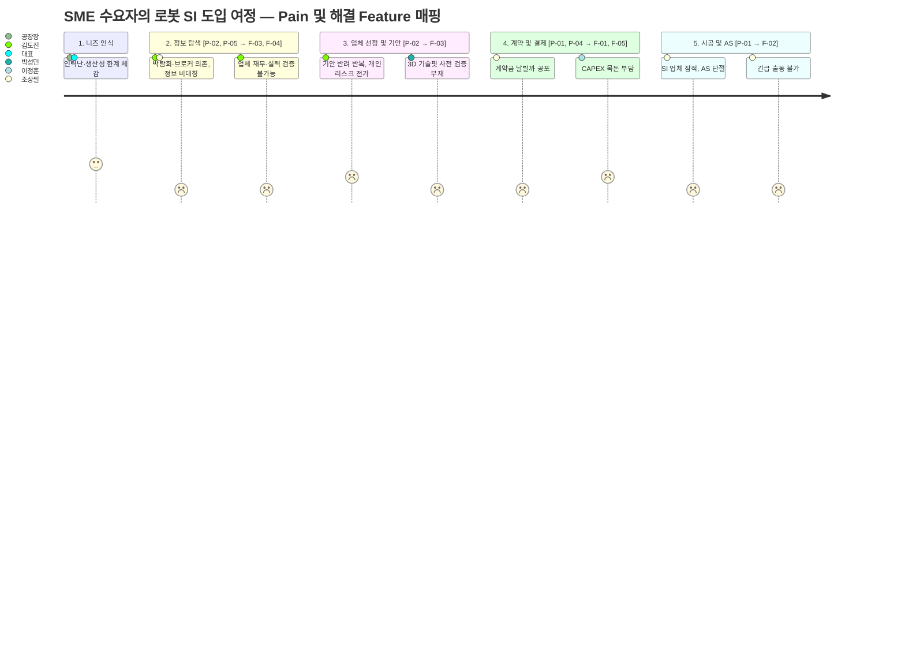
```mermaid
journey
    title SME 수요자의 로봇 SI 도입 여정 — Pain 및 해결 Feature 매핑
    section 1. 니즈 인식
      인력난·생산성 한계 체감: 3: 공장장, 대표
    section 2. 정보 탐색 [P-02, P-05 → F-03, F-04]
      박람회·브로커 의존, 정보 비대칭: 1: 김도진, 조상필
      업체 재무·실력 검증 불가능: 1: 김도진
    section 3. 업체 선정 및 기안 [P-02 → F-03]
      기안 반려 반복, 개인 리스크 전가: 2: 김도진
      3D 기술핏 사전 검증 부재: 1: 박성민
    section 4. 계약 및 결제 [P-01, P-04 → F-01, F-05]
      계약금 날릴까 공포: 1: 조상필
      CAPEX 목돈 부담: 2: 이정훈
    section 5. 시공 및 AS [P-01 → F-02]
      SI 업체 잠적, AS 단절: 1: 조상필
      긴급 출동 불가: 1: 조상필
```

---

## 12. 인터뷰·시장·전략 근거 (Evidence)

### 12.1 인터뷰 근거

PRD 9.1절의 JTBD 심층 인터뷰 결과를 SRS 참조용으로 정식 기재한다.

| 출처 | 핵심 인사이트 (원문 인용) | 연결 Pain/Feature | PRD 출처 |
|:---|:---|:---|:---|
| JTBD 심층 인터뷰 — 조상필 (P9) | *"새벽 2시 출동 보장되면 15% 더 주지"* → 보증료 WTP 10~15% 검증 | P-01, F-02 → VAL-05 | PRD 9.1절 인터뷰 근거 |
| JTBD 심층 인터뷰 — 김도진 (P1) | *"부도나면 내 목이 날아감"* → 기안 통과율 Pain 확인 | P-02, F-03 → VAL-02 | PRD 9.1절 인터뷰 근거 |
| JTBD 심층 인터뷰 — 백창훈 (P11) | *"온라인은 사기야. 멱살 잡을 담당자가 없으면 절대 안 사"* → O2O 필수성 검증 | P-03, F-06 | PRD 9.1절 인터뷰 근거 |
| JTBD 심층 인터뷰 — 강혁진 (P6) | *"매칭 과정이 너무 파편화되어 영업사원들도 지쳐 떨어집니다"* → 파트너 검색 Pain 확인 | P-05, F-04 | PRD 9.1절 인터뷰 근거 |

### 12.2 시장 리서치 근거

PRD 9.2절의 시장 데이터를 SRS 참조용으로 정식 기재한다.

| 출처 | 핵심 데이터 | 활용 요구사항 | PRD 출처 |
|:---|:---|:---|:---|
| Grand View Research (2024) | 글로벌 로봇 SI 시장 **$745억**, CAGR **9.6%** | 시장 규모 타당성 → REQ-NF-021 확장성 근거 | PRD 9.2절 시장 리서치 근거 |
| 국내 로봇 산업 실태조사 (2023) | 국내 로봇 SI 매출 **1조 6,695억 원**, SME **44.2%** CAPEX 부담 | P-04 검증 → REQ-FUNC-018~022 (RaaS) | PRD 9.2절 시장 리서치 근거 |
| 마로솔 사례분석 | 2023 상반기 수주 **100억**, 매출 Y/Y **5.8×** 성장 | 경쟁사 벤치마크 → REQ-RISK-05 | PRD 9.2절 경쟁사 분석 |

### 12.3 전략 분석 근거

PRD 9.3절의 전략 분석 결과를 SRS 참조용으로 정식 기재한다.

| 출처 | 핵심 인사이트 | 활용 요구사항 | PRD 출처 |
|:---|:---|:---|:---|
| Porter's 5 Forces | 대체재 위협 상 (전통 SI) → **공생 구조 편입 전략** | ADR-001 (에스크로 중재) → REQ-FUNC-003 | PRD 9.3절 전략 분석 근거 |
| KSF 통합 보고서 | KSF A(호환성 DB) → B(SI 공생) → C(3D 시뮬레이션) **순서적 실행** | Section 11.5 이행 경로 | PRD 9.3절 전략 분석 근거 |
| AOS-DOS 분석 | **Q1 집중(예산 80%)** → Q3(O2O) → Q2(백로그) 투자 서열 | Section 11.4 투자 우선순위 | PRD 9.3절 전략 분석 근거 |

---

## 13. Glossary (용어집 확장)

기존 SRS 1.3절에 정의된 용어 외 추가로 참조가 필요한 용어를 기재한다.

| 용어 | 정의 | 사용 섹션 |
|:---|:---|:---|
| **에스크로 거래 완결 수 (월간)** | 북극성 KPI. `ESCROW_TX` 테이블에서 `state=released`인 건수의 월간 집계값 | 11.3, REQ-NF-023 |
| **뱃지 인증 SI** | 로봇 제조사가 기술력을 보증하여 인증 뱃지를 발급한 SI 업체. 검색 결과 상단 노출 대상 | 4.1.4, REQ-FUNC-013~017 |
| **SLA (Service Level Agreement)** | AS 접수 후 24시간 이내 현장 출동을 보장하는 서비스 수준 협약 | REQ-FUNC-007, REQ-NF-024 |
| **Cold-Start** | 플랫폼 초기 런칭 시 공급(SI 파트너) 또는 수요(기업)가 부족하여 네트워크 효과가 미작동하는 상태 | REQ-RISK-01 |
| **Layer 3 SI** | 소규모 영세 SI 업체 (규모 기준). 플랫폼 초기 공급 확보를 위한 무료 온보딩 대상 | REQ-RISK-01 완화 전략 |
| **GMV (Gross Merchandise Volume)** | 플랫폼을 통해 체결된 전체 거래액. 보증 수수료 비율 산출 기준 | 11.3 |
| **Van Westendorp PSM** | 가격 민감도 측정 설문 기법 (4개 질문). 보증료 WTP 중앙값 산출에 사용 | VAL-05 |
| **Quadrant (Q1~Q4)** | AOS-DOS 분석에서 기회 점수와 만족 점수를 기반으로 기능을 4개 상한에 분류하는 기법 | 11.4 |
| **LOI (Letter of Intent)** | 의향서. 제조사 파트너십 체결 의지를 사전에 확인하기 위한 법적 비구속 문서 | ASM-02, DEP-03 |
| **RPO / RTO** | Recovery Point Objective (복구 시점 목표) / Recovery Time Objective (복구 시간 목표) | REQ-NF-009, REQ-NF-010 |

---

*끝. 본 SRS v1.1은 PRD v0.2 (REF-01)를 유일한 원천(Source of Truth)으로 하여 ISO/IEC/IEEE 29148:2018 표준에 따라 작성되었습니다. v1.0 대비 주요 변경: ① Assumptions 검증 방안 추가, ② 외부 문서 참조를 PRD 단일 원천으로 통합, ③ External Systems 역할 및 Fallback 전략 명시, ④ 시퀀스 다이어그램 3종(뱃지·OPEX 비교·RaaS 구독) 추가. Closed Beta 결과 및 실험(EXP-01~05) 수행 결과에 따라 SRS v1.2로 개정됩니다.*

