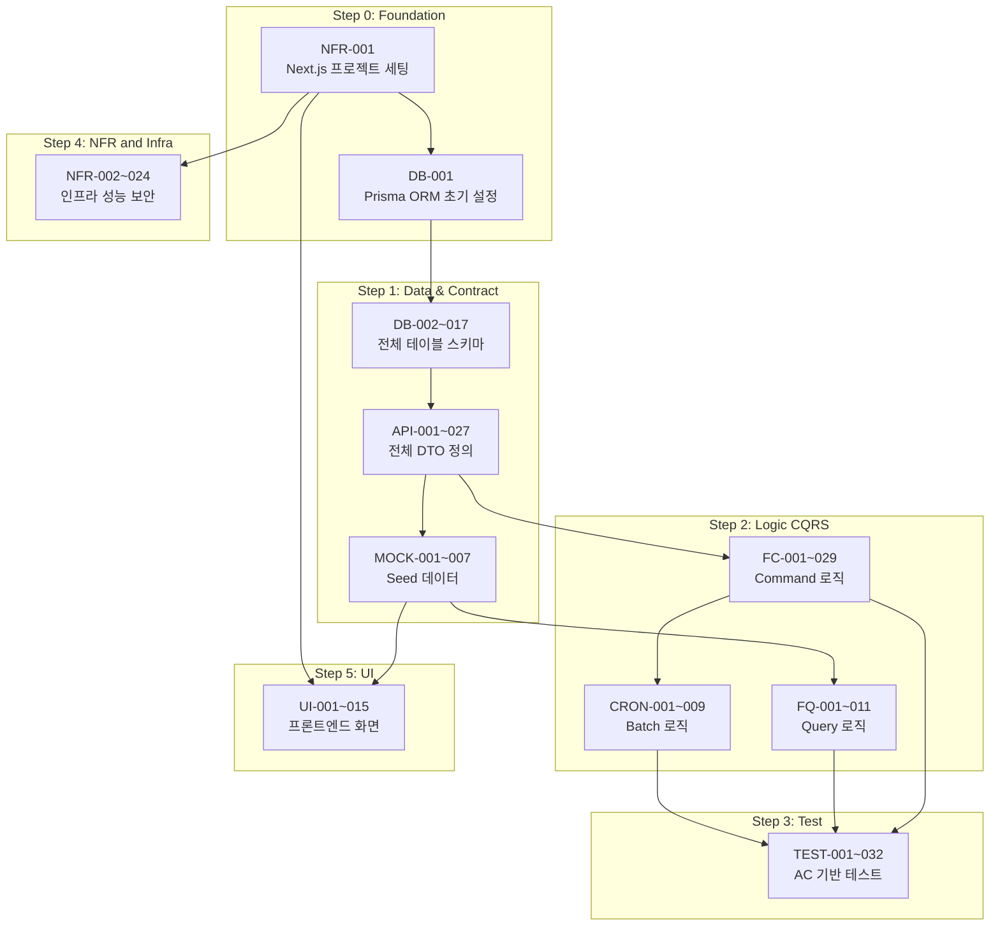

# 🗂️ 개발 태스크 리스트 (Task Breakdown from SRS v1.2)

**Source Document:** `06_SRS-v1.md` (SRS-001, Revision 1.2 / v0.4)  
**Date:** 2026-04-18  
**작성 기준:** ISO/IEC/IEEE 29148:2018 기반 SRS → 실행 가능한 Epic/Feature 태스크 분해  
**처리 순서:** Contract/Data → Logic(CQRS) → Test(AC→TDD) → NFR/Infra → Dependency Mapping

---

## 📌 범례 (Legend)

| 접두사 | 의미 | 설명 |
|:---|:---|:---|
| `DB-` | Database Schema | 테이블 스키마, 마이그레이션, Seed 데이터 |
| `API-` | API/DTO Contract | Request/Response DTO, 에러 코드, Server Action/Route Handler 인터페이스 정의 |
| `MOCK-` | Mock Data/Endpoint | 프론트엔드 독립 개발용 Mocking 데이터/엔드포인트 |
| `FQ-` | Feature/Query | 읽기 전용 (데이터 조회, 렌더링) |
| `FC-` | Feature/Command | 쓰기 (상태 변경, 입력 검증, 비즈니스 로직) |
| `CRON-` | Batch/Cron Job | 정기 배치 작업 (Vercel Cron) |
| `TEST-` | Test Task | AC 기반 단위/통합 테스트 코드 작성 |
| `NFR-` | Non-Functional Requirement | 성능, 보안, 인프라, 운영 |
| `UI-` | UI/UX Design & Component | 프론트엔드 화면 컴포넌트, 레이아웃 |

**복잡도:** H (High, 5일+) / M (Medium, 2~4일) / L (Low, 1일 이하)

---

## Step 1. 계약·데이터 명세 (Contract & Data Specification)

> 백엔드와 프론트엔드의 **단일 진실 공급원(SSOT)** 을 먼저 확립한다.

### 1-1. 데이터베이스 스키마 (DB Schema & Migration)

| Task ID | Epic (도메인) | Feature (기능명) | 관련 SRS 섹션 | 선행 태스크 (Dependencies) | 복잡도 |
|:---|:---|:---|:---|:---|:---:|
| DB-001 | Project Setup | Prisma ORM 초기 설정 및 SQLite/PostgreSQL 이중 환경 구성 (`schema.prisma` 기본 설정, `datasource`, `generator`) | 6.2 ORM 매핑 노트, CON-13 | None | M |
| DB-002 | User & Auth | `BUYER_COMPANY` 테이블 스키마 및 마이그레이션 작성 (PK, UNIQUE 제약, ENUM segment) | 6.2.1 | DB-001 | L |
| DB-003 | User & Auth | `SI_PARTNER` 테이블 스키마 및 마이그레이션 작성 (tier ENUM, financial_grade, success_rate) | 6.2.2 | DB-001 | L |
| DB-004 | User & Auth | `MANUFACTURER` 테이블 스키마 및 마이그레이션 작성 | 6.2.3 | DB-001 | L |
| DB-005 | Contract & Escrow | `CONTRACT` 테이블 스키마 및 마이그레이션 작성 (status ENUM 6종, FK 관계, inspection_deadline) | 6.2.4 | DB-002, DB-003 | M |
| DB-006 | Contract & Escrow | `ESCROW_TX` 테이블 스키마 및 마이그레이션 작성 (state ENUM 3종, UNIQUE FK→CONTRACT, admin 필드) | 6.2.5 | DB-005 | M |
| DB-007 | AS & Warranty | `AS_TICKET` 테이블 스키마 및 마이그레이션 작성 (priority ENUM, 4단계 timestamp, sla_met) | 6.2.6 | DB-005 | M |
| DB-008 | Badge & Partnership | `BADGE` 테이블 스키마 및 마이그레이션 작성 (FK→MANUFACTURER, FK→SI_PARTNER, is_active, expires_at) | 6.2.7 | DB-003, DB-004 | M |
| DB-009 | SI Profile & Search | `SI_PROFILE` 테이블 스키마 및 마이그레이션 작성 (JSONB review_summary, capability_tags TEXT[]→Json) | 6.2.8 | DB-003 | M |
| DB-010 | O2O Booking | `O2O_BOOKING` 테이블 스키마 및 마이그레이션 작성 (status ENUM 4종, report_content JSONB) — Phase 2 대비 | 6.2.9 | DB-002 | M |
| DB-011 | AS & Warranty | `WARRANTY` 테이블 스키마 및 마이그레이션 작성 (FK→CONTRACT, FK→ESCROW_TX, coverage 필드) | 6.2.10 | DB-005, DB-006 | M |
| DB-012 | RaaS & Quote | `QUOTE_LEAD` 테이블 스키마 및 마이그레이션 작성 (status ENUM 4종, response_data JSONB) | 6.2.11 | DB-002 | L |
| DB-013 | Badge & Partnership | `PARTNER_PROPOSAL` 테이블 스키마 및 마이그레이션 작성 (status ENUM 4종: pending/accepted/rejected/expired, deadline) — Class Diagram 참조 | 6.2.12 (ER), 6.3.2 | DB-003, DB-004 | M |
| DB-014 | Notification | `NOTIFICATION` 테이블 스키마 및 마이그레이션 작성 (내장 웹 알림함: 수신자, 유형, 내용, 읽음 여부, 발송 채널) | 3.1 (알림 시스템 우회 처리) | DB-001 | M |
| DB-015 | Monitoring & Event | `EVENT_LOG` 테이블 스키마 및 마이그레이션 작성 (이벤트 유형, 사용자 ID, payload JSONB, timestamp) — Vercel Analytics 대체 DB 이벤트 로그 | REQ-FUNC-027 (signup_complete 이벤트) | DB-001 | L |
| DB-016 | RaaS & Quote | `ROBOT_MODEL` (로봇 모델 마스터 데이터) 테이블 스키마 작성 (모델코드, 모델명, 제조사 FK, 가격 정보) — RaaS 계산 엔진 기반 데이터 | REQ-FUNC-018, 021 | DB-004 | M |
| DB-017 | AS & Warranty | `AS_ENGINEER` (로컬 AS 엔지니어) 테이블 스키마 작성 (이름, 지역, 역량, 가용 상태) | REQ-FUNC-007, 6.3.5 | DB-001 | L |

### 1-2. API 통신 계약 (API Contract & DTO Definition)

| Task ID | Epic (도메인) | Feature (기능명) | 관련 SRS 섹션 | 선행 태스크 (Dependencies) | 복잡도 |
|:---|:---|:---|:---|:---|:---:|
| API-001 | User & Auth | Auth 도메인 — 수요기업 회원가입 (`signupBuyer`) Server Action DTO, 유효성 규칙, 에러 코드 정의 | 6.1 #25, REQ-FUNC-027 | DB-002 | M |
| API-002 | User & Auth | Auth 도메인 — SI 파트너 회원가입 (`signupSiPartner`) Server Action DTO, Admin 검토 대기 상태 전환 규칙 정의 | 6.1 #26, REQ-FUNC-028 | DB-003, DB-009 | M |
| API-003 | Contract & Escrow | Escrow 도메인 — `createContract` Server Action DTO, 계약 상태 전이(State Machine) 규칙 정의 | 6.1 #4, REQ-FUNC-001 | DB-005 | M |
| API-004 | Contract & Escrow | Escrow 도메인 — `updateEscrowStatus` (예치) Server Action DTO, Admin 권한 검증 규칙, 에러 코드 정의 | 6.1 #1, API-01 | DB-006 | M |
| API-005 | Contract & Escrow | Escrow 도메인 — `confirmRelease` (방출 확인) Server Action DTO, 선행 조건(검수 승인 완료) 정의 | 6.1 #1, API-02 | DB-006 | M |
| API-006 | Contract & Escrow | Escrow 도메인 — 분쟁 접수 (`POST /api/escrow/dispute`) Route Handler Request/Response DTO, 에러 코드 정의 | 6.1 #2, REQ-FUNC-003 | DB-005 | M |
| API-007 | Contract & Escrow | Escrow 도메인 — 에스크로 TX 상태 조회 (`GET /api/escrow/[txId]/status`) Route Handler Response DTO 정의 | 6.1 #3 | DB-006 | L |
| API-008 | Contract & Escrow | Inspection 도메인 — `submitInspection` (검수 승인/거절) Server Action DTO, 상태 전이 규칙, 분쟁 자동 전환 규칙 정의 | 6.1 #5, REQ-FUNC-002, 005 | DB-005 | M |
| API-009 | AS & Warranty | AS 도메인 — `createAsTicket` Server Action DTO, priority ENUM, 에러 코드 정의 | 6.1 #6, API-11 | DB-007 | M |
| API-010 | AS & Warranty | AS 도메인 — `assignEngineer` Server Action DTO, 배정 규칙(지역·역량 기반), 에러 코드 정의 | 6.1 #7, API-11 | DB-007, DB-017 | M |
| API-011 | AS & Warranty | AS 도메인 — `resolveTicket` Server Action DTO, SLA 자동 판정 로직 인터페이스 정의 | 6.1 #8, API-11 | DB-007 | L |
| API-012 | AS & Warranty | Warranty 도메인 — 보증서 발급 (`POST /api/warranty/issue`) Route Handler DTO, PDF 바이너리 응답 규격 정의 | 6.1 #10, API-12 | DB-011 | M |
| API-013 | SI Profile & Search | Search 도메인 — SI 파트너 검색/필터 Server Component 쿼리 인터페이스 (지역, 브랜드, 역량 태그, 페이지네이션) 정의 | 6.1 #11, API-07 | DB-003, DB-009, DB-008 | M |
| API-014 | SI Profile & Search | Profile 도메인 — SI 프로필 상세 조회 Server Component Response DTO (재무등급, 시공성공률, 리뷰, 뱃지, 갱신일) 정의 | 6.1 #12, API-07 | DB-003, DB-009, DB-008 | M |
| API-015 | SI Profile & Search | Report 도메인 — 기안용 리포트 PDF 생성 (`POST /api/reports/pdf`) Route Handler DTO, 4섹션 구조 정의 | 6.1 #13, API-09 | DB-003, DB-009 | M |
| API-016 | Badge & Partnership | Badge 도메인 — `issueBadge` Server Action DTO, 만료일 규칙, 에러 코드 정의 | 6.1 #14, API-10 | DB-008 | M |
| API-017 | Badge & Partnership | Badge 도메인 — `revokeBadge` Server Action DTO, 비활성화 규칙 정의 | 6.1 #15, API-10 | DB-008 | L |
| API-018 | Badge & Partnership | Partnership 도메인 — `sendPartnerProposal` Server Action DTO, 응답 기한(5영업일) 규칙, 에러 코드 정의 | 6.1 #20, REQ-FUNC-030 | DB-013 | M |
| API-019 | Badge & Partnership | Partnership 도메인 — `respondProposal` (수락/거절) Server Action DTO, 뱃지 자동 발급 연계 규칙 정의 | 6.1 #21, REQ-FUNC-030 | DB-013, DB-008 | M |
| API-020 | RaaS & Quote | RaaS 도메인 — `calculateRaasOptions` Server Action DTO (Input: 모델/수량/기간, Output: 3옵션 비교 JSON), 유효성 규칙 정의 | 6.1 #17, API-08 | DB-016 | M |
| API-021 | RaaS & Quote | RaaS 도메인 — RaaS 비교 결과 PDF (`POST /api/raas/pdf`) Route Handler DTO, PDF 구조 정의 | 6.1 #18, API-08 | API-020 | L |
| API-022 | RaaS & Quote | Quote 도메인 — `requestManualQuote` Server Action DTO (Input: 모델/수량/기간/연락처), 리드 상태 전이 규칙 정의 | 6.1 #19, API-13 | DB-012 | L |
| API-023 | O2O Booking | O2O 도메인 — `createO2oBooking` Server Action DTO, 가용 슬롯 조회 Server Component 인터페이스 정의 — Phase 2 대비 | 6.1 #22, #23 | DB-010 | M |
| API-024 | O2O Booking | O2O 도메인 — 방문 보고서 등록 (`submitVisitReport`) Server Action DTO, 보고서 필수 항목 정의 — Phase 2 대비 | 6.1 #24, REQ-FUNC-025 | DB-010 | L |
| API-025 | Notification | Notification 도메인 — 알림 발송 (`POST /api/notifications/send`) Route Handler DTO (채널: 카카오/SMS/이메일/내부), 에러 코드 정의 | 6.1 #27, API-04, API-05 | DB-014 | M |
| API-026 | Monitoring & Event | Monitoring 도메인 — Slack Webhook 알림 인터페이스 (에스크로 오류율, AS 미배정, RaaS 성능, LCP) 정의 | REQ-FUNC-033~036 | None | M |
| API-027 | User & Auth | Auth 도메인 — NextAuth.js/Supabase Auth OAuth 2.0 설정 및 RBAC 역할(buyer/si_partner/manufacturer/admin) 인터페이스 정의 | REQ-NF-016, CON-11 | DB-002, DB-003, DB-004 | H |

### 1-3. Mock 데이터 및 Seed (Mock Data & Seed Script)

| Task ID | Epic (도메인) | Feature (기능명) | 관련 SRS 섹션 | 선행 태스크 (Dependencies) | 복잡도 |
|:---|:---|:---|:---|:---|:---:|
| MOCK-001 | User & Auth | Prisma Seed 스크립트 — 수요기업 10개사, SI 파트너 20개사, 제조사 3사 샘플 데이터 생성 | 6.2.1~6.2.3, CON-05 | DB-002, DB-003, DB-004 | M |
| MOCK-002 | Contract & Escrow | Prisma Seed 스크립트 — 계약 5건 (상태별: pending, escrow_held, inspecting, release_pending, completed), 에스크로 TX 5건 | 6.2.4, 6.2.5 | DB-005, DB-006, MOCK-001 | M |
| MOCK-003 | Badge & Partnership | Prisma Seed 스크립트 — 뱃지 15건 (3개 제조사 × 5개 SI, 활성/만료/철회 혼합), 파트너 제안 10건 | 6.2.7, 6.2.12 | DB-008, DB-013, MOCK-001 | M |
| MOCK-004 | SI Profile & Search | Prisma Seed 스크립트 — SI 프로필 20건 (역량 태그, 리뷰 요약, 평점, 완료/실패 프로젝트 수) | 6.2.8 | DB-009, MOCK-001 | L |
| MOCK-005 | AS & Warranty | Prisma Seed 스크립트 — AS 티켓 10건 (접수~완료 단계별), 보증서 5건, AS 엔지니어 8명 | 6.2.6, 6.2.10 | DB-007, DB-011, DB-017, MOCK-002 | M |
| MOCK-006 | RaaS & Quote | Prisma Seed 스크립트 — 로봇 모델 마스터 10건 (3개 제조사), 견적 리드 5건 | 6.2.11 | DB-016, DB-012, MOCK-001 | L |
| MOCK-007 | O2O Booking | Prisma Seed 스크립트 — O2O 예약 5건, 매니저 슬롯 데이터 — Phase 2 대비 | 6.2.9 | DB-010, MOCK-001 | L |

---

## Step 2. 로직 및 상태 변경 분해 (Logic — CQRS Pattern)

> 읽기(Query)와 쓰기(Command)를 **철저히 분리** 하여 에이전트의 문맥을 격리한다.

### 2-1. Read (Query) — 데이터 조회 로직

| Task ID | Epic (도메인) | Feature (기능명) | 관련 SRS 섹션 | 선행 태스크 (Dependencies) | 복잡도 |
|:---|:---|:---|:---|:---|:---:|
| FQ-001 | SI Profile & Search | SI 파트너 검색 — 지역·브랜드·역량 태그 기반 필터링 + 페이지네이션 Server Component 구현 (p95 ≤ 1초) | REQ-FUNC-029, 015 | API-013, MOCK-004, MOCK-003 | H |
| FQ-002 | SI Profile & Search | SI 프로필 상세 조회 — 재무등급·시공성공률·리뷰·뱃지 통합 렌더링 Server Component 구현 (p95 ≤ 2초, 갱신일 표시) | REQ-FUNC-009 | API-014, MOCK-004 | M |
| FQ-003 | SI Profile & Search | 뱃지 보유 SI 필터 — 미인증 SI 혼입률 0% 검증 포함 필터 로직 구현 | REQ-FUNC-015 | FQ-001, MOCK-003 | M |
| FQ-004 | Contract & Escrow | 에스크로 TX 상태 조회 — `GET /api/escrow/[txId]/status` Route Handler 구현 | API-07 (6.1 #3) | API-007, MOCK-002 | L |
| FQ-005 | AS & Warranty | SLA 충족 여부 조회 — AS 티켓별 `resolved_at - reported_at ≤ 24h` 판정 데이터 Server Component 구현 | REQ-FUNC-008 | API-011, MOCK-005 | M |
| FQ-006 | Badge & Partnership | 제조사 대시보드 — 파트너 현황 (뱃지 보유 SI 목록, 제안 상태별 집계) Server Component 구현 | REQ-FUNC-031 | API-016, API-018, MOCK-003 | M |
| FQ-007 | Contract & Escrow | Admin 대시보드 — 에스크로 거래 목록 조회 (상태별 필터: held/released/refunded, '방출 대기' 알림 목록) | REQ-FUNC-002 | API-004, MOCK-002 | M |
| FQ-008 | RaaS & Quote | Admin 대시보드 — 견적 요청(QUOTE_LEAD) 목록 조회 (상태별 필터: pending/in_progress/responded/closed) | REQ-FUNC-020 | API-022, MOCK-006 | L |
| FQ-009 | Monitoring & Event | Admin 대시보드 — 이벤트 로그 조회 (signup_complete, escrow_deposit_confirmed 등 집계) | REQ-FUNC-027 | DB-015 | L |
| FQ-010 | AS & Warranty | Admin/Ops 대시보드 — AS SLA 모니터링 (출동률, 미배정 건, 평균 해결 시간) 조회 | REQ-FUNC-008, 034 | FQ-005, MOCK-005 | M |
| FQ-011 | O2O Booking | 가용 매니저 슬롯 조회 — 지역·날짜 기반 Server Component 구현 (≤ 2초) — Phase 2 | REQ-FUNC-023 | API-023, MOCK-007 | M |

### 2-2. Write (Command) — 상태 변경 비즈니스 로직

| Task ID | Epic (도메인) | Feature (기능명) | 관련 SRS 섹션 | 선행 태스크 (Dependencies) | 복잡도 |
|:---|:---|:---|:---|:---|:---:|
| FC-001 | User & Auth | 수요기업 회원가입 — 입력 검증 (사업자등록번호 UNIQUE, 필수 필드), `signup_complete` 이벤트 로깅 | REQ-FUNC-027 | API-001, DB-015 | M |
| FC-002 | User & Auth | SI 파트너 회원가입 — 회사 정보·시공 이력·역량 태그 등록, Admin 검토 대기 상태 전환 | REQ-FUNC-028 | API-002 | M |
| FC-003 | User & Auth | NextAuth.js/Supabase Auth — OAuth 2.0 로그인 흐름 구현, RBAC 미들웨어 (buyer/si_partner/manufacturer/admin) | REQ-NF-016 | API-027 | H |
| FC-004 | User & Auth | B2B 관리자 TOTP MFA — Admin 계정 다중 인증 필수 적용 | REQ-NF-016 | FC-003 | H |
| FC-005 | Contract & Escrow | 계약 생성 (`createContract`) — 수요기업↔SI 파트너 매핑, CONTRACT INSERT (status=pending), 법인 계좌 안내 | REQ-FUNC-001 | API-003, FC-003 | M |
| FC-006 | Contract & Escrow | Admin 에스크로 예치 확인 (`updateEscrowStatus`) — 입금 확인, ESCROW_TX INSERT (state=held), admin_verified_at 기록, Admin 권한 검증 | REQ-FUNC-001 | API-004, FC-005 | H |
| FC-007 | Contract & Escrow | 검수 승인 (`submitInspection`: approve) — CONTRACT status→release_pending 전환, Admin '방출 대기' 알림 트리거 | REQ-FUNC-002 | API-008, FC-006 | M |
| FC-008 | Contract & Escrow | 검수 거절 (`submitInspection`: reject) — CONTRACT status→disputed 전환, 분쟁 중재 개시 알림 (≤ 2영업일) | REQ-FUNC-003, 005 | API-008, FC-006 | M |
| FC-009 | Contract & Escrow | Admin 자금 방출 확인 (`confirmRelease`) — ESCROW_TX state→released, CONTRACT status→completed, SI 대금 지급 알림 | REQ-FUNC-002 | API-005, FC-007 | M |
| FC-010 | Contract & Escrow | 분쟁 접수 (`POST /api/escrow/dispute`) — 분쟁 상태 전환, 중재팀 알림, 자금 에스크로 유지 로직 | REQ-FUNC-003 | API-006, FC-006 | M |
| FC-011 | AS & Warranty | AS 티켓 접수 (`createAsTicket`) — SI 부도/폐업/연락두절 상태 확인, AS_TICKET INSERT (priority=urgent) | REQ-FUNC-007 | API-009, FC-005 | M |
| FC-012 | AS & Warranty | AS 엔지니어 배정 (`assignEngineer`) — 지역·역량 기반 자동 매칭, assigned_at 기록 (≤ 4시간 목표) | REQ-FUNC-007 | API-010 | H |
| FC-013 | AS & Warranty | AS 완료 처리 (`resolveTicket`) — resolved_at 기록, SLA 자동 판정 (`resolved_at - reported_at ≤ 24h`) | REQ-FUNC-008 | API-011, FC-012 | M |
| FC-014 | AS & Warranty | 보증서 자동 발급 (`POST /api/warranty/issue`) — 에스크로 결제 완료 트리거, WARRANTY INSERT, PDF 생성 (≤ 1분) | REQ-FUNC-006 | API-012, FC-006 | H |
| FC-015 | SI Profile & Search | 기안용 리포트 PDF 생성 (`POST /api/reports/pdf`) — jsPDF 기반, 재무·기술·인증·리뷰 4섹션 포함 (≤ 5초) | REQ-FUNC-010 | API-015, FQ-002 | H |
| FC-016 | Badge & Partnership | 뱃지 발급 (`issueBadge`) — BADGE INSERT, is_active=true, expires_at 설정, SI 프로필 반영 (≤ 1시간) | REQ-FUNC-013 | API-016, FC-003 | M |
| FC-017 | Badge & Partnership | 뱃지 철회 (`revokeBadge`) — BADGE UPDATE (is_active=false, revoked_at), SI 프로필 비노출 (≤ 10분) | REQ-FUNC-014 | API-017, FC-016 | M |
| FC-018 | Badge & Partnership | 파트너 제안 발송 (`sendPartnerProposal`) — PROPOSAL INSERT (status=pending, deadline=D+5), SI 알림 발송 (≤ 3초) | REQ-FUNC-030 | API-018, FC-003 | M |
| FC-019 | Badge & Partnership | 파트너 제안 수락/거절 (`respondProposal`) — 수락 시 BADGE INSERT(파트너십 뱃지) + 대시보드 갱신, 거절 시 알림 | REQ-FUNC-030, 031 | API-019, FC-018 | M |
| FC-020 | RaaS & Quote | RaaS 비용 비교 계산 (`calculateRaasOptions`) — 내부 DB 기반 3옵션 계산 (일시불/리스/RaaS), 유효성 검증 (음수/0/미존재 모델) | REQ-FUNC-018, 021 | API-020 | H |
| FC-021 | RaaS & Quote | RaaS 비교 결과 PDF 생성 (`POST /api/raas/pdf`) — ROI 그래프·월비용 테이블·TCO 비교 포함 (≤ 3초) | REQ-FUNC-019 | API-021, FC-020 | M |
| FC-022 | RaaS & Quote | 수기 견적 요청 (`requestManualQuote`) — QUOTE_LEAD INSERT (status=pending), Admin Slack+이메일 알림, 확인 화면 | REQ-FUNC-020 | API-022, FC-003 | L |
| FC-023 | Notification | 알림 발송 (`POST /api/notifications/send`) — 카카오 알림톡 → SMS Fallback → 이메일 우회 체인 구현 | 3.1 (EXT-03, EXT-04) | API-025 | H |
| FC-024 | Notification | 내장 웹 알림함 — DB 기반 알림 생성·읽음 처리·목록 조회 구현 | 3.1 (알림 우회) | DB-014 | M |
| FC-025 | O2O Booking | O2O 매니저 예약 생성 (`createO2oBooking`) — 슬롯 확인, O2O_BOOKING INSERT, SMS+카카오 이중 알림 (≤ 30초) — Phase 2 | REQ-FUNC-023, 024 | API-023, FC-023 | M |
| FC-026 | O2O Booking | O2O 가용 슬롯 0건 시 — 가장 가까운 가용 일정 자동 추천 (≤ 2초), 대기 예약 옵션 제공, Ops Slack 알림 — Phase 2 | REQ-FUNC-026 | FC-025 | M |
| FC-027 | O2O Booking | O2O 방문 보고서 등록 (`submitVisitReport`) — report_content (상담 요약·추천 SI 3개사·예상 견적) JSONB 저장 — Phase 2 | REQ-FUNC-025 | API-024, FC-025 | M |
| FC-028 | RaaS & Quote | 유사 모델 추천 — 미존재 모델 코드 입력 시 유사 모델 3건 자동 표시 로직 구현 | REQ-FUNC-021 | DB-016, FC-020 | M |
| FC-029 | Contract & Escrow | Admin 견적 응답 등록 — QUOTE_LEAD UPDATE (status=responded, response_data), 사용자 이메일 알림 | 3.4.6 (RaaS 구독 흐름) | FC-022 | L |

### 2-3. Batch/Cron Jobs (Vercel Cron 기반 정기 배치)

| Task ID | Epic (도메인) | Feature (기능명) | 관련 SRS 섹션 | 선행 태스크 (Dependencies) | 복잡도 |
|:---|:---|:---|:---|:---|:---:|
| CRON-001 | Contract & Escrow | 검수 기한 만료 자동 감지 — 7영업일 초과 미응답 계약 스캔, CONTRACT status→disputed 자동 전환, 중재팀 알림 (≤ 10분) | REQ-FUNC-005 | FC-007, FC-023 | H |
| CRON-002 | Badge & Partnership | 뱃지 만료 D-7일 스캔 — 만료 예정 뱃지 조회, 해당 SI에게 이메일+내부 알림 자동 발송 | REQ-FUNC-016 | FC-016, FC-023 | M |
| CRON-003 | Badge & Partnership | 뱃지 만료일 도래 자동 비활성화 — BADGE UPDATE (is_active=false), SI 프로필 비노출 (≤ 10분) | REQ-FUNC-014 | FC-016 | M |
| CRON-004 | Badge & Partnership | 파트너 제안 D+3 리마인더 — 미응답 제안 스캔, SI에게 리마인더 1회 발송 | REQ-FUNC-032 | FC-018, FC-023 | M |
| CRON-005 | Badge & Partnership | 파트너 제안 D+5 만료 처리 — PROPOSAL UPDATE (status=expired), 제조사에게 "미응답 종료" 알림 + 대안 SI 3개사 자동 추천 (≤ 1분) | REQ-FUNC-032 | CRON-004, FQ-001 | M |
| CRON-006 | Monitoring & Event | 에스크로 상태 변경 오류율 모니터링 — 연속 5분간 0.5% 초과 시 Slack Webhook 알림 | REQ-FUNC-033 | API-026, FC-006 | M |
| CRON-007 | Monitoring & Event | AS 티켓 24시간 미배정 모니터링 — 미배정 건 스캔, Ops Slack 즉시 알림 | REQ-FUNC-034 | API-026, FC-011 | M |
| CRON-008 | Monitoring & Event | RaaS 계산 엔진 p95 응답 모니터링 — 연속 10분간 3초 초과 시 Eng팀 알림 | REQ-FUNC-035 | API-026, FC-020 | L |
| CRON-009 | Monitoring & Event | 페이지 LCP p95 모니터링 — 연속 1시간 동안 3초 초과 시 Eng 알림 | REQ-FUNC-036 | API-026 | L |

---

## Step 3. AC → 테스트 태스크 변환 (Acceptance Criteria → Test Tasks)

> 각 AC를 **자동화된 피드백 루프** 로 변환하여, 에이전트가 "이 테스트가 통과할 때까지 로직 수정"을 수행할 수 있도록 한다.

### 3-1. F-01: 안심 에스크로 결제 시스템 테스트

| Task ID | Epic (도메인) | Feature (기능명) | 관련 SRS 섹션 | 선행 태스크 (Dependencies) | 복잡도 |
|:---|:---|:---|:---|:---|:---:|
| TEST-001 | Contract & Escrow | `createContract` 단위 테스트 — (1) 유효한 입력 → CONTRACT (status=pending) 생성 확인 (2) 필수 필드 누락 → 400 에러 확인 (3) 법인 계좌 정보 안내 응답 확인 | REQ-FUNC-001 AC | FC-005 | M |
| TEST-002 | Contract & Escrow | `updateEscrowStatus` 단위 테스트 — (1) Admin 입금 확인 → state=held, admin_verified_at 기록 확인 (2) 비Admin 권한 → 403 에러 (3) 존재하지 않는 계약 → 404 에러 | REQ-FUNC-001 AC | FC-006 | M |
| TEST-003 | Contract & Escrow | `submitInspection(approve)` 단위 테스트 — (1) 검수 합격 → status=release_pending 전환 확인 (2) Admin 대시보드 '방출 대기' 알림 전송 확인 (3) admin_memo 기록 확인 | REQ-FUNC-002 AC | FC-007 | M |
| TEST-004 | Contract & Escrow | `submitInspection(reject)` + 분쟁 자동 개시 테스트 — (1) 검수 거절 → status=disputed 전환 (2) 중재팀 알림 발송 확인 (3) 중재 개시 ≤ 2영업일 시뮬레이션 | REQ-FUNC-003 AC | FC-008 | M |
| TEST-005 | Contract & Escrow | 검수 기한 만료 자동 분쟁 전환 테스트 — (1) 7영업일 미응답 → status=disputed 자동 전환 (2) 중재팀 알림 ≤ 10분 (3) 자금 에스크로 유지(방출 불가) 확인 | REQ-FUNC-005 AC | CRON-001 | H |
| TEST-006 | Contract & Escrow | `confirmRelease` 단위 테스트 — (1) 검수 승인 후 Admin 방출 → state=released, released_at 확인 (2) 검수 미승인 상태에서 방출 시도 → 400 에러 | REQ-FUNC-002 AC | FC-009 | M |

### 3-2. F-02: AS망 연동 및 보증서 발급 테스트

| Task ID | Epic (도메인) | Feature (기능명) | 관련 SRS 섹션 | 선행 태스크 (Dependencies) | 복잡도 |
|:---|:---|:---|:---|:---|:---:|
| TEST-007 | AS & Warranty | 보증서 자동 발급 테스트 — (1) 에스크로 완료 트리거 → WARRANTY INSERT, ≤ 1분 (2) 보증서에 AS 업체명·연락처·보증범위 100% 명시 확인 (3) PDF URL 생성 확인 | REQ-FUNC-006 AC | FC-014 | M |
| TEST-008 | AS & Warranty | 긴급 AS 접수 테스트 — (1) SI 부도 상태 → AS_TICKET (priority=urgent) 성공 (2) SI 정상 상태 → 접수 불가 확인 (3) symptom_description 필수 검증 | REQ-FUNC-007 AC | FC-011 | M |
| TEST-009 | AS & Warranty | AS 엔지니어 배정 테스트 — (1) 지역 매칭 성공 → assigned_at 기록 (2) 가용 엔지니어 0명 → Ops Slack 알림 발송 (3) 배정 ≤ 4시간 시뮬레이션 | REQ-FUNC-007 AC | FC-012 | M |
| TEST-010 | AS & Warranty | SLA 자동 판정 테스트 — (1) `resolved_at - reported_at ≤ 24h` → sla_met=true (2) 초과 시 → sla_met=false (3) 각 단계별 timestamp 순차 기록 확인 | REQ-FUNC-008 AC | FC-013 | M |

### 3-3. F-03: SI 파트너 투명 평판 뷰어 테스트

| Task ID | Epic (도메인) | Feature (기능명) | 관련 SRS 섹션 | 선행 태스크 (Dependencies) | 복잡도 |
|:---|:---|:---|:---|:---|:---:|
| TEST-011 | SI Profile & Search | SI 프로필 상세 조회 테스트 — (1) 재무등급·성공률·리뷰·뱃지 통합 로딩 확인 (2) 로딩 시간 ≤ 2초 (p95) (3) 갱신일 YYYY-MM-DD 표시 확인 | REQ-FUNC-009 AC | FQ-002 | M |
| TEST-012 | SI Profile & Search | 기안용 리포트 PDF 생성 테스트 — (1) PDF 생성 ≤ 5초 (2) 재무·기술·인증·리뷰 4섹션 100% 포함 확인 (3) PDF 바이너리 응답 Content-Type 확인 | REQ-FUNC-010 AC | FC-015 | M |

### 3-4. F-04: 제조사 인증 뱃지 시스템 테스트

| Task ID | Epic (도메인) | Feature (기능명) | 관련 SRS 섹션 | 선행 태스크 (Dependencies) | 복잡도 |
|:---|:---|:---|:---|:---|:---:|
| TEST-013 | Badge & Partnership | 뱃지 발급 테스트 — (1) 발급 → BADGE INSERT 성공 (2) SI 프로필 반영 ≤ 1시간 (3) 서로 다른 제조사(≥3사) 뱃지 동시 표시 확인 (Brand-Agnostic) | REQ-FUNC-013, 017 AC | FC-016 | M |
| TEST-014 | Badge & Partnership | 뱃지 만료/철회 테스트 — (1) 만료일 도래 → is_active=false, SI 프로필 비노출 ≤ 10분 (2) 제조사 철회 → 즉시 비노출 (3) revoked_at 기록 확인 | REQ-FUNC-014 AC | FC-017, CRON-003 | M |
| TEST-015 | Badge & Partnership | 뱃지 필터링 테스트 — (1) 뱃지 보유 필터 적용 → 미인증 SI 혼입률 = 0% (2) 필터 응답 ≤ 1초 (p95) | REQ-FUNC-015 AC | FQ-003 | M |
| TEST-016 | Badge & Partnership | 뱃지 만료 D-7 알림 테스트 — (1) 만료 7일 전 배치 스캔 → 해당 SI에게 이메일+내부 알림 발송 확인 | REQ-FUNC-016 AC | CRON-002 | L |
| TEST-017 | Badge & Partnership | 파트너 제안 수락/거절/만료 GWT 테스트 — (1) 수락 → 뱃지 자동 발급, 대시보드 갱신 (2) D+3 리마인더 발송 (3) D+5 만료 → 대안 SI 3개사 추천 ≤ 1분 | REQ-FUNC-030, 031, 032 AC | FC-018, FC-019, CRON-004, CRON-005 | H |

### 3-5. F-05: RaaS 비용 비교 계산기 테스트

| Task ID | Epic (도메인) | Feature (기능명) | 관련 SRS 섹션 | 선행 태스크 (Dependencies) | 복잡도 |
|:---|:---|:---|:---|:---|:---:|
| TEST-018 | RaaS & Quote | RaaS 3옵션 비교 계산 테스트 — (1) 유효 입력 → 일시불·리스·RaaS 3옵션 결과 렌더링 ≤ 2초 (2) 각 옵션 금액 > 0 확인 | REQ-FUNC-018 AC | FC-020 | M |
| TEST-019 | RaaS & Quote | RaaS PDF 생성 테스트 — (1) PDF 생성 ≤ 3초 (2) ROI 그래프·월비용 테이블·TCO 비교 포함 확인 | REQ-FUNC-019 AC | FC-021 | M |
| TEST-020 | RaaS & Quote | 수기 견적 요청 테스트 — (1) 폼 제출 → QUOTE_LEAD INSERT (status=pending) (2) Admin Slack+이메일 알림 발송 확인 (3) 사용자 "요청 완료" 확인 화면 표시 | REQ-FUNC-020 AC | FC-022 | L |
| TEST-021 | RaaS & Quote | 유효성 검증 예외 처리 테스트 — (1) 미존재 모델 코드 → 인라인 에러 ≤ 200ms, 유사 모델 3건 추천 (2) 수량 0 → 에러 + 계산 차단 (3) 음수 수량 → 에러 + 계산 차단 | REQ-FUNC-021 AC | FC-020, FC-028 | M |

### 3-6. F-06: O2O 매니저 파견 (Phase 2) 테스트

| Task ID | Epic (도메인) | Feature (기능명) | 관련 SRS 섹션 | 선행 태스크 (Dependencies) | 복잡도 |
|:---|:---|:---|:---|:---|:---:|
| TEST-022 | O2O Booking | 가용 슬롯 조회 테스트 — (1) 지역·날짜 → 슬롯 조회 ≤ 2초 (2) 3일 내 가용 슬롯 ≥ 2개 (수도권) 확인 | REQ-FUNC-023 AC | FQ-011 | M |
| TEST-023 | O2O Booking | 예약 확정 이중 알림 테스트 — (1) SMS + 카카오 발송 ≤ 30초 (2) 발송 실패율 < 1% 시뮬레이션 | REQ-FUNC-024 AC | FC-025 | M |
| TEST-024 | O2O Booking | 방문 보고서 테스트 — (1) 보고서 등록 성공 (2) 상담 요약·추천 SI 3개사·예상 견적 범위 포함 확인 (3) 등록 ≤ 24시간 | REQ-FUNC-025 AC | FC-027 | L |
| TEST-025 | O2O Booking | 슬롯 0건 대기 예약 테스트 — (1) 가장 가까운 가용 일정 추천 ≤ 2초 (2) 대기 예약 옵션 존재 (3) Ops Slack 알림 발송 확인 | REQ-FUNC-026 AC | FC-026 | M |

### 3-7. 온보딩 및 검색 테스트

| Task ID | Epic (도메인) | Feature (기능명) | 관련 SRS 섹션 | 선행 태스크 (Dependencies) | 복잡도 |
|:---|:---|:---|:---|:---|:---:|
| TEST-026 | User & Auth | 수요기업 회원가입 GWT 테스트 — (1) 필수 정보 입력 → 가입 성공, signup_complete 이벤트 로깅 (2) 사업자등록번호 중복 → 409 Conflict (3) 필수 필드 누락 → 400 에러 | REQ-FUNC-027 AC | FC-001 | M |
| TEST-027 | User & Auth | SI 파트너 회원가입 GWT 테스트 — (1) 정보 등록 → SI 프로필 생성, Admin 검토 대기 상태 확인 (2) 필수 필드 누락 → 400 에러 | REQ-FUNC-028 AC | FC-002 | M |
| TEST-028 | SI Profile & Search | SI 검색 필터링 통합 테스트 — (1) 지역·브랜드·태그 조합 → 결과 반환 ≤ 1초 (p95) (2) 뱃지·성공률·지역 명시 확인 (3) 빈 결과 시 안내 메시지 | REQ-FUNC-029 AC | FQ-001 | M |

### 3-8. 모니터링 알림 테스트

| Task ID | Epic (도메인) | Feature (기능명) | 관련 SRS 섹션 | 선행 태스크 (Dependencies) | 복잡도 |
|:---|:---|:---|:---|:---|:---:|
| TEST-029 | Monitoring & Event | 에스크로 오류율 Slack 알림 테스트 — (1) 오류율 > 0.5% 연속 5분 → Slack 알림 발송 확인 (2) 0.5% 미만 → 미발송 확인 | REQ-FUNC-033 AC | CRON-006 | M |
| TEST-030 | Monitoring & Event | AS 24시간 미배정 Slack 알림 테스트 — (1) 접수 후 24시간 미배정 → Ops Slack 즉시 알림 (2) 배정 완료 건 → 미발송 | REQ-FUNC-034 AC | CRON-007 | L |
| TEST-031 | Monitoring & Event | RaaS 엔진 p95 > 3초 알림 테스트 — 연속 10분간 p95 > 3초 → Eng팀 알림 발송 확인 | REQ-FUNC-035 AC | CRON-008 | L |
| TEST-032 | Monitoring & Event | LCP p95 > 3초 알림 테스트 — 연속 1시간 p95 > 3초 → Eng팀 알림 발송 확인 | REQ-FUNC-036 AC | CRON-009 | L |

---

## Step 4. 비기능 제약 (NFR) 및 인프라 태스크

### 4-1. 인프라 및 DevOps

| Task ID | Epic (도메인) | Feature (기능명) | 관련 SRS 섹션 | 선행 태스크 (Dependencies) | 복잡도 |
|:---|:---|:---|:---|:---|:---:|
| NFR-001 | Infra & DevOps | Next.js App Router 프로젝트 초기 세팅 — Tailwind CSS + shadcn/ui 구성, 프로젝트 디렉토리 구조 (lib/ 도메인 모듈 분리) | CON-11, CON-14, 3.1.1 | None | M |
| NFR-002 | Infra & DevOps | Vercel 배포 파이프라인 구성 — Git Push → 자동 배포, Preview/Production 환경 분리 | CON-16 | NFR-001 | M |
| NFR-003 | Infra & DevOps | Supabase PostgreSQL 배포 환경 설정 — Prisma 연동, 환경 변수 구성, SSL 연결 | CON-13 | DB-001, NFR-002 | M |
| NFR-004 | Infra & DevOps | Vercel Cron Jobs 설정 — 배치 작업 스케줄 등록 (검수 기한, 뱃지 만료, 제안 만료, 모니터링), 주기 최소 1분 | CON-17 | NFR-002, CRON-001~009 | M |
| NFR-005 | Infra & DevOps | Vercel AI SDK + Google Gemini API 연동 설정 — 환경 변수 기반 모델 교체 가능 구조 | CON-15 | NFR-002 | M |
| NFR-006 | Infra & DevOps | 환경 변수 관리 표준화 — `.env.local` / Vercel Dashboard 시크릿 분리, 모든 외부 키 (Supabase, Gemini, Kakao, SMS) 관리 | CON-15, CON-16 | NFR-002 | L |

### 4-2. 성능 (Performance)

| Task ID | Epic (도메인) | Feature (기능명) | 관련 SRS 섹션 | 선행 태스크 (Dependencies) | 복잡도 |
|:---|:---|:---|:---|:---|:---:|
| NFR-007 | Performance | 페이지 LCP p95 ≤ 2,000ms 검증 — Vercel Analytics Web Vitals 연동, 주요 페이지별 LCP 측정 자동화 | REQ-NF-001 | NFR-002 | M |
| NFR-008 | Performance | API 응답 시간 (검색·필터) p95 ≤ 1,000ms 검증 — SI 검색 쿼리 최적화, 인덱스 전략 수립 | REQ-NF-002 | FQ-001, NFR-003 | H |
| NFR-009 | Performance | PDF 생성 소요 p95 ≤ 5,000ms 검증 — jsPDF 최적화, 생성 로그 계측 | REQ-NF-004 | FC-015, FC-021 | M |
| NFR-010 | Performance | 500 CCU 부하 테스트 — k6 스크립트 작성, Vercel Preview 환경에서 500 CCU × 30분 지속, p95·에러율·CPU 임계치 검증 | REQ-NF-005, REQ-NF-006, ASM-05 | NFR-002, NFR-003, FQ-001 | H |

### 4-3. 보안 (Security)

| Task ID | Epic (도메인) | Feature (기능명) | 관련 SRS 섹션 | 선행 태스크 (Dependencies) | 복잡도 |
|:---|:---|:---|:---|:---|:---:|
| NFR-011 | Security | TLS 1.3 강제 적용 — Vercel 도메인 SSL 설정, SSL Labs A+ 등급 검증 | REQ-NF-017 | NFR-002 | L |
| NFR-012 | Security | 결제 입출금 증빙 5년 보존 정책 구현 — ESCROW_TX, admin_memo 데이터 보존 전략, Soft Delete + Archive 구조 | REQ-NF-014, CON-08 | DB-006 | M |
| NFR-013 | Security | 개인정보 탈퇴 후 30일 파기 정책 구현 — 자동 파기 배치, 파기 로그 기록 | REQ-NF-012 | DB-002, DB-003 | M |
| NFR-014 | Security | RBAC 미들웨어 강화 — Admin 전용 API 접근 제어 (에스크로 상태 변경, 분쟁 중재), 역할별 라우트 가드 | REQ-NF-016 | FC-003 | M |
| NFR-015 | Security | 로그 보존 정책 구현 — 90일 Hot Storage, 이후 1년 Cold Storage 전환 정책 | REQ-NF-013 | NFR-003 | M |

### 4-4. 신뢰성·가용성 (Reliability & Availability)

| Task ID | Epic (도메인) | Feature (기능명) | 관련 SRS 섹션 | 선행 태스크 (Dependencies) | 복잡도 |
|:---|:---|:---|:---|:---|:---:|
| NFR-016 | Reliability | 월간 가용성 99.5% 모니터링 — 업타임 모니터링 도구(UptimeRobot/Vercel) 설정, 알림 연동 | REQ-NF-007 | NFR-002 | L |
| NFR-017 | Reliability | 에스크로 결제 오류율 < 0.1% 검증 — 오류 집계 쿼리, 대시보드 시각화 | REQ-NF-008 | FC-006, CRON-006 | M |
| NFR-018 | Reliability | 데이터 백업 RPO ≤ 1시간 구현 — Supabase 자동 백업 설정, 복구 시점 검증 | REQ-NF-009 | NFR-003 | M |
| NFR-019 | Reliability | RTO ≤ 4시간 장애 복구 훈련 — 복구 런북 작성, 시뮬레이션 실행 | REQ-NF-010 | NFR-018 | H |
| NFR-020 | Reliability | 거래·결제 데이터 5년 보존 검증 — 전자금융거래법 준수 감사 스크립트 | REQ-NF-011 | NFR-012 | M |

### 4-5. 비용 및 확장성

| Task ID | Epic (도메인) | Feature (기능명) | 관련 SRS 섹션 | 선행 태스크 (Dependencies) | 복잡도 |
|:---|:---|:---|:---|:---|:---:|
| NFR-021 | Cost & Scaling | 인프라 비용 월 500만 원 이하 모니터링 — Vercel + Supabase + 알림톡/SMS 비용 추적 대시보드 | REQ-NF-018, CON-10 | NFR-002, NFR-003 | L |
| NFR-022 | Cost & Scaling | Brand-Agnostic 호환성 DB 검증 — 신규 제조사 추가 시 스키마 마이그레이션 불필요 확인 테스트 | REQ-NF-022, CON-03 | DB-004, DB-008 | L |
| NFR-023 | Cost & Scaling | SI 120사 + 수요기업 300사 수평 확장 검증 — 데이터 볼륨 시뮬레이션, 성능 임계치 준수 확인 | REQ-NF-021 | NFR-010 | M |
| NFR-024 | Cost & Scaling | SMS/카카오 알림톡 발송 비용 건당 ≤ 20원 검증 — 알림 서비스 비용 정산 모니터링 | REQ-NF-020 | FC-023 | L |

---

## Step 5. UI/UX 컴포넌트 태스크 (프론트엔드 화면)

> 백엔드 로직과 **분리** 하여, Mock/Query 데이터 기반으로 독립 개발 가능하도록 구성한다.

| Task ID | Epic (도메인) | Feature (기능명) | 관련 SRS 섹션 | 선행 태스크 (Dependencies) | 복잡도 |
|:---|:---|:---|:---|:---|:---:|
| UI-001 | UI/UX | 수요기업 회원가입 페이지 — 필수 정보 폼 (회사명, 사업자등록번호, 지역, 담당자), 인라인 유효성 검증 | REQ-FUNC-027, CLI-01 | NFR-001, MOCK-001 | M |
| UI-002 | UI/UX | SI 파트너 회원가입 페이지 — 회사 정보·시공 이력·역량 태그 등록 폼, Admin 검토 대기 안내 | REQ-FUNC-028, CLI-02 | NFR-001, MOCK-001 | M |
| UI-003 | UI/UX | SI 파트너 검색 결과 목록 페이지 — 필터 패널 (지역/브랜드/역량/뱃지), 카드 리스트, 페이지네이션 | REQ-FUNC-029, 015, CLI-01 | NFR-001, MOCK-003, MOCK-004 | H |
| UI-004 | UI/UX | SI 프로필 상세 페이지 — 재무등급·시공성공률·리뷰·뱃지 통합 뷰, 기안 리포트 PDF 다운로드 버튼 | REQ-FUNC-009, 010, CLI-01 | NFR-001, MOCK-004 | H |
| UI-005 | UI/UX | 에스크로 결제 흐름 UI — 법인 계좌 안내 페이지, 예치 완료 확인 화면, 보증서 다운로드 | REQ-FUNC-001, UC-05 | NFR-001, MOCK-002 | M |
| UI-006 | UI/UX | 검수 승인/거절 UI — 검수 판정 폼, 거절 사유 입력, 분쟁 접수 안내 | REQ-FUNC-002, 003, UC-06 | NFR-001, MOCK-002 | M |
| UI-007 | UI/UX | 긴급 AS 접수 UI — AS 접수 폼 (증상 설명, 긴급도 선택), 배정 현황 추적 화면 | REQ-FUNC-007, 008, UC-08 | NFR-001, MOCK-005 | M |
| UI-008 | UI/UX | Admin 대시보드 — 에스크로 관리 (예치 확인, 방출 확인, 분쟁 목록), AS SLA 모니터링, 이벤트 로그 | REQ-FUNC-001~003, 033~036, CLI-04 | NFR-001, MOCK-002, MOCK-005 | H |
| UI-009 | UI/UX | 제조사 포털 — 뱃지 발급/철회 UI, 파트너 제안 발송 UI, 파트너 현황 대시보드 | REQ-FUNC-013~017, 030~032, CLI-03 | NFR-001, MOCK-003 | H |
| UI-010 | UI/UX | RaaS 비용 비교 계산기 UI — 로봇 모델·수량·기간 입력 폼, 3옵션 비교 결과 렌더링, PDF 다운로드 버튼 | REQ-FUNC-018~021, CLI-01 | NFR-001, MOCK-006 | H |
| UI-011 | UI/UX | 수기 견적 요청 팝업 — "운영팀에 맞춤 견적 요청하기" 폼, "요청 완료" 확인 화면 | REQ-FUNC-020, CLI-01 | UI-010 | L |
| UI-012 | UI/UX | O2O 매니저 파견 예약 캘린더 UI — 지역·날짜 선택, 가용 슬롯 표시, 대기 예약 옵션 — Phase 2 | REQ-FUNC-023~026, CLI-01 | NFR-001, MOCK-007 | H |
| UI-013 | UI/UX | SI 파트너 포털 — 프로필 등록/수정, 파트너 제안 수락/거절 UI, 뱃지 현황 | REQ-FUNC-028, 030, CLI-02 | NFR-001, MOCK-001 | M |
| UI-014 | UI/UX | 알림함 UI — 내장 웹 알림 목록, 읽음 처리, 실시간 업데이트 | 3.1 (알림 우회), CLI-01~04 | NFR-001, FC-024 | M |
| UI-015 | UI/UX | 공통 레이아웃 — 반응형 헤더/사이드바/푸터, 역할별 네비게이션 (Buyer/SI/Manufacturer/Admin) | 3.2 Client Applications | NFR-001 | M |

---

## 📊 의존성 요약 (Dependency Map)

---

## 📈 태스크 집계

| Step | 접두사 | 태스크 수 | 비고 |
|:---|:---|:---:|:---|
| Step 1-1 | DB- | 17 | 데이터베이스 스키마 및 마이그레이션 |
| Step 1-2 | API- | 27 | API 통신 계약 및 DTO |
| Step 1-3 | MOCK- | 7 | Mock/Seed 데이터 |
| Step 2-1 | FQ- | 11 | 읽기 (Query) 로직 |
| Step 2-2 | FC- | 29 | 쓰기 (Command) 로직 |
| Step 2-3 | CRON- | 9 | 배치/Cron 작업 |
| Step 3 | TEST- | 32 | AC 기반 자동화 테스트 |
| Step 4 | NFR- | 24 | 비기능 요구사항 (인프라, 성능, 보안) |
| Step 5 | UI- | 15 | UI/UX 프론트엔드 화면 |
| **합계** | | **171** | |

---

## ⚠️ 참고 사항

### Phase 구분
**Phase 1 (MVP)** 에 해당하는 태스크: F-06(O2O) 관련 태스크(DB-010, API-023~024, FC-025~027, FQ-011, TEST-022~025, UI-012)는 **Phase 2** 범위이나, 스키마와 DTO는 Phase 1에서 사전 정의하여 향후 확장성을 확보합니다.

### SRS에 누락된 엔티티 보완
- `PARTNER_PROPOSAL` (DB-013): ER Diagram에는 미포함이나, Class Diagram 및 시퀀스 다이어그램(6.3.2)에서 명확히 식별됨
- `NOTIFICATION` (DB-014): 외부 알림 장애 시 내장 웹 알림함(3.1)에서 요구됨
- `EVENT_LOG` (DB-015): Vercel Analytics 대체 DB 이벤트 로그로 `signup_complete` 등 이벤트 기록용
- `ROBOT_MODEL` (DB-016): RaaS 계산 엔진(REQ-FUNC-018) 기반 데이터 마스터
- `AS_ENGINEER` (DB-017): AS 엔지니어 배정 로직(6.3.5)에서 요구됨
