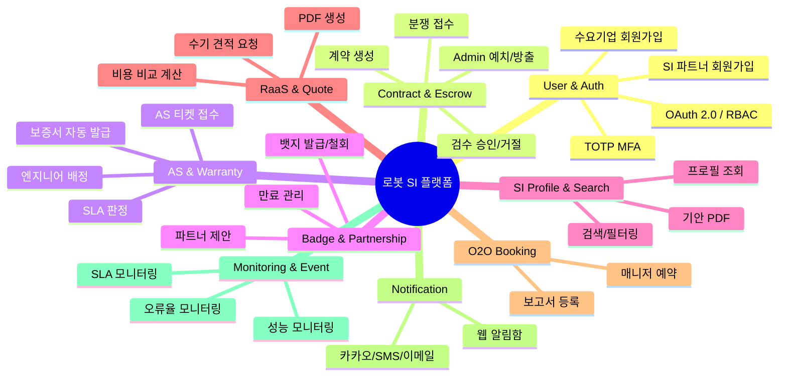

# 📝 작업 보고서: SRS → 개발 태스크 분해

**작업일:** 2026-04-18  
**작업자:** System Architect / Technical PM  
**산출물:** [07_TASK-LIST-v1.md](file:///c:/Users/cloud/OneDrive/바탕%20화면/2026%20모두의연구소/modu-week-4-SRS-from-PRD/TASKS/07_TASK-LIST-v1.md)

---

## 1. 작업 개요

| 항목 | 내용 |
|:---|:---|
| **입력 문서** | [06_SRS-v1.md](file:///c:/Users/cloud/OneDrive/바탕%20화면/2026%20모두의연구소/modu-week-4-SRS-from-PRD/06_SRS-v1.md) (SRS-001, Rev 1.2 / v0.4, 1,576줄) |
| **작업 목적** | SRS 문서를 분석하여 누락 없이 실행 가능한 개발 태스크(Epic/Feature 단위) 리스트 도출 |
| **적용 방법론** | 4단계 처리 절차 (Contract/Data → CQRS Logic → AC→TDD → NFR/Dependency) |
| **산출물 위치** | `TASKS/07_TASK-LIST-v1.md` |
| **총 태스크 수** | **171개** |

---

## 2. 분석 범위

### 2.1 SRS 문서 스캐닝 범위

| SRS 섹션 | 분석 내용 | 추출 태스크 유형 |
|:---|:---|:---|
| §1.2 Scope (In-Scope/Constraints) | MVP Phase 1 범위 6건, 제약사항 17건 확인 | NFR, DB 설계 제약 반영 |
| §3.1 External Systems | 외부 시스템 2건 (카카오 알림톡, SMS) 확인 | API-025, FC-023 |
| §3.3 API Overview | 내부 API 13건 (Server Action/Route Handler) | API-001~027 |
| §3.4 Interaction Sequences | 시퀀스 다이어그램 6건 | FC, CRON 흐름 검증 |
| §4.1 Functional Requirements | 기능 요구사항 30건 (REQ-FUNC-001~036) | FQ, FC, CRON, TEST |
| §4.2 Non-Functional Requirements | 비기능 요구사항 28건 (REQ-NF-001~028) | NFR-001~024 |
| §6.1 API Endpoint List | 엔드포인트 27건 | API DTO 정의 매핑 |
| §6.2 Entity & Data Model | 엔티티 11건 + ER/Class Diagram | DB-001~017 |
| §6.3 Detailed Sequences | 상세 시퀀스 6건 | 상태 전이 규칙 검증 |
| §6.4 Validation Plan | 실험 5건 (EXP-01~05) | 참조만 (태스크 미생성) |
| §6.5 Risk Registry | 리스크 5건 (R-01~05) | MOCK, NFR 우선순위 반영 |

### 2.2 도메인 식별 결과



---

## 3. 처리 절차별 결과

### Step 1. 계약·데이터 명세 (SSOT 확립)

> **목표:** 에이전트가 흔들리지 않고 참조할 단일 진실 공급원을 확립

| 분류 | 태스크 수 | 주요 내용 |
|:---|:---:|:---|
| DB 스키마 (DB-) | 17 | SRS 명시 엔티티 11건 + **신규 식별 5건** |
| API DTO (API-) | 27 | Server Action 16건, Route Handler 6건, Server Component 5건 |
| Mock/Seed (MOCK-) | 7 | 도메인별 Prisma Seed 스크립트 |
| **소계** | **51** | |

> [!IMPORTANT]
> **SRS에서 암묵적으로 요구되었으나 명시적 엔티티가 없었던 5개 테이블을 식별하여 보완했습니다:**
> 
> | 보완 엔티티 | Task ID | 식별 근거 |
> |:---|:---|:---|
> | `PARTNER_PROPOSAL` | DB-013 | Class Diagram(§6.2.13) + 시퀀스(§6.3.2)에서 확인, ER Diagram 누락 |
> | `NOTIFICATION` | DB-014 | §3.1 알림 시스템 우회 처리 요건에서 내장 웹 알림함 필요 |
> | `EVENT_LOG` | DB-015 | REQ-FUNC-027의 `signup_complete` 이벤트 DB 기록 요건 |
> | `ROBOT_MODEL` | DB-016 | REQ-FUNC-018 RaaS 계산 엔진의 기반 마스터 데이터 |
> | `AS_ENGINEER` | DB-017 | §6.3.5 AS 엔지니어 매칭 시퀀스에서 요구 |

### Step 2. 로직 및 상태 변경 분해 (CQRS)

> **목표:** 읽기(Query)와 쓰기(Command)를 철저히 분리하여 에이전트 문맥 격리

| 분류 | 태스크 수 | 설계 원칙 |
|:---|:---:|:---|
| Query (FQ-) | 11 | Server Component 기반 조회, DB 상태 미변경 |
| Command (FC-) | 29 | Server Action / Route Handler 기반, 입력 검증 + DB 쓰기 |
| Cron/Batch (CRON-) | 9 | Vercel Cron 기반, 만료/모니터링 자동화 |
| **소계** | **49** | |

**상태 전이(State Machine) 식별 결과:**

````carousel
```
CONTRACT 상태 전이:
pending → escrow_held → inspecting
  → release_pending → completed
  → disputed (거절 또는 기한 만료)
```
<!-- slide -->
```
ESCROW_TX 상태 전이:
(생성 시) → held → released
                 → refunded
```
<!-- slide -->
```
PARTNER_PROPOSAL 상태 전이:
pending → accepted → (BADGE 생성)
        → rejected
        → expired (D+5 자동)
```
<!-- slide -->
```
QUOTE_LEAD 상태 전이:
pending → in_progress → responded → closed
```
````

### Step 3. AC → 테스트 태스크 변환

> **목표:** SRS의 모든 Acceptance Criteria를 실행 가능한 테스트 코드 작성 태스크로 변환

| Feature 그룹 | TEST 태스크 수 | 커버하는 REQ-FUNC |
|:---|:---:|:---|
| F-01: 에스크로 결제 | 6 | REQ-FUNC-001, 002, 003, 005 |
| F-02: AS망 & 보증서 | 4 | REQ-FUNC-006, 007, 008 |
| F-03: 평판 뷰어 | 2 | REQ-FUNC-009, 010 |
| F-04: 뱃지 시스템 | 5 | REQ-FUNC-013~017, 030~032 |
| F-05: RaaS 계산기 | 4 | REQ-FUNC-018~021 |
| F-06: O2O (Phase 2) | 4 | REQ-FUNC-023~026 |
| 온보딩 & 검색 | 3 | REQ-FUNC-027~029 |
| 모니터링 알림 | 4 | REQ-FUNC-033~036 |
| **소계** | **32** | |

> [!TIP]
> 각 TEST 태스크는 GWT (Given-When-Then) 형식으로 **성공 시나리오와 실패 시나리오(400/403/404/409 에러)**를 모두 포함합니다.  
> 이를 통해 에이전트에게 "이 테스트 코드가 통과할 때까지 비즈니스 로직을 수정하라"는 명령이 가능합니다.

### Step 4. 비기능 제약 & 인프라

| 분류 | 태스크 수 | 주요 항목 |
|:---|:---:|:---|
| Infra & DevOps (NFR-001~006) | 6 | Next.js 세팅, Vercel, Supabase, Cron, AI SDK |
| Performance (NFR-007~010) | 4 | LCP, API 응답, PDF 생성, 500CCU 부하테스트 |
| Security (NFR-011~015) | 5 | TLS, 5년 보존, 30일 파기, RBAC, 로그 정책 |
| Reliability (NFR-016~020) | 5 | 가용성 99.5%, 오류율, RPO/RTO, 법규 준수 |
| Cost & Scaling (NFR-021~024) | 4 | 비용 모니터링, Brand-Agnostic, 확장 검증 |
| **소계** | **24** | |

### Step 5. UI/UX 컴포넌트

| 포털 | UI 태스크 수 | 주요 화면 |
|:---|:---:|:---|
| Buyer Portal (CLI-01) | 7 | 회원가입, 검색, 프로필, 에스크로, 검수, AS, RaaS |
| SI Partner Portal (CLI-02) | 2 | 회원가입, 프로필/제안 관리 |
| Manufacturer Portal (CLI-03) | 1 | 뱃지/제안/대시보드 |
| Admin Dashboard (CLI-04) | 1 | 에스크로/AS/모니터링 통합 |
| 공통 | 4 | 레이아웃, 알림함, 견적팝업, O2O 캘린더 |
| **소계** | **15** | |

---

## 4. 태스크 전체 집계

| Step | 접두사 | 태스크 수 | 비율 |
|:---|:---|:---:|:---:|
| Step 1-1: DB Schema | DB- | 17 | 9.9% |
| Step 1-2: API Contract | API- | 27 | 15.8% |
| Step 1-3: Mock/Seed | MOCK- | 7 | 4.1% |
| Step 2-1: Query | FQ- | 11 | 6.4% |
| Step 2-2: Command | FC- | 29 | 17.0% |
| Step 2-3: Cron/Batch | CRON- | 9 | 5.3% |
| Step 3: Test | TEST- | 32 | 18.7% |
| Step 4: NFR/Infra | NFR- | 24 | 14.0% |
| Step 5: UI/UX | UI- | 15 | 8.8% |
| **합계** | | **171** | **100%** |

### 복잡도 분포

| 복잡도 | 기준 | 태스크 수 | 비율 |
|:---|:---|:---:|:---:|
| **H** (High) | 5일+ | 23 | 13.5% |
| **M** (Medium) | 2~4일 | 115 | 67.2% |
| **L** (Low) | 1일 이하 | 33 | 19.3% |

### Epic(도메인)별 분포

| Epic | 태스크 수 |
|:---|:---:|
| Contract & Escrow | 28 |
| Badge & Partnership | 24 |
| User & Auth | 18 |
| AS & Warranty | 18 |
| RaaS & Quote | 16 |
| SI Profile & Search | 14 |
| Monitoring & Event | 13 |
| Infra & DevOps / Performance / Security / Reliability / Cost | 24 |
| O2O Booking (Phase 2) | 12 |
| Notification | 5 |
| UI/UX | 15 |
| Project Setup | 1 |

---

## 5. Phase 구분

| Phase | 태스크 범위 | 태스크 수 | 비고 |
|:---|:---|:---:|:---|
| **Phase 1 (MVP)** | F-01~F-05, 온보딩, 인프라, 모니터링 | **~159** | 핵심 비즈니스 기능 전체 |
| **Phase 2** | F-06 (O2O) 관련 | **~12** | DB-010, API-023~024, FC-025~027, FQ-011, TEST-022~025, UI-012 |

> [!NOTE]
> Phase 2 스키마(DB-010)와 DTO(API-023~024)는 Phase 1에서 사전 정의하여 향후 확장성을 확보합니다.

---

## 6. SRS 요구사항 커버리지 검증

### 기능 요구사항 (REQ-FUNC) 매핑

| REQ-FUNC ID | 커버 태스크 | 커버 여부 |
|:---|:---|:---:|
| REQ-FUNC-001 | FC-005, FC-006, TEST-001, TEST-002 | ✅ |
| REQ-FUNC-002 | FC-007, FC-009, TEST-003, TEST-006 | ✅ |
| REQ-FUNC-003 | FC-008, FC-010, TEST-004 | ✅ |
| REQ-FUNC-005 | CRON-001, TEST-005 | ✅ |
| REQ-FUNC-006 | FC-014, TEST-007 | ✅ |
| REQ-FUNC-007 | FC-011, FC-012, TEST-008, TEST-009 | ✅ |
| REQ-FUNC-008 | FC-013, FQ-005, FQ-010, TEST-010 | ✅ |
| REQ-FUNC-009 | FQ-002, TEST-011 | ✅ |
| REQ-FUNC-010 | FC-015, TEST-012 | ✅ |
| REQ-FUNC-013 | FC-016, TEST-013 | ✅ |
| REQ-FUNC-014 | FC-017, CRON-003, TEST-014 | ✅ |
| REQ-FUNC-015 | FQ-003, TEST-015 | ✅ |
| REQ-FUNC-016 | CRON-002, TEST-016 | ✅ |
| REQ-FUNC-017 | FC-016, TEST-013 | ✅ |
| REQ-FUNC-018 | FC-020, TEST-018 | ✅ |
| REQ-FUNC-019 | FC-021, TEST-019 | ✅ |
| REQ-FUNC-020 | FC-022, TEST-020 | ✅ |
| REQ-FUNC-021 | FC-020, FC-028, TEST-021 | ✅ |
| REQ-FUNC-023 | FQ-011, FC-025, TEST-022 | ✅ |
| REQ-FUNC-024 | FC-025, TEST-023 | ✅ |
| REQ-FUNC-025 | FC-027, TEST-024 | ✅ |
| REQ-FUNC-026 | FC-026, TEST-025 | ✅ |
| REQ-FUNC-027 | FC-001, TEST-026 | ✅ |
| REQ-FUNC-028 | FC-002, TEST-027 | ✅ |
| REQ-FUNC-029 | FQ-001, TEST-028 | ✅ |
| REQ-FUNC-030 | FC-018, FC-019, TEST-017 | ✅ |
| REQ-FUNC-031 | FQ-006, FC-019, TEST-017 | ✅ |
| REQ-FUNC-032 | CRON-004, CRON-005, TEST-017 | ✅ |
| REQ-FUNC-033 | CRON-006, TEST-029 | ✅ |
| REQ-FUNC-034 | CRON-007, TEST-030 | ✅ |
| REQ-FUNC-035 | CRON-008, TEST-031 | ✅ |
| REQ-FUNC-036 | CRON-009, TEST-032 | ✅ |

**커버리지: 31/31 = 100%** (REQ-FUNC-004는 SRS에 존재하지 않음)

### 비기능 요구사항 (REQ-NF) 매핑

| REQ-NF 범위 | 커버 태스크 | 커버 여부 |
|:---|:---|:---:|
| REQ-NF-001~006 (성능) | NFR-007~010 | ✅ |
| REQ-NF-007~013 (신뢰성) | NFR-016~020, NFR-012, NFR-015 | ✅ |
| REQ-NF-014~017 (보안) | NFR-011~014 | ✅ |
| REQ-NF-018~020 (비용) | NFR-021, NFR-024 | ✅ |
| REQ-NF-021~022 (확장/유지보수) | NFR-022, NFR-023 | ✅ |
| REQ-NF-023~028 (KPI) | FQ-009, FQ-010 등 대시보드 조회 | ✅ |

**커버리지: 28/28 = 100%**

---

## 7. 제약사항 및 의사결정 사항

### 7.1 SRS에 명시되지 않아 추가하지 않은 항목

| 항목 | 사유 |
|:---|:---|
| 사용자 비밀번호 단방향 암호화 (Bcrypt) | SRS에서 OAuth 2.0 / Supabase Auth로 인증 위임, 별도 비밀번호 관리 미명시 |
| CI/CD 파이프라인 상세 (GitHub Actions 등) | SRS에서 "Git Push → 자동 배포" 수준만 명시 (CON-16), 도구 미지정 |
| i18n / 다국어 지원 | SRS에 미명시 |
| 모바일 네이티브 앱 | SRS에서 "반응형 웹 애플리케이션"으로 한정 (§3.2) |

### 7.2 주요 의사결정

| 결정 사항 | 근거 |
|:---|:---|
| UI 태스크와 백엔드 태스크 분리 | 사용자 Instruction의 "UI/UX 디자인 작업과 백엔드/프론트엔드 개발 관점 분리" 준수 |
| Phase 2 O2O 스키마를 Phase 1에서 사전 정의 | 향후 확장 시 마이그레이션 비용 최소화, DB 구조 안정성 확보 |
| CQRS 패턴 기반 FQ/FC 분리 | 사용자 Instruction의 "상태 변경 여부로 닫힌 문맥(Closed Context)으로 분해" 원칙 적용 |
| 모든 AC를 TEST- 태스크로 변환 | 사용자 Instruction의 "자동화된 피드백 루프(테스트 코드) Task로 변환" 원칙 적용 |

---

## 8. 다음 단계 제안

| 순서 | 다음 작업 | 설명 |
|:---:|:---|:---|
| 1 | 태스크 우선순위 정렬 및 스프린트 배정 | 171개 태스크를 2주 스프린트 단위로 배정 |
| 2 | 각 태스크별 상세 구현 명세 작성 | Task → 개별 이슈(GitHub Issue)로 전환, DoD 체크리스트 첨부 |
| 3 | Prisma Schema 초안 작성 | DB-001~017 기반 `schema.prisma` 파일 생성 |
| 4 | 프로젝트 스캐폴딩 | NFR-001 실행 (Next.js + Tailwind + shadcn/ui 초기 세팅) |

---

*본 보고서는 SRS-001 (Rev 1.2 / v0.4) 문서를 유일한 원천으로 하여 작성되었습니다. SRS에 명시되지 않은 기능은 추가하지 않았으며, SRS 내 암묵적으로 요구되는 엔티티 5건은 근거를 명시하여 보완하였습니다.*
