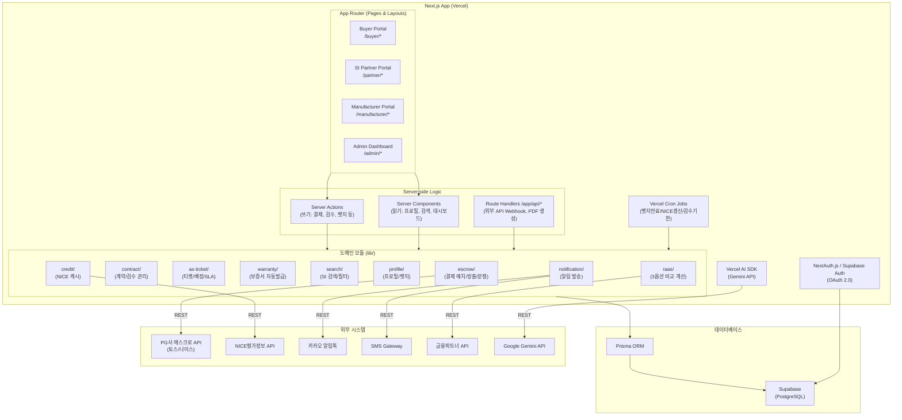
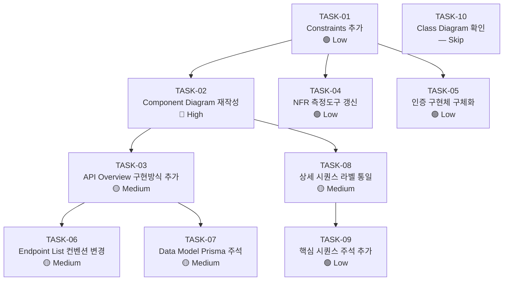

# SRS v0.3 기술 스택 정합성 전환 계획서

**Document ID:** PLAN-SRS-v0.3-TECH-ALIGN  
**Date:** 2026-04-18  
**Status:** Draft — 승인 후 실행  
**Input:** SRS-v0_2.md + C-TEC-001 ~ C-TEC-007 (목표 기술 스택)  
**Output:** SRS-v0_3.md (기술 스택 정합 완료 버전)

---

## 1. 변경 동기 및 목표

### 1.1 변경 동기

현재 `SRS-v0_2.md`는 **기술 스택에 대해 중립적(agnostic)** 으로 작성되어, 아키텍처 다이어그램과 인프라 가정이 범용 마이크로서비스 구조(BFF, Redis, Datadog 등)를 전제하고 있다. 이는 실제 MVP 구현에 사용할 **Next.js 풀스택 단일 프레임워크** 스택과 구조적 불일치를 유발하여, 개발 착수 시 SRS↔구현 간 해석 격차(gap)가 발생할 위험이 있다.

### 1.2 목표 기술 스택 (C-TEC)

| ID | 제약사항 | 범주 |
|:---|:---|:---:|
| **C-TEC-001** | 모든 서비스는 **Next.js (App Router)** 기반의 단일 풀스택 프레임워크로 구현한다. 프론트엔드와 백엔드를 별도 분리하지 않는다. | 내부 |
| **C-TEC-002** | 서버 측 로직(DB 접근, API 호출 등)은 Next.js의 **Server Actions** 또는 **Route Handlers**를 사용하여 별도의 백엔드 서버 없이 구현한다. | 내부 |
| **C-TEC-003** | 데이터베이스는 **Prisma + 로컬 SQLite**(개발) / **Supabase(PostgreSQL)**(배포)를 사용하여 인프라 설정 복잡도를 최소화한다. | 내부 |
| **C-TEC-004** | UI 및 스타일링은 **Tailwind CSS + shadcn/ui**를 사용하여 AI가 일관된 디자인 코드를 생성하도록 강제한다. | 내부 |
| **C-TEC-005** | LLM 오케스트레이션은 별도의 Python 서버 없이 **Vercel AI SDK**를 사용하여 Next.js 내부에서 직접 구현한다. | 외부 |
| **C-TEC-006** | LLM 호출은 **Google Gemini API**를 기본으로 사용하며, 환경 변수 설정만으로 모델 교체가 가능하도록 SDK의 표준 인터페이스를 준수한다. | 외부 |
| **C-TEC-007** | 배포 및 인프라 관리는 **Vercel 플랫폼**으로 단일화하며, CI/CD 설정 없이 Git Push만으로 배포를 자동화한다. | 외부 |

### 1.3 변경 원칙

1. **비즈니스 요구사항 불변**: 기능 요구사항(REQ-FUNC-001~036)의 Acceptance Criteria는 **일체 변경하지 않는다.**
2. **아키텍처 표현만 전환**: How(구현 방식)만 변경하고, What(기능)과 Why(비즈니스 목표)는 보존한다.
3. **측정 지표 목표치 유지**: NFR 성능 목표(p95, CCU 등)는 유지하되, 측정 도구명만 스택에 맞게 교체한다.

---

## 2. 작업 명세 (변경 항목별 상세)

### TASK-01: §1.2.3 Constraints — C-TEC 제약사항 추가

| 항목 | 내용 |
|:---|:---|
| **변경 위치** | §1.2.3 Constraints 테이블 (Line 41~54) |
| **변경 내용** | CON-11 ~ CON-17 (7건) 신규 행 추가 |
| **영향 REQ** | 없음 (제약사항 추가이므로 기존 REQ 불변) |
| **복잡도** | 🟢 Low |

**추가할 제약사항:**

| ID | 제약사항 | 근거 |
|:---|:---|:---|
| CON-11 | 모든 서비스는 Next.js (App Router) 기반의 단일 풀스택 프레임워크로 구현한다 | C-TEC-001 |
| CON-12 | 서버 측 로직은 Next.js Server Actions 또는 Route Handlers로 구현하며, 별도 백엔드 서버를 두지 않는다 | C-TEC-002 |
| CON-13 | 데이터베이스는 Prisma ORM을 사용하며, 로컬 개발은 SQLite, 배포 환경은 Supabase (PostgreSQL)를 사용한다 | C-TEC-003 |
| CON-14 | UI/스타일링은 Tailwind CSS + shadcn/ui로 통일한다 | C-TEC-004 |
| CON-15 | LLM 오케스트레이션은 Vercel AI SDK + Google Gemini API로 구현하며, 환경 변수를 통해 모델 교체가 가능해야 한다 | C-TEC-005, C-TEC-006 |
| CON-16 | 배포 및 인프라는 Vercel 플랫폼으로 단일화하며, Git Push → 자동 배포를 강제한다 | C-TEC-007 |
| CON-17 | Vercel Pro 플랜을 기준으로 하며, Serverless Function 실행 시간 60초, Cron 최소 주기 1분을 활용한다 | C-TEC-007 (운영 요건) |

---

### TASK-02: §3.1.1 Component Diagram — 전면 재작성

| 항목 | 내용 |
|:---|:---|
| **변경 위치** | §3.1.1 System Component Diagram (Line 141~215) |
| **변경 내용** | 마이크로서비스(BFF, 별도 서비스) 구조 → **Next.js 단일 모놀리스 + 도메인 모듈** 구조로 전면 재작성 |
| **영향 REQ** | 없음 (아키텍처 표현 변경, 기능 불변) |
| **복잡도** | 🔴 High |

**변경 전 → 후 비교:**

```
[변경 전]
Clients → BFF/API Gateway → CoreServices / MatchingServices / FinanceServices / InfraServices → DB(PostgreSQL) + Cache(Redis) → External APIs

[변경 후]
Clients (Next.js SSR/CSR) → Next.js App Router
  ├── Server Components (읽기 → Prisma 직접 접근)
  ├── Server Actions (쓰기 → Prisma 직접 접근)
  ├── Route Handlers /app/api/* (외부 API 연동, Webhook)
  ├── Vercel Cron Jobs (배치 스케줄링)
  └── Vercel AI SDK (LLM 기능)
→ Prisma ORM → Supabase (PostgreSQL)
→ External APIs (PG, NICE, 카카오, SMS, 금융파트너)
```

**신규 Component Diagram 구조 (Mermaid 초안):**



---

### TASK-03: §3.3 API Overview — 구현 방식 컬럼 추가

| 항목 | 내용 |
|:---|:---|
| **변경 위치** | §3.3 API Overview 테이블 (Line 306~321) |
| **변경 내용** | "구현 방식" 컬럼 추가: 각 API에 대해 `Server Action`, `Route Handler`, `Server Component` 중 하나를 명시 |
| **영향 REQ** | 없음 |
| **복잡도** | 🟡 Medium |

**변경 규칙:**
- **외부(Outbound) API** → `Route Handler` (/app/api/* 경유, 외부 REST 호출)
- **내부(쓰기)** → `Server Action` (form action, DB mutation)
- **내부(읽기)** → `Server Component` (서버 사이드 데이터 fetch)

| API ID | 현재 방향 | 추가: 구현 방식 |
|:---:|:---:|:---|
| API-01 | 외부 | Route Handler (`/app/api/escrow/deposit`) |
| API-02 | 외부 | Route Handler (`/app/api/escrow/release`) |
| API-03 | 외부 | Route Handler (`/app/api/credit/query`) |
| API-04 | 외부 | Route Handler (`/app/api/notifications/kakao`) |
| API-05 | 외부 | Route Handler (`/app/api/notifications/sms`) |
| API-06 | 외부 | Route Handler (`/app/api/raas/finance`) |
| API-07 | 내부(읽기) | Server Component + Prisma 직접 쿼리 |
| API-08 | 내부(계산) | Server Action (`calculateRaasOptions`) |
| API-09 | 내부(생성) | Route Handler (`/app/api/reports/pdf`) — 바이너리 응답 |
| API-10 | 내부(쓰기) | Server Action (`issueBadge`, `revokeBadge`) |
| API-11 | 내부(쓰기) | Server Action (`createAsTicket`, `assignEngineer`) |
| API-12 | 내부(생성) | Route Handler (`/app/api/warranty/issue`) — PDF 바이너리 |

---

### TASK-04: §4.2 Non-Functional Requirements — 측정 도구 갱신

| 항목 | 내용 |
|:---|:---|
| **변경 위치** | §4.2.1 REQ-NF-001 (Line 591), §4.2.1 REQ-NF-005~006 (Line 595~596), §4.1.9 REQ-FUNC-033~036 (Line 578~581) |
| **변경 내용** | 모니터링/측정 도구명 변경 |
| **영향 REQ** | REQ-NF-001, 005, 006 측정 기준 컬럼 / REQ-FUNC-033~036 알림 채널 |
| **복잡도** | 🟢 Low |

**도구 변경 매핑:**

| 현재 (SRS v0.2) | 변경 후 (SRS v0.3) | 사유 |
|:---|:---|:---|
| Datadog RUM Core Web Vitals | **Vercel Analytics** (Web Vitals 자동 수집) | C-TEC-007, Vercel 내장 |
| k6 또는 Locust (부하 테스트) | k6 (유지) — **Vercel Preview 환경에서 실행** | k6는 오픈소스, Vercel 호환 |
| PagerDuty 알림 | **Slack Webhook** (Vercel Log Drain 연동) | MVP 비용 절감 |
| Amplitude (이벤트 추적) | **Vercel Analytics** + 커스텀 이벤트 로그 (DB) | 단일 도구 통합 |
| Metabase 대시보드 | **Supabase Dashboard** + 커스텀 Admin 페이지 | Supabase 내장 SQL 편집기 활용 |

---

### TASK-05: §REQ-NF-016 인증 구현체 구체화

| 항목 | 내용 |
|:---|:---|
| **변경 위치** | §4.2.3 REQ-NF-016 (Line 616) |
| **변경 내용** | "OAuth 2.0 + MFA" → "**NextAuth.js (Auth.js) 또는 Supabase Auth** 기반 OAuth 2.0 + TOTP MFA" 로 구체화 |
| **영향 REQ** | REQ-NF-016 측정 기준 변경 |
| **복잡도** | 🟢 Low |

---

### TASK-06: §6.1 API Endpoint List — 엔드포인트 컨벤션 변경

| 항목 | 내용 |
|:---|:---|
| **변경 위치** | §6.1 API Endpoint List 테이블 (Line 700~732) |
| **변경 내용** | (1) 엔드포인트 경로를 Next.js App Router 컨벤션 `/app/api/` 기반으로 재정의, (2) "구현 방식" 컬럼 추가 (Server Action / Route Handler 구분) |
| **영향 REQ** | 없음 (인터페이스 URL 매핑 변경, 비즈니스 로직 불변) |
| **복잡도** | 🟡 Medium |

**변경 규칙:**
- `/api/v1/*` → `/api/*` (Next.js Route Handler는 버전 접두사 불필요, MVP 단일 버전)
- Server Action 대상은 엔드포인트 없이 **함수명**으로 표기 (예: `action: submitInspection`)
- 외부 Webhook 수신용은 Route Handler로 유지

---

### TASK-07: §6.2 Data Model — Prisma 주석 추가

| 항목 | 내용 |
|:---|:---|
| **변경 위치** | §6.2 Entity & Data Model 전체 (Line 734~963) |
| **변경 내용** | (1) 각 테이블 상단에 Prisma model 스니펫 예시 추가, (2) PostgreSQL 전용 타입(`TEXT[]`, `JSONB`)에 Prisma 매핑 주석(`@db.JsonB`, `Json` 타입 사용) 추가, (3) SQLite 호환성 노트 추가 |
| **영향 REQ** | 없음 (데이터 모델 스키마 불변, ORM 표기만 추가) |
| **복잡도** | 🟡 Medium |

**SQLite ↔ PostgreSQL 호환성 처리 규칙:**

| PostgreSQL 타입 | Prisma 타입 | SQLite 대응 | 비고 |
|:---|:---|:---|:---|
| `JSONB` | `Json` | JSON 문자열 저장 | Prisma가 자동 직렬화/역직렬화 |
| `TEXT[]` | `String[]` | JSON 배열 문자열 | `@db.Text` 사용 불가 → `Json` 대체 권장 |
| `ENUM` | `enum` (Prisma) | 문자열 검증 | Prisma enum → SQLite에서는 String으로 매핑 |
| `DECIMAL(15,2)` | `Decimal` | `REAL` | 정밀도 차이 주의, 로컬 개발 시 허용 |

---

### TASK-08: §6.3 상세 시퀀스 다이어그램 — 라벨 통일

| 항목 | 내용 |
|:---|:---|
| **변경 위치** | §6.3.1 ~ §6.3.6 모든 상세 시퀀스 다이어그램 (Line 1147~1508) |
| **변경 내용** | 모든 참가자(participant) 라벨을 Next.js 아키텍처에 맞게 통일 |
| **영향 REQ** | 없음 (논리 흐름 불변, 표현만 변경) |
| **복잡도** | 🟡 Medium |

**라벨 변경 매핑:**

| 현재 라벨 | 변경 후 라벨 |
|:---|:---|
| `BFF` / `플랫폼 BFF` | `Next.js Server` |
| `WEB` / `웹 프론트엔드` | `Next.js Client (RSC/CSR)` |
| `DB` / `데이터베이스` | `Prisma → Supabase` |
| `CACHE` / `DB캐시(TTL=30일)` | `Prisma (TTL 컬럼)` |
| `BATCH` / `배치 스캐너` | `Vercel Cron` |
| `LOG` / `로그/모니터링` | `Vercel Logs` |
| `MON` / `모니터링` | `Vercel Analytics + Slack` |
| `NOTI` / `알림 서비스` | `Notification Module (Route Handler)` |
| `CALC` / `RaaS계산엔진` | `RaaS Module (Server Action)` |

---

### TASK-09: §3.4 핵심 시퀀스 다이어그램 — 라벨 경량 갱신

| 항목 | 내용 |
|:---|:---|
| **변경 위치** | §3.4.1 ~ §3.4.6 핵심 시퀀스 다이어그램 (Line 323~494) |
| **변경 내용** | 핵심 다이어그램은 **추상도가 높으므로** "플랫폼" 라벨을 유지하되, 부제/주석에 "(Next.js Server)" 명시 |
| **영향 REQ** | 없음 |
| **복잡도** | 🟢 Low |

---

### TASK-10: §6.2.11 Class Diagram — 변경 없음 확인

| 항목 | 내용 |
|:---|:---|
| **변경 위치** | §6.2.11 Class Diagram (Line 965~1145) |
| **변경 내용** | **변경 없음**. 도메인 객체의 속성/메서드는 기술 스택에 독립적이며, Prisma model과 1:1 매핑 가능 |
| **복잡도** | — (변경 불필요) |

---

## 3. 기술 리스크 및 완화 전략

| ID | 리스크 | 심각도 | 발생 가능성 | 완화 전략 | 영향 REQ |
|:---|:---|:---:|:---:|:---|:---|
| **R-TEC-01** | Vercel Serverless 함수 실행 시간 제한 — PG API 타임아웃(10초) + 재시도(10초) = 최대 20초+ → Hobby 플랜 10초 제한 초과 | 🔴 상 | 중상 | **Vercel Pro 플랜 필수** (60초 제한). PG Webhook 비동기 패턴 검토: 결제 요청 후 즉시 응답 → Webhook으로 상태 수신 | REQ-FUNC-001, 004 |
| **R-TEC-02** | PDF 생성 — Puppeteer는 Vercel Serverless에서 바이너리 크기 제한(50MB unzipped) 초과 | 🟡 중 | 상 | **jsPDF + jspdf-autotable** 또는 **@react-pdf/renderer** 사용. 서버 사이드에서 경량 PDF 빌드. Puppeteer 사용 금지 | REQ-FUNC-010, 019 |
| **R-TEC-03** | Vercel Cron 주기 제한 — 검수 기한(7영업일) 만료 자동 전환(REQ-FUNC-005)은 최소 1일 1회 배치로 가능하나, 분 단위 정밀도 필요 시 제약 | 🟡 중 | 중 | Vercel Pro Cron (최소 1분 주기) 활용. 또는 Supabase pg_cron + Edge Function 조합. MVP에서는 **1일 1회 00:00 배치**로 충분 (영업일 단위 판정이므로) | REQ-FUNC-005, 016 |
| **R-TEC-04** | SQLite ↔ PostgreSQL ORM 호환 — `TEXT[]`, `JSONB` 등 Postgres 전용 타입이 SQLite에서 지원 안 됨 | 🟢 하 | 중 | Prisma가 추상화. `String[]` → SQLite에서는 JSON 문자열로 매핑. 개발 초기에 **Prisma migrate 테스트** 수행하여 호환성 확인 | 전체 Data Model |
| **R-TEC-05** | Vercel Analytics 한계 — PagerDuty 수준의 실시간 알림(5분 연속 실패율 감지)은 Vercel Analytics만으로 구현 불가 | 🟡 중 | 상 | Route Handler 내 커스텀 카운터 + **Slack Incoming Webhook** 조합. 5분 윈도우 집계는 DB 기반 로그 테이블 + Vercel Cron 1분 주기 스캔으로 구현 | REQ-FUNC-033~036 |

---

## 4. MVP 핵심 사용자 경험(UX) 보전 검증

> **검증 목적:** 기술 스택 전환이 **사용자가 체감하는 가치 전달(Value Delivery)** 을 훼손하지 않는지 확인한다.

### 4.1 검증 원칙

MVP의 가치 전달은 다음 5가지 핵심 UX 흐름으로 정의된다. 이 흐름은 PRD의 Pain → Feature 매핑에서 도출되며, 각 흐름이 기술 스택 변경에 의해 **행동(What)이 동일하게 유지**되는지를 검증한다.

### 4.2 핵심 UX 흐름 × 기술 변경 영향 매트릭스

#### UX-01: "투자금 보호" — 에스크로 결제 → 검수 → 자금 방출

| 단계 | 사용자 행동 | 변경 전 구현 | 변경 후 구현 | UX 동일성 |
|:---:|:---|:---|:---|:---:|
| 1 | 계약금 결제 버튼 클릭 | BFF → PG REST API | **Server Action** → Route Handler → PG REST API | ✅ 동일 |
| 2 | "예치 완료" 확인 화면 | BFF 응답 → 프론트 렌더 | Server Action revalidation → **React RSC 자동 갱신** | ✅ 동일 (더 빠름) |
| 3 | 보증서 자동 다운로드 | BFF → PDF 바이너리 응답 | Route Handler → **jsPDF 생성** → 바이너리 응답 | ✅ 동일 |
| 4 | 검수 합격 승인 | BFF PUT API | **Server Action** (`submitInspection`) | ✅ 동일 |
| 5 | PG 타임아웃 시 재시도 + CS 팝업 | BFF 재시도 로직 | Route Handler 재시도 로직 (Vercel Pro 60초 내) | ✅ 동일 |

> **결론: UX 훼손 없음.** PG API 호출의 물리적 경로만 BFF → Route Handler로 변경. 사용자 화면과 타이밍은 동일.

---

#### UX-02: "객관적 증빙 즉시 확보" — SI 프로필 조회 → 기안 리포트 PDF

| 단계 | 사용자 행동 | 변경 전 구현 | 변경 후 구현 | UX 동일성 |
|:---:|:---|:---|:---|:---:|
| 1 | SI 검색 (필터) | BFF → 검색 엔진 | **Server Component** → Prisma 쿼리 (SSR) | ✅ 동일 (SSR로 초기 로딩 더 빠름) |
| 2 | SI 프로필 상세 페이지 | BFF → NICE 캐시 조회 | **Server Component** → Prisma (캐시 TTL 컬럼 확인) → 필요 시 Route Handler → NICE API | ✅ 동일 |
| 3 | "실시간 조회 불가" 배너 | BFF 폴백 → 프론트 배너 | Server Component → 캐시 폴백 → **shadcn/ui Alert** | ✅ 동일 |
| 4 | 기안 리포트 PDF 다운로드 | BFF → PDF 생성 (서버) | Route Handler → **@react-pdf/renderer** 또는 **jsPDF** | ⚠️ **확인 필요** |
| 5 | PDF 내 4섹션 포함 여부 | 서버 PDF 엔진 | jsPDF/react-pdf로 재무·기술·인증·리뷰 4섹션 구성 | ✅ 가능 |

> **결론: UX 훼손 없음**, 단 PDF 생성 엔진 변경(jsPDF)으로 **레이아웃 품질 사전 검증 필요** (R-TEC-02). 4섹션 구성 자체는 데이터 기반이므로 기술 무관.

---

#### UX-03: "인증된 파트너만 보기" — 뱃지 필터링 → 파트너 제안

| 단계 | 사용자 행동 | 변경 전 구현 | 변경 후 구현 | UX 동일성 |
|:---:|:---|:---|:---|:---:|
| 1 | 뱃지 보유 SI 필터 클릭 | BFF → 검색 필터 | **Server Component** → Prisma WHERE `is_active=true` | ✅ 동일 (더 빠름) |
| 2 | 뱃지 발급 (제조사) | BFF → DB INSERT | **Server Action** (`issueBadge`) | ✅ 동일 |
| 3 | 뱃지 만료 D-7 알림 | Batch Scheduler → 알림 | **Vercel Cron** → Server Logic → Route Handler (알림 API) | ✅ 동일 |
| 4 | 뱃지 만료 시 자동 비노출 (≤10분) | Batch Scanner | **Vercel Cron (1분 주기)** → Prisma UPDATE | ✅ 동일 |
| 5 | 파트너 제안 발송 (≤3초) | BFF → DB + 알림 | **Server Action** → Prisma + Route Handler (알림) | ✅ 동일 |

> **결론: UX 훼손 없음.** Vercel Cron이 기존 Batch Scheduler를 완전 대체.

---

#### UX-04: "비용 한눈에 비교" — RaaS 3옵션 계산 → PDF → 금융 연결

| 단계 | 사용자 행동 | 변경 전 구현 | 변경 후 구현 | UX 동일성 |
|:---:|:---|:---|:---|:---:|
| 1 | 로봇 모델·수량·기간 입력 | 프론트 유효성 검증 | **Client Component** + zod/react-hook-form 검증 | ✅ 동일 |
| 2 | "비교 계산" 클릭 → ≤2초 렌더 | BFF → RaaS 엔진 | **Server Action** (`calculateRaasOptions`) → JSON 반환 | ✅ 동일 |
| 3 | 비교 결과 PDF 다운로드 | BFF → PDF 바이너리 | Route Handler → jsPDF (ROI그래프는 Chart.js → Canvas → 이미지) | ⚠️ **확인 필요** |
| 4 | 금융 파트너 연결 → 보증금/월납입금 표시 | BFF → 금융 API | Route Handler → 금융 API REST | ✅ 동일 |
| 5 | 금융 API 장애 → "이메일 견적" 대안 | BFF 폴백 | Route Handler 폴백 → Client 토스트 + 대안 경로 | ✅ 동일 |

> **결론: UX 훼손 없음**, 단 PDF 내 ROI 그래프 시각화 방식에 대해 **Server-side Chart 렌더링 기술 검증 필요** (Chart.js의 서버 렌더 지원 확인 또는 D3 SVG 직접 생성).

---

#### UX-05: "AS 단절 공포 해소" — 긴급 AS 접수 → 엔지니어 배정 → 출동

| 단계 | 사용자 행동 | 변경 전 구현 | 변경 후 구현 | UX 동일성 |
|:---:|:---|:---|:---|:---:|
| 1 | 긴급 AS 접수 버튼 | BFF → DB INSERT | **Server Action** (`createAsTicket`) | ✅ 동일 |
| 2 | 배정 완료 알림 (SMS+카카오) | BFF → 알림 서비스 | Server Action → Route Handler (카카오/SMS API) | ✅ 동일 |
| 3 | 24시간 미배정 시 Slack 알림 | 별도 모니터링 서비스 | **Vercel Cron (1시간 주기)** → 미배정 건 스캔 → Slack Webhook | ✅ 동일 |
| 4 | AS 완료 보고 → SLA 판정 | BFF → DB UPDATE | **Server Action** (`resolveTicket`) → Prisma timestamp 비교 | ✅ 동일 |

> **결론: UX 훼손 없음.** 전 과정이 Server Action + Vercel Cron으로 완전 대체 가능.

---

### 4.3 종합 UX 보전 판정

| UX 흐름 | Pain 해결 | 가치 전달 핵심 | 기술 변경 후 보전 | 추가 검증 필요 |
|:---|:---|:---|:---:|:---|
| **UX-01** 에스크로 결제 | P-01 (투자금 보호) | 3분 내 예치 완료, 실패 시 CS 유도 | ✅ **완전 보전** | Vercel Pro 실행 시간 확인 |
| **UX-02** 평판 뷰어 + 리포트 | P-02 (객관적 증빙) | 2초 내 프로필 로딩, 5초 내 PDF | ✅ **완전 보전** | jsPDF 레이아웃 품질 검증 |
| **UX-03** 뱃지 필터링 | P-05 (검색 비용 절감) | 1초 내 필터 응답, 미인증 SI 0% 혼입 | ✅ **완전 보전** | — |
| **UX-04** RaaS 비용 비교 | P-04 (CAPEX 부담 해소) | 2초 내 3옵션 렌더, PDF 포함 | ✅ **완전 보전** | 서버 사이드 차트 렌더링 방식 |
| **UX-05** AS 출동 보장 | P-01 (AS 단절 공포) | 4시간 내 배정, 24시간 내 출동 95% | ✅ **완전 보전** | — |

> **📌 5개 핵심 UX 흐름 모두 기술 스택 전환에 의한 가치 훼손이 없음을 확인합니다.**
> 추가 검증이 필요한 2건(PDF 품질, 차트 렌더링)은 **기능적 커버리지 문제가 아닌 시각적 품질 문제**이며, 대체 라이브러리로 해결 가능합니다.

---

## 5. 작업 실행 순서 및 의존성



**권장 실행 순서:**

| 순서 | TASK | 이유 |
|:---:|:---|:---|
| 1 | **TASK-01** | 모든 변경의 근거가 되는 C-TEC 제약사항을 먼저 문서에 확정 |
| 2 | **TASK-02** | Component Diagram이 전체 아키텍처의 기준선을 설정 |
| 3 | **TASK-04, 05** | 독립적인 Low 복잡도 작업, 병렬 처리 가능 |
| 4 | **TASK-03** | API Overview가 Endpoint List의 선행 조건 |
| 5 | **TASK-06** | Endpoint List가 API Overview에 의존 |
| 6 | **TASK-07** | Data Model Prisma 주석은 독립적이나 Endpoint와 정합성 확인 |
| 7 | **TASK-08** | 상세 시퀀스 라벨은 Component Diagram 확정 후 통일 |
| 8 | **TASK-09** | 핵심 시퀀스는 상세 시퀀스 라벨 확정 후 경량 갱신 |
| 9 | **TASK-10** | 변경 불필요 확인만 수행 |

---

## 6. 산출물 및 완료 기준

| 산출물 | 파일명 | 완료 기준 |
|:---|:---|:---|
| 기술 스택 정합 SRS | `SRS-Drafts/SRS-v0_3.md` | 9개 TASK 모두 반영, C-TEC-001~007 제약사항 명시, Component Diagram 재작성 완료 |
| 변경 추적 | SRS-v0_3.md 파일 헤더에 Revision: 1.1, Change Log 기재 | v0.2 → v0.3 변경 사유 및 TASK ID 목록 기재 |

---

*끝. 본 계획서는 승인 후 SRS-v0_2.md 기반으로 SRS-v0_3.md를 생성하는 작업에 사용됩니다.*
